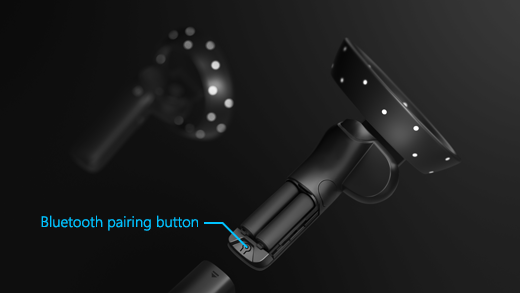

# Controllers in Windows Mixed Reality

Windows Mixed Reality is designed to work best with mixed reality motion controllers, which provide natural, precise interactions with no need to install hardware on your walls.

You can also use an Xbox controller or a mouse and keyboard. And remember, you can always get around in mixed reality [using just your voice](using-speech-in-wmr.md).

Having trouble with your motion controllers? [Get help](using-wmr-faq.md#im-having-trouble-with-my-motion-controllers)

## Motion controller setup

Most headsets come pre-paired directly to the headset, but some early headsets require the motion controllers to be paired to your PC with Bluetooth 4.0. When you connect your immersive headset for the first time, you'll be walked through turning on your motion controllers during setup. But if you need to re-pair them later on, here’s how: 

1. Launch **Mixed Reality Portal** with your headset connected.  
2. In the lower-left corner select **… > Pair controllers**.  
3. Insert 2 AA batteries into each controller and follow the instructions provided on-screen.

> [!NOTE]
> * For controllers that pair directly to your PC, you’ll need to put them into pairing mode by turning them on and then pressing the pairing button inside the battery compartment until the lights start flashing.  
> 
> * Motion controllers only support being paired to one computer or PC at a time. If you need to use them with a different headset, you’ll need to go through the pairing process .  

[Get help connecting](wmr-setup-faq.md#my-motion-controllers-arent-working)

> [!IMPORTANT]
> **Got an Xbox controller?** 
> 
> If you have a Bluetooth Xbox controller, pair it with your PC to use it with your headset. Learn how. <!-- NEED NON-CIRCULAR LINK -->.
> 
> If you have a wired Xbox controller, plug it in to your PC.
> 
> Some games and apps use the Xbox controller differently from how it's used in mixed reality. To use the controller for a game or app, select **Use as gamepad** on the app bar or say, "Use as gamepad." To switch the controller back to mixed reality, select **Use as gamepad**, again, or say, "Use with gaze."  

## Using controllers

Here’s how to get around in mixed reality with motion controllers, an Xbox gamepad, or a mouse and keyboard.

> [!TIP]
> To switch input between mixed reality and your desktop, press **Windows logo key + Y** on your PC keyboard.

|  To do this  |  Motion controllers  | Gamepad | Mouse + keyboard |
| --- | --- | --- | --- |
| Teleport | Press the thumbstick forward, then point the controller where you want to go. Release the thumbstick. | Press the left thumbstick forward, then look where you want to go. Release the thumbstick. | Click and hold the right button, then point the mouse where you want to go. Release the button. |
| Select | Point the controller, then pull the trigger or click the touchpad. | Gaze at the target, then press A. | Point the mouse, then left-click. |
| Open the Start menu | Press the **Windows** button. | Press the **Xbox** button. | Press the **Windows logo key**. |
| Leave an immersive app | Press the **Windows** button. Then select **Mixed reality home** on the quick actions menu. | Press the **Xbox** button. Then select **Mixed reality home** button on the quick actions menu. | Press the **Windows logo key**.Then select the **Mixed reality home** button on the Quick Actions menu that appears. |
| Rotate | Move the thumbstick left or right. | Move the right stick left or right. | Not available. |
| Back up | Move the thumbstick backward. | Move the left stick backward. | Not available. |
| Walk | Push the thumbstick straight down, then press it in the direction you want to walk. | Push the left stick straight down, then press it in the direction you want to walk. | Not available. |
| Move an app window | Point at the app bar. Pull and hold the trigger to grab the window, then use the controller to move it in any direction. Release the trigger. | Gaze at the app bar, then press and hold A to grab the window. Use the left stick to move the window side-to-side or up and down. Use the triggers to move it closer and farther away. Then release A. | Point the mouse at the app bar. Left-click and hold to grab the window, then use the mouse to move it side-to-side or up and down. Use the scroll wheel to move the window closer or farther away. Release the mouse button. |
| Move a 3D object | Point at the object, then pull and hold the trigger to grab it. Move it in any direction with the controller, then release the trigger. | Gaze at the object, then press and hold A to grab it. Use the left stick to move the window side-to-side or up and down. Use the triggers to move it closer and farther away. Then release A. | Point the mouse at the object. Left-click and hold to grab it, then use the mouse to move it side-to-side or up and down.  To move it closer or farther away, use the scroll wheel. Release the mouse button. |
| Rotate or resize an app window | Point one controller at the app bar and the other controller anywhere on the window. Hold down both triggers, then move the controllers together or apart to resize.  To rotate, move one controller toward you and the other one away from you. Release the triggers. | Select **Adjust** on the app bar. Gaze at a corner of the adjustment frame, then press A to select it. Use the left stick to resize the window.	 | Select **Adjust** on the app bar. Select and hold a corner of the adjustment frame, then use your mouse to resize the window. |
| Rotate or resize a 3D object | Point both controllers at the object. Hold down both triggers, then move the controllers together or apart to resize.  To rotate, move one controller toward you and the other one away from you. | Select **Adjust** on the app bar, and then move the object using the left stick. | Select **Adjust** on the app bar, and then select and hold the object and use your mouse to move it. |
| Scroll in an app window | Pull and hold the trigger, then move the controller up or down.  | Use the D-pad. | Use the mouse scroll wheel. |
| Zoom in or out in app window | Pull both triggers, then move the controllers closer together or farther apart. | Pull the right trigger to zoom in, and the left trigger to zoom out. | Use the mouse scroll wheel while holding down the CTRL key on the keyboard. |
| Open a menu | Press the **Menu** button. | Press the **Menu** button. | Right-click. |

## What do the vibrations and lights mean?

Your controller communicates to you what it's doing by vibrating and blinking its LED lights. 

|  When your controller does this  |  It means this | 
| --- | --- |
| LEDs turn on, and the controller vibrates once | **Turning on** |  
| LEDs turn off, and the controller vibrates twice | **Turning off** |
| LEDs blink every 3 seconds | **Sleeping** |
| LEDs slowly pulse, and the controller vibrates once | **Entering pairing mode** |
| Controller vibrates once | **Connecting or disconnecting from your PC** |
| LEDs are brightly lit | **Controllers tracked by headset** |
| LEDs are dimly lit | **Controllers not tracked by headset** |
| Controller vibrates three times and then turns off | **Critical battery level** |
| The outer and inner rings of LEDs blink in an alternating pattern | **Updating** |

## See also
* [Ask the community](https://answers.microsoft.com)
* [Contact us for support](https://support.microsoft.com/contactus/)
* [Troubleshooting](troubleshooting-windows-mixed-reality.md)

