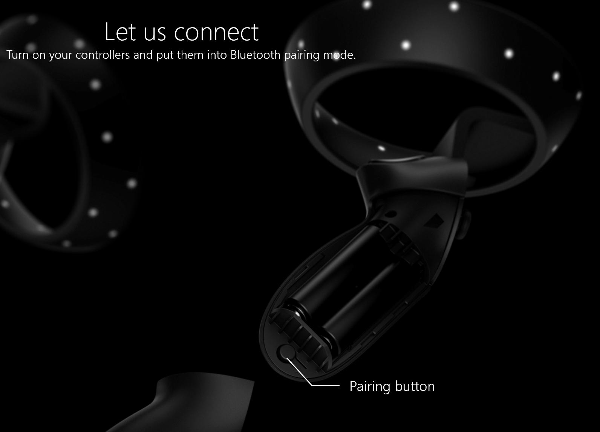
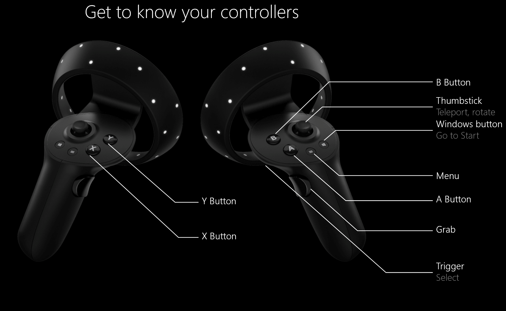

# Motion controllers in Windows Mixed Reality

Motion controllers are hardware accessories that allow users to interact in mixed reality. An advantage of motion controllers over gestures is that the controllers have a precise position in space, allowing for fine-grained interaction with digital objects. For Windows Mixed Reality immersive headsets, motion controllers are the primary way that users will take action in their world.

Windows Mixed Reality motion controllers offer precise and responsive movement tracking in your field of view through the immersive headset sensors. There's no need to install hardware on the walls in your space. These motion controllers will offer the same ease of setup and portability as Windows Mixed Reality immersive headsets.

You can also use an Xbox controller, a mouse, and keyboard or get around by [using just your voice](using-speech-in-wmr.md).

## Motion controller setup

Most headsets come pre-paired directly to the headset, but some early headsets require the motion controllers to be paired to your PC with Bluetooth 4.0. When you connect your immersive headset for the first time, you'll be walked through turning on your motion controllers during setup. But if you need to re-pair them later on, here’s how:

1. Launch **Mixed Reality Portal** with your headset connected.  
2. In the lower-left corner, select **… > Set up controllers**.
3. Insert two AA batteries into each controller and put your controller in pairing mode (see instructions in [pair motion controllers section](controllers-in-wmr.md#pair-motion-controllers)
4. Follow the instructions provided on-screen.

> [!NOTE]
> * For controllers that pair directly to your PC, you’ll need to put them into pairing mode by turning them on and then pressing the pairing button inside the battery compartment until the lights start flashing.
> * Motion controllers only support being paired to one PC at a time. If you need to use them with a different headset, you’ll need to go through the pairing process. See [Set up Windows Mixed Reality](set-up-windows-mixed-reality.md)

[Get help connecting](wmr-setup-faq.yml#my-motion-controllers-arent-working)

> [!IMPORTANT]
> **Got an Xbox controller?**
> 
> If you have a Bluetooth Xbox controller, pair it with your PC to use it with your headset.
> 
> If you have a wired Xbox controller, plug it in to your PC.
> 
> Some games and apps use the Xbox controller differently from how it's used in mixed reality. To use the controller for a game or app, select **Use as gamepad** on the app bar or say, "Use as gamepad." To switch the controller back to mixed reality, select **Use as gamepad**, again, or say, "Use with gaze."  

## Pair motion controllers

If you're using a headset that includes an integrated Bluetooth controller, such as the Samsung Odyssey+ or HP Reverb, your controllers should already be paired. But you can still pair your controllers using setup app (it should be already installed during the HMD set up. You can also get it from Microsoft store).

### Pair motion controllers to HMD

Power the controllers by pressing the Windows button for 2 seconds until LEDs light up.

Remove the battery cover from your controllers and find the small pairing button at the edge of the controller. Hold this button down to pair with your PC.
    

Launch **Mixed Reality Portal** with your headset connected.  
In the lower-left corner, select **… > Set up controllers**.
Follow the instructions on the screen.

### Pair motion controllers to PC

You can pair your controller to a PC by adding another bluetooth device.

Power the controllers and place them into pairing mode as described above.

* Navigate to Computer settings
* Device/ Add Bluetooth or other device.

Once pairing is complete, LEDs will be solid on and bright.

### Common issues

* Verify that you have only one Bluetooth radio active on your PC. If you have more than one Bluetooth radio, you’ll need to disable the other radios in Device Manager.
* Place your Bluetooth dongle in a port that has a clear line of sight to your controllers, and far from plugged in USB 3.0 devices. USB 3.0 is known to have RF interference with Bluetooth (read [this paper](https://www.intel.com/content/dam/www/public/us/en/documents/white-papers/usb3-frequency-interference-paper.pdf) from Intel for more details). USB 2.0 ports may work better for your Bluetooth dongle.
* Make sure your Bluetooth dongle isn't plugged into a USB port next to your HMD's USB cable. The headset cable has been known to cause interference with Bluetooth dongles as well. Plug the dongle into the front USB port on your PC for best results.
* For notebooks, ensure WiFi is connected to 5-GHz band for the best experience. Select the wireless network icon bottom-right tray and select properties for the network you're using. Notebooks that are designed to share a 2.4-GHz antenna for Bluetooth and WiFi connectivity will see data congestion from slow network speeds or poor motion controller tracking performance.
* Your motion controllers will receive new software updates from Microsoft on a regular basis. The controllers will show an alternating pattern of flashing lights when they receive these new software updates. This is normal. Wait until the software upgrade is complete before using the controllers. The controllers will vibrate and a constant light will replace the alternating flash pattern when it's done.
* You may be told to "Put on the headset and use the thumbstick to teleport" before the controllers finish the update process. The controllers won't be visible or usable until the update is completed. Most updates occur within two minutes, but updates can take as long as 10 minutes or so. Wait for the update to complete before proceeding to the next step.

## Using controllers

Here’s how to get around in mixed reality with motion controllers, an Xbox gamepad, or a mouse and keyboard.

> [!TIP]
> To switch input between mixed reality and your desktop, press **Windows logo key + Y** on your PC keyboard.

|  To do this  |  Motion controllers  | Gamepad | Mouse + keyboard |
| --- | --- | --- | --- |
| Teleport | Press the thumbstick forward, then point the controller where you want to go. Release the thumbstick. | Press the left thumbstick forward, then look where you want to go. Release the thumbstick. | Select and hold the right button, then point the mouse where you want to go. Release the button. |
| Select | Point the controller, then pull the trigger or use the touchpad. | Gaze at the target, then press A. | Point the mouse, then left-click. |
| Open the Start menu | Press the **Windows** button. | Press the **Xbox** button. | Press the **Windows logo key**. |
| Leave an immersive app | Press the **Windows** button. Then select **Mixed reality home** on the quick actions menu. | Press the **Xbox** button. Then select **Mixed reality home** button on the quick actions menu. | Press the **Windows logo key. Then select the **Mixed reality home** button on the Quick Actions menu that appears. |
| Rotate | Move the thumbstick left or right. | Move the right stick left or right. | Not available. |
| Back up | Move the thumbstick backward. | Move the left stick backward. | Not available. |
| Walk | Push the thumbstick straight down, then press it in the direction you want to walk. | Push the left stick straight down, then press it in the direction you want to walk. | Not available. |
| Move an app window | Point at the app bar. Pull and hold the trigger to grab the window, then use the controller to move it in any direction. Release the trigger. | Gaze at the app bar, then press and hold A to grab the window. Use the left stick to move the window side-to-side or up and down. Use the triggers to move it closer and farther away. Then release A. | Point the mouse at the app bar. Left-click and hold to grab the window, then use the mouse to move it side-to-side or up and down. Use the scroll wheel to move the window closer or farther away. Release the mouse button. |
| Move a 3D object | Point at the object, then pull and hold the trigger to grab it. Move it in any direction with the controller, then release the trigger. | Gaze at the object, then press and hold A to grab it. Use the left stick to move the window side-to-side or up and down. Use the triggers to move it closer and farther away. Then release A. | Point the mouse at the object. Left-click and hold to grab it, then use the mouse to move it side-to-side or up and down.  To move it closer or farther away, use the scroll wheel. Release the mouse button. |
| Rotate or resize an app window | Point one controller at the app bar and the other controller anywhere on the window. Hold down both triggers, then move the controllers together or apart to resize.  To rotate, move one controller toward you and the other one away from you. Release the triggers. | Select **Adjust** on the app bar. Gaze at a corner of the adjustment frame, then press A to select it. Use the left stick to resize the window.	 | Select **Adjust** on the app bar. Select and hold a corner of the adjustment frame, then use your mouse to resize the window. |
| Rotate or resize a 3D object | Point both controllers at the object. Hold down both triggers, then move the controllers together or apart to resize.  To rotate, move one controller toward you and the other one away from you. | Select **Adjust** on the app bar, and then move the object using the left stick. | Select **Adjust** on the app bar, and then select and hold the object and use your mouse to move it. |
| Scroll in an app window | Pull and hold the trigger, then move the controller up or down.  | Use the D-pad. | Use the mouse scroll wheel. |
| Zoom in or out in app window | Pull both triggers, then move the controllers closer together or farther apart. | Pull the right trigger to zoom in, and the left trigger to zoom out. | Use the mouse scroll wheel while holding down the CTRL key on the keyboard. |
| Open a menu | Press the **Menu** button. | Press the **Menu** button. | Right-click. |

## What do the vibrations and lights mean

Your controller communicates to you what it's doing by vibrating and blinking its LED lights.

|  When your controller does this  |  It means this |
| --- | --- |
| LEDs turn on, and the controller vibrates once | **Turning on** |  
| LEDs turn off, and the controller vibrates twice | **Turning off** |
| LEDs blink every 3 seconds | **Sleeping** |
| LEDs slowly pulse, and the controller vibrates once | **Entering pairing mode** |
| Controller vibrates once | **Connecting or disconnecting from your PC** |
| LEDs are brightly lit | **Controllers tracked by headset** |
| LEDs are dimly lit | **Controllers not tracked by headset** |
| Controller vibrates three times and then turns off | **Critical battery level** |
| The outer and inner rings of LEDs blink in an alternating pattern | **Updating** |

## Updating motion controllers firmware

* If an immersive headset is connected to your PC, and new controller firmware is available, the firmware will be pushed to your motion controllers automatically the next time they're turned on.
* Controller firmware updates are shown with a pattern of illuminating LED quadrants in a circular motion, and take 1-2 minutes. Firmware updates can occasionally take longer, up to 10 minutes, which may indicate poor Bluetooth connectivity or radio interference.
* In case firmware update is interrupted (controller powered off or battery runs out) it will be tried again on next power on.
* After the firmware update completes, the controllers will reboot and reconnect.
* Both controllers should be connected now. Navigate to Mixed Reality Portal to check the status of your controllers.
* Verify your controllers work properly:
  * Launch **Mixed Reality Portal** and enter your Mixed Reality Home.
  * Move your controllers and verify tracking, test buttons, and verify teleportation works. If they don't, then check out [the motion controller troubleshooting section](motion-controller-problems.md)

## FAQ

### How can I check battery level?

*A: Battery level is on reverse side of the virtual model, there's no physical battery level indicator. After powering on the controller, wait few seconds to let the reading stabilize.*

### Can you use these controllers without a headset? Just for the joystick/trigger/etc input?

*A: Not for Universal Windows Applications*

## Filing motion controller feedback/bugs

Give us feedback in Feedback Hub, using the "Mixed Reality -> Input" category.

## See also

- [HP Controllers in Unity](/windows/mixed-reality/develop/unity/unity-reverb-g2-controllers)
- [HP Controllers in Unreal](/windows/mixed-reality/develop/unreal/unreal-reverb-g2-controllers)
- [Ask the community](https://answers.microsoft.com)
- [Contact us for support](https://support.microsoft.com/contactus/)
- [Troubleshooting](troubleshooting-windows-mixed-reality.md)

Having trouble with your motion controllers? [Get help](motion-controller-problems.md)