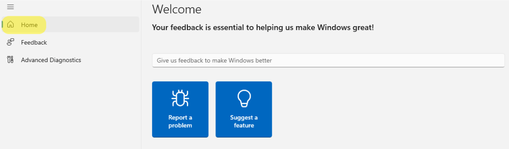
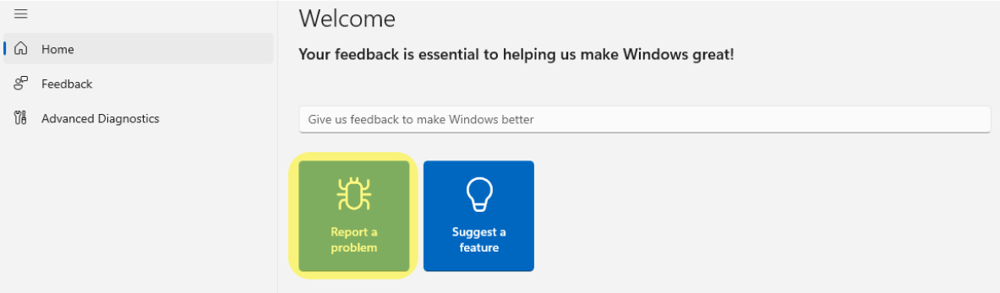
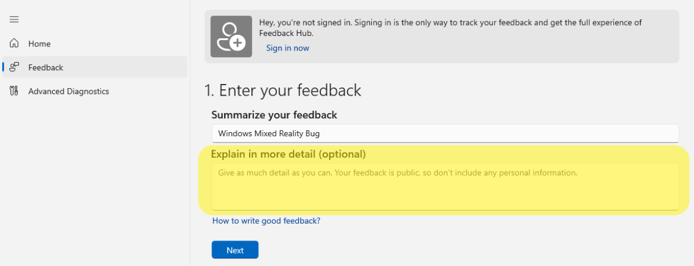
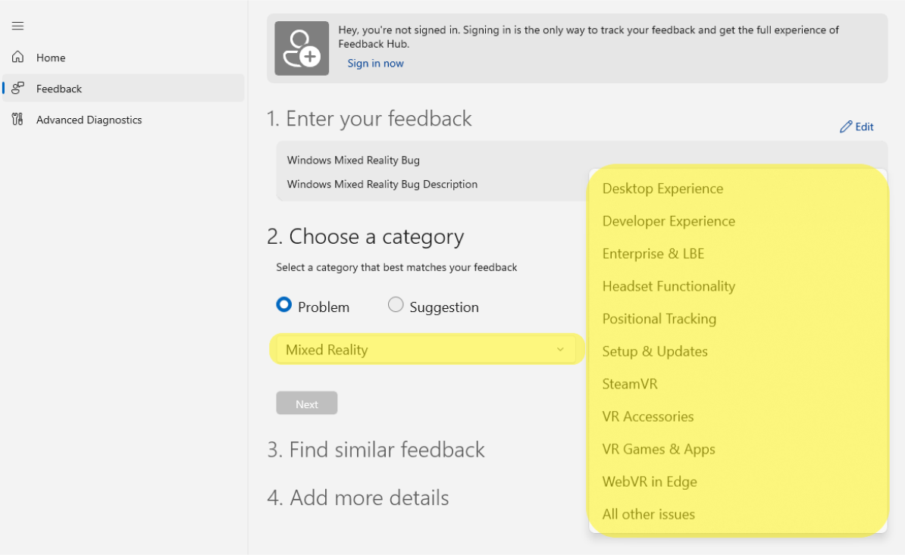
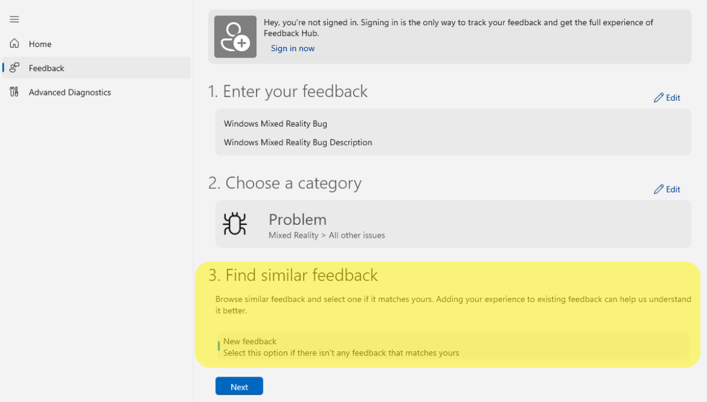
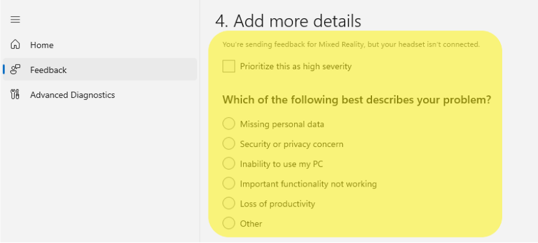
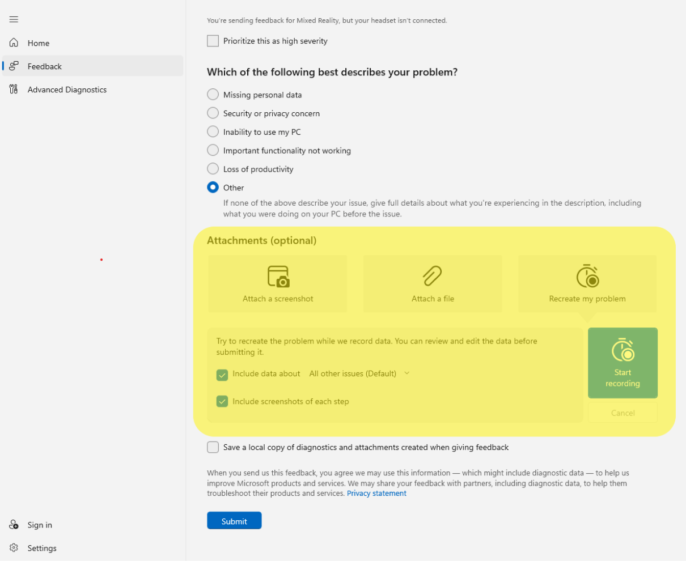
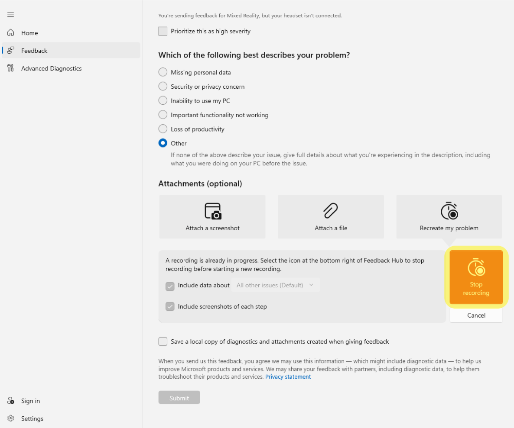
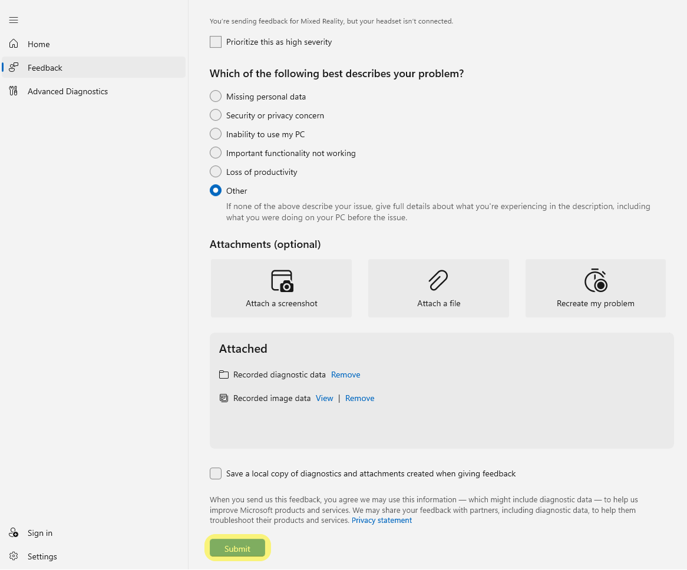

# Filing bugs and feedback

## Why it's important

The engineering team uses the same mechanism for tracking and fixing internal bugs, so please use Feedback Hub to report anything odd that you're seeing - we're listening!

>[!Note]
>In order to provide us with full data for feedback and diagnostics, double check the settings on your PC before filing feedback: <ol> <li> Open the Windows **Settings** app. </li> <li> Select **Privacy**. </li> <li> Go to **Feedback & diagnostics** on the left pane, which has been renamed to **Diagnostics & feedback** in recent Windows Insider builds of Windows. </li> <li> Under **Select how much data you send to Microsoft**, select **Full** if it isn't already selected. </li> <li> Be sure to restart your PC and repeat the steps to reproduce your issue before filing feedback. </li> <ol>

## How to file feedback for Windows Mixed Reality immersive headsets on PC

1. Ensure you have the immersive headset connected to your PC.
2. Launch **Feedback Hub** on desktop with the HMD connected. If you don't already have **Feedback Hub** installed, you can download and install the latest [**Feedback Hub**](https://www.microsoft.com/p/feedback-hub/9nblggh4r32n?rtc=1&activetab=pivot:overviewtab) app from Microsoft Store.
3. Go to **Home** on the left pane.  
4. Select **Report a problem**. 
5. Provide a meaningful feedback title in the **Summarize your feedback** box. 
6. Provide details and steps to reproduce the issue in the **Explain in more detail** (optional) box, then select the **Next** button. 
7. Select **Problem** under **Select a category that best matches your feedback** to make the feedback actionable. 
8. Select **Mixed Reality** as the main category, pick an applicable subcategory, then click the **Next** button:

    

   | Subcategory | Description |
   |:-------------|:-------------|
   | Desktop Experience | Issues with the Mixed Reality Portal or Windows OS integration |
   | Developer Experience | Issues with authoring / running an application for Windows Mixed Reality |
   | Enterprise & LBE | Issues setting up or using Windows Mixed Reality in an LBE or Enterprise environment |
   | Headset Functionality | Issues related to various components of a Windows Mixed Reality headset (display, audio, connectivity, drivers, and etc.)  |
   | Motion Controllers | Issues related to various components of a Windows Mixed Reality motion controller (buttons, Bluetooth, batteries, and etc.) |
   | Positional Tracking | Issues related to positional tracking while using Windows Mixed Reality. (such as head tracking and controller tracking) |
   | Setup & Updates | Issues related to set up, installation, or updates for Windows Mixed Reality products |
   | SteamVR  | Issues related to the "Windows Mixed Reality for SteamVR" Steam integration |
   | VR Accessories | Issues related to third-party VR accessories intended for use with Windows Mixed Reality products |
   | VR Games & Apps | Issues related to games and apps intended for use with Windows Mixed Reality products |
   | WebVR in Edge  | Issues related to using WebVR in Edge with Windows Mixed Reality products |
   | All other issues  | All other issues related to Windows Mixed Reality products and experiences |

9. Browse through similar feedback and select one if it matches yours (adding your experience to existing feedback can help us understand it better). Once you're done, click the **Next** button. 
10. Add more details to your feedback, such as considering your issue a blocking issue or selecting one of the available options to help better describe the issue you are encountering. 
11. To help us identify and fix the bug faster, consider capturing traces and video of the issue before submitting. To start collecting traces, select **Recreate my problem**, and then select **Start recording** when you're ready. This will begin collecting traces and a video capture of your mixed reality scenario. You can also consider attaching screenshots and files that might be helpful. 

12. Leave the Feedback app and running in the background and attempt to reproduce the broken scenario. 
13. After you're done reproducing the broken scenario, go back to the **Feedback Hub** app and select **Stop Recording**. Once you've completed that, you should see that a file containing the traces has been added to your feedback. 
14. Select **Submit**. 

This will lead you to the "Thank You" page. At this point, your feedback has been successfully submitted.

It's easy to direct other people to your feedback after submission by going to **Feedback > My Feedback**, selecting the issue, and using the **Share** icon to get a shortened URL. You can give the URL to coworkers, Microsoft staff, [forum](https://forums.hololens.com/) readers, and so on, to upvote or escalate.

> [!IMPORTANT]
> Before filing a bug, please ensure you meet the following constraints so that the logs are successfully uploaded with the feedback.
>    * Have a minimum of 3GB free disk space available on the main drive of the device.
>    * Ensure that a non-metered network is available in order to upload cabs.

## After filing feedback

Make sure to check back regularly with Feedback Hub after filing feedback! In most cases, we'll try to respond as soon as we can. If you're not already in touch with us when you file feedback, the only way we can reach out to you with troubleshooting suggestions or more questions is via the comments system in Feedback Hub. Unfortunately, at this time, notifications aren't sent to you outside of Feedback Hub.

## See also

* [Troubleshooting](troubleshooting-windows-mixed-reality.md)