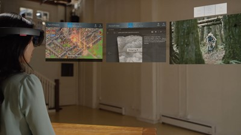
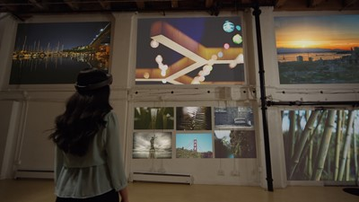
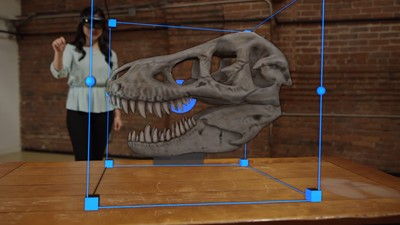

# Release notes - May 2016

The HoloLens team is committed to providing you with the latest feature updates and major fixes through the Windows Insider Program. Thanks to all your suggestions, we take your feedback to heart. Continue to [give us feedback](/windows/mixed-reality/give-us-feedback) through the Feedback Hub, the [developer forums](https://forums.hololens.com) and [Twitter via @HoloLens](https://twitter.com/hololens).

**Release version:** Windows Holographic May 2016 Update (**10.0.14342.1016**)

>[!VIDEO https://www.youtube.com/embed/XM5OHHrOGqQ]

To update to the current release, open the *Settings* app, go to *Update & Security*, then select the *Check for updates* button.

## New features

* You can now **run up to three apps in 2D view simultaneously**, which enables endless use cases for multi-tasking in HoloLens. Have the new Feedback Hub with the list of Quests open while exploring the new features on this flight.

   
  Run up to three apps in 2D view simultaneously

* We've added new **voice commands**:
   * Try looking at a hologram and rotate it by saying "face me"
   * Change its size by saying "bigger" or "smaller"
   * Move an app by saying "Hey Cortana, move *app name* here."
* We've made **developing on HoloLens easier**. You can now browse, upload, and download files through the [Windows Device Portal](/windows/mixed-reality/develop/platform-capabilities-and-apis/using-the-windows-device-portal). You can access the Documents folder, Pictures folder, and the local storage for any app you side-loaded or deployed through Visual Studio.
* The **emulator now supports log-in with a Microsoft Account** just like you would on a real HoloLens, which you can enable from the Additional Tools menu ">>".
* **2D Apps now hide the app bar and cursor when watching video full screen** to avoid distraction. Your video watching experience will be even more enjoyable on HoloLens.
* You can also **pin photos without the app bar** in your world.

   
  The app bar can be hidden for apps with a 2D view, like Photos

* **File picker** works just like you expect it to on HoloLens.
* Updated **Edge browser** to map unified user experience with desktop and phone. We enabled multiple instances of your browser, custom HoloLens new tab page, tab peek, and open in new windows, along with power & performance improvements.
* **Groove Music** app is now on HoloLens. Visit the store to download it and try playing in the background.
* You can easily customize how apps are arranged in your world. Try **rotating your holograms** in adjust mode by simply click and drag on circle in the middle vertical wireframes. You might notice holograms have **tighter fitted bounding boxes** to ensure maximized interaction. You can also resize all flat apps vertically (except Photos and Hologram apps).

   
  Rotate holograms after you place them in your world

* We've made several **input improvement** in this flight. You can connect a regular Bluetooth mouse to HoloLens. The clicker has been fine-tuned to enable resizing & moving holograms with a clicker. Keyboard is also running better than ever.
* Now you can take **mixed reality pictures** by pressing down the volume up + volume down simultaneously. You can also share your mixed reality captured photos & videos to Facebook, Twitter, and YouTube.
* The maximum recording length of **mixed reality videos** has been increased to five minutes.
* **Photos app** now streams videos from OneDrive instead of having to download the entire video before playback.
* We've improved how your **holograms will be right where you left them**. You'll also be presented the option to reconnect to Wi-Fi and try again if HoloLens can't detect where they are.
* The keyboard has an **improved layout for entering email address** with keys that allow you to enter the most popular email domains with a single click.
* Faster **app registration** and **auto detection of time zone** during OOBE, giving you the best first user experience.
* **Storage sense** allows you to view remaining and used disk space by the system and apps in the settings app.
* We've converged Feedback App and Inside Hub into a single app **Feedback Hub**, which is the go-to tool for **giving us feedback** on features you love, which ones need improvement, and which ones you could do without. When you join the Insider Program, you can keep up on **get latest Insider news**, **rate builds** and go on **feedback quests** from Feedback Hub.
* We've also [published an updated HoloLens Emulator](/windows/mixed-reality/develop/install-the-tools) build.
* Your mixed reality videos now look better because of automatic **video stabilization**.

## Major fixes

We fixed issues with hologram spaces where the spaces would be slow or incorrectly detected. We fixed a shutdown issue that could continue to try launching the shell during shutdown.

We fixed an issue
* that blocks the ability to resume a XAML application.
* where a crash would leave a black screen and some jagged lines.
* scrolling would sometimes stick in the wrong direction when using some apps.
* the power LEDs could indicate an off state when the device was still on.
* WiFi could get turned off after resuming from standby.
* the Xbox identity provider offers gamertag setup and then gets stuck in a loop.
* the Shell occasionally crashes when selecting a downloaded file in the OneDrive File Picker.
* pressing and holding on a link sometimes both opens a new, broken tab and opens a context menu.
* where windows device portal didn’t allow IPD adjustments from 50 to 80

We fixed issues with Photos where
* an image would occasionally display rotated because ignoring EXIF orientation property was ignored.
* it could crash during start-up on pinned Photos.
* videos would restart after pausing instead of continuing from where last paused.
* replay of a shared video could be prevented if it was shared while playing.
* Mixed Reality Capture recordings would begin with 0.5-1 second of audio only feed.
* the Sync button disappears during initial OneDrive sync.

We fixed issues with settings where
* a refresh was needed when the environment changes.
* 'Enter' on keyboard wouldn't behave like clicking Next in some dialogs.
* it was hard to know when the clicker failed pairing.
* it could become unresponsive with WiFi disconnect and connect.

We fixed issues with Cortana where
* it could get stuck displaying the Listening UI.
* asking "Hey Cortana, what can I say" from an exclusive mode app would get stuck if you answered maybe rather yes/no to the request to exit the app.
* the Cortana listening UI doesn't resume correctly if you ask Cortana to go to sleep and then resume.
* the queries "What network am I connected to?" and the "Am I connected?" could fail when the first network profile comes back with no connectivity.
* the UI froze on "Listening" but upon exiting an app would immediately began doing speech recognition again.
* where signing out of the Cortana app wouldn't let you sign back into it until a reboot.
* it wouldn't launch when Mixed Reality Capture UI was active.

We fixed issues with Visual Studio where
* background task debugging didn't work.
* frame analysis in the graphics debugger didn't work.
* the HoloLens Emulator didn't' appear in the drop-down list for Visual Studio unless your project's TargetPlatformVersion was set to 10240.

## Changes from previous release
* The Cortana command **Hey Cortana, reboot the device** doesn't work. User can say **Hey Cortana, restart** or **Hey Cortana, restart the device**.
* Kiosk mode has been removed from the product.

## Prior release notes
* [Release notes - March 2016](release-notes-march-2016.md)

## See also
* [HoloLens known issues](/windows/mixed-reality/hololens-known-issues)
* [Install the tools](/windows/mixed-reality/develop/install-the-tools)
* [Shell](/windows/mixed-reality/discover/navigating-the-windows-mixed-reality-home)
* [Updating 2D UWP apps for mixed reality](/windows/mixed-reality/develop/porting-apps/building-2d-apps)
* [Hardware accessories](/windows/mixed-reality/discover/hardware-accessories)
* [Mixed reality capture](/windows/mixed-reality/mixed-reality-capture)
* [Voice input](/windows/mixed-reality/design/voice-input)
* [Submitting an app to the Windows Store](/windows/mixed-reality/distribute/submitting-an-app-to-the-microsoft-store)
* [Using the HoloLens emulator](/windows/mixed-reality/develop/platform-capabilities-and-apis/using-the-hololens-emulator)