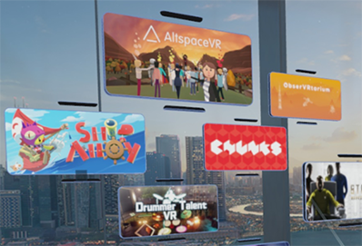

# Release notes - October 2018

The **[Windows 10 October 2018 Update](https://blogs.windows.com/windowsexperience/2018/10/02/find-out-whats-new-in-windows-and-office-in-october/)** (also known as RS5) includes new features for both HoloLens and Windows Mixed Reality immersive headsets connected to PCs. 

To update to the latest release on HoloLens or PC (for Windows Mixed Reality immersive (VR) headsets), open the **Settings** app, go to **Update & Security**, then select the **Check for updates** button. On a Windows 10 PC, you can also manually install the Windows 10 October 2018 Update using the [Windows media creation tool](https://www.microsoft.com/software-download/windows10).

**Latest release for Desktop:** Windows 10 October 2018 Update (**10.0.17763.107**) 
**Latest release for HoloLens:** Windows 10 October 2018 Update (**10.0.17763.134**) 

## New features for Windows Mixed Reality immersive headsets

The Windows 10 October 2018 Update includes many improvements for using Windows Mixed Reality immersive (VR) headsets with your desktop PC.

### For everyone

* **Mixed Reality Flashlight** - Open a portal into the real world to find your keyboard, see someone nearby, or take a look at your surroundings without removing your headset! You can turn on Mixed Reality Flashlight from the Start menu, by pressing Windows + Grab on your motion controller, or by saying "Flashlight on/off." Point your controller in the direction of what you want to see, like using a flashlight in the dark.

    

* **New apps and ways to launch content in the mixed reality home**
    * If you're using [Windows Mixed Reality for SteamVR](./using-steamvr-with-windows-mixed-reality.md), your SteamVR titles now show up in the Start menu and app launchers for each can be placed in the mixed reality home.
    
        
        
    * New *360 Videos* app for discovering a regularly-curated selection of 360-degree videos.
    * New *WebVR Showcase* app for discovering a regularly-curated selection of WebVR experiences.
    * First-time Windows Mixed Reality customers will enter the Cliff House and find it pre-populated with 3D app launchers for some of our favorite immersive apps and games from the Microsoft Store.
    * Microsoft Edge windows now include a *Share* button.
* **Quick actions menu** - From within an immersive mixed reality app, you can press the Windows button to access a new quick actions menu, with easy access to *SteamVR menu*, *photo/video capture*, *flashlight*, and *home*.
* **Support for backpack PCs** - Windows Mixed Reality immersive (VR) headsets run on backpack PCs without requiring a display emulator once setup has been completed.
* **New audio features** - You can now mirror the audio from a Windows Mixed Reality experience to both the audio jack (or headphones) in your headset *and* an audio device connected to your PC (like external speakers). We've also added a visual indicator for volume level in your headset's display.
* **Other improvements**
    * Mixed Reality Portal updates are now delivered through the Microsoft Store, enabling quicker updates between major Windows releases. Note that this only applies to the desktop app and the Windows Mixed Reality headset experience still updates with the OS. 
    * When headsets go to sleep, Windows Mixed Reality apps are suspended instead of terminated (until Mixed Reality Portal is closed).
    
### For developers

* **[QR code tracking](/windows/mixed-reality/develop/platform-capabilities-and-apis/qr-code-tracking)** - Enable QR code tracking in your mixed reality app, allowing Windows Mixed Reality immersive (VR) headsets to scan for QR codes and report them back to interested apps.
* **Hardware DRM support for immersive apps** - Developers can now request hardware-protected backbuffer textures if supported by the display hardware, allowing applications to use hardware-protected content from sources like PlayReady.
* **[Integrate mixed reality capture UI into immersive apps](/windows/mixed-reality/develop/platform-capabilities-and-apis/mixed-reality-capture-for-developers#integrating-mrc-functionality-from-within-your-app)** - Developers can integrate mixed reality capture into their apps using the built-in Windows [camera capture UI](/windows/uwp/audio-video-camera/capture-photos-and-video-with-cameracaptureui) with just a few lines of code.

## New features for HoloLens

The Windows 10 October 2018 Update is publicly available for all HoloLens customers, and includes a number of improvements, such as:

### For everyone

* **Quick actions menu** - From within an immersive mixed reality app, you can press the Windows button to access a new quick actions menu, with easy access to *Start recording video*, *Take pictures*, *Mixed Reality Home*, *Change volume*, and *Connect*.
* **Start/stop video capture from the Start or quick actions menu** - If you start video capture from the Start menu or quick actions menu, you’ll be able to stop recording from the same place. (Don’t forget, you can always do this with voice commands too.)
* **Project to a Miracast-enabled device** - Project your HoloLens content to a nearby Surface device or TV/monitor if using a Miracast-enabled display or adapter.
* **New notifications** - View and respond to notifications on HoloLens, just like you do on a PC.  
* **Useful overlays in immersive mixed reality apps** - You’ll now see overlays such as the keyboard, dialogs, file picker, etc. when using immersive mixed reality apps.
* **Visual indicator for volume change** - When you use the volume up/down buttons on your HoloLens you’ll see a visual indicator of the volume level in the headset.
* **New visuals for device boot** - A loading indicator was added during the boot process to provide visual feedback that the system is loading.
* **Nearby Sharing** - The Windows Nearby Sharing experience allows you to share a capture with a nearby Windows device.  
* **Share from Microsoft Edge** - Microsoft Edge now includes a *Share* button. 

### For developers

* **[Integrate mixed reality capture UI into immersive apps](/windows/mixed-reality/develop/platform-capabilities-and-apis/mixed-reality-capture-for-developers#integrating-mrc-functionality-from-within-your-app)** - Developers can integrate mixed reality capture into their apps using the built-in Windows [camera capture UI](/windows/uwp/audio-video-camera/capture-photos-and-video-with-cameracaptureui) with just a few lines of code.

### For commercial customers

* **Enable post-setup provisioning** - You can now apply a runtime provisioning package at any time using Settings.
* **Assigned access with Azure AD groups** - You can now use Azure AD groups for configuration of Windows assigned access to set up single or multi-app kiosk configuration.
* **PIN sign-in on profile switch from sign-in screen** - PIN sign-in is now available for "Other User" at the sign-in screen. 
* **Read device hardware info through MDM** - IT administrators can see and track HoloLens by device serial number in their MDM console.
* **Set HoloLens device name through MDM (rename)** - IT administrators can see and rename HoloLens devices in their MDM console.

### For international customers

You can now use HoloLens with localized user interface for Simplified Chinese or Japanese, including localized Pinyin keyboard, dictation, text-to-speech (TTS), and voice commands.

## Known issues

We've worked hard to deliver a great Windows Mixed Reality experience, but we're still tracking some known issues. If you find others, please [give us feedback](/windows/mixed-reality/give-us-feedback).

### HoloLens
 
#### After update
You may notice the following issues when using the Windows 10 October 2018 Update on your HoloLens:
* **Apps can end up in sign-in loop when launched from a notification** – Some apps requiring sign-in can end-up in an endless sign-in loop when launched from a notification. As an example, this can happen after installing the Microsoft Company Portal app from the Microsoft Store and launching it from the installation complete notification.
* **App sign-in page can complete with a blank page** – In some cases when a sign-in prompt shows over your application, on completion the sign-in page does not close and instead shows a blank (black) page. You can either close the blank page or move it to uncover the application underneath. As an example, this can happen on sign-in during MDM enrollment from the Settings app. 

## Provide feedback and report issues

Please use the [Feedback Hub app on your HoloLens or Windows 10 PC](/windows/mixed-reality/give-us-feedback) to provide feedback and report issues. Using Feedback Hub ensures that all necessary diagnostics information is included to help our engineers quickly debug and resolve the problem.

>[!NOTE]
>Be sure to accept the prompt that asks whether you’d like Feedback Hub to access your Documents folder (select **Yes** when prompted).

## Prior release notes

* [Release notes - April 2018](release-notes-april-2018.md)
* [Release notes - October 2017](release-notes-october-2017.md)
* [Release notes - August 2016](release-notes-august-2016.md)
* [Release notes - May 2016](release-notes-may-2016.md)
* [Release notes - March 2016](release-notes-march-2016.md)

## See also
* [Immersive headset support (external link)](./troubleshooting-windows-mixed-reality.md)
* [HoloLens support (external link)](https://support.microsoft.com/products/hololens)
* [Install the tools](/windows/mixed-reality/develop/install-the-tools)
* [Give us feedback](/windows/mixed-reality/give-us-feedback)