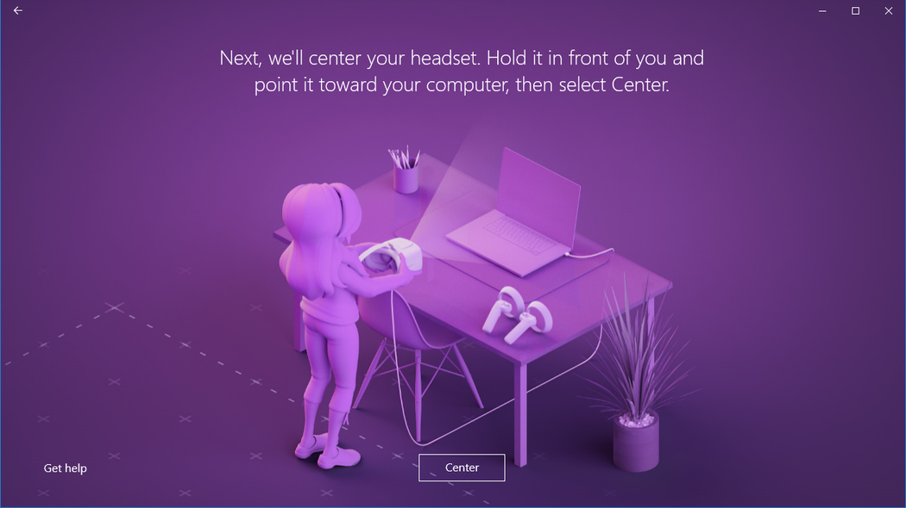
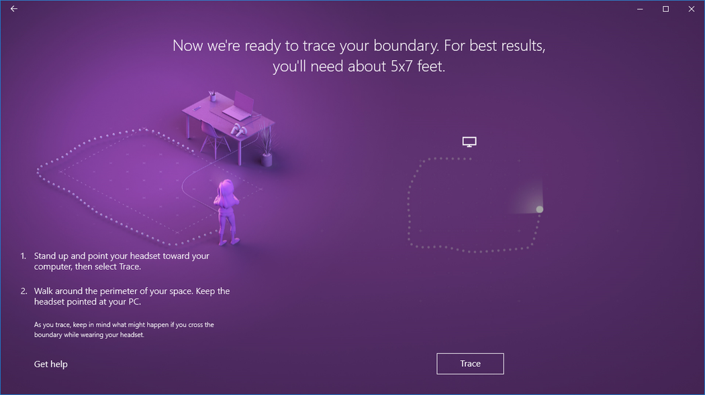

# Set up Windows Mixed Reality

## Get ready

To run Windows Mixed Reality, you'll need:

* A compatible mixed reality immersive headset. [Learn more](https://www.microsoft.com/mixed-reality/windows-mixed-reality?rtc=1)
* A [Windows Mixed Reality-ready PC](windows-mixed-reality-minimum-pc-hardware-compatibility-guidelines.md) with the correct ports for your headset
* Motion [controllers](controllers-in-wmr.md), an Xbox controller, or a mouse and keyboard
* Headphones with a mic (if your headset doesn't have them built in)
* A large, open space

## Get set

Prepare your space (including your overhead space). Make sure there are no obstacles, hazards, or fragile items in the area you’ll be using. Don’t set up at the top of a staircase or under an extra-low ceiling fan. Remove any breakables or obstacles from the area and make sure that all headset users read and understand the safety guidelines.

Once your space is ready, plug in your  headset, but don't put it on yet—first we'll need to do some setup on your PC. We’ll run a PC check, download some software, connect your controllers, and create a [boundary](boundary-questions.md) to help you avoid obstacles.

Then comes the fun part—put on your headset and enter the mixed world. Cortana will be waiting to give you a tour. Have fun!

## Go!

Once your space is ready, plug in your  headset, but don't put it on yet—first we'll need to do some setup on your PC. We’ll run a PC check, download some software, connect your controllers, and create a [boundary](boundary-questions.md) to help you avoid obstacles.

Then comes the fun part—put on your headset and enter the mixed world. Cortana will be waiting to give you a tour. Have fun!

## Get familiar with your motion controllers

If your headset has a built-in radio, the controllers that come with your headset are paired to it in the factory. When you first turn on your new controllers and headset, they'll already be paired.

If you have a headset without a built-in radio, you'll have to set up your motion controllers by pairing them to your PC. Most headsets manufactured after 2018 have built-in radio.

You don’t need to pair your controllers if you're only planning to use an Xbox gamepad or keyboard and mouse.  If you ever plan to use controllers, you should pair them.

**Note**: Windows Mixed Reality motion controllers require Bluetooth 4.0. If your PC doesn't have built-in Bluetooth, you'll need to plug in a USB Bluetooth adapter that supports Bluetooth 4.0 to enable your motion controllers. You don’t need a Bluetooth adapter to use the built-in radio in your headset.

If you need to pair your motion controllers, review [controllers in Windows Mixed Reality](controllers-in-wmr.md) article.

## Set up your room boundary

Choose a room scale or desk scale experience:

**Option 1: Set me up for all experiences (also known as room scale)** will allow you to walk around the room and is the most immersive mixed reality experience. We recommend you at clear at least five foot x seven foot (1.5 meters x 2 meters) of space for mixed reality.

**Option 2: Set me up for seated and standing (also known as desk scale)** experience will work at your desk. It's a good option if your space isn't large. It also means that you'll be using your headset without a boundary. You'll need to stay in one place, as you'll have no boundary to help you avoid physical obstacles. Some apps and games aren't designed to be a boundary experience, so they might not work as intended.

### If you choose "Set me up for all experiences"

Soon, your room will become a virtual world where you can walk around and interact! Stand up and clear some space in your room for running mixed reality. We recommend you at clear at least five foot x seven foot, or 1.5 meters x 2 meters, of space for mixed reality.

Make sure your space is clear.

Center your headset.

Trace your boundary.

Keep your headset pointed toward your PC.

Here's your boundary.

### If you choose "Set me up for seated and standing"

There are no extra steps required if you choose this option.

## What is the maximum size of the boundary?

The maximum supported boundary size in Windows Mixed Reality is a 18x18ft (5.7x5.7m) or 13 ft (4 m) radius from the center. The boundary size depends on the anchor point and how far from the anchor point you can move before you risk the stability of the boundary.  Windows Mixed Reality is built on a stage abstraction, the stage being the space you move around in. That stage depends on a single anchor, which nearly every app also assumes – it’s how Vive and Oculus work too with their single coordinate system.  This is important because with inside-out tracking, as you move further away from an anchor point the headset tracking is reliable at keeping the boundary stable.  Where the boundary is intended to help avoid physical obstacles, it becomes more of a problem the further out from the center you go.  Two factors went into the decision on maximum boundary size. The maximum distance at which Windows Mixed Reality headsets could provide the best room scale experience with a boundary and the length of the headset cable, which for most Windows Mixed Reality headsets are 10 ft (3 m).

## Set up speech

You can enable Cortana commands in mixed reality, which lets you use speech commands to teleport and open apps. You'll learn more about these actions in the [Learn Mixed Reality](learn-mixed-reality.md) chapter.

## Set up your audio headset

Modern Windows Mixed Reality headsets often include speakers and microphones, but if you are using an older headset, you may need to use an audio headset with both microphone and headphones. You can [connect a Bluetooth headset](https://support.microsoft.com/en-us/windows/pair-a-bluetooth-device-in-windows-2be7b51f-6ae9-b757-a3b9-95ee40c3e242) or connect a cabled headset by plugging it into your headset's 3.5-mm audio jack. The 3.5-mm audio jack for your headset is located on the underside of the headset visor or at the end of a short audio cable attached to the headset visor, depending on the headset model.

## Adjusting your headset's display settings

Windows Mixed Reality automatically chooses display settings that balance quality and performance, based on your PC's hardware configuration. To adjust these settings, go to **Settings > Mixed Reality > Headset display**.

### Visuals

This setting controls the visual quality of your Mixed reality home. The default is **Automatic**.

### Resolution

Your headset's native resolution is shown here.

If you connect a headset with higher resolution displays to your PC, for example headsets with 4320x2160 displays, you'll see a setting to adjust the Mixed reality display resolution.

* This setting provides the option for the Windows Mixed Reality composition stack to render natively (for example, at 4320x2160), or to have the composition stack render at a lower resolution and upscale (for example, render at 2880x1440 and upscale to 4320x2160).
* The default setting is to render natively (for example, the **4320 x 2160 (best quality)** option) to provide the best visual quality possible from your headset.
* Use the **Automatic upscaling (best performance)** option if:
    * Your PC doesn't meet the minimum graphics hardware requirements for your headset with higher resolution displays
    * You're seeing graphics performance issues

This setting is available on Windows 10, version 1903, or newer, and on Windows 11.

### Calibration

This setting is to adjust the IPD calibration for headsets with software IPD support.
If this option is greyed out, you're likely using a headset with hardware IPD support, adjust the IPD using the slider on your headset.

### Frame rate

This advanced setting overrides the default headset display refresh rate experience.

* **Let Windows decide**: Automatically select the 60 Hz or 90 Hz experience based on your PC's hardware configuration.
* **60 Hz**
* **90 Hz**

>[!Note]
>When first setting up the HP Reverb G2 headset, the frame rate will be changed to **90 Hz** to ensure the best experience. If needed you can change this to **60 Hz** or **Let Windows decide**.

### Input switching

This setting controls the behavior of Windows Mixed Reality in response to your headset's presence sensor:

* **Automatically switch using headset presence sensor** (default): Windows will automatically direct input (keyboard, mouse...) to Windows Mixed Reality whenever you're wearing your headset. You can override this at any time with Win + Y.
* **Manually switch using Windows logo key + Y**: Windows won't use the headset presence sensor to detect when you're wearing your headset. You'll need to use Win + Y to switch your input between your PC desktop and Windows Mixed Reality.

This setting is available on Windows 10, version 1903, or newer, and on Windows 11.

## Installing Microsoft Edge 

To use the new Chromium-based Microsoft Edge in Windows Mixed Reality home, upgrade to Windows 10 Version 1903 or later, or Windows 11 for native support of Win32 applications (like the new Microsoft Edge) in Windows Mixed Reality home. Check Windows Update, [manually install the latest version of Windows 10](https://www.microsoft.com/software-download/windows10), or [install the latest version of Windows 11](https://www.microsoft.com/software-download/windows11).

>[!IMPORTANT]
>The new Microsoft Edge launches with support for WebXR, the new standard for creating immersive web experiences for VR headsets. You will no longer be able to play WebVR experiences in Microsoft Edge if you install the new Microsoft Edge.

### Issues with the new Microsoft Edge in Windows Mixed Reality

**Known issues resolved by the 2020-01 Cumulative update for Windows 10 Version 1903 (or later)**

- Launching any Win32 app, including the new Microsoft Edge, causes the headset display to briefly freeze.
- The Microsoft Edge tile disappears from the Windows Mixed Reality Start menu (you can find it in the “Classic apps” folder).
- Windows from the previous Microsoft Edge are still placed around the mixed reality home, but cannot be used. Attempting to activate those windows launches Edge in the Desktop app.
- Selecting a hyperlink in the mixed reality home launches a web browser on the desktop instead of the mixed reality home.
- The WebVR Showcase app is present in the mixed reality home, despite WebVR no longer being supported.
- General improvements to keyboard launch and visuals.

**Additional known issues**

- Websites open in Windows Mixed Reality will be lost when Mixed Reality Portal closes, though the Microsoft Edge windows will remain where they were placed in the mixed reality home.
- Audio from Microsoft Edge windows isn't spatialized.
- Fixed in 360 Viewer extension version 2.3.8: Opening a 360 video from YouTube in Windows Mixed Reality may result in the video being distorted in the headset. Restarting Edge should invisibly update the 360 Viewer extension to resolve this issue. You can confirm which version of the extension you have by entering `edge://system/` in the address bar and selecting the "Expand" button next to "extensions."
- During Windows Mixed Reality sessions, virtual monitors will appear as generic physical monitors in **Settings > System > Display**.

## Launching mixed reality after the first time

Entering mixed reality a second time is as easy as putting the headset back on while it's connected to your PC. You can also launch the Mixed Reality Portal application manually by opening it from the Start menu. Input and audio will route automatically to the headset when you put it on, or you can trigger this manually by pressing **Windows + Y** on your keyboard.

## See also

* [Ask the community](https://answers.microsoft.com)
* [Contact us for support](https://support.microsoft.com/contactus/)
* [Troubleshooting installation](installation_errors.md)
* [Troubleshooting setup](wmr-setup-faq.yml)
* [Learn Mixed Reality](learn-mixed-reality.md)
* [Motion controllers](controllers-in-wmr.md)
* [How inside-out tracking works](tracking-system.md)
