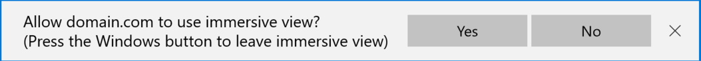

# Using games and apps in Windows Mixed Reality

Windows Mixed Reality is just Windows, which means you can run immersive games designed for mixed reality. You can also run all of the regular 2D apps you know and love on your Desktop (like Candy Crush or Photoshop/AutoCAD).

## How to get into your first immersive game

1. Go to the Store slate that is placed in the Windows Mixed Reality home.
2. Search for HoloTour.
3. Download and install it.
4. Open up the Mixed Reality Start menu by pressing the Windows button on your controller (or Windows Key on your keyboard). Search for HoloTour. You may need to select All Apps.
5. Select HoloTour in Start and place the slate.
6. HoloTour will launch the experience in your headset!

## How to place your first 2D app slate

1. Go to the Store slate that is placed in the Windows Mixed Reality home.
2. Search for your favorite 2D app (for example, Candy Crush).
3. Download and install it.
4. Open up the Mixed Reality Start menu by pressing the Start on your controller (or Windows Key on your keyboard). Search for Candy Crush. You may need to select All Apps.
5. Select Candy Crush in Start and place the slate.
6. You can now interact with the 2D slate using your controllers/mouse & keyboard/gamepad!

## How to use a full Desktop application

1. Open up the Mixed Reality Start menu by pressing the Start on your controller (or Windows Key on your keyboard). Search for Desktop Preview. You may need to press All Apps.
2. Select Desktop Preview in Start and place the slate.
3. You can now see your Desktop!
4. Select the slate and use your mouse and keyboard to launch any full desktop application you desire (like Photoshop or AutoCAD).

## How to get into your first WebVR experience

1. Ensure that your headset is plugged in and your controllers are powered on and connected.
2. Go to the Microsoft Edge slate that is placed in Mixed Reality, or Microsoft Edge application on the Windows desktop.
3. Navigate to a website that supports WebVR. Some Examples:
   * [A-Painter](https://aframe.io/a-painter/)
   * [A-Blast](https://aframe.io/a-blast/)
   * [Sketchfab](https://sketchfab.com/)
   * [CNN/VR](https://cnn.com/vr)
4. Select the 'Enter VR' button on the webpage. It may look similar to:\
   
5. The first time you try to enter VR on a specific domain, the browser will ask for consent to use immersive view. Select Yes: 
6. The WebVR content will launch in your headset!

**Note:** You can launch WebVR experiences from Microsoft Edge either from within Windows Mixed Reality, or on the Windows desktop.

Entering VR from Microsoft Edge on the desktop.

Entering VR from Microsoft Edge within the Mixed Reality cliffhouse.

**To leave a WebVR experience:**
* Press the Windows key on a motion controller, or the keyboard.
* Press the escape key on the keyboard.
* Some pages may offer a way to exit VR from within their immersive experience.
* For desktop Microsoft Edge:
  * Take off your headset and go to a different browser tab
  * Some pages may offer a button on the 2D website to "Exit VR".

## How to get into your first SteamVR experience

Windows Mixed Reality for SteamVR allows users to run SteamVR experiences on Windows Mixed Reality immersive headsets. After installing  Windows Mixed Reality for SteamVR, you can launch your favorite SteamVR applications from a desktop or Steam library and play them directly on their Windows headset.

To get started, follow the [SteamVR setup instructions for Windows Mixed Reality](./using-steamvr-with-windows-mixed-reality.md).

## See also

If you're interested in learning more about how Windows Mixed Reality works, you may also want to read about:
* [Your Mixed Reality home](your-mixed-reality-home.md)
* [Tracking system](tracking-system.md)
* [Motion controllers](controllers-in-wmr.md)
* [WebVR](webvr.md)
* [Using SteamVR with Windows Mixed Reality](using-steamvr-with-windows-mixed-reality.md)
* [Filing feedback](filing-feedback.md)