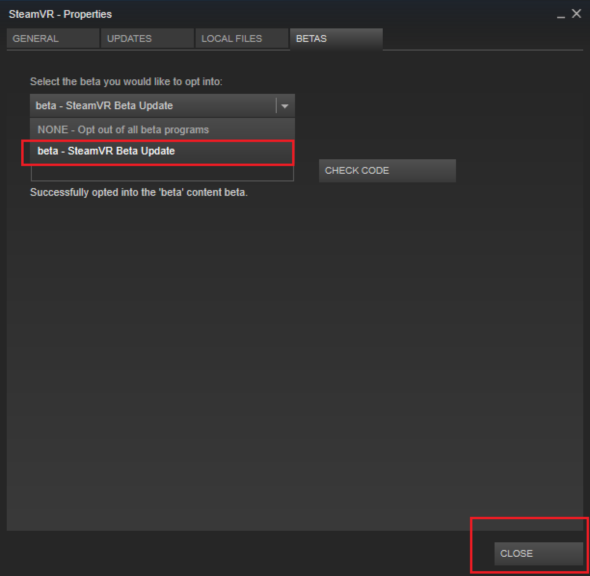
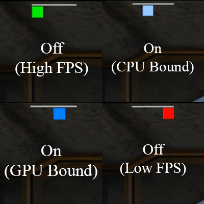

# Using SteamVR with Windows Mixed Reality

Windows Mixed Reality for SteamVR allows users to run SteamVR experiences on Windows Mixed Reality immersive headsets. After installing the Windows Mixed Reality for SteamVR, users can launch their favorite SteamVR applications from their desktop or Steam library and play them directly on their Windows headset.

## Get your PC ready

* Make sure you have no pending updates: Select **Start > Settings > Update & Security > Windows Update**. If updates are available, select **Install now**. If no updates are available, select **Check for updates**, and then install any new ones.
* PC requirements vary for the apps and content on Steam. See the minimum requirements per title. A PC with a GTX 1070 graphics card (or equivalent) and an Intel® Core™ i7 processor should offer a good experience for a broad range of titles.
* Set up up [Windows Mixed Reality](set-up-windows-mixed-reality.md) if you haven't already. 

## Set up Windows Mixed Reality for SteamVR

1. [Download and install SteamVR.](https://steamcdn-a.akamaihd.net/client/installer/SteamWindowsMRInstaller.exe)
2. When ready, start SteamVR. The SteamVR Tutorial should start automatically.

> **Note:** For advanced troubleshooting of your SteamVR setup, make sure you have the following software components installed:
> 1. Install [Steam](http://store.steampowered.com/about/) and **login** or **create a new account.**
> 2. Install [SteamVR](https://store.steampowered.com/app/250820/SteamVR/). With your headset plugged in, launch Steam and you should see a dialog prompting you to install SteamVR. Follow the prompts on the dialog to install it.
    * If you don't see the popup, install SteamVR by navigating to the *Tools* section of your *library*. Locate SteamVR in the list and then right-click and select *Install Game*.
> 3. Install [Windows Mixed Reality for SteamVR](https://store.steampowered.com/app/719950/Windows_Mixed_Reality_for_SteamVR/).

## Set up Windows Mixed Reality for SteamVR in an environment without internet access

**Store the necessary media on a portable storage device**
1. Install [SteamVR](https://store.steampowered.com/app/250820/SteamVR/) and [Windows Mixed Reality for SteamVR](https://store.steampowered.com/app/719950/Windows_Mixed_Reality_for_SteamVR/) as directed above using [Steam](http://store.steampowered.com/about/) on a PC with full internet access.
2. In Steam, open the Library section and find the part labeled "Tools".
3. Once SteamVR is installed, right-click the entry "SteamVR" and in the resulting popup menu, click on the entry "Properties".
4. A new window with multiple tabs will open. Select the tab "LOCAL FILES" and click on the button labeled "BROWSE LOCAL FILES".
5. The directory containing the SteamVR Runtime will open. Copy this entire directory (named SteamVR) onto a portable medium of your choice (e.g. a USB thumb drive).
6. Do the same with Windows Mixed Reality for SteamVR, and any SteamVR-compatible apps you would like to install on the target PC.

**Run SteamVR on the target PC**
1. After plugging the portable storage device into the target PC, move the SteamVR, MixedRealityVRDriver, and other folders to a convenient place on the target PC.


2. Ensuring SteamVR and MixedRealityVRDriver are in the same folder, open a command prompt. For the sake of this example, we will assume the containing folder is at *C:\SteamVRInstall*. In that case, in the command prompt you should run:
```powershell
chdir "C:\SteamVRInstall"
.\SteamVR\bin\win64\vrpathreg.exe adddriver "C:\SteamVRInstall\MixedRealityVRDriver"
```
(Note that if you're running a 32-bit version of Windows, the `win64` part of the path above should be `win32` instead.)

This will allow the runtime to find the Windows Mixed Reality for SteamVR driver in your custom installation.

4. In order to run SteamVR you should double-click the file "vrstartup.exe" located at *SteamVR\bin\win64\vrstartup.exe*, or *SteamVR\bin\win32\vrstartup.exe* if the target PC is running a 32-bit version of Windows.

See the [Steamworks documentation page for more information and troubleshooting](https://partner.steamgames.com/doc/features/steamvr/enterprise#2).

## Play SteamVR games

1. Connect your headset to your PC and turn on your motion controllers.
2. Once the Windows Mixed Reality home has loaded and your controllers are visible, open the Steam app on your desktop.
3. Use the Steam app to launch a SteamVR game from your Steam library.

**Tip**: To launch SteamVR games without taking off your headset, use the Desktop app (**Start > Desktop**) to view and interact with your PC desktop inside Windows Mixed Reality.

## Using Motion Controllers with SteamVR

You'll use your motion controllers differently in different games. Here are a few basics to help you get started:

* To open the Steam dashboard, press straight down on the left or right thumbstick.
* To exit a SteamVR game and return to the Windows Mixed Reality home, press the Windows button.

## Changing the resolution

You can adjust the Application Resolution slider in the SteamVR -> Settings -> Applications window at any time if you'd like to play games at a higher resolution. **When using a higher resolution multiplier you can expect the game to put more strain on your PC. If you increase the multiplier and see degraded performance, readjust the slider to the default level and restart the game to ensure that the change takes effect.

## Using multiple headsets

If you're a VR enthusiast, you might regularly use more than one VR headset on the same PC. If that's the case note that when a Windows Mixed Reality headset is plugged in, SteamVR games will always launch to the Windows Mixed Reality headset. If you'd like to launch SteamVR games on another headset make sure to first unplug the Windows Mixed Reality headset before continuing.

## Preview programs

We release regular updates to improve the performance, reliability, and overall experience of using SteamVR on Windows Mixed Reality immersive headsets. While none of these preview programs are required, we encourage you to join them if you would like to get updates sooner and more frequently (and give us feedback on those updates!).

### Windows Mixed Reality for SteamVR Beta

Windows Mixed Reality for SteamVR is the component you install from the Steam Store that enables SteamVR to work with your Windows Mixed Reality headset.  We publish updates to this "bridge" regularly and Steam installs them automatically.

If you want to get updates more frequently, we encourage you to join our public Beta.  Updates go to our Beta audience first, and we use their feedback to make sure the updates are high quality before publishing them to all users.  If you’re not in our Beta program, you’ll eventually get all of the same fixes and features, but after they've been tested by our Beta users.

To join:

  1. In Steam, use the drop-down under the **Library** menu to filter to **Software**.
  2. In the list, right-click **Windows Mixed Reality for SteamVR** and select **Properties**.
  3. Select the **Betas** tab.
  4. Opt in to **"beta - public beta"** and select **Close** to confirm. The beta access code field should be left blank.
  
### SteamVR Beta

SteamVR is built and released by Valve and is common across all SteamVR headsets.  It follows a similar model of releasing updates to Beta members before publishing to all users.

To join:

  1. In Steam, use the drop-down under the **Library** menu to filter to **Tools**.
  2. In the list, right-click **SteamVR** and select **Properties**.
  3. Select the **Betas** tab.
  4. Opt in to **"beta - public beta"** and select **Close** to confirm.  The beta access code field should be left blank.

### Windows Insider Program

Windows Mixed Reality is a part of Windows 10.  Many fixes and features that affect SteamVR users come with the Windows OS.  If you want to try the latest Windows 10 preview builds, we encourage you to join the [Windows Insider Program](https://insider.windows.com).

## Enabling motion reprojection for SteamVR Apps

Windows Mixed Reality for SteamVR has an experimental motion reprojection feature to make 90 FPS reprojection more smooth.

When motion reprojection is enabled, all Steam VR games will render nominally at ½ frame rate (45 fps instead of 90 FPS) while Windows Mixed Reality for SteamVR uses motion vectors generated by the GPU to extrapolate the next frame. For SteamVR games that reliably hit 60 FPS+ on a given PC, this should result in a solid 90 FPS experience with occasional artifacts while maintaining a comfortable experience.

The available motion reprojection modes are as follows:

* **SteamVR per-app setting**: Allows you to control motion reprojection through the SteamVR Settings UI. You can then open SteamVR Settings, go to Video > Per-Application Video Settings, and select an option for "Motion Smoothing."
* **Auto**: Enables motion reprojection to turn on automatically when a game is rendering too slowly to maintain 90 FPS. When a game begins to maintain 90 FPS or starts rendering at less than 45 FPS, motion reprojection will turn off. Asynchronous rotational reprojection is enabled always.
* **Motion Vector**: Forces the application to always run at half-framerate with motion vector reprojection.
* **None**: Disables motion reprojection.

**Expected Visual Artifacts** 

1. When using an application resolution greater than 150%, you may experience blurring. When using motion reprojection, we recommend using a value less than 150%.
2. Sharp contrast edges or text, especially on in-game HUDs or menus, may look temporarily warped or distorted because of disocclusion.
3. SteamVR Home and many other games that don't reliably hit 50-60 FPS on your PC will continue to have a poor experience with this mode.
4. Some games have been reported to run at 50% speed or with increased latency (lag). Report these games through the [Windows Feedback Hub](filing-feedback.md) instructions below.

Initially we have experimental support for recent generation NVidia GPUs. We're continuing to iterate and improve our motion reprojection support on more GPUs, and we’re eager to hear your feedback.

**Supported GPUs:** Nvidia GeForce GTX1060, AMD RX470 or better, with Windows Mixed Reality compatible graphics drivers installed.

To enable motion reprojection:

1. Make sure you've opted into the **Windows Mixed Reality for SteamVR Beta** using the instructions above.
2. Open the SteamVR dashboard.
3. Select the button on the left side with the Windows Mixed Reality logo to open **Windows Mixed Reality for SteamVR** Settings.
4. In the UI that pops up, select the Graphics tab.
5. Select "Auto" for "Default SteamVR app motion reprojection mode" to enable automatic motion reprojection.


**Motion Reprojection Indicator**

The motion reprojection indicator helps diagnose issues with the experimental automatic motion reprojection feature. When set to true, you'll see an indicator in the top-left of your headset display during automatic motion reprojection. The color and position of this indicator corresponds to the current motion reprojection mode - see the diagram below for examples.



Green = motion reprojection is off because the application can render at full framerate.

Cyan = motion reprojection is on because the application is cpu bound.

Blue = motion reprojection is on because the application is gpu bound.

Red = motion reprojection is off because the application is running at less than half framerate; try reducing super sampling if enabled.

Green + Cyan + Blue = motion reprojection is in half-framerate mode or the application requested motion reprojection.

## Sharing feedback on SteamVR

Your feedback is invaluable when it comes to improving the Windows Mixed Reality SteamVR experience. Submit all feedback and bugs through the [Windows Feedback Hub](filing-feedback.md). Follow these suggestions to help us get the most from your feedback:

1. In Feedback Hub, indicate that you're reporting a new Problem in the "What kind of feedback is it?" section at the top.
2. Select the **Mixed Reality** category and the **Apps** subcategory.
3. Put the word "SteamVR" in the problem summary. That helps us find your feedback.
4. Describe what SteamVR game or application you were using when you come across the issue.
5. Consider attaching a SteamVR System Report to your feedback. This provides more logs that can help us diagnose your problem.
    1. On the SteamVR Window (the small windows that shows your controller status) select on the title to open the menu.
    2. Select "Create System Report".
    3. Save to File.
    4. Attach the generated file to your Feedback Hub entry directly.
6. If your feedback is about SteamVR performance, collect a Mixed Reality Performance trace: 
    1. Select the **Recreate my Problem** button.
    2. In the drop-down next to "include data about", select **Mixed Reality Performance**.
    3. Make sure the game is running and select **Start Capture**.
    4. Spend a few seconds playing the game to capture the trace. Don't capture the trace for more than 10-15 seconds, or it will be too large to submit.
    5. Select **Stop Capture**.
7. Select **Submit** once you've completed the rest of the fields.

If you have questions or comments to share, you can also reach us on our [Steam forum](http://steamcommunity.com/app/719950/discussions/).

## See also

* [Troubleshooting SteamVR with Windows Mixed Reality](steamvr-questions.md)
* [Using games and apps in Windows Mixed Reality](using-games-and-apps-in-windows-mixed-reality.md)
* [Using HP Controllers in Unity](/windows/mixed-reality/develop/unity/unity-reverb-g2-controllers)
* [Using HP Controllers in Unreal](/windows/mixed-reality/develop/unreal/unreal-reverb-g2-controllers)
* [Filing bugs and feedback](filing-feedback.md)
