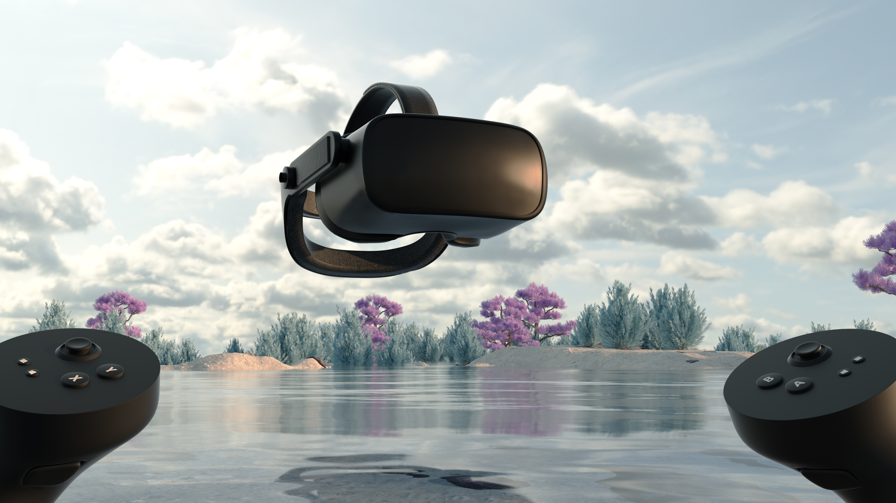

# Your VR journey

## Setup & usability checkpoints

Use the following checkpoints to set up, configure, and use your Windows Mixed Reality devices to bring your applications and games to life in VR.

### 1. Before you buy

Your PC must be capable of running Windows Mixed Reality devices to achieve the best setup and usage experience. Use the following resources to ensure your system meets the requirements for Windows Mixed Reality compatibility:

 

|  Checkpoint  |  Description  |
| --- | --- |
| [Before you buy](before-you-start.md) | Ensure you have everything you need to start using Windows Mixed Reality. |
| [Before you buy FAQ](before-you-buy-faqs.md) | Find answers to common questions you might have about Windows Mixed Reality before purchasing. |
| [Minimum PC hardware guidelines](windows-mixed-reality-minimum-pc-hardware-compatibility-guidelines.md) | Learn everything you need to know about running Windows Mixed Reality on your PC. |
| [Get help with PC compatibility](get-help-with-pc-compatibility.md) | Troubleshooting tips and solutions for getting your PC ready for use with Windows Mixed Reality devices.  |
| [Recommended adapters](recommended-adapters-for-windows-mixed-reality-capable-pcs.md) | Recommended guidance for understanding port compatibility, purchasing adapters, and using USB hubs. |

### 2. Getting started

Once you have your device, you'll need to correctly set up and configure it for use with your PC and real-world surroundings. This section will guide you through installation and setup of Windows Mixed Reality:

 

|  Checkpoint  |  Description  |
| --- | --- |
| [Plug in your headset](plug-in-your-headset.md) | Review guidance on correctly connecting your Windows Mixed Reality device to your PC. |
| [Install Windows Mixed Reality](install-windows-mixed-reality.md) | Guidance and troubleshooting tips for installing Windows Mixed Reality on your PC. |
| [Set up Windows Mixed Reality](set-up-windows-mixed-reality.md) | Set up your motion controllers, room boundary, and speech settings for your Windows Mixed Reality device. |
| [Windows Mixed Reality setup FAQs](wmr-setup-faq.yml) | Review solutions and troubleshooting tips for common issues when setting up Windows Mixed Reality on your PC. |
| [Health, safety, and comfort guidelines](wmr-health-safety-comfort.md) | Read up on health and safety guidance before using Windows Mixed Reality.  |

### 3. Using Windows Mixed Reality

There are many different features, capabilities, and services available to Windows Mixed Reality users. This section will explain all the different ways you can use Windows Mixed Reality, including how to navigate the virtual world and what input types are supported: 

 

|  Checkpoint  |  Description  |
| --- | --- |
| [Learn Windows Mixed Reality](learn-mixed-reality.md) | Basic introduction to concepts such as how to use motion controllers and how navigation works in the virtual world.  |
| [Your Mixed Reality home](your-mixed-reality-home.md) | Explore the virtual environment of the Windows Mixed Reality home space.  |
| [Motion controllers & other input types](controllers-in-wmr.md) | Setup, understand, and use your motion controllers and learn about other supported input types. |
| [Using speech commands](using-speech-in-wmr.md) | Familiarize yourself with different voice commands that can help you interact with the virtual world.  |
| [Using Windows Mixed Reality FAQ](using-wmr-faq.yml) | Troubleshooting steps and solutions for common issues when using Windows Mixed Reality. |

## 4. Discover games, apps, and other content

Explore the vast world of immersive games, applications, and experiences supported on Windows Mixed Reality using the resources below:

 

|  Checkpoint  |  Description  |
| --- | --- |
| [Windows games & apps](using-games-and-apps-in-windows-mixed-reality.md) | An introduction to using immersive apps, Windows slates, and desktop applications in virtual reality. |
| [Microsoft Edge & WebXR](using-microsoft-edge.md) | Get setup to experience VR using the Microsoft Edge browser and learn how to access immersive content on the web.  |
| [Explore AltspaceVR](/windows/mixed-reality/altspace-vr/explore/beginners-guide) | Explore the expanding world of VR events happening in AltspaceVR. |
| [Using SteamVR](using-steamvr-with-windows-mixed-reality.md) | Learn how to connect Windows Mixed Reality to Steam and access thousands of exciting immersive games, apps, and experiences. |

## Troubleshooting, tips & resources

If you encounter any issues with your Windows Mixed Reality experience, start here: 

* [Troubleshooting & FAQ](troubleshooting-windows-mixed-reality.md) 

>[!NOTE]
>A full Windows Mixed Reality release history is available [here](mixed-reality-software.md).
