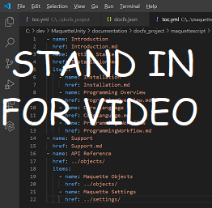

# About Maquette

<!-- TODO(Harrison): Need consolidated logo with text -->
 MaquetteScript Introduction

<!-- TODO(Harrison/Stefan): Add more high level, less technical explanation of what Maquette is and why it's useful in MR development. 
          - Differentiate between Maquette and MaquetteScript
          - Separate out each of Maquette's main parts and add content
          - Give brief explanations of use case or examples
-->
Maquette integrates standard ECMA 5.1 Javascript to enable investment of interactivity in Maquette scenes and objects which can be edited and executed from within VSCode. Properties of objects are exposed for reading and setting from within script, object methods called, and object and system events fielded. Script can also interact with Maquette itself via system objects accessible via script. Various UI controls that the user can interact with are part of the system. These can be added when authoring in Maquette or created and managed from within script. User interaction events with these elements (data entry, clicks, etc) are also exposed to script as events. With these additions, simple to complex scenes can be built, from experiments to data visualization to explorations of Mixed Reality user scenarios to fully realized experiences in AR or VR.

  

<!-- TODO(Harrison/Stefan): Get this video recorded or create the content in text form until it's available. -->
60 second'ish video
* Entry Title Card
  * Creation of Interactive Mixed Reality Content in Maquette
  * Scripting/Interactivity/UI System
* VO welcome by team or video captions?  explaining:
  * reasoning behind scripting to enable creation of interactive MR content
  * touch on how it can be used in very broad brush strokes
* Scripting vingette’s in action
  * Composing dialog box
  * Building app from outline (cooking app demo)
  * Composing in photogrammetry model
  * Interacting with troubleshooting guide
  * Screen view of debugging scripting in VSCode
  * Getting access to script from an object in scene
  * Etc...
* Summary Title card at end
  * Link to Maquette
  * Where to go to get started with scripting
  * Announcements/status/community
  * Look forward to seeing what you can do/submissions(?)
  * Feedback and how we can serve you better

<!-- TODO(Harrison): Consider breaking this out into a Maquette journey doc or section as applicable. -->
* [Getting Started](installation.md)
* [Examples and Sample Apps](../samples/overview.md)
* [Support](../resources/support.md)

<!-- TODO(Harrison): Need to find out why docs feedback footer isn't appearing. -->
## Send us feedback

We look forward to hearing about your experiences and results. Feedback, suggestions and bug reports always welcome!
<Link?>