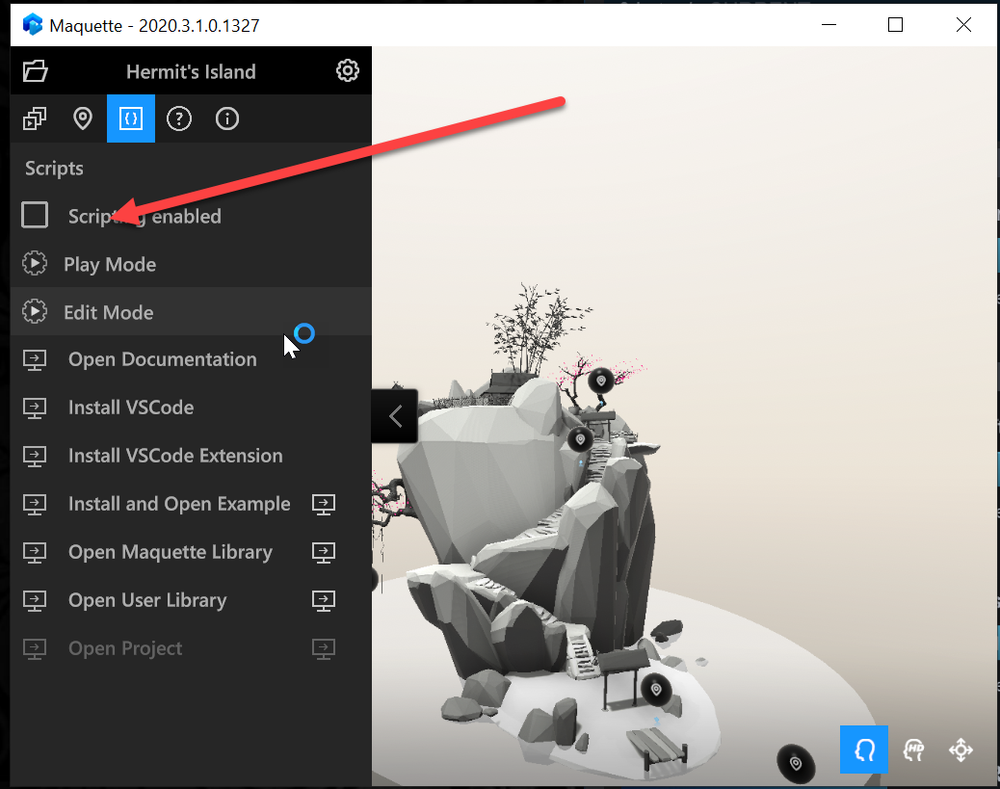

# Installing Maquette

<!-- TODO(Harrison): Need consolidated logo with text. -->
 MaquetteScript Installation

<!-- TODO(Stefan): Need more explanation on the .mqjs route for running MaquetteScript. -->
MaquetteScript development is primarily done within VSCode. MaquetteScript can run from script contained in `.mqjs` files and also via a special VSCode extension interface. Integration between VSCode and Maquette to enable the extension interface is accomplished with a MaquetteScript VSCode extension.

## Installing the VSCode Extension

* Download and install [VSCode](https://code.visualstudio.com). 

The Maquette javascript extension is in [the Visual Studio Marketplace](https://marketplace.visualstudio.com/items?itemName=ms-maquette.vscode-maquette-javascript).

* Run the [installation procedure for the extension](vscode:extension/ms-maquette.vscode-maquette-javascript).

<!-- TODO(Stefan): Are there plans to have the extension update manually in the future? If so, when will this be available? -->
`NOTE: The VSCode extension does not automatically update currently and will need to be updated manually.`

## Enabling Scripting

<!-- TODO(Stefan): Is scripting still a pre-release only option? If and when will it be available for current users? -->
`PRE-RELEASE NOTE: Javascript is already embedded within Maquette but requires additional steps and settings to access and enable. Scripting is currently only available for pre-release testing and is not a visible option for current users. Ensure at least version 2020.3.0.0.1315 but preferably use latest version.`

To make scripting accessible during pre-release:

* Put a file with the name `scripting.enabled` in the Users Documents directory for Maquette in: `~/Documents/Maquette/Settings`.

After installation, scripting will be disabled by default for security reasons.

<!-- TODO(Stefan): Missing a first step where the user has to select the {} tab in VSCode, shown in the screenshot, to access the scripting enabled setting.
                   - Also missing instructions and screenshot on how to turn on scripting in the JSON settings file.
 -->
* To enable execution of script, turn it ON in the main tab of the companion window or in the json settings file.

