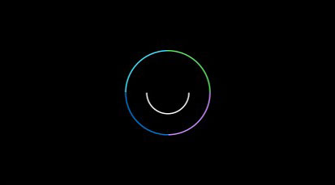
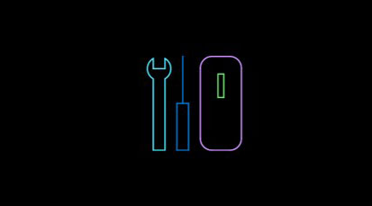
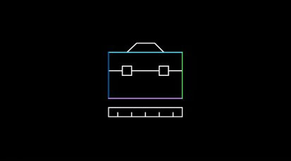
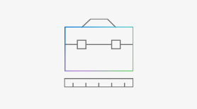

# Get started with Mixed Reality

<ul id="cardtypes-W" class="cardsW panelContent" style="display: flex; margin-top: 0px;">
                            <li>
                              <a href="https://docs.microsoft.com/azure/spatial-anchors" target="_blank" title="Understanding the basics of mixed reality" data-linktype="absolute-path">
                                    

                                        

                                            

                                                

                                                    

                                                        
                                                    

                                                

                                                

                                                    <h3 class="x-hidden-focus">Understanding the basics of mixed reality</h3>
                                                  
I’m brand new to mixed reality. I would like to learn about what it is and understand it’s capabilities.

                                                

                                            

                                        

                                    

                                    </a>
                            </li>
                            <li>
                              <a href="https://docs.microsoft.com/azure/cognitive-services/speech-service/" target="_blank" title="Understand the tools, languages and architecture" data-linktype="absolute-path">
                                    

                                        

                                            

                                                

                                                    

                                                        
                                                    

                                                

                                                

                                                    <h3 class="x-hidden-focus">Understand the tools, languages and architecture</h3>
                                                  
I’m an experienced developer but new to the tools, languages and architecture of mixed reality.

                                                

                                            

                                        

                                    

                                    </a>
                            </li>
                             <li>
                              <a href="https://docs.microsoft.com/azure/cognitive-services/computer-vision/" target="_blank" title="Jump in with Unity and MRTK" data-linktype="absolute-path">
                                    

                                        

                                            

                                                

                                                    

                                                        
                                                    

                                                

                                                

                                                    <h3 class="x-hidden-focus">Jump in with Unity and MRTK</h3>
                                                  
I’m experienced with mixed reality. Show me how to port apps from other platforms, find tutorials and learn about MRTK.

                                                

                                            

                                        

                                    

                                    </a>
                            </li>
</ul>

<h2>Browse for articles by category</h2>

<ul id="cardtypes-W" class="cardsW panelContent" style="display: flex; margin-top: 0px;">
                            <li>
                            <a href="design.md" title="Design landing" data-linktype="absolute-path">
                                    

                                        

                                            

                                                

                                                    

                                                        
                                                    

                                                

                                                

                                                    <h3>Design</h3>
                                                    
Get design guidance, build user interface and learn interaction and input.

                                                

                                            

                                        

                                    

                               </a>
                            </li>
                            <li>
                             <a href="development.md" title="Development landing" data-linktype="absolute-path">
                              

                                  

                                      

                                          

                                              

                                                  
                                              

                                          

                                          

                                              <h3>Develop</h3>
                                              
Get development guides, learn the technology, and understand the science.

                                          

                                      

                                  

                              

                               </a>
                            </li>
                             <li>
                              <a href="implementing-3d-app-launchers.md" title="Distribute" data-linktype="absolute-path">
                                    

                                        

                                            

                                                

                                                    

                                                        
                                                    

                                                

                                                

                                                    <h3 class="x-hidden-focus">Distribute</h3>
                                                  
Get your application ready for others and consider creating a 3D launcher.

                                                

                                            

                                        

                                    

                                </a>
                            </li>
 </ul>

<h2>Learn more about Azure services for mixed reality</h2>

[]azure-services.md)

Create mixed reality apps that map, designate, and recall precise points of interest that are accessible across HoloLens, iOS, and Android devices. Enable wayfinding across spaces to help your users collaborate more efficiently.

>[!IMPORTANT]
>All mixed reality development materials are provided on this site for your reference only. Your application, its usage, and its effect on end users is your sole responsibility as the application developer, including ensuring that your app does not cause discomfort, injury, or any other harm to the end user, and including appropriate warnings and disclaimers. You need to at all times take the appropriate steps in the development and publishing of your application to ensure that your application is safe, and that you meet all obligations in your [App Developer Agreement with Microsoft](https://docs.microsoft.com/legal/windows/agreements/app-developer-agreement). 
