# 2. Initializing your project and first application

## Overview

<!-- TODO: Consider expanding to include summary of each tutorial in this tutorial series -->
In this first tutorial, you will learn about some of the capabilities the <a href="https://github.com/microsoft/MixedRealityToolkit-Unity" target="_blank">Mixed Reality Toolkit (MRTK)</a> has to offer, start your first application for the HoloLens 2, and deploy it to the device.

## Objectives

* Configure Unity for HoloLens development
* Import assets and set up the scene
* Visualization of the spatial mapping mesh, hand meshes, and the framerate counter

## Create new Unity project

Launch **Unity Hub**, select the **Projects** tab, and click the **down arrow** next to the **New** button:

<!-- TODO: updated image-->

Select the Unity version specified in the [Prerequisites](#prerequisites) section above:

<!-- TODO: updated image-->

In the Create a new project window:

* Ensure **Templates** is set to **3D**
* Enter a suitable **Project Name**, for example, _MRTK Tutorials_
* Choose a suitable **Location** to store your project, for example, _D:\MixedRealityLearning_
* Click the **Create** button to create and launch your new Unity project

<!-- TODO: updated image-->

> [!CAUTION]
> When working on Windows, there is a MAX_PATH limit of 255 characters. Unity is affected by these limits and may fail to compile if any file path is longer than 255 characters. Consequently, it is strongly recommended to store your Unity project as close to the root of the drive as possible.

Wait for Unity to create the project:

<!-- TODO: Consider if we should change this image with a new open unity project or add second image-->

## Import TextMesh Pro Essential Resources

<!-- TODO: Consider changing-->
> [!NOTE]
> We are importing this package because it is required by Mixed Reality Toolkit's UI elements. Although we will not be using it in this lesson it is very important for upcoming lessons.

In the Unity menu, select **Window** > **TextMeshPro** > **Import TMP Essential Resources**:

In the Import Unity Package window, click the **All** button to ensure all the assets are selected, then click the **Import** button to import the assets:

## Import the Mixed Reality Toolkit

Download the Unity custom package:

* [Microsoft.MixedReality.Toolkit.Unity.Foundation.2.3.0.unitypackage](https://github.com/microsoft/MixedRealityToolkit-Unity/releases/download/v2.3.0/Microsoft.MixedReality.Toolkit.Unity.Foundation.2.3.0.unitypackage)

In the Unity menu, select **Assets** > **Import Package** > **Custom Package...** to open the Import package... window:

In the Import package... window, select the **Microsoft.MixedReality.Toolkit.Unity.Foundation.2.3.0.unitypackage** you downloaded and click the **Open** button:

In the Import Unity Package window, click the **All** button to ensure all the assets are selected, then click the **Import** button to import the assets:

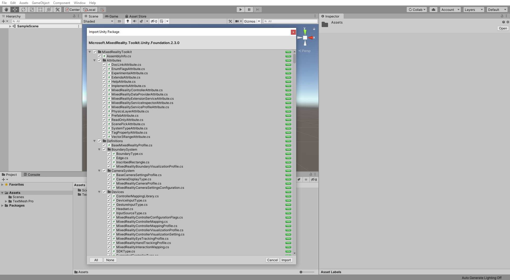

> [!NOTE]
> When it is finished importing the MRTK Project Configurator window will pop up. We don't need this at this stage so just close it by pressing the red **x** at the top.

## Configure the Unity project for the Mixed Reality Toolkit

In this section, you will switch the build platform to Universal Windows Platform (UWP) and configure the Mixed Reality capabilities.

### 1. Switch build platform

In the Unity menu, select **File** > **Build Settings...** to open the Build Settings window:

In the Build Settings window, select **Universal Windows Platform** and click the **Switch Platform** button:

Wait for Unity to finish switching the platform:

When Unity has finished switching the platform, click the red **x** icon to close the Build Settings window:

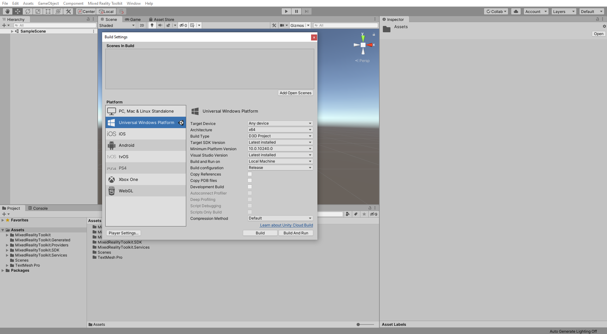

### 2. Configure the MRTK capabilities 

After the platform has switched, the MRTK Project Configurator window should appear. If it does not, open it by selecting **Mixed Reality Toolkit** > **Utilities** > **Configure Unity Project** in the Unity menu.

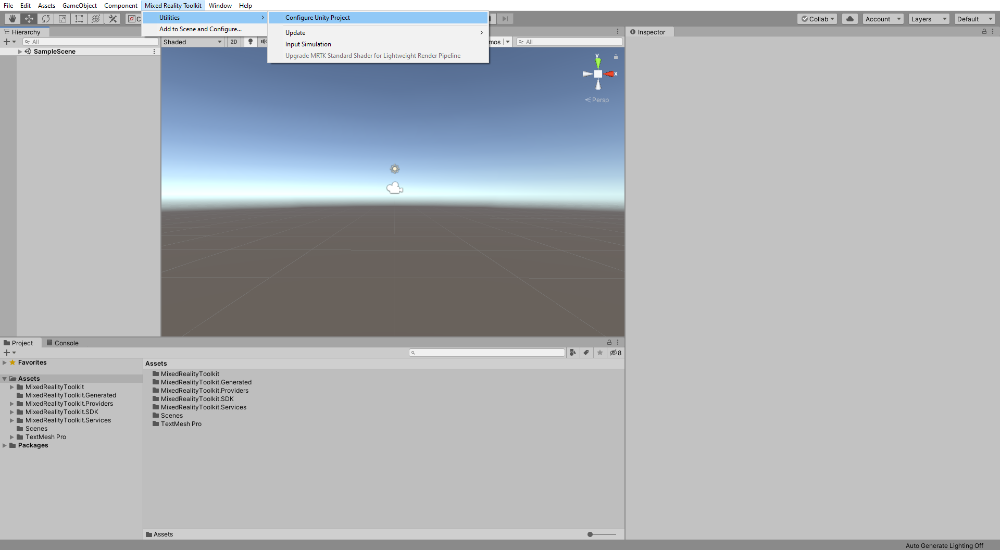

In the MRTK Project Configurator window, expand the **Modify Configurations** section, ensure all options are checked, and click the **Apply** button to apply the settings:

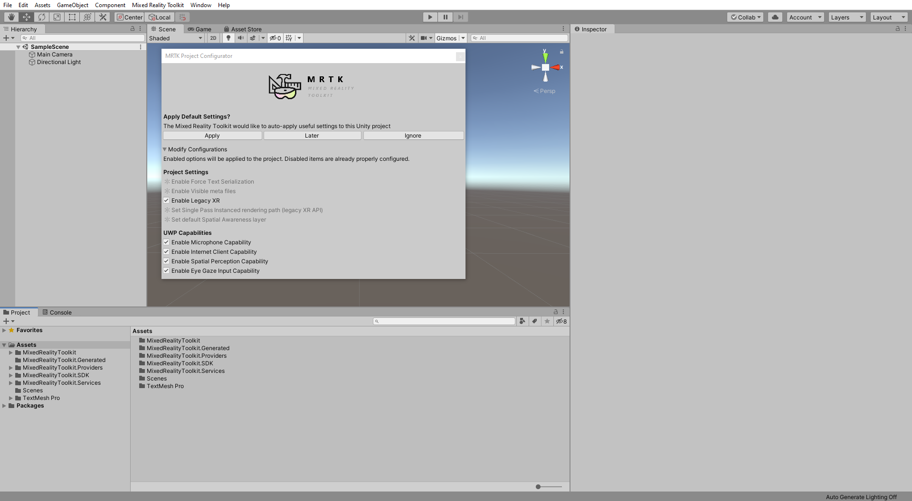

## Creating and preparing the scene

In this section, you will create a new scene, change the light settings, and add the MRTK to the scene.

### 1. Make a new scene

In the Unity menu, select **File** > **New Scene** to create a new scene:

### 2. Add Mixed Reality to the scene and configure

In the Unity menu, select **Mixed Reality Toolkit** > **Add to Scene and Configure...** to add the Mixed Reality Toolkit to your current scene:

With the MixedRealityToolkit object selected in the Hierarchy window, in the Inspector window, verify the Mixed Reality Toolkit configuration profile is set to **DefaultMixedRealityToolkitConfigurationProfile**:

> [!IMPORTANT]
> Typically, you will use the DefaultHoloLens2ConfigurationProfile when developing for HoloLens 2. However, for the purpose of this tutorial, you will use the DefaultMixedRealityToolkitConfigurationProfile, then in the next tutorial, [Creating user interface and configure Mixed Reality Toolkit](mrlearning-base-ch2.md), you will change to the DefaultHoloLens2ConfigurationProfile.

### 3. Enable Auto Generate Lighting

In the Unity menu, select **Windows** > **Rendering** > **Light Settings** to open the light settings window:

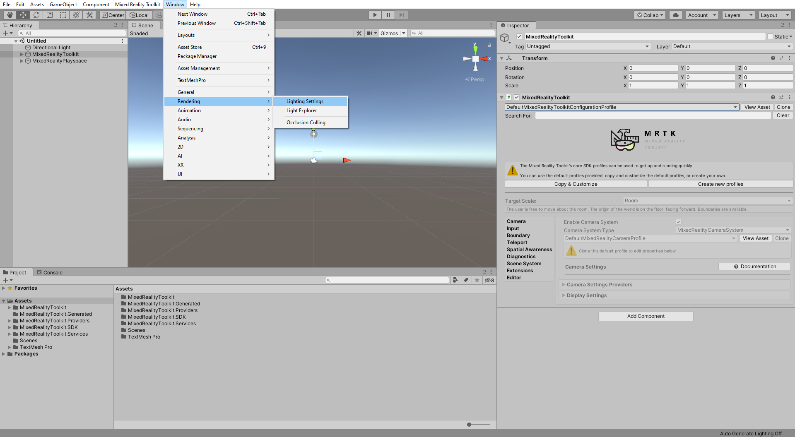

At the bottom of the **Light Settings** window, check the **Auto Generate** box:

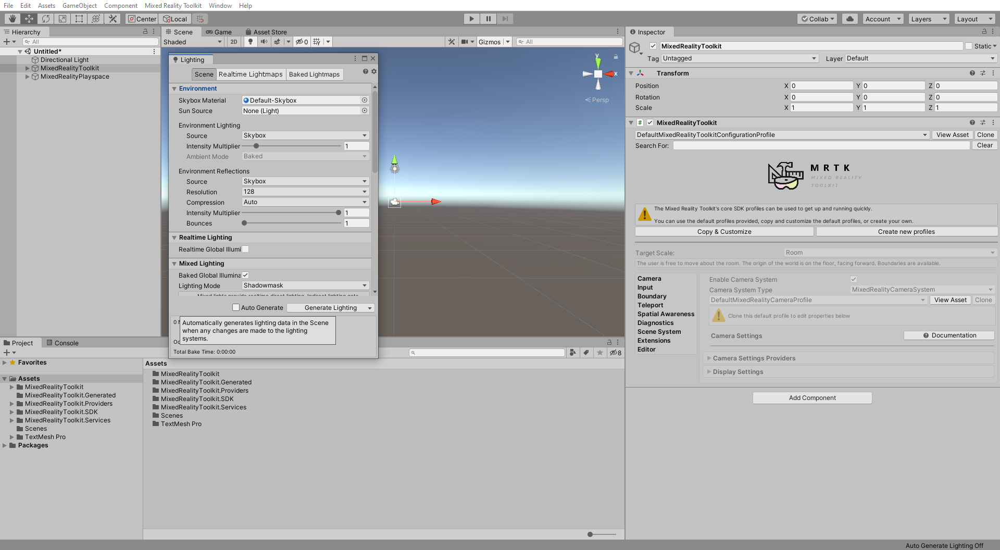

> [!NOTE]
> For bigger projects you will probably leave this setting off due to how much it can slow your computer, but in our case it will be fine.

### 4. Save scene

In the Unity menu, select **File** > **Save As...** to open the Save Scene window:

In the Save Scene window, navigate to your project's **Scenes** folder, give your scene a suitable name, for example, _GettingStarted_, and click the **Save** button to save the scene:

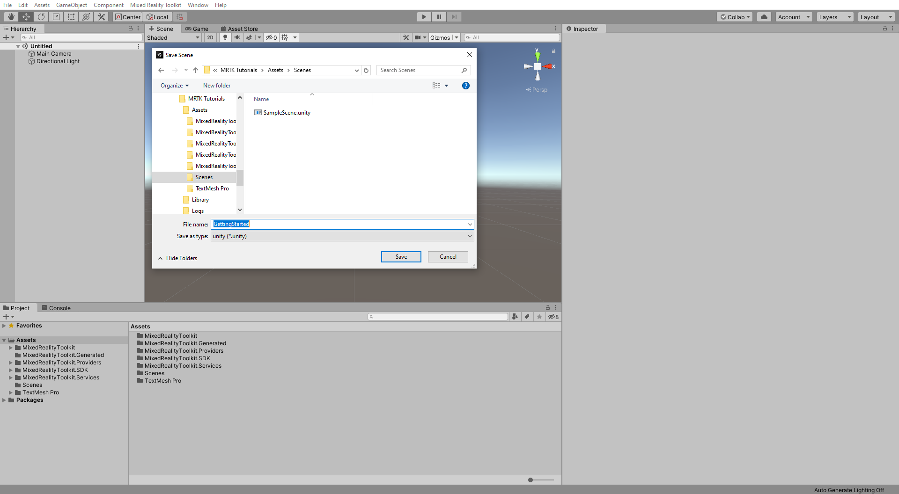

## Configure Project settings for Hololens

In this section, you will change the package name, enable spatial audio, and enable Windows Mixed Reality (WMR) SDK.

### 1. Configure UWP package settings

In the Unity menu, select **Edit** > **Project Settings...** to open the Project Settings window:

In the Project Settings window, select the **Player** tab, and at the top, in the **Company Name** slot, type your name:

Expand the **Publishing Settings** section, and in the **Package Name** slot, enter a suitable name, for example _MRTKTutorials-GettingStarted_:

> [!TIP]
> The Package Name slot does not except spaces. Any spaces will be removed pushing everything together.

### 2. Configure XR settings

with the **Player** tab still selected, Expand the **XR Settings** section. Under **Virtual Reality SDKs**, press the **+** icon, to add an SDK, and select **Windows Mixed Reality**:

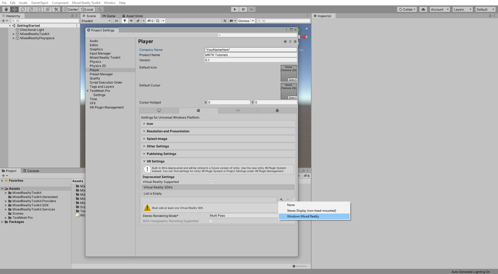

When Unity has finished adding the SDK, optimize the XR Settings as follows:

* Set Windows Mixed Reality **Depth Format** to **16-Bit Depth**
* Check the Windows Mixed Reality **Enable Depth Buffer Sharing**
* Set **Stereo Render Mode\*** to **Single Pass Instanced**

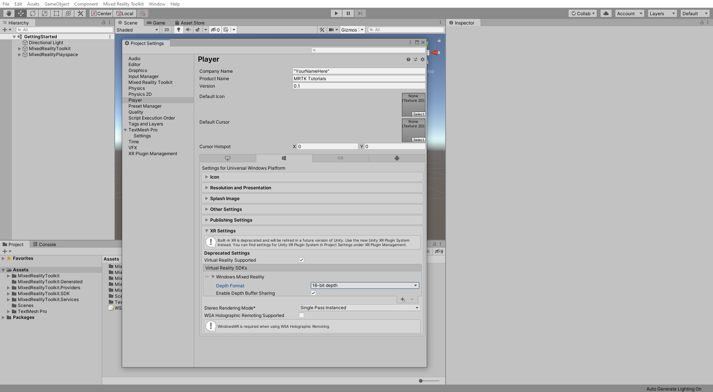

### 3. Enable spatial sound

In the Project settings window, select the **Audio** tab:

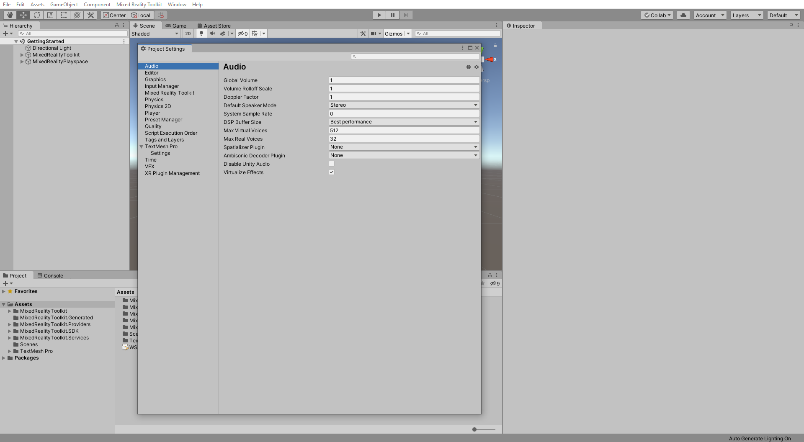

Click on the **Spatializer Plugin** dropdown, and select **MS HRTF Spatializer**:

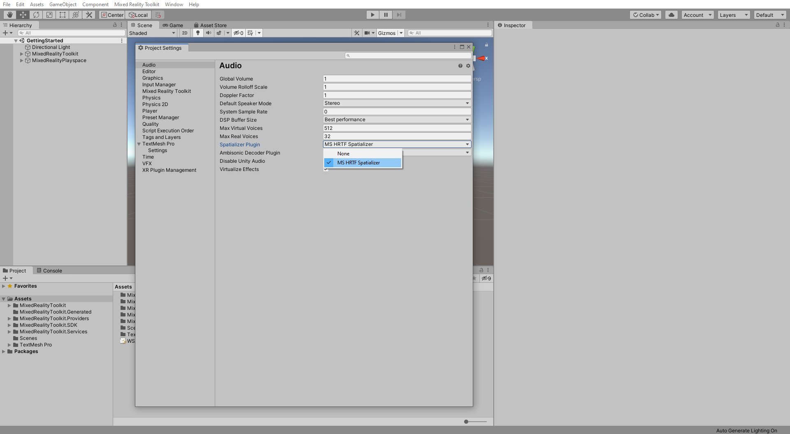

## Build your application to your Hololens 2

In this section, you will learn how to build and deploy to a Hololens 2.

### 1. Build the Unity project

In the Unity menu, select **File** > **Build Settings...** to open the Build Settings window.

In the Build Settings window, click the **Add Open Scenes** button to add your current scene to the **Scenes In Build** list. Expand the **Architecture** dropdown and select **ARM**, then click the **Build** button to open the Build Universal Windows Platform window:

In the Build Universal Windows Platform window, choose a suitable location to store your build, for example, _D:\MixedRealityLearning\Builds_, create a new folder and give it a suitable name, for example, _GettingStarted_, and then click the **Select Folder** button to start the build process:

Wait for Unity to finish the build process:

### 2. Build and deploy the application

When the build process is completed, Unity will prompt Windows File Explorer to open the location you stored the build. Navigate inside the folder, and double-click the solution file to open it in Visual Studio:

> [!NOTE]
> If Visual Studio asks you to install new components, take a moment to ensure that all prerequisite components are installed as specified in the [Install the Tools](install-the-tools.md) documentation.

Configure Visual Studio for HoloLens 2 by selecting the **Master** or **Release** configuration, the **ARM** architecture, and **Device** as target:

> [!NOTE]
> If you don't see Device as an option you may need to change the default start up project from the IC2Lpp project to your UWP Project. In the **Solution Explorer**, right click on **yourprojectname (Universal Windows)** and select **Set as StartUp Project**.

Connect your HoloLens 2 to your computer.

> [!IMPORTANT]
> Before building to your device, the device must be in Developer Mode and paired with your development computer. Both of these steps can be completed by following [these instructions](using-visual-studio.md).

The final step is to build and deploy to your device by selecting **Debug** > **Start Without Debugging**:

While these instructions assume you will be deploying to a HoloLens 2 device, you can also deploy to the [HoloLens 2 emulator](using-the-hololens-emulator.md) or create an [app package for sideloading](<https://docs.microsoft.com//windows/uwp/packaging/packaging-uwp-apps>).

Selecting Start without Debugging causes the application to immediately start on your device upon a successful build, but without the debugger attached and information appearing in Visual Studio. This also means that you can disconnect your USB cable while your application is running on your HoloLens 2 without stopping the application.

To deploy to your device without having the application start automatically, you can select Build > Deploy Solution.

## Congratulations

<!-- TODO: Consider cleanup and adding in app screenshots -->
You have now deployed your first HoloLens 2 application. As you walk around, you should see a spatial mapping mesh covering all the surfaces that have been perceived by the HoloLens 2. Additionally, you should see indicators on your hands and fingers for hand tracking and a frame rate counter for keeping an eye on application performance. These are just a few of the foundational pieces, included out of the box, with the Mixed Reality Toolkit. In the tutorials to come, you will start adding more content and interactivity to your scene so that you can fully explore the capabilities of HoloLens 2 and the Mixed Reality Toolkit.

> [!NOTE]
> In the app, you may notice the Diagnostics profiler, you can toggle it's visibility using the speech command **Toggle Diagnostics**. However, it is generally recommended to keep the profiler visible at all times during development to understand when changes to the app may have impacted performance, for example, HoloLens 2 application should [continuously run at 60 FPS](understanding-performance-for-mixed-reality.md).

[Next Tutorial: 3. Creating user interface and configure Mixed Reality Toolkit](mr-learning-base-03.md)
