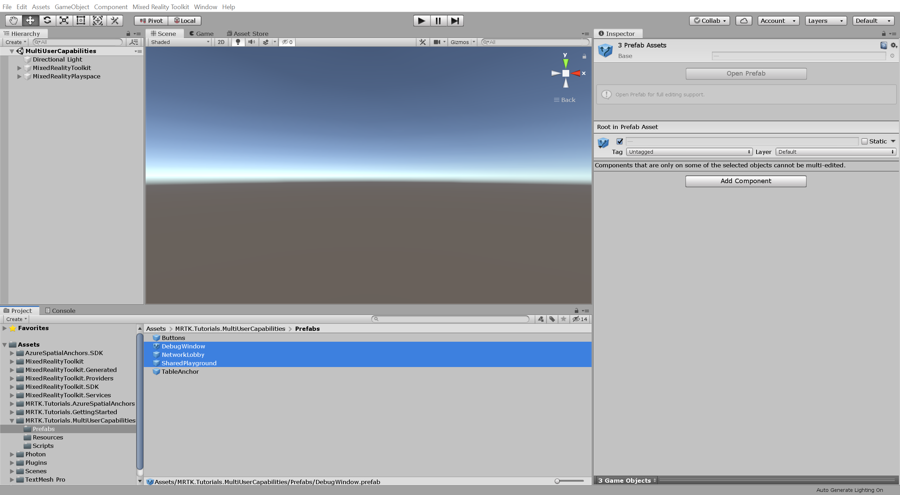
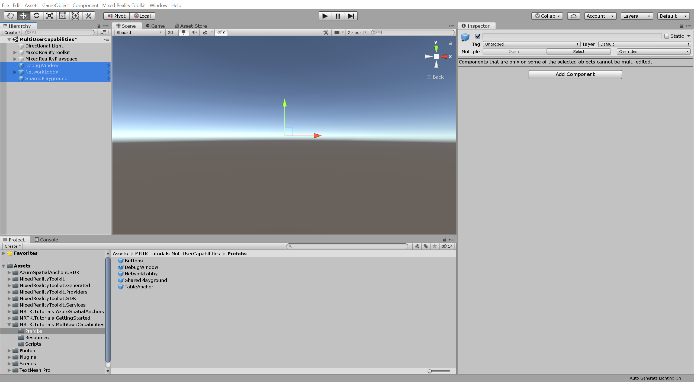
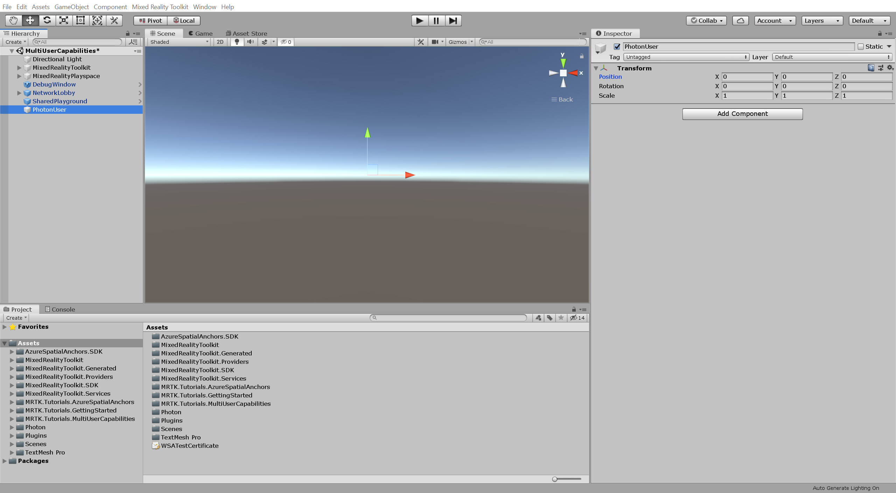
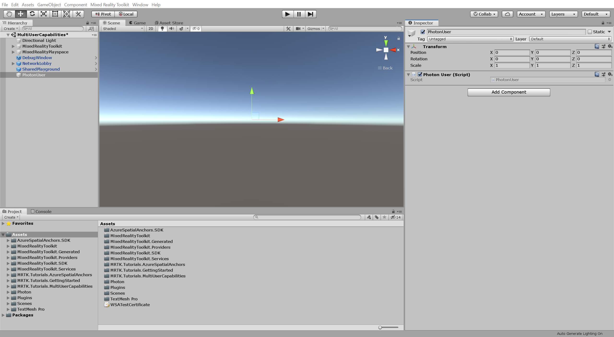
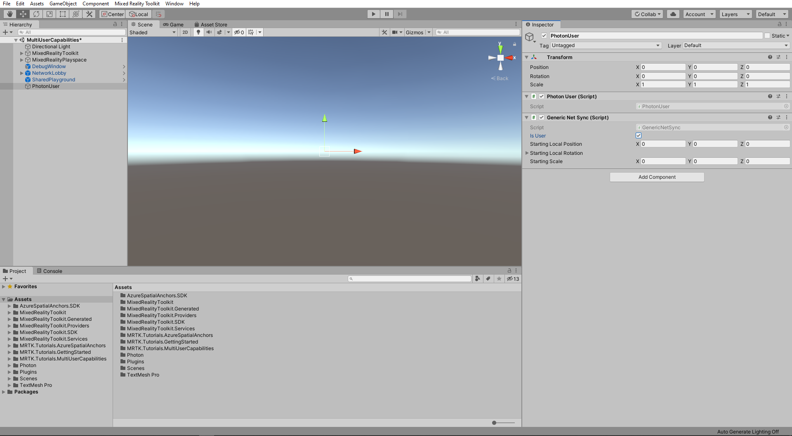
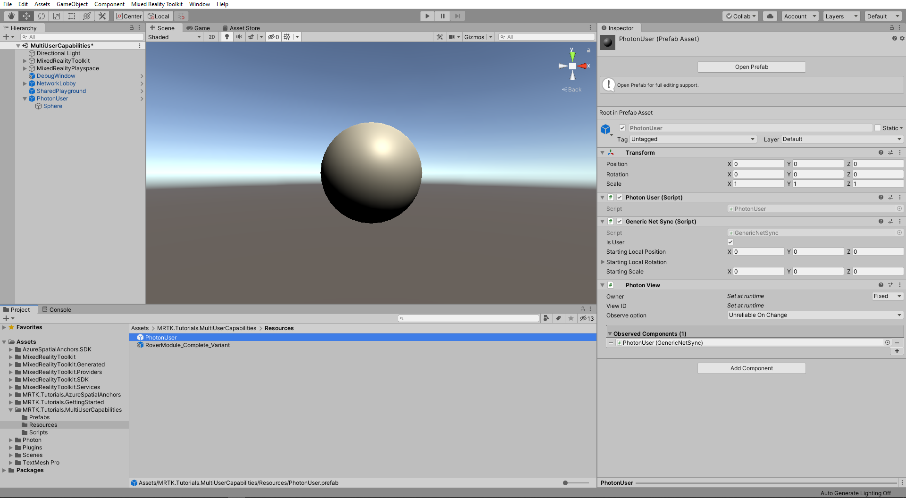
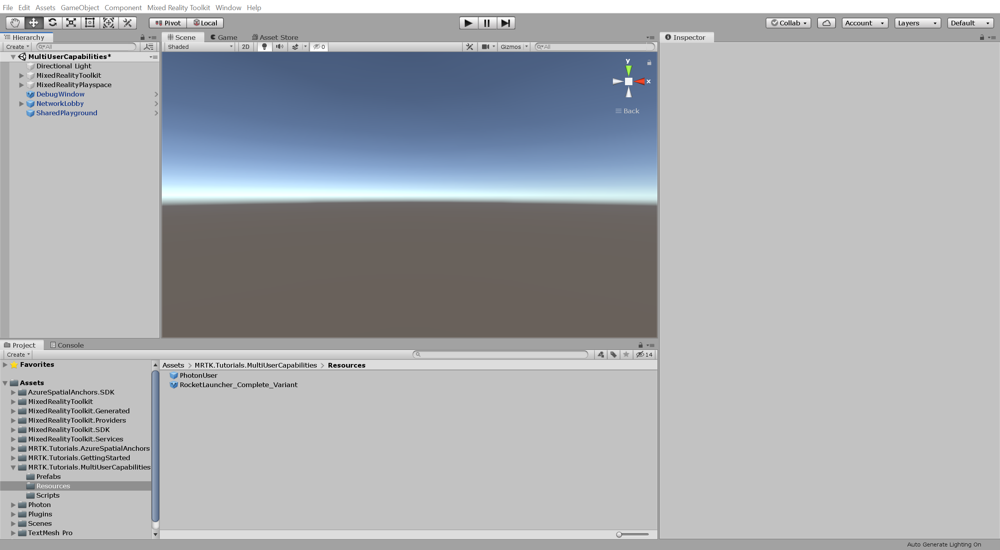
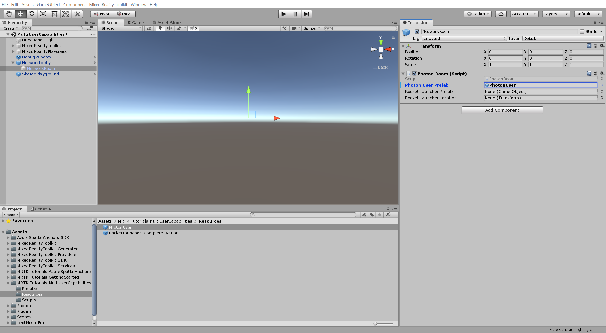
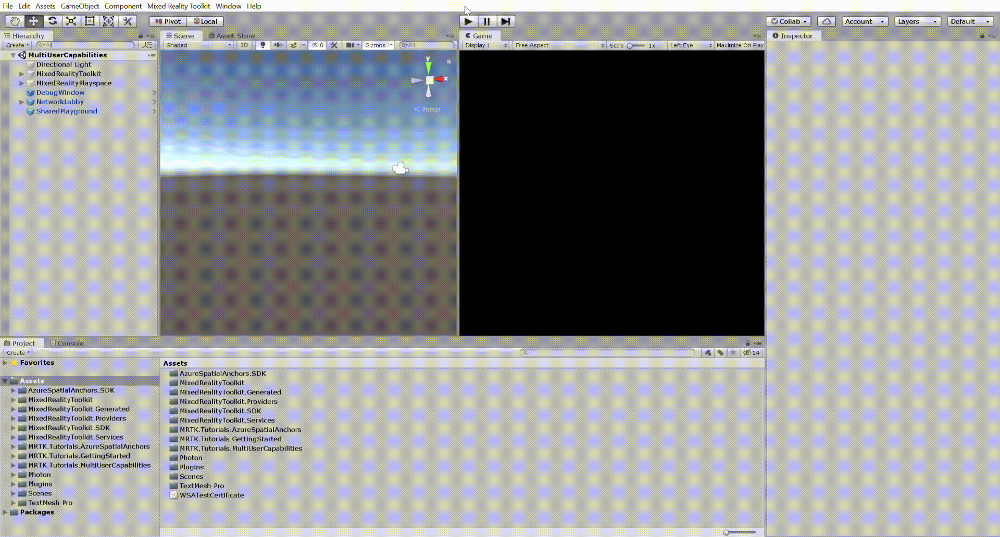

# 3. Connecting multiple users

In this tutorial, you will learn how to connect multiple users as part of a live shared experience. By the end of the tutorial you will be able to run the application on multiple devices and have each user see the avatar of other users move in real-time.

## Objectives

* Learn how to connect multiple users in a shared experience

## Preparing the scene

In this section, you will prepare the scene by adding some of the tutorial prefabs.

In the Project window, navigate to the **Assets** > **MRTK.Tutorials.MultiUserCapabilities** > **Prefabs** folder. While holding down the CTRL button, click on **DebugWindow**, **NetworkLobby**, and **SharedPlayground** to select the three prefabs:

With the three prefabs still selected, drag them into the Hierarchy window to add them to the scene:

## Creating the user prefab

In this section, you will create a prefab that will be used to represent the users in the shared experience.

### 1. Create and configure the user

In the Hierarchy window, right-click on an empty area and select **Create Empty** to add an empty object to your scene, name the object **PhotonUser**, and configure it as follows:

* Ensure the Transform **Position** is set to X = 0, Y = 0, Z = 0:

With the **PhotonUser** object still selected, in the Inspector window, use the **Add Component** button to add the **Photon User (Script)** component to the PhotonUser object:

In the Inspector window, use the **Add Component** button to add the **Generic Net Sync (Script)** component to the PhotonUser object and configure it as follows:

* Check the **Is User** checkbox

In the Inspector window, use the **Add Component** button to add the **Photon View (Script)** component to the PhotonUser object and configure it as follows:

* To the **Observed Components** field, assign the Generic Net Sync (Script) component

### 2. Create the avatar

In the Hierarchy window, right-click on the **PhotonUser** object and select **3D Object** > **Sphere** to create a sphere object as a child of the PhotonUser object and configure it as follows:

* Ensure the Transform **Position** is set to X = 0, Y = 0, Z = 0
* Change the Transform **Scale** to a suitable size, for example, X = 0.15, Y = 0.15, Z = 0.15

<!-- TODO: Update image with lighting. Will also need to touch up all images to change the message in lower right corner. (Looks like Unity at some point has change default setting to Auto Generate Lighting off, so students should probably turn it on so objects are properly lit, manual generation will create unnecessary project assets in the given scenario). -->

### 3. Create the prefab

In the Project window, navigate to the **Assets** > **MRTK.Tutorials.MultiUserCapabilities** > **Resources** folder:

<!-- TODO: Update image with lighting. Will also need to touch up all images to change the message in lower right corner. (Looks like Unity at some point has change default setting to Auto Generate Lighting off, so students should probably turn it on so objects are properly lit, manual generation will create unnecessary project assets in the given scenario). -->

With the Resources folder still selected, **click-and-drag** the **PhotonUser** object from the Hierarchy window into the **Resources** folder to make the PhotonUser object a prefab:

<!-- TODO: Update image with lighting. Will also need to touch up all images to change the message in lower right corner. (Looks like Unity at some point has change default setting to Auto Generate Lighting off, so students should probably turn it on so objects are properly lit, manual generation will create unnecessary project assets in the given scenario). -->

In the Hierarchy window, right-click on the **PhotonUser** object and select **Delete** to remove it from the scene:

## Configuring PUN to instantiate the user prefab

In this section, you will configure the project to use the PhotonUser prefab you created in the previous section.

In the Project window, navigate to the **Assets** > **MRTK.Tutorials.MultiUserCapabilities** > **Resources** folder.

In the Hierarchy window, expand the **NetworkLobby** object and select the **NetworkRoom** child object, then in the Inspector window, locate the **Photon Room (Script)** component and configure it as follows:

* To the **Photon User Prefab** field, assign the **PhotonUser** prefab from the Resources folder

## Trying the experience with multiple users

If you now build and deploy the Unity project to your HoloLens, and then, back in Unity, press the Play button to enter Game mode while the application is running on your HoloLens, you will see the HoloLens user avatar move when you move your head (HoloLens) around:

<!-- TODO: update gif when everything else is done-->

> [!TIP]
> For a reminder on how to build and deploy your Unity project to HoloLens 2, you can refer to the [Build your application to your device](mr-learning-base-02.md#build-your-application-to-your-device) instructions.

> [!CAUTION]
> The application needs to connect to Photon, so make sure your computer/device is connected to the internet.

## Congratulations

You have successfully configured your project to allow multiple users to connect to the same experience and see each other's movements. In the next tutorial, you will implement functionality so that the movements of objects are also shared across multiple devices.

[Next tutorial: 4. Sharing object movements with multiple users](mr-learning-sharing(photon)-04.md)
