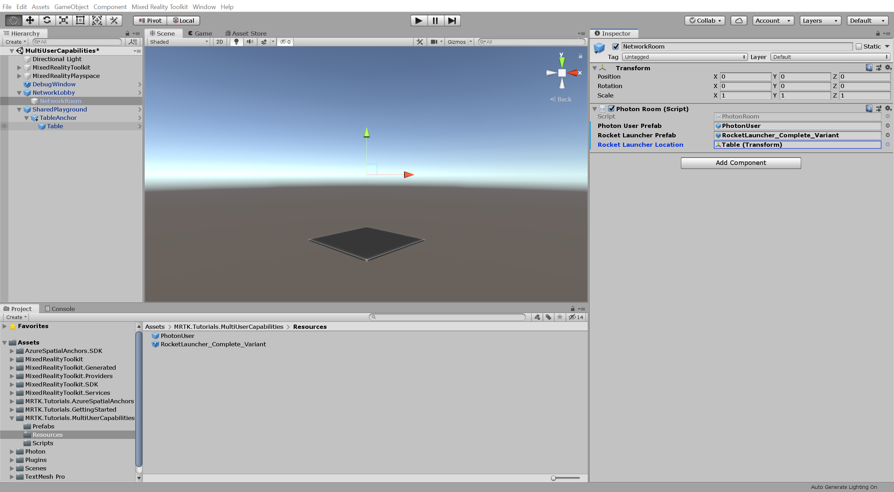
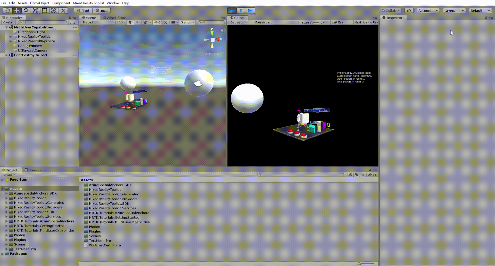

# 4. Sharing object movements with multiple users

In this tutorial, you will learn how to share the movements of objects so that all participants of a shared experience can collaborate and view each others' interactions.

## Objectives

* Configure your project to share the movements of objects
* Learn how to build a basic multi-user collaborative application

## Preparing the scene

In this section, you will prepare the scene by adding the tutorial prefab.

In the Project window, navigate to the **Assets** > **MRTK.Tutorials.MultiUserCapabilities** > **Prefabs** folder and drag the **TableAnchor** prefab on top of the **SharedPlayground** object in the Hierarchy window to add it to your scene as a child of the SharedPlayground object:

## Configuring PUN to instantiate the objects

In this section, you will configure the project to use the RoverModule_Complete_Variant prefab you created in [Getting Started Tutorials](mr-learning-base-01.md) and [Azure Spatial Anchors Tutorials](mr-learning-asa-01.md) and define where it will be instantiated.

In the Project window, navigate to the **Assets** > **MRTK.Tutorials.MultiUserCapabilities** > **Resources** folder.

In the Hierarchy window, expand the **NetworkLobby** object and select the **NetworkRoom** child object, then in the Inspector window, locate the **Photon Room (Script)** component and configure it as follows:

* To the **Rover Module Prefab** field, assign the **RoverModule_Complete_Variant** prefab from the Resources folder

With the **NetworkRoom** child object still selected, in the Hierarchy window, expand the **TableAnchor** object, then in the Inspector window, locate the **Photon Room (Script)** component and configure it as follows:

* To the **Rover Module Location** field, assign the **Table** child object from the Hierarchy window

## Trying the experience with shared object movement

If you now build and deploy the Unity project to your HoloLens, and then, back in Unity, press the Play button to enter Game mode while the application is running on your HoloLens, you will see the object move in Unity when you move the object in HoloLens:

<!-- TODO: Update animated gif when prefab is finalized -->

## Congratulations

You have successfully configured your project so object movements are synchronized and users can see the objects move when other users move the objects. In the next tutorial, you will implement functionality so the shared experience is aligned in the physical world and the users see each other in their actual physical location and so the objects appear in the same physical position and rotation for all users.

[Next tutorial: 5. Integrating Azure Spatial Anchors into a shared experience](mr-learning-sharing-05.md)
