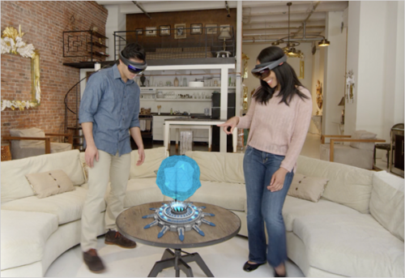
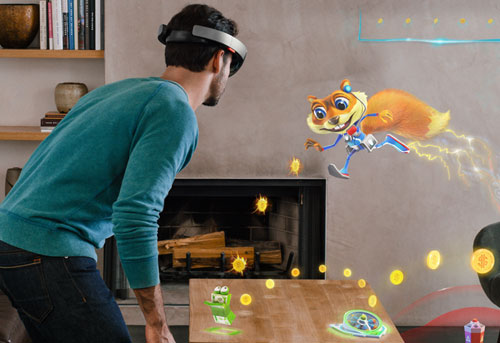
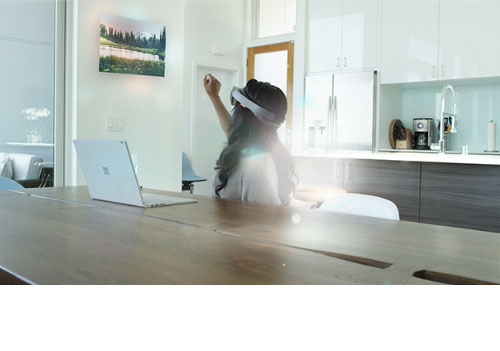

# About this design guidance

## Introduction

**Hello, and welcome to your design guidance for mixed reality.**

This guidance is authored by Microsoft designers, developers, program managers, and researchers, whose work spans holographic devices, as HoloLens and immersive devices, such as Acer and HP Windows Mixed Reality headsets. Consider this work as a set of topics for how to design for Windows head-mounted displays.

With you, we are entering a tremendously exciting new era of computing. Breakthroughs in head-mounted displays, spatial sound, sensors, environmental awareness, input, and 3D graphics lead us, and challenge us, to define new types of experiences--a new frontier dramatically more personal, intuitive, immersive, and contextual.

Wherever possible, we will offer actionable design guidance with related code on GitHub. That said, because we are learning right along with you, we won’t always be able to offer specific, actionable guidance here. Some of what we share will be in the spirit of ‘lessons we’ve learned’ and ‘avoid going down that path’.

And we know, many innovations will be generated by the larger design community. So, we look forward to hearing from you, learning from you, and working closely with you. For our part, we’ll do our best to share our insights, even if they are exploratory and early with the intent of empowering developers and designers with design thinking, best practices, and the related open source controls, patterns, and sample apps that you can use directly in your own work.

## Overview

Here’s a quick overview of how this design guidance is organized. You’ll find sections for each of these areas with links to multiple articles.
* **[Get started with design](mixed-reality.md)** - Read our high-level thoughts, and understand the principles we follow.
* **[Instinctual interactions](interaction-fundamentals.md)** - Learn about input, commanding, navigation, and other interaction basics for designing your apps.
* **[Style](typography.md)** - Make your application delightful by using color, typography, and motion.
* **[App patterns](types-of-mixed-reality-apps.md)** - Learn how app;ications can span scenarios across immersive and real world environments.
* **[Controls](interactable-object.md)** - Use controls and patterns as building blocks to create your own application experience.
* **[Sample apps](design.md#sample-apps)** - Build great experiences from samples designed and created by our team.
* **[Design tools and resources](design.md#design-tools)** - Jump-start your project with design templates and tools.

For all the above, we aim to deliver the right mix of text, illustrations and diagrams, and videos, so you’ll see us experimenting with different formats and techniques, all with the intent of delivering what you need. And in the months ahead, we’ll expand this taxonomy to include a broader set of design topics. Whenever possible, we’ll give you a heads-up about what is coming next, so please keep checking back.

## Objectives

Here’s a quick look at some high-level objectives that are guiding this work so you can understand where we’re coming from

### Help solve customer challenges

  

We wrestle with many of the same issues that you do, and we understand how challenging your work is. It’s exciting to explore and define a new frontier… and it can also be daunting. Old paradigms and practices need to be re-thought; customers need new experiences; and there is so much potential for innovation. Given that we want this work to be as comprehensive as possible, moving well beyond a style guide. We aim to deliver a comprehensive set of design guidance that covers mixed reality interaction, commanding, navigation, input, and style – all grounded in human behavior and scenarios. 

### Point the way towards a new, more human way of computing

 

While it is important to focus on specific customer problems, we also want to push ourselves to think beyond that, and to deliver more. We believe great design is not “just” problem-solving, but also a way to meaningfully activate human evolution. New ways of human behavior; new ways of people relating to themselves, their activities, and their environments; new ways of seeing our world… we want our guidance to reflect all these more aspirational ways of thinking too. 

### Meet creators where they are

  

We hope many audiences find this guidance to be helpful. You have different skill-sets (beginning, intermediate, advanced), use different tools (Unity, DirectX, C++, C#, other), are familiar with various platforms (Windows, iOS, Android), come from different backgrounds (mobile, enterprise, gaming), and are working on different size teams (solo, small, medium, large). So, this guidance can be viewed with different perspectives and needs. Whenever possible, we will try to keep this diversity in mind, and make our guidance as relevant as possible to as many people as possible. In addition, we know that many of you are already on GitHub. So, we will directly link to GitHub repos and forums to meet you where you already are. 

### Share as much as possible, from experimental to explicit

  

One of the challenges of offering design guidance in this new 3D medium is that we don’t always have definitive guidance to offer. Just like you, we are learning, experimenting, prototyping, problem-solving, and adjusting as we hit obstacles. Rather than wait for some mythical future moment when we have it all figured out, we aim to share our thinking with you in real time, even if it is not conclusive. Of course, our end goal is to be definitive wherever we can, providing clear, flexible design guidance tied to open-source code, and actionable in Microsoft development and design tools. But getting to that point takes many rounds of iteration and learning. We want to engage with you, and learn with you, along the way. With all this in mind, we'll do our best  to share as we go, even with our stuff that is experimental. 

### The right balance of global and local design

  

We’ll offer two levels of design guidance: global and local. Our 'global' design guidance is embodied in the [Fluent Design System](http://fluent.microsoft.com). Fluent details how we think about fundamentals like light, depth, motion, material, and scale across all Microsoft design--our devices, products, tools, and services. That said, significant device-specific differences exist across this larger system. So, our 'local' design guidance for head-mounted displays describe designing for holographic and immersive devices that often have different input and output methods as well as different user needs and scenarios. Local design guidance covers topics unique to HMDs. For example: 3D environments and objects; shared environments; the use of sensors, eye tracking and spatial mapping; and the opportunities of spatial audio. Throughout our guidance you will likely see us refer to both these global and the local aspects. Hopefully this will help you ground your work in a larger foundation of design while taking advantage of the design differences between specific devices.

### Have a discussion

  

Perhaps most importantly, we want to engage with you, the community of holographic and immersive designers and developers, to define this exciting new era of design. As mentioned above, we know we don’t have all the answers. That's why we believe many exciting solutions and innovations will come from you. We aim to be open and available to hear about them, and discuss with you online and at events, and add value wherever we can. We are excited to be a part of this amazing design community, embarking on an adventure together. 

## Please dive in

We hope this introductory article provides some meaningful context as you explore our design guidance. Please dive in, and let us know your thoughts in the GitHub forums you'll find linked in our articles, or at Microsoft Design on [Twitter](https://twitter.com/MicrosoftDesign) and [Facebook](https://www.facebook.com/microsoftdesign/). Let's co-design the future together!
