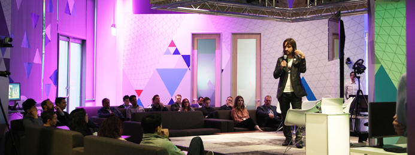
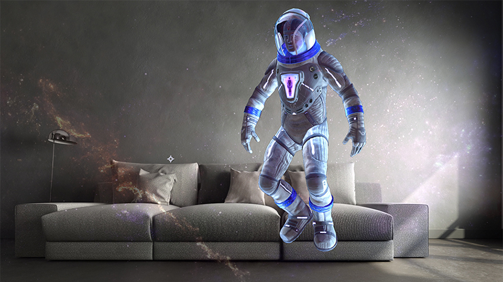
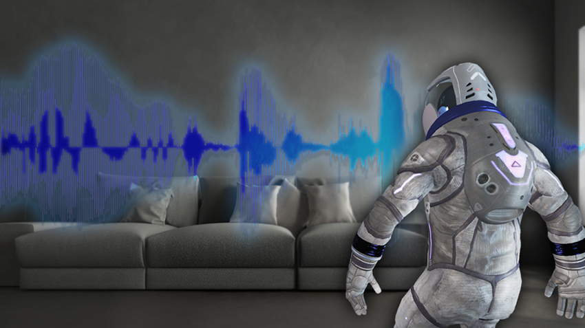
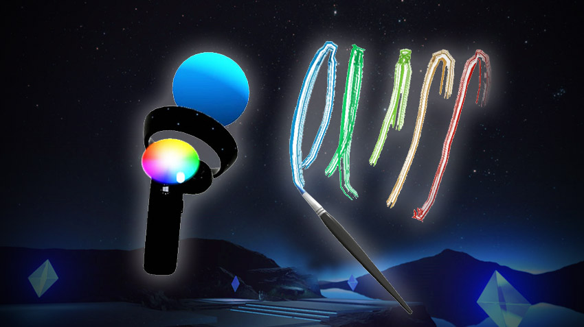
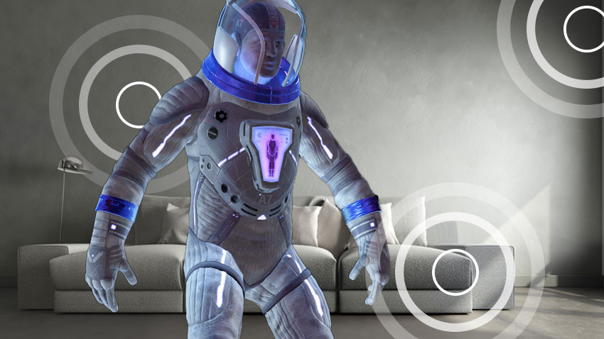
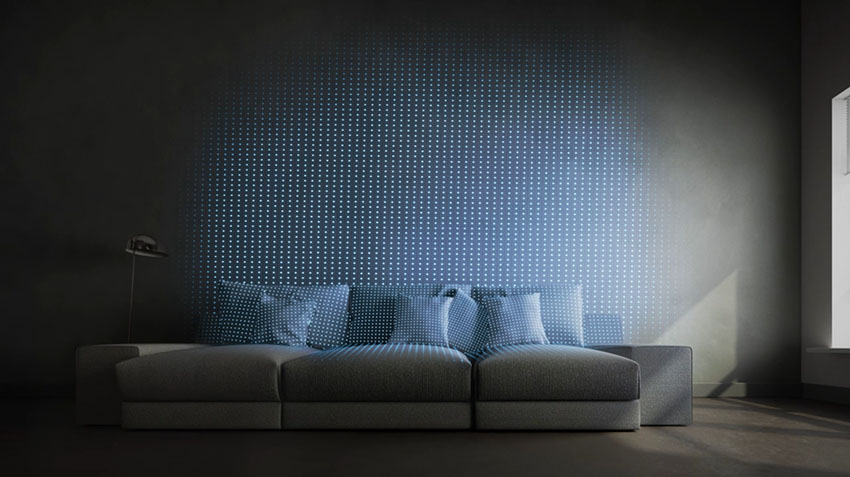
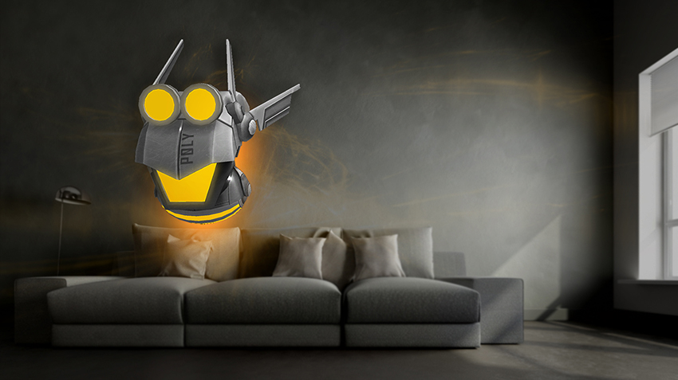

# Academy

## San Francisco

“The Mixed Reality Academy serves as a community hub, for creators to come together, collaborate, learn, and help us fuel this new era of computing – the era of mixed reality.”

— Alex Kipman

The Microsoft Reactor in San Francisco, located at 680 Folsom in SOMA, serves as the flagship location for the Mixed Reality Capture Studio and the Mixed Reality Academy. It is a place where developers and creators can begin their journey building mixed reality experiences for Microsoft HoloLens and Windows Mixed Reality headsets. <a href="http://www.microsoftreactor.com">Check for announcements of upcoming sessions, workshops, and hackathons.</a>

 

## Tutorials

 

<h3 class="text-title spacer-12-bottom" style="margin-top:15px;">
<a href="holograms-100.md">Holograms 100: Getting started with Unity</a>
</h3>We will walk you through creating a basic holographic app built with Unity. This project can then serve as a starting template for any holographic app you might want to build in Unity.

 

<h3 class="text-title spacer-12-bottom" style="margin-top:15px;">
<a href="holograms-101e.md">Holograms 101E: Introduction with Emulator</a>
</h3>We will walk you through a complete project that introduces core Windows Holographic features including: gaze, gesture, voice, spatial sound and spatial mapping using the HoloLens emulator.

 

<h3 class="text-title spacer-12-bottom" style="margin-top:15px;">
<a href="holograms-101.md">Holograms 101: Introduction with Device</a>
</h3>We will walk you through a complete project that introduces core Windows Holographic features including: gaze, gesture, voice, spatial sound and spatial mapping.

 

<h3 class="text-title spacer-12-bottom" style="margin-top:15px;">
<a href="holograms-210.md">Holograms 210: Gaze</a>
</h3>Gaze is the first form of input, and reveals the user&#39;s intent and awareness. You will add contextual awareness to your cursor and holograms, taking full advantage of what your app knows about the user&#39;s gaze.

 

<h3 class="text-title spacer-12-bottom" style="margin-top:15px;">
<a href="holograms-211.md">Holograms 211: Gesture</a>
</h3>Gestures turn user intention into action. With gestures, users can interact with holograms. In this course, you will learn to track the user&#39;s hands, respond to user input, and give feedback based on hand state and location.

 

<h3 class="text-title spacer-12-bottom" style="margin-top:15px;">
<a href="holograms-212.md">Holograms 212: Voice</a>
</h3>Voice allows us to interact with our holograms in an easy and natural way. In this course, you will learn to make users aware of available voice commands, give feedback that a voice command was heard, and your app will use dictation to understand what the user is saying.

 

<h3 class="text-title spacer-12-bottom" style="margin-top:15px;">
<a href="mixed-reality-213.md">Mixed Reality 213: Motion controllers</a>
</h3>This course will explore ways of visualizing the motion controllers, handling input events, and attaching custom UI elements to the controllers.

 

<h3 class="text-title spacer-12-bottom" style="margin-top:15px;">
<a href="holograms-220.md">Holograms 220: Spatial sound</a>
</h3>Spatial sound breathes life into holograms and gives them presence. In this course, you will learn to use spatial sound to ground holograms in the real world, give feedback during interactions, and use audio to find your holograms.

 

<h3 class="text-title spacer-12-bottom" style="margin-top:15px;">
<a href="holograms-230.md">Holograms 230: Spatial mapping</a>
</h3>Spatial mapping brings the real world and virtual world together. You&#39;ll explore shaders and use them to visualize your space. Then you&#39;ll learn to simplify the room mesh into simple planes, give feedback on placing holograms on real-world surfaces, and explore occlusion visual effects.

 

<h3 class="text-title spacer-12-bottom" style="margin-top:15px;">
<a href="holograms-240.md">Holograms 240: Sharing holograms</a>
</h3>Our //Build 2016 project! We will walk you through a complete project where we will share coordinate systems between devices and create a shared experience that allows us to take part in a shared holographic world.

 

<h3 class="text-title spacer-12-bottom" style="margin-top:15px;">
<a href="mixed-reality-250.md">Mixed Reality 250: Sharing mixed reality</a>
</h3>In our //Build 2017 project, we demonstrate building an app that leverages the unique strengths of HoloLens and immersive headsets with a shared experience.

