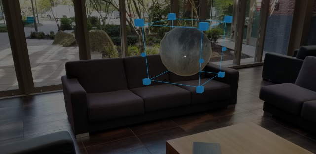

# Bounding box and App bar
 

## What is the Bounding box?

Bounding is the standard interface for object manipulation in Mixed Reality. It provides the user an affordance that the object is currently adjustable. The corners tell the user that the object can also scale. This visual affordance shows users the total area of the object – even if it’s not visible outside of an adjustment mode. This is especially important because if it weren’t there, an object snapped to another object or surface may appear to behave as if there was space around it that shouldn’t be there. On HoloLens 2, the bounding box works with direct hand manipulation and responds to the user's finger's proximity. It shows visual feedback to help the user perceive the distance from the object. 

 
*Scaling an object via bounding box*

The handles in the corners of the bounding box follow a widely understood pattern for adjusting scale. 

 
*Rotating an object via bounding box*

 
*Visual feedback based on the proximity*

The vertical rectangular affordances on the edges of the bounding box are rotation indicators. This gives the user more fine adjustment over their placed holograms. Not only can they adjust and scale, but now rotate as well.

* For Unity app development, see [Bounding box on Mixed Reality Toolkit-Unity](https://microsoft.github.io/MixedRealityToolkit-Unity/Documentation/README_BoundingBox.html)

## What is the App bar?

The App bar is a object-level menu containing a series of buttons that displays on the bottom edge of a hologram's bounds. This pattern is commonly used to give users the ability to remove and adjust holograms.

Since this pattern is used with objects that are world locked, as a user moves around the object the App bar will always display on the objects' side closest to the user. While this isn't billboarding, it effectively achieves the same result; preventing a user's position to occlude or block functionality that would otherwise be available from a different location in their environment.

 
*Walking around a hologram, the App bar follows*

The App bar was designed primarily as a way to manage placed objects in a user's environment. Coupled with the bounding box, a user has full control over where and how objects are oriented in mixed reality.

* For Unity app development, see [App bar on Mixed Reality Toolkit-Unity](https://microsoft.github.io/MixedRealityToolkit-Unity/Documentation/README_AppBar.html)

## See also
* [Interactable object](interactable-object.md)
* [Text in Unity](text-in-unity.md)
* [Object collection](object-collection.md)
* [Displaying progress](progress.md)
