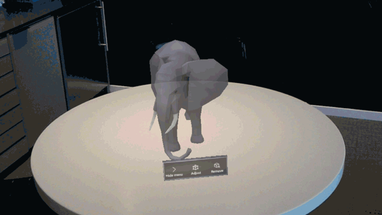
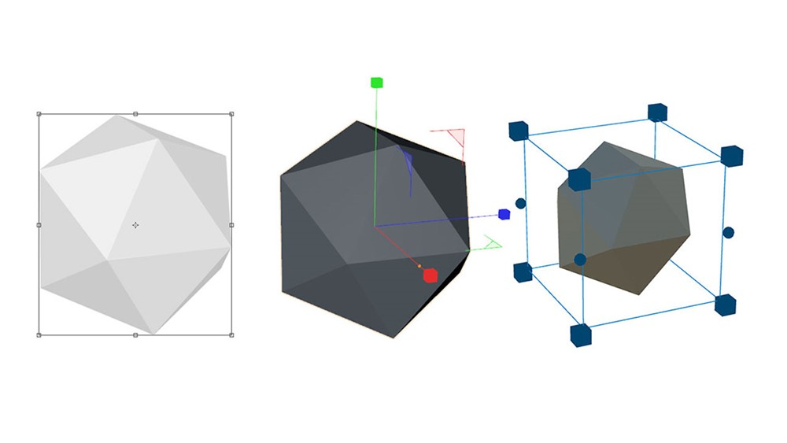
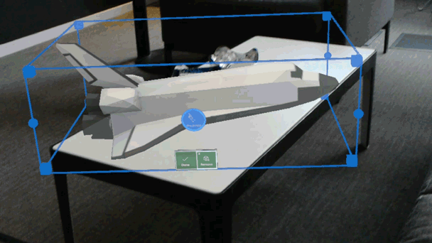
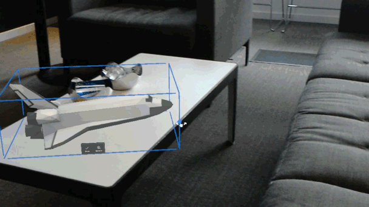

# App bar and bounding box

The App bar is a object-level menu containing a series of buttons that displays on the bottom edge of a hologram's bounds. This pattern is commonly used to give users the ability to remove and adjust holograms.

 
*Bounding boxes are a necessary control for object manipulation in mixed reality*

Since this pattern is used with objects that are world locked, as a user moves around the object the App bar will always display on the objects' side closest to the user. While this isn't billboarding, it effectively achieves the same result; preventing a user's position to occlude or block functionality that would otherwise be available from a different location in their environment.

 
*Walking around a hologram, the App bar follows*

The App bar was designed primarily as a way to manage placed objects in a user's environment. Coupled with the bounding box, a user has full control over where and how objects are oriented in mixed reality.

## What is the bounding box?

 
*A 2D and 3D resize gizmo, and a holographic bounding box*

The bounding box is a state for objects editable in a user’s environment. It provides the user an affordance that the object is currently adjustable. The corners tell the user that the object can also scale. This visual affordance shows users the total area of the object – even if it’s not visible outside of an adjustment mode. This is especially important because if it weren’t there, an object snapped to another object or surface may appear to behave as if there was space around it that shouldn’t be there.

 
*Scaling an object via bounding box*

The cube-like corners of the bounding box follow a widely understood pattern for adjusting scale. Coupled with the explicit action of putting an object into “adjust mode” it’s clear they can both move the object, but also scale it in their environment.

 
*Rotating an object via bounding box*

The spherical affordances on the edges of the bounding box are rotation indicators. This gives the user more fine adjustment over their placed holograms. Not only can they adjust and scale, but now rotate as well.

## See also
* [Scripts and prefabs for App bar and bounding box on Mixed Reality Design Labs GitHub](https://github.com/Microsoft/MRDesignLabs_Unity/tree/master/DesignLabs_Unity_Examples)
* [Interactable object](interactable-object.md)
* [Text in Unity](text-in-unity.md)
* [Object collection](object-collection.md)
* [Displaying progress](progress.md)
