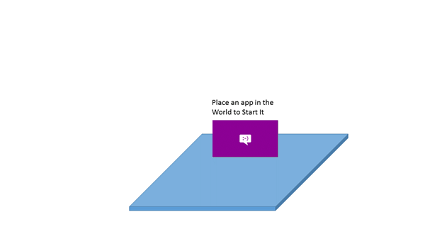
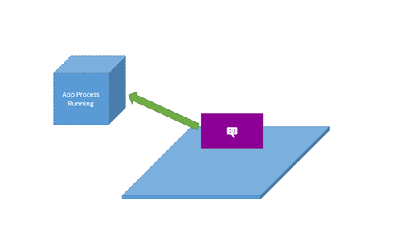
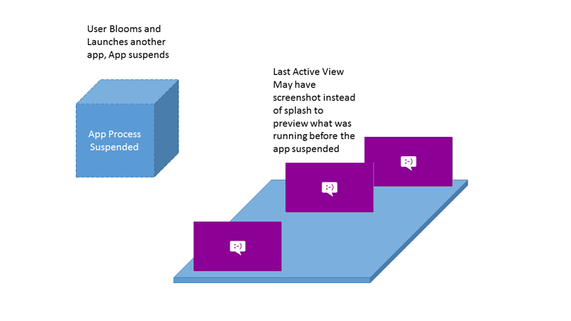
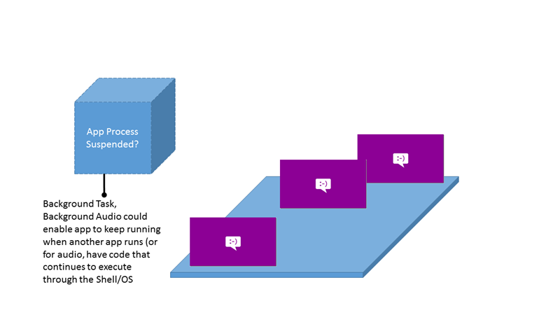
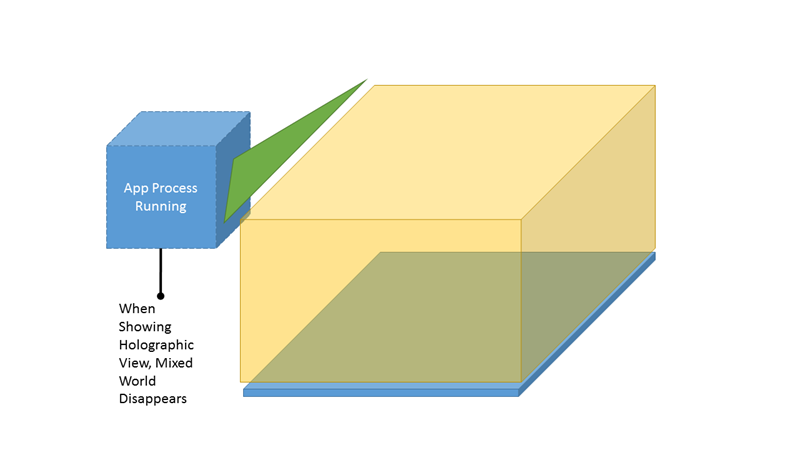
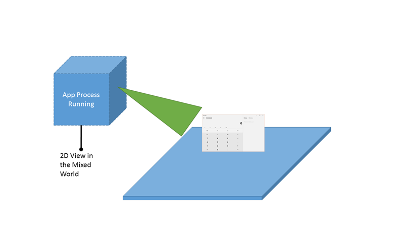
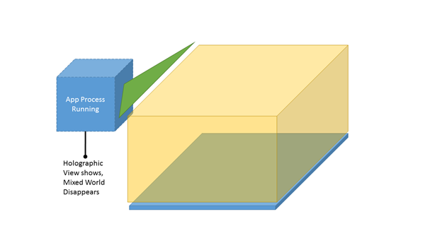
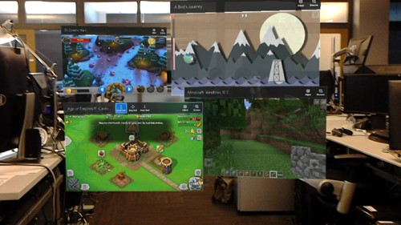

# App model

Windows Mixed Reality uses the app model provided by the [Universal Windows Platform](https://dev.windows.com/en-us/getstarted) (UWP), a model and environment for modern Windows apps. The UWP app model defines how apps are installed, updated, versioned and removed safely and completely. It governs the application life cycle - how apps execute, sleep and terminate - and how they can preserve state. It also covers integration and interaction with the operating system, files and other apps.

## App lifecycle

The lifecycle of a mixed reality app involves standard app concepts such as placement. launch, termination and removal.

### Placement is launch

Every app starts in mixed reality by placing an app tile (just a Windows secondary tile <https://msdn.microsoft.com/en-us/library/windows/apps/windows.ui.startscreen.secondarytile.aspx>) in the [HoloLens shell](navigating-the-windows-mixed-reality-home.md). These app tiles, on placement, will start running the app. These app tiles persist and stay at the location where they are placed, acting like launchers for anytime you want to get back to the app.

As soon as placement completes (unless the placement was started by an [App 2 App](app-model.md#protocols) launch), the app starts launching. Windows Mixed Reality can run a limited number of apps at one time. As soon as you place and launch an app, other active apps may suspend, leaving a screenshot of the app's last state on its app tile wherever you placed it. See [app lifecycle](https://msdn.microsoft.com/en-us/library/windows/apps/mt243287.aspx) for more information on handling resume and other app life cycle events.

 

### Remove is close/terminate process

When you remove a placed app tile from the world, this closes the underlying processes. This can be useful for ensuring your app is terminated or restarting a problematic app.

### App suspension/termination

In the [Windows Mixed Reality Home](navigating-the-windows-mixed-reality-home.md), the user is able to create multiple entry points for an app. They do this by launching your app from the start menu, and placing the app tile in the world. Each app tile behaves as a different entry point, and has a separate tile instance in the system. A query for [SecondaryTile.FindAllAsync()](https://msdn.microsoft.com/en-us/library/windows/apps/br242208.aspx) will result in a SecondaryTile for each app instance.

When a UWP app suspends, a screenshot is taken of the current state.

One key difference from other Windows 10 shells is how the app is informed of an app instance activation via the CoreApplication.Resuming and CoreApplication.Activated events.

|  Scenario |  Resuming  |  Activated | 
|----------|----------|----------|
|  Launch new instance of app from the Start Menu  |   |  Activated with a new TileId | 
|  Launch second instance of app from the Start Menu  |   |  Activated with a new TileId | 
|  Select the instance of the app that is not currently active  |   |  Activated with the TileId associated with the instance | 
|  Select a different app, then select the previously active instance  |  Resuming fired  |  | 
|  Select a different app, then select the instance that was previously inactive  |  Resuming fired  |  Then Activated with the TileId associated with the instance | 

### Extended execution

Sometimes your app needs to continue doing work in the background or playing audio. [Background tasks](https://msdn.microsoft.com/en-us/library/windows/apps/xaml/hh977049.aspx) are available on HoloLens with some [limitations](current-limitations-for-apps-using-apis-from-the-shell.md).

## App views

When your app activates, you can choose what type of view you'd like to display. For an app's CoreApplication, there is always a primary [app view](https://msdn.microsoft.com/en-us/library/windows/apps/windows.ui.viewmanagement.applicationview.aspx) and any number of further app views you would like to create. On Desktop, you can think of an app view as a window. Our Mixed Reality app templates will create a Unity project where the primary app view is [immersive](app-views.md). Your app can create an additional 2D app view using technology like XAML, to use Shell features such as in-app purchase. If your app started as a universal app for other Windows shells, your primary view is 2D, but you could "light up" in mixed reality by adding an additional app view that's immersive to show an experience volumetrically. Imagine building a photo viewer app in XAML where the slideshow button switched to an immersive app view that flew photos from the app across the world and surfaces.

### Creating an immersive view

Mixed reality apps are those that create an immersive view, which is done by the HolographicSpace type.

An app that is purely immersive should always create an immersive view on launch, even if launched from the desktop. Immersive views always show up in the headset, regardless of where they were created from. Activating an immersive view will display the Mixed Reality Portal and guide the user to put on their headset.

An app that starts with a 2D view on the desktop monitor may create a secondary immersive view to show content in the headset. An example of this is a 2D Edge window on the monitor displaying a 360-degree video in the headset.

### 2D view in the Mixed Reality home

Anything other than an immersive view is rendered as a 2D view in your world.

An app may have 2D views on both the desktop monitor and in the headset. Note that a new 2D view will be placed in the same shell as the view that created it, either on the monitor or in the headset. It is not currently possible for an app or a user to move a 2D view between the Mixed Reality home and the monitor.

### Placement of further App Tiles

You can place as many 2D views in your world as you want with Secondary Tile APIs. These "pinned" tiles will appear as splash screens that users must place and then can later use to launch your app. Windows Mixed Reality does not currently support rendering any of the 2D Tile content as live tiles. You can find out more about the [secondary tile APIs](https://msdn.microsoft.com/en-us/library/windows/apps/xaml/Hh868249(v=win.10)).

### Switching views

**Switching from the 2D XAML view to the immersive view**

If the app uses XAML, then the XAML `IFrameworkViewSource` will control the first view of the app. The app will need to switch to the immersive view before activating the `CoreWindow`, to ensure the app launches directly into the immersive experience.

Use [CoreApplication::CreateNewView](https://msdn.microsoft.com/en-us/library/windows/apps/windows.applicationmodel.core.coreapplication.createnewview.aspx) and [ApplicationViewSwitcher::SwitchAsync](https://msdn.microsoft.com/en-us/library/windows/apps/windows.ui.viewmanagement.applicationviewswitcher.switchasync.aspx) to make it the active view.

NOTE:
* Do not specify the Consolidate flag to SwitchAsync when switching from the XAML view to the immersive view, or the slate that launched the app will be removed from the world.
* SwitchAsync should be called using the `Dispatcher` associated with the view you are switching into.
* You will need to SwitchAsync back to the XAML view if you need to launch a virtual keyboard or want to activate another app

 

**Switching from the immersive view back to a keyboard XAML view**

One common reason for switching back-and-forth between views is displaying a keyboard in a mixed reality app. The shell is only able to display the system keyboard if the app is showing a 2D view. If the app needs to get text input, it may provide a custom XAML view with a text input field, switch to it, and then switch back after the input is complete.

Like above, you can use [ApplicationViewSwitcher::SwitchAsync](https://msdn.microsoft.com/en-us/library/windows/apps/windows.ui.viewmanagement.applicationviewswitcher.switchasync.aspx) to transition back to a XAML view from your immersive view.

## App size

2D app views always appear in a fixed virtual slate. This makes all 2D views show the exact same amount of content. Here are some further details about the size of your app's 2D view:
* Aspect ratio of the app is preserved while resizing.
* App [resolution and scale factor](updating-your-existing-universal-app-for-hololens.md#universal-app-resolution-and-scale-factor) are not changed by resizing.
* Apps are not able to query their actual size in the world.

## App tiles

The Start Menu uses the standard small tile and medium tile for pins and the All Apps list in Mixed Reality. 

## App to app interactions

As you build apps, you have access to the rich app to app communication mechanisms available on Windows 10. Even though HoloLens currently does not support the new [app service protocol launches](current-limitations-for-apps-using-apis-from-the-shell.md), many of the new Protocol APIs and file registrations work perfectly on HoloLens to enable app launching and communication. Note that for desktop headsets, the app associated with a given file extension or protocol may be a Win32 app that can only appear on the desktop monitor or in the desktop slate.

### Protocols

HoloLens supports app to app launching via the [Windows.System.Launcher APIs](https://msdn.microsoft.com/en-us/library/windows/apps/xaml/windows.system.launcher.aspx).

There are some things to consider when launching another application:
* When doing a non-modal launch, such as [LaunchUriAsync](https://msdn.microsoft.com/en-us/library/windows/apps/xaml/windows.system.launcher.launchuriasync.aspx), the user must place the app before interacting with it
* When doing a modal launch, such as through [LaunchUriForResultsAsync](https://msdn.microsoft.com/en-us/library/windows/apps/xaml/windows.system.launcher.launchuriforresultsasync.aspx), the modal app is placed on top of the window
* Windows Mixed Reality cannot overlay applications on top of exclusive views. In order to show the launched app, Windows takes the user back to the world to display the application.

### File pickers

HoloLens supports both [FileOpenPicker](https://msdn.microsoft.com/en-us/library/windows/apps/windows.storage.pickers.fileopenpicker.aspx) and [FileSavePicker](https://msdn.microsoft.com/en-us/library/windows/apps/windows.storage.pickers.filesavepicker.aspx) contracts. However, no app comes pre-installed that fulfills the file picker contracts. These apps - OneDrive, for example - can be installed from the Windows Store.

If you have more than one file picker app installed, you will not see any disambiguation UI for choosing which app to launch; instead, the first file picker installed will be chosen. When saving a file, the filename is generated which includes the timestamp. This cannot be changed by the user.

By default, the following extensions are supported locally:

|  App  |  Extensions | 
|----------|----------|
|  Photos  |  bmp, gif, jpg, png, avi, mov, mp4, wmv | 
|  Microsoft Edge  |  htm, html, pdf, svg, xml | 

### App contracts and Windows Mixed Reality extensions

App Contracts and extension points allow you to register your app to take advantage of deeper operating system features like handle a file extension or use background tasks. This is a list of the supported contracts and extension points on HoloLens. This is different than [APIs that are supported](current-limitations-for-apps-using-apis-from-the-shell.md).

|  Contract or Extension  |  Supported? | 
|----------|----------|
| [Account Picture Provider (extension)](https://msdn.microsoft.com/en-us/library/windows/desktop/hh464906.aspx#account_picture_provider) | Unsupported | 
| [Alarm](https://msdn.microsoft.com/en-us/library/windows/desktop/hh464906.aspx#alarm) | Unsupported | 
| [App service](https://msdn.microsoft.com/en-us/library/windows/desktop/hh464906.aspx#app_service) | Supported but not fully functional | 
| [Appointments provider](https://msdn.microsoft.com/en-us/library/windows/desktop/hh464906.aspx#appointmnets_provider) | Unsupported | 
| [AutoPlay (extension)](https://msdn.microsoft.com/en-us/library/windows/desktop/hh464906.aspx#autoplay) | Unsupported | 
| [Background tasks (extension)](https://msdn.microsoft.com/en-us/library/windows/desktop/hh464906.aspx#background_tasts) | Partially Supported (not all triggers work) | 
| [Update task (extension)](https://msdn.microsoft.com/en-us/library/windows/desktop/hh464906.aspx#update_task) | Supported | 
| [Cached file updater contract](https://msdn.microsoft.com/en-us/library/windows/desktop/hh464906.aspx#cached_file_updater) | Supported | 
| [Camera settings (extension)](https://msdn.microsoft.com/en-us/library/windows/desktop/hh464906.aspx#camera_settings) | Unsupported | 
| [Dial protocol](https://msdn.microsoft.com/en-us/library/windows/desktop/hh464906.aspx#dial_protocol) | Unsupported | 
| [File activation (extension)](https://msdn.microsoft.com/en-us/library/windows/desktop/hh464906.aspx#file_activation) | Supported | 
| [File Open Picker contract](https://msdn.microsoft.com/en-us/library/windows/desktop/hh464906.aspx#file_open_picker_contract) | Supported | 
| [File Save Picker contract](https://msdn.microsoft.com/en-us/library/windows/desktop/hh464906.aspx#file_save_picker_contract) | Supported | 
| [Lock screen call](https://msdn.microsoft.com/en-us/library/windows/desktop/hh464906.aspx#lock_screen_call) | Unsupported | 
| [Media playback](https://msdn.microsoft.com/en-us/library/windows/desktop/hh464906.aspx#media_playback) | Unsupported | 
| [Play To contract](https://msdn.microsoft.com/en-us/library/windows/desktop/hh464906.aspx#playto_contract) | Unsupported | 
| [Preinstalled config task](https://msdn.microsoft.com/en-us/library/windows/desktop/hh464906.aspx#preinstalled_config_task) | Unsupported | 
| [Print 3D Workflow](https://msdn.microsoft.com/en-us/library/windows/desktop/hh464906.aspx#print_3d_workflow) | Supported | 
| [Print task settings (extension)](https://msdn.microsoft.com/en-us/library/windows/desktop/hh464906.aspx#print_task_settings) | Unsupported | 
| [URI activation (extension)](https://msdn.microsoft.com/en-us/library/windows/desktop/hh464906.aspx#protocol_activation) | Supported | 
| [Restricted launch](https://msdn.microsoft.com/en-us/library/windows/desktop/hh464906.aspx#restricted_launch) | Unsupported | 
| [Search contract](https://msdn.microsoft.com/en-us/library/windows/desktop/hh464906.aspx#search_contract) | Unsupported | 
| [Settings contract](https://msdn.microsoft.com/en-us/library/windows/desktop/hh464906.aspx#settings_contract) | Unsupported | 
| [Share contract](https://msdn.microsoft.com/en-us/library/windows/desktop/hh464906.aspx#share_contract) | Unsupported | 
| [SSL/certificates (extension)](https://msdn.microsoft.com/en-us/library/windows/desktop/hh464906.aspx#ssl_certificates) | Supported | 
| [Web account provider](https://msdn.microsoft.com/en-us/library/windows/desktop/hh464906.aspx#web_account_provider) | Supported | 

## App File Storage

All storage is through the Windows.Storage namespace, see the following for more details. HoloLens does not support App Storage sync/roaming.
* [Files, folders, and libraries](https://msdn.microsoft.com/en-us/library/windows/apps/mt185399.aspx|)
* [Store and retrieve settings and other app data](https://msdn.microsoft.com/en-us/library/windows/apps/mt299098.aspx|)

### Known folders

See [KnownFolders](https://msdn.microsoft.com/en-us/library/windows/apps/windows.storage.knownfolders.aspx) for the full details of [KnownFolders](https://msdn.microsoft.com/en-us/library/windows/apps/windows.storage.knownfolders.aspx) for UWP apps.

<table>
<tr>
<th> Property</th><th> Supported on HoloLens</th><th> Supported on immersive headsets</th><th> Description</th>
</tr><tr>
<td><b><a href="https://msdn.microsoft.com/en-us/library/windows/apps/windows.storage.knownfolders.appcaptures.aspx">AppCaptures</a></b></td><td style="text-align: center;">X</td><td style="text-align: center;">X</td><td>Gets the App Captures folder.</td>
</tr><tr>
<td><b><a href="https://msdn.microsoft.com/en-us/library/windows/apps/windows.storage.knownfolders.cameraroll.aspx">CameraRoll</a></b></td><td style="text-align: center;">X</td><td style="text-align: center;">X</td><td>Gets the Camera Roll folder.</td>
</tr><tr>
<td><b><a href="https://msdn.microsoft.com/en-us/library/windows/apps/windows.storage.knownfolders.documentslibrary.aspx">DocumentsLibrary</a></b></td><td style="text-align: center;">X</td><td style="text-align: center;">X</td><td>Gets the Documents library. The Documents library is not intended for general use.</td>
</tr><tr>
<td><b><a href="https://msdn.microsoft.com/en-us/library/windows/apps/windows.storage.knownfolders.musiclibrary.aspx">MusicLibrary</a></b></td><td style="text-align: center;">X</td><td style="text-align: center;">X</td><td>Gets the Music library.</td>
</tr><tr>
<td><b><a href="https://msdn.microsoft.com/en-us/library/windows/apps/windows.storage.knownfolders.objects3d.aspx">Objects3D</a></b></td><td style="text-align: center;">X</td><td style="text-align: center;">X</td><td>Gets the Objects 3D folder.</td>
</tr><tr>
<td><b><a href="https://msdn.microsoft.com/en-us/library/windows/apps/windows.storage.knownfolders.pictureslibrary.aspx">PicturesLibrary</a></b></td><td style="text-align: center;">X</td><td style="text-align: center;">X</td><td>Gets the Pictures library.</td>
</tr><tr>
<td><b><a href="https://msdn.microsoft.com/en-us/library/windows/apps/windows.storage.knownfolders.playlists.aspx">Playlists</a></b></td><td style="text-align: center;">X</td><td style="text-align: center;">X</td><td>Gets the play lists folder.</td>
</tr><tr>
<td><b><a href="https://msdn.microsoft.com/en-us/library/windows/apps/windows.storage.knownfolders.savedpictures.aspx">SavedPictures</a></b></td><td style="text-align: center;">X</td><td style="text-align: center;">X</td><td>Gets the Saved Pictures folder.</td>
</tr><tr>
<td><b><a href="https://msdn.microsoft.com/en-us/library/windows/apps/windows.storage.knownfolders.videoslibrary.aspx">VideosLibrary</a></b></td><td style="text-align: center;">X</td><td style="text-align: center;">X</td><td>Gets the Videos library.</td>
</tr><tr>
<td><b><a href="https://msdn.microsoft.com/en-us/library/windows/apps/windows.storage.knownfolders.homegroup.aspx">HomeGroup</a></b></td><td></td><td style="text-align: center;">X</td><td>Gets the HomeGroup folder.</td>
</tr><tr>
<td><b><a href="https://msdn.microsoft.com/en-us/library/windows/apps/windows.storage.knownfolders.mediaserverdevices.aspx">MediaServerDevices</a></b></td><td></td><td style="text-align: center;">X</td><td>Gets the folder of media server (Digital Living Network Alliance (DLNA)) devices.</td>
</tr><tr>
<td><b><a href="https://msdn.microsoft.com/en-us/library/windows/apps/windows.storage.knownfolders.recordedcalls.aspx">RecordedCalls</a></b></td><td></td><td style="text-align: center;">X</td><td>Gets the recorded calls folder.</td>
</tr><tr>
<td><b><a href="https://msdn.microsoft.com/en-us/library/windows/apps/windows.storage.knownfolders.removabledevices.aspx">RemovableDevices</a></b></td><td></td><td style="text-align: center;">X</td><td>Gets the removable devices folder.</td>
</tr>
</table>

## App package

With Windows 10 you no longer target an operating system but instead [target your app to one or more device families](https://msdn.microsoft.com/en-us/library/windows/apps/dn894631.aspx?f=255&MSPPError=-2147217396#device_families). A device family identifies the APIs, system characteristics, and behaviors that you can expect across devices within the device family. It also determines the set of devices on which your app can be installed from the [Windows Store](submitting-an-app-to-the-microsoft-store.md#specifying-target-device-families).
* To target both Desktop headsets and HoloLens, target your app at the **Windows.Universal** device family.
* To target just Desktop headsets, target your app at the **Windows.Desktop** device family.
* To target just HoloLens, target your app at the **Windows.Holographic** device family.

## See also
* [App views](app-views.md)
* [Building 2D apps](building-2d-apps.md)
