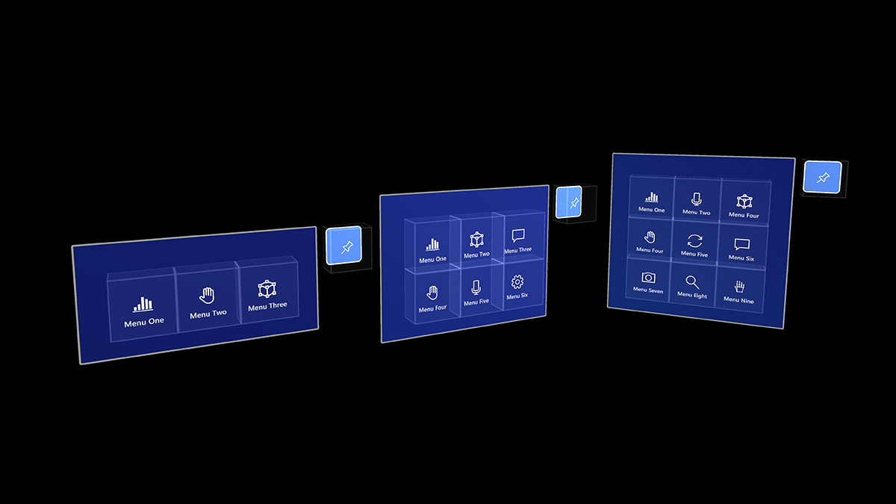

# UX elements overview

## Style

:::row:::
    :::column:::
       
        **[Color, light and materials](color,-light-and-materials.md)**
    :::column-end:::
    :::column:::
       
        **[Scale](scale.md)**
    :::column-end:::
    :::column:::
       
        **[Spatial sound](spatial-sound.md)**
    :::column-end:::
:::row-end:::

:::row:::
    :::column:::
       
        **[Typography](typography.md)**
    :::column-end:::
    :::column:::
    :::column-end:::
    :::column:::
    :::column-end:::
:::row-end:::

 

## Controls and behaviors

:::row:::
    :::column:::
       
        **[Cursor](cursors.md)**
    :::column-end:::
    :::column:::
       
        **[Hand ray](point-and-commit.md)**
    :::column-end:::
    :::column:::
       
        **[Button](button.md)**
    :::column-end:::
:::row-end:::

:::row:::
    :::column:::
       
        **[Bounding box](app-bar-and-bounding-box.md)**
    :::column-end:::
    :::column:::
       
        **[Interactable object](interactable-object.md)**
    :::column-end:::
    :::column:::
       
        **[Manipulation](direct-manipulation.md)**
    :::column-end:::
:::row-end:::

:::row:::
    :::column:::
       
        **[Hand menu](hand-menu.md)**
    :::column-end:::
    :::column:::
       
        **[Near menu](near-menu.md)**
    :::column-end:::
    :::column:::
       
        **[Object collection](object-collection.md)**
    :::column-end:::
:::row-end:::

:::row:::
    :::column:::
       
        **[Voice command](voice-input.md)**
    :::column-end:::
    :::column:::
       
        **[Keyboard](keyboard.md)**
    :::column-end:::
    :::column:::
       
        **[Tooltip](tooltip.md)**
    :::column-end:::
:::row-end:::

:::row:::
    :::column:::
       
        **[Slate](slate.md)**
    :::column-end:::
    :::column:::
       
        **[Slider](slider.md)**
    :::column-end:::
    :::column:::
        
        **[Shader](shader.md)**
    :::column-end:::
:::row-end:::

:::row:::
    :::column:::
        
        **[Billboarding and tag-along](billboarding-and-tag-along.md)**
    :::column-end:::
    :::column:::
       
        **[Progress indicator](progress.md)**
    :::column-end:::
    :::column:::
       
        **[Surface magnetism](surface-magnetism.md)**
    :::column-end:::
:::row-end:::

 

 

