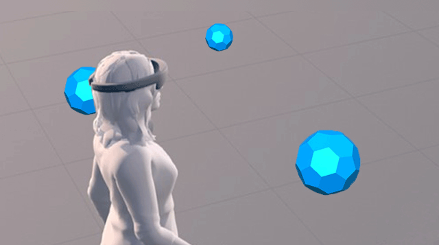

# Mixed reality UX patterns

## Style

:::row:::
    :::column:::
       
        **[Color, light and materials](color,-light-and-materials.md)**
    :::column-end:::
    :::column:::
       
        **[Scale](scale.md)**
    :::column-end:::
    :::column:::
       
        **[Spatial sound](spatial-sound.md)**
    :::column-end:::
:::row-end:::

:::row:::
    :::column:::
       
        **[Typography](typography.md)**
    :::column-end:::
    :::column:::
    :::column-end:::
    :::column:::
    :::column-end:::
:::row-end:::

 

## Controls

:::row:::
    :::column:::
       
        **[Interactable object](interactable-object.md)**
    :::column-end:::
    :::column:::
       
        **[Object collection](object-collection.md)**
    :::column-end:::
    :::column:::
       
        **[Bounding box and App bar](app-bar-and-bounding-box.md)**
    :::column-end:::
:::row-end:::

:::row:::
    :::column:::
       
        **[Displaying progress](progress.md)**
    :::column-end:::
    :::column:::
        
        **[Cursors](cursors.md)**
    :::column-end:::
    :::column:::
    :::column-end:::
:::row-end:::

 

## App patterns

:::row:::
    :::column:::
       
        **[Types of mixed reality apps](types-of-mixed-reality-apps.md)**
    :::column-end:::
    :::column:::
       
        **[Room scan visualization](room-scan-visualization.md)**
    :::column-end:::
    :::column:::
       
        **[Billboarding and tag-along](billboarding-and-tag-along.md)**
    :::column-end:::
:::row-end:::

:::row:::
    :::column:::
       
        **[Updating 2D UWP apps for mixed reality](building-2d-apps.md)**
    :::column-end:::
    :::column:::
        
        **[App model](app-model.md)**
    :::column-end:::
    :::column:::
        
        **[App views](app-views.md)**
    :::column-end:::
:::row-end:::

 

 

