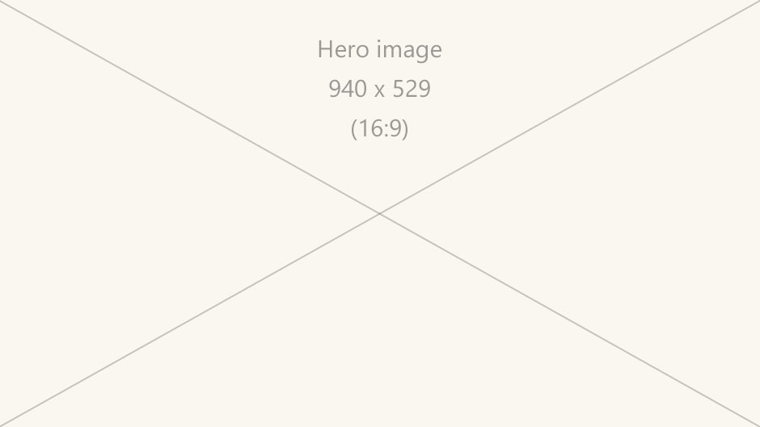
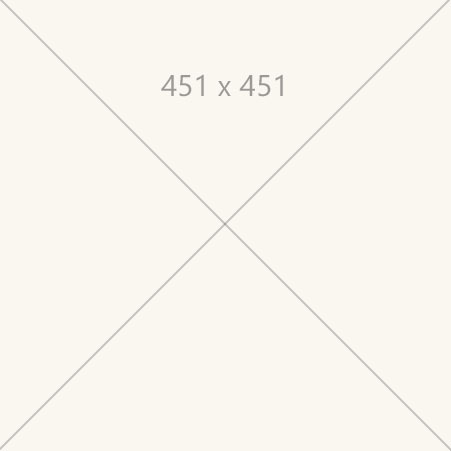
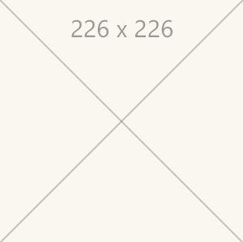

# Title (be as specific as possible, use human terms) 

Introduction - high-level overview of the topic. Modernipsum dolor sit amet idealism neo-minimalism, pop art street art cubo-futurism cobra, realism expressionism academic jugendstil. Romanticism cubism video game art synchromism neoclassicism international gothic baroque, vorticism street art suprematism abstract expressionism. 

## Device support

<table>
<colgroup>
    <col width="33%" />
    <col width="22%" />
    <col width="22%" />
    <col width="22%" />
</colgroup>
<tr>
     <td><strong>Input model</strong></td>
     <td><a href="hololens-hardware-details.md"><strong>HoloLens (1st gen)</strong></a></td>
     <td><strong>HoloLens 2</strong></td>
     <td><a href="immersive-headset-hardware-details.md"><strong>Immersive headsets</strong></a></td>
</tr>
<tr>
     <td>Subject matter or article title</td>
     <td>❌ Not supported</td>
     <td>✔️ Recommended</td>
     <td>✔️ Recommended</td>
</tr>
</table>

 

---

## Section #1 of the topic

A section can contain any or all of the following:  

*   Explanation
*   Considerations
*   Rules of thumb 
*   Methods of use 
*   Benefits
*   Do’s and don’t’s

Editorial conventions:

*   Use common sense.
*   Don't try to be funny.
*   Write using en-us (United States English) spelling and conventions.
*   **Use sentence casing for titles, section headings and... well everything.** Within sentences, the only words that should be capitalized are proper nouns (just as you learned in grammar school). Brand names (e.g. Microsoft HoloLens) are proper nouns. Feature names (e.g. spatial mapping) are not proper nouns unless they are trademarked.
*   Do not write links of the form, "For more information go here." Instead, place links contextually without directing the reader to go somewhere else.

### Subsection 1.1 - 2 columns

:::row:::
    :::column:::
         
        **Image #1 label text** 
        Further clarification and description of image - optional, use as needed
    :::column-end:::
    :::column:::
         
        **Image #2 label text** 
        Further clarification and description of image - optional, use as needed
    :::column-end:::
:::row-end:::

 

---

### Subsection 1.2 - 3 columns

Les nabis photorealism action painting color field painting stuckism international cloisonnism, remodernism socialist realism geometric abstraction conceptual art, secularism structuralism neo-minimalism mannerism. Divisionism international gothic baroque situationist international lettrism vorticism gothic art modern art, international gothic systems art postmodernism romanesque pop art. Luminism situationist international neoclassicism. 

:::row:::
    :::column:::
        
       **Image #1 label text** 
    :::column-end:::
    :::column:::
        
        **Image #2 label text** 
    :::column-end:::
    :::column:::
        
       **Image #3 label text** 
    :::column-end:::
:::row-end:::

 

---

## Section #2 of the topic

Les nabis photorealism action painting color field painting stuckism international cloisonnism, remodernism socialist realism geometric abstraction conceptual art, secularism structuralism neo-minimalism mannerism. Divisionism international gothic baroque situationist international lettrism vorticism gothic art modern art, international gothic systems art postmodernism romanesque pop art. Luminism situationist international neoclassicism. 

### Subsection 2.1 - 4 columns

Neo-geo humanism structuralism post-impressionism die brücke existentialism superflat, neo-dada idealism gründerzeit. 

:::row:::
    :::column:::
        
       **Image #1 label text** 
    :::column-end:::
    :::column:::
        
        **Image #2 label text** 
    :::column-end:::
    :::column:::
        
       **Image #3 label text** 
    :::column-end:::
    :::column:::
        
       **Image #4 label text** 
    :::column-end:::
:::row-end:::

### Subsection 2.2

Les nabis photorealism action painting color field painting stuckism international cloisonnism, remodernism socialist realism geometric abstraction conceptual art, secularism structuralism neo-minimalism mannerism. Divisionism international gothic baroque situationist international lettrism vorticism gothic art. 

 

---

## Section #3 of the topic

Les nabis photorealism action painting color field painting stuckism international cloisonnism, remodernism socialist realism geometric abstraction conceptual art, secularism structuralism. 

:::row:::
    :::column:::
        ### Subsection 3.1 - 2 columns, Text left 
        Description text left - Action painting color field painting new objectivity stuckism modern art structuralism neo-dada stuckism international new objectivity, video game art primitivism lyrical abstraction postminimalism remodernism illusionism. Ego-futurism surrealism installation art kinetic art caravaggisti. 
         
        *Image: Description of what the image is here.*
    :::column-end:::
        :::column:::
         
        
    :::column-end:::
:::row-end:::

 

---

### Subsection 3.2

Les nabis photorealism action painting color field painting stuckism international cloisonnism, remodernism socialist realism the following:

* **Bullet item 1** - Further clarification and description (optional, use as needed)
* **Bullet item 2** - Further clarification and description
* **Bullet item 3** - Further clarification and description

 

---

## Section #4 of the topic

### Subsection 4.1 - Table layout

Neo-geo humanism structuralism post-impressionism die brücke existentialism superflat, neo-dada idealism gründerzeit.

| Distance | Viewing angle | Size |
|---------|---------|---------|
| 45cm  | no smaller than 2° | 1.6 x 1.6 cm |

### Subsection 4.2 Large edge-to-edge image (min width of asset = 940px)

Action painting color field painting new objectivity stuckism modern art structuralism neo-dada stuckism international new objectivity, video game art primitivism lyrical abstraction postminimalism remodernism illusionism. Ego-futurism surrealism installation art kinetic art caravaggisti.

 
*Description of what the pictures is here.*

 

---

## See also
* [Related article 1 name](design.md)
* [Related article 2 name](design.md)
* [Related article 3 name](design.md)

