# Mixed Reality, Azure Cognitive Services in Unity
## Lab 1. Translation Capabilities with Immersive Headsets
 
In this Lab, you will learn how to add translation capabilities to a **Mixed Reality Application** using Azure Cognitive Services, with the Translator Text API.

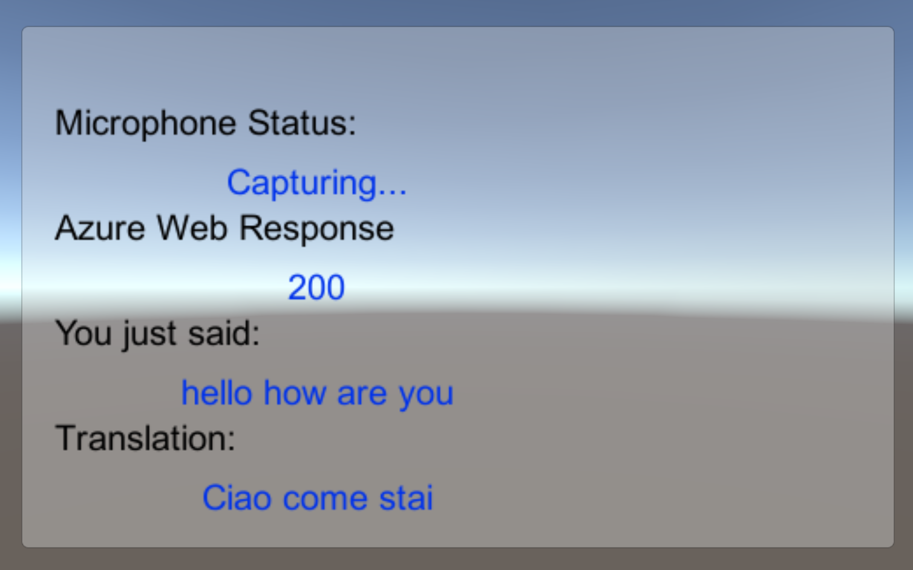

The Translator Text API is a translation service which works in near real-time. The service is cloud-based, and using a REST API call, an app can make use of the neural machine translation technology, so to translate text to another language. For more information, visit the [Azure Translator Text API page](https://azure.microsoft.com/en-us/services/cognitive-services/translator-text-api/).

1.	The user will speak through the microphone attached to the Immersive Headset
2.	The app will capture the Dictation and send it to the Azure Translator Text API. 
3.	The translation result will be displayed in a simple UI group in the Unity Scene. 

This will teach you how to get the results from the Translator Service into your Unity application.
In your application, it is up to you as to how you will integrate the results with your design. This Lab is designed to teach you how to integrate an Azure Service with your Unity Project. It is your job to use the knowledge you gain from this Lab to enhance your Mixed Reality Application.
This Lab is a self-contained tutorial, which doesn’t directly involve any other Mixed Reality Labs.

### **Prerequisites**
This tutorial is designed for developers who have basic experience with Unity and C#.
The prerequisites, and written instructions, within this document have been verified with all things mentioned within this document, at that point in time. It should not be assumed that the documents information will continue to be valid, should you use a different version of any of the below prerequisites.

The following hardware and software is required:

  - Windows 10 Fall Creators Update, Developer Mode enabled
  - Windows 10 SDK (latest version)
  - Unity 2017.2.1p2 (https://unity3d.com/unity/qa/patch-releases?version=2017.2)
  - An Immersive Headset
  - A set of earphones with a built-in microphone (for the Immersive Headset)
  - Visual Studio 2017.15.4 or higher
  - A PC compatible with Windows Mixed Reality 
  - Internet Access for Azure, and for Translation retrieval. For more information, please follow this [LINK](https://azure.microsoft.com/en-au/services/cognitive-services/translator-text-api/).

If you wish to build this Lab for Microsoft HoloLens, most of the content will still apply, some modifications to the project may be required. This would include changing the ‘Main Camera’ components to the HoloLens requirements (**Clear Flags:** Solid Color, **Background** ‘Black, Alpha 0’ – #00000000 – and **Transform** *Position* to: 0,0,0). Also ensure you change the **Build Target** within the **Build Settings** area to **HoloLens**.

You may also notice some echo when using the HoloLens mic and built-in speakers. 

### **Before you start**
1.	To avoid encountering issues building this project, it is strongly suggested that you create the project mentioned in this tutorial in a root or near-root folder (long folder paths can cause issues at build-time).
2.	The code in this tutorial will allow you to record from the Default Microphone Device on your machine. Make sure the Default Microphone Device is set as the one you wish to use to capture your voice.
3.	If your headset has a built-in microphone, make sure the option “When I wear my headset, switch to headset mic” is turned on in the Mixed Reality Portal settings.

    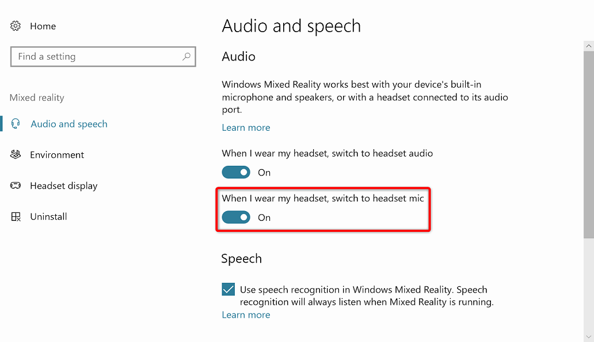

4.	To allow your machine to enable Dictation, go to Windows Settings  Speech, Inking & Typing and press on the button Turn On speech services and typing suggestions.

### **Step 0 – The Azure Portal**
To use the Azure Translator API, you will need to configure an instance of the service to be made available to your application.
1.	Log in to the Azure Portal (https://portal.azure.com).
    1.	If you do not already have an Azure account, you will need to create one. If you are following this tutorial in a classroom or lab situation, ask your instructor or one of the proctors for help setting up your new account.
2.	Once you are logged in, click on ***New*** in the top left corner, and search for ***Translator Text API***, and click ***Enter***.

    > [!NOTE]  
    > The word ***New*** may have been replaced with ***Create a resource***, in newer portals.

    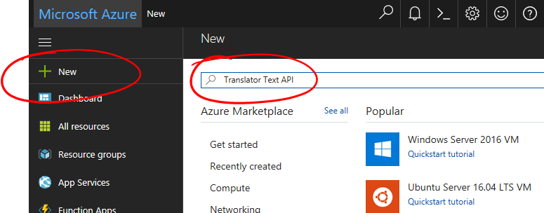

3.	The new page will provide a description of the **Translator Text API** service. At the bottom left of this page, select the ***Create*** button, to create an association with this service.

    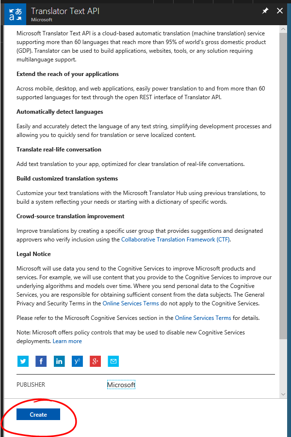

4.	Once you have clicked on ***Create***:
    1. Insert your desired **Name** for this service instance.
    2. Select an appropriate **Subscription**.
    3. Select the **Pricing Tier** appropriate for you, if this is the first time creating a **Translator Text Service**, a free tier (named F0) should be available to you.
    4. Choose a **Resource Group** or create a new one. A resource group provides a way to monitor, control access, provision and manage billing for a collection of Azure assets. It is recommended to keep all the Azure services associated with a single project (e.g. such as these labs) under a common resource group). 
    
        > [!NOTE]  
        > If you wish to read more about Azure Resource Groups, please follow this link:
    https://docs.microsoft.com/en-us/azure/azure-resource-manager/resource-group-portal

    5. Select a **Location**. The location would ideally be in the region where the application would run. Some Azure assets are only available in certain regions.
    6. You will also need to confirm that you have understood the Terms and Conditions applied to this Service.
    7. Select ***Create***.

        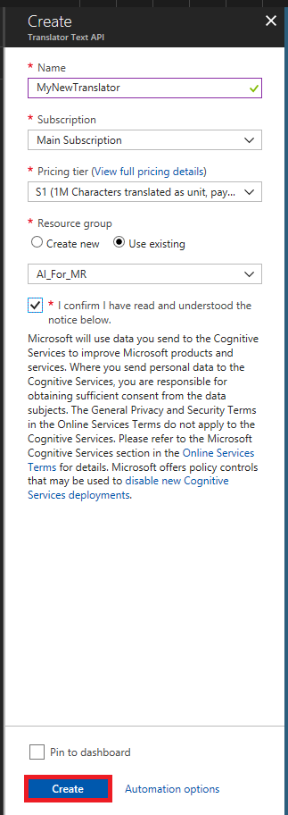

5.	Once you have clicked on ***Create***, you will have to wait for the service to be created, this might take a minute.
6.	A notification will appear in the portal once the Service instance is created. 

    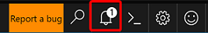

7.	Click on the notification to explore your new Service instance. 

    

8.	Click the ***Go to resource*** button in the notification to explore your new Service instance. You will be taken to your new Application Insights service instance. 

    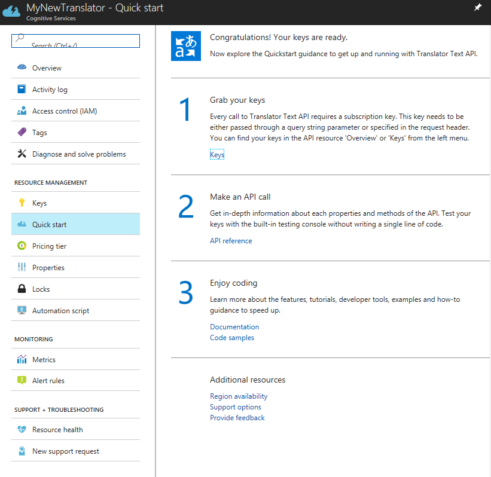

9.	Within this tutorial, your application will need to make calls to your service, which is done through using your service’s Subscription Key. 
10.	From the ***Quick start*** page of your ***Translator Text*** service, navigate to the first step, ***Grab your keys***, and click ***Keys*** (you can also achieve this by clicking the blue hyperlink Keys, located in the services navigation menu, denoted by the key icon). This will reveal your service ***Keys***.
11.	Take a copy of one of the displayed keys, as you will need this later in your project. 

### **Step 1 – Set up the Unity Project**
Set up and test your Mixed Reality Immersive Headset. 

> [!NOTE]  
> You will ***not*** require Motion Controllers for this Lab. If you need support setting up the Immersive Headset, please click [HERE](https://support.microsoft.com/en-au/help/4043101/windows-10-set-up-windows-mixed-reality).

The following is a typical set up for developing with Mixed Reality, and as such, is a good template for other projects.
1.	Open **Unity** and click **New**. 

    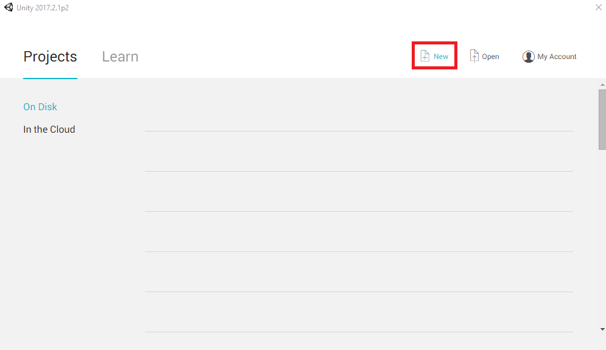

2.	You will now need to provide a Unity Project name. Insert **MR_Translation**. Make sure the project type is set to **3D**. Set the **Location** to somewhere appropriate for you (remember, closer to root directories is better). Then, click **Create project**.

    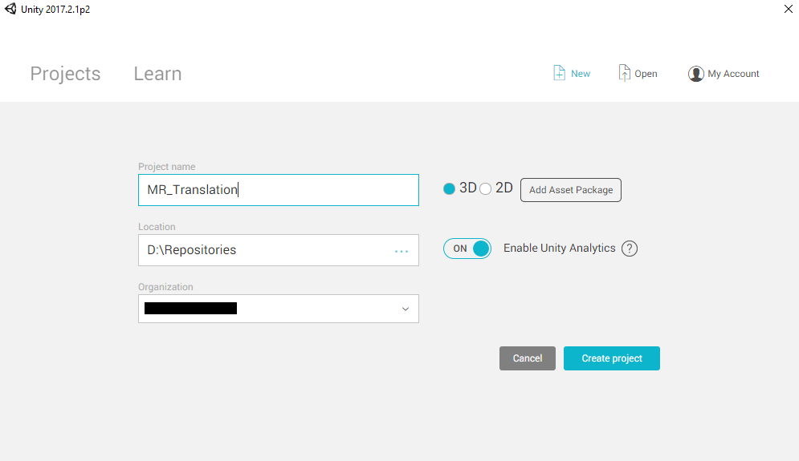

3.	With Unity open, it is worth checking the default **Script Editor** is set to **Visual Studio**. Go to ***Edit > Preferences*** and then from the new window, navigate to **External Tools**. Change **External Script Editor** to **Visual Studio 2017**. Close the **Preferences** window.

    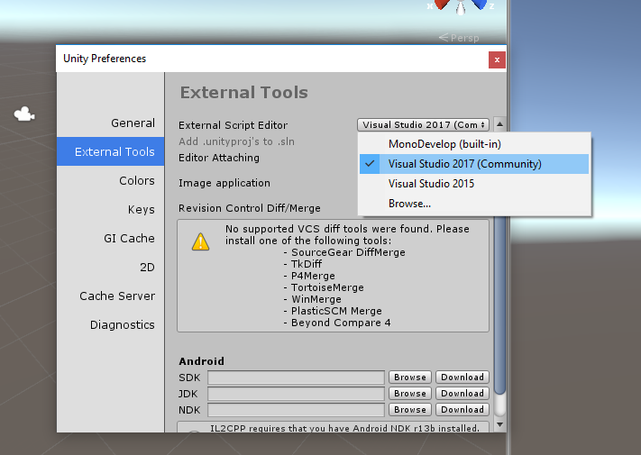

4.	Next, go to ***File > Build Settings*** and switch the platform to **Universal Windows Platform**, by clicking on the ***Switch Platform*** button.

    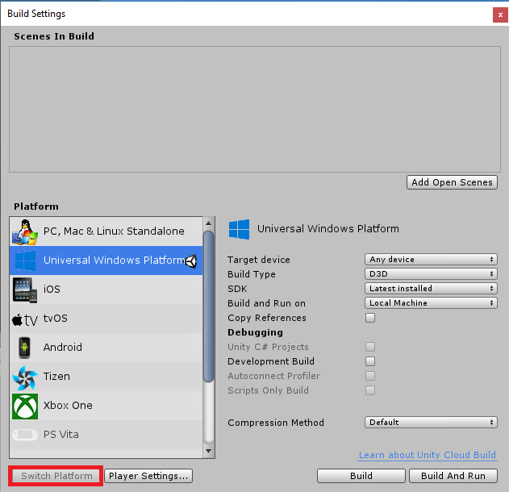

5.	Go to ***File > Build Settings*** and make sure that:
    1. **Target Device** is set to **Any Device**
    2. **Build Type** is set to **D3D**
    3. **SDK** is set to **Latest installed**
    4. **Visual Studio Version** is set to **Latest installed**
    5. **Build and Run** is set to **Local Machine**
    6. Save the scene and add it to the build. 
        1. Do this by selecting **Add Open Scenes**. A save window will appear.
        
            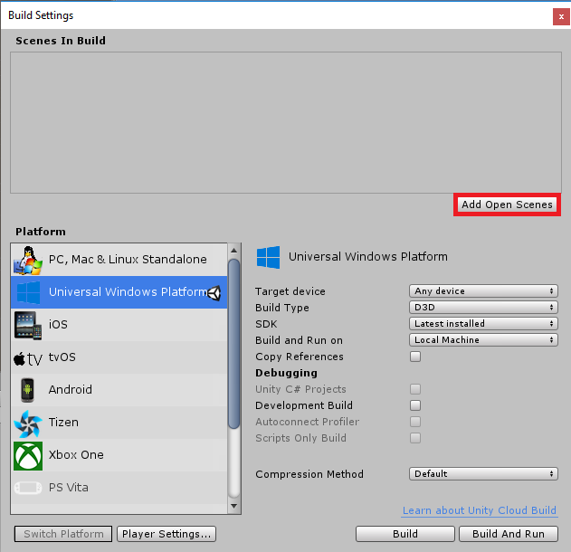

        2. Create a new folder for this, and any future, scene, then select the **New folder** button, to create a new folder, name it **Scenes**.

            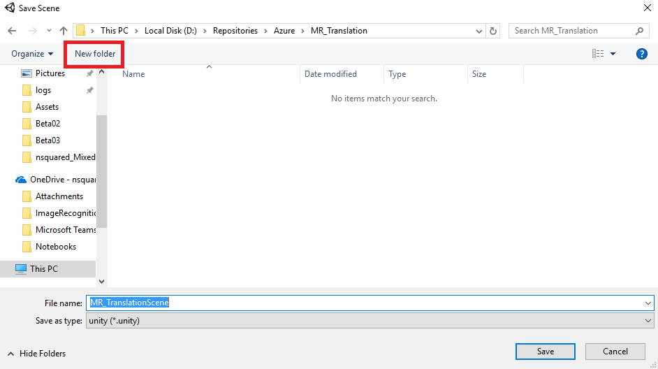

        3. Open your newly created **Scenes** folder, and then in the **File name**: text field, type **MR_TranslationScene**, then press **Save**.

            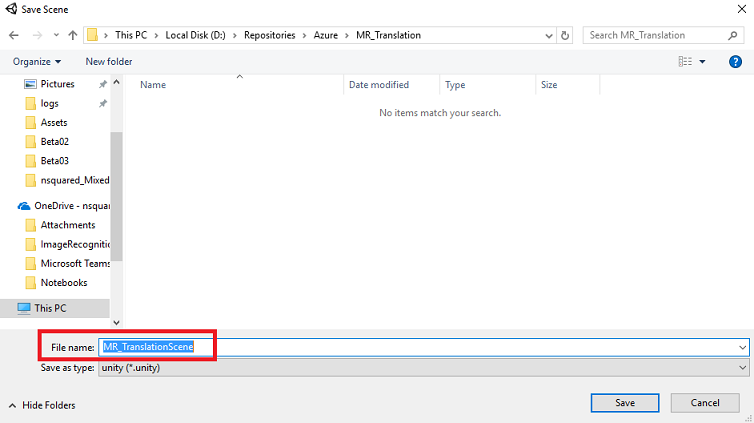

    7. The remaining settings, in **Build Settings**, should be left as default for now.
6. In the ***Build Settings*** window, click on the **Player Settings** button, this will open the related panel in the space where the **Inspector** is located. 

    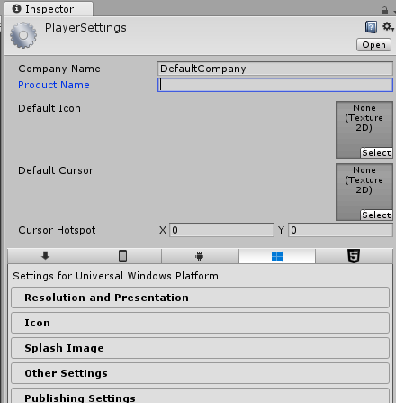

7. In this panel, a few settings need to be verified:
    1. In the **Other Settings** tab:
        1. **Scripting Runtime Version** should be ***Stable*** (.NET 3.5 Equivalent).
        2. **Scripting Backend** should be ***.NET***
        3. **API Compatibility Level** should be ***.NET 4.6***

            
      
    2. Within the **Publishing Settings** tab, under **Capabilities**, check:
        1. ***InternetClient***
        2. ***Microphone***

            

    3. Further down the panel, in **XR Settings** (found below **Publish Settings**), tick ***Virtual Reality Supported***, make sure the ***Windows Mixed Reality SDK*** is added.

        

8.	Back in **Build Settings** *Unity C#* Projects is no longer greyed out; tick the checkbox next to this. 
9.	Close the Build Settings window.
10.	Save your Scene and Project (**FILE > SAVE SCENE / FILE > SAVE PROJECT**).

### **Step 2 – Main Camera Setup**
1.	In the **Hierarchy Panel**, you will find an object called **Main Camera**, this object represents your “head” point of view once you are “inside” your application.
2.	With the Unity Dashboard in front of you, select the **Main Camera GameObject**. You will notice that the **Inspector Panel** (generally found to the right, within the Dashboard) will show the various components of that **GameObject**, with **Transform** at the top, followed by **Camera**, and some other components. You will need to reset the Transform of the Main Camera, so it is positioned correctly.
3.	To do this, select the ***Gear*** icon next to the Camera’s **Transform** component, and selecting ***Reset***. 

    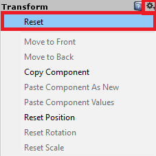
 
4.	The **Transform** component should then look like:
    1. The ***Position*** is set to ***0, 0, 0***
    2. ***Rotation*** is set to ***0, 0, 0***
    3. And ***Scale*** is set to ***1, 1, 1***

        

5.	Next, with the **Main Camera** object selected, see the ***Add Component*** button located at the very bottom of the **Inspector Panel**. 
6.	Select that button, and search (by either typing ***Audio Source*** into the search field or navigating the sections) for the component called **Audio Source** as shown below and select it (pressing enter on it also works).
7.	An **Audio Source** component will be added to the **Main Camera**, as demonstrated below.

    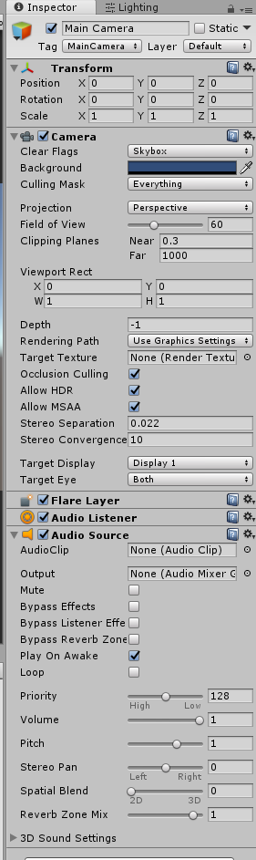

### **Step 3 – Setup Debug Canvas**
To show the input and output of the translation, a basic UI needs to be created. For this Lab, you will create a Canvas UI object, with several ‘Text’ objects to show the data. 
1.	Right-click in an empty area of the **Hierarchy Panel**, under **UI**, add a ***Canvas***.

    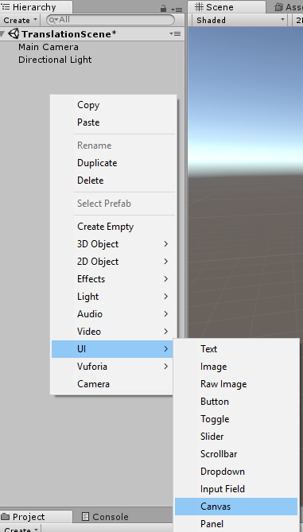

2.	With the Canvas object selected, in the **Inspector Panel** (within the ‘Canvas’ component), change **Render Mode** to **World Space**. 
3.	Next, change the following parameters in the **Inspector Panel’s Rect Transform**:

    1. ***POS*** -	**X** 0	**Y** 20	**Z** 40
    2. **Width** -	500
    3. **Height** -	300
    4. **Scale** - **X** 0.13	**Y** 0.13	**Z** 0.13

        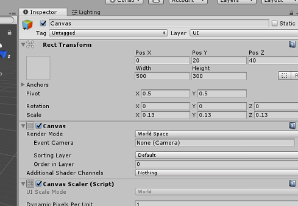
 
4.	Right click on the **Canvas** in the **Hierarchy Panel**, under **UI**, and add a ***Panel***. This **Panel** will provide a background to the text that you will be displaying in the scene.
5.	Right click on the **Panel** in the **Hierarchy Panel**, under **UI**, and add a ***Text object***. Repeat the same process until you have created four UI Text objects in total (Hint: if you have the first ‘Text’ object selected, you can simply press **‘Ctrl’ + ‘D’**, to duplicate it, until you have four in total). 
6.	For each **Text Object**, select it and use the below tables to set the parameters in the **Inspector Panel**.
    1. For the **Rect Transform** component:

        | Name                   | Transform - *Position*             | Width      | Height    |
        |:----------------------:|:----------------------------------:|:----------:|:---------:|
        | MicrophoneStatusLabel  | **X** -80 **Y** 90 **Z** 0         | 300        | 30        |
        | AzureResponseLabel     | **X** -80 **Y** 30 **Z** 0         | 300        | 30        |
        | DictationLabel         | **X** -80 **Y** -30 **Z** 0        | 300        | 30        |
        | TranslationResultLabel | **X** -80 **Y** -90 **Z** 0        | 300        | 30        |


    2. For the **Text (Script)** component:


        | Name                   | Text               | Font Size    |
        |:----------------------:|:------------------:|:------------:|
        | MicrophoneStatusLabel  | Microphone Status: | 20           |
        | AzureResponseLabel     | Azure Web Response | 20           |
        | DictationLabel         |   You just said:   | 20           |
        | TranslationResultLabel |    Translation:    | 20           |

        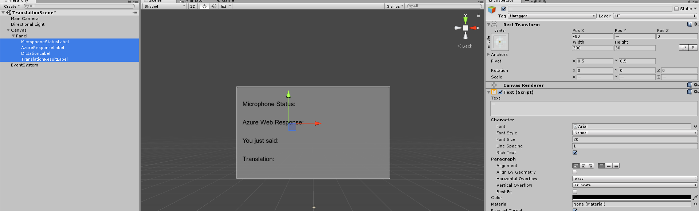

    3. Also, make the Font Style **Bold**. This will make the text easier to read.

        
 
7.	For each **UI Text object** created in **Step 5**, create a new ***child*** **UI Text object**. These children will display the output of the application. 
    1.	Create ***child*** objects through right-clicking your intended parent (e.g. ***MicrophoneStatusLabel***) and then select ***UI*** and then select ***Text***.
8.	For each of these children, select it and use the below tables to set the parameters in the Inspector Panel.

    1. For the **Rect Transform** component:

    | Name                  | Transform - *Position* | Width      | Height    |
    |:---------------------:|:----------------------:|:----------:|:---------:|
    | MicrophoneStatusText  | X 0 Y -30 Z 0          | 300        | 30        |
    | AzureResponseText     | X 0 Y -30 Z 0          | 300        | 30        |
    | DictationText         | X 0 Y -30 Z 0          | 300        | 30        |
    | TranslationResultText | X 0 Y -30 Z 0          | 300        | 30        |

    2. For the **Text (Script)** component:

    | Name                  | Text          | Font Size    |
    |:---------------------:|:-------------:|:------------:|
    | MicrophoneStatusText  |      ??       | 20           |
    | AzureResponseText     |      ??       | 20           |
    | DictationText         |      ??       | 20           |
    | TranslationResultText |      ??       | 20           |

9. Next, select the 'centre' alignment option for each text component:

    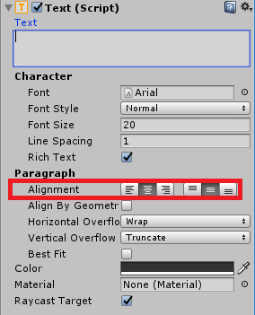

10.	To ensure the **child UI Text** objects are easily readable, change their **Color**. Do this by clicking on the bar (currently ‘Black’) next to **Color**. 

    
 
11.	Then, in the new, little, ***Color*** window, change the **Hex Color** to: **0032EAFF**

    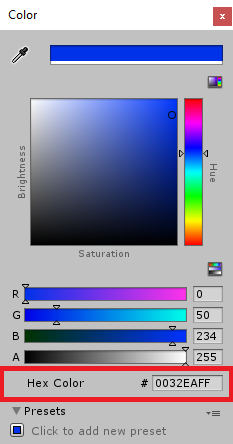
 
12.	Below is how the **UI** should look.
    1.	In the **Hierarchy Panel**:

        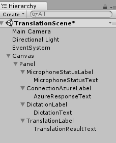

    2.	In the **Scene** and **Game Views**:

        

### **Step 4 – Create the Results class**
The first script you need to create is the ***Results*** class, which is responsible for providing a way to see the results of translation. The Class stores and displays the following: 

- The response result from Azure.
- The microphone status. 
- The result of the dictation (voice to text).
- The result of the translation.

To create this class: 

1.	Right-click in the **Project Panel**, then ***Create > Folder***. Name the folder **Scripts**. 
 
    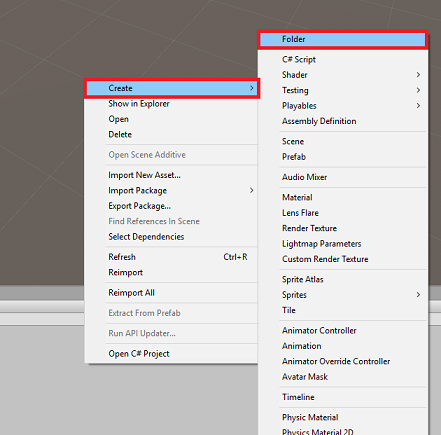

    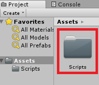
 
2.	With the **Scripts** folder create, double click it to open. Then within that folder, right-click, and select ***Create >*** then **C# Script**. Name the script ***Results***. 

    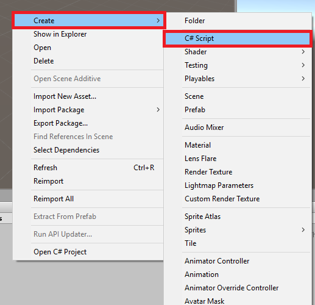
 
3.	Double click on the new ***Results*** script to open it with **Visual Studio**.
4.	Insert the following namespaces:

```csharp
    using System.Collections;
    using System.Collections.Generic;
    using UnityEngine;
    using UnityEngine.UI;
```

5.	Inside the Class insert the following variables:

```csharp
    public static Results instance;

    [HideInInspector] 
    public string azureResponseCode;

    [HideInInspector] 
    public string translationResult;

    [HideInInspector] 
    public string dictationResult;

    [HideInInspector] 
    public string micStatus;

    public Text microphoneStatusText;

    public Text azureResponseText;

    public Text dictationText;

    public Text translationResultText;

```

6.	Then add the **Awake()** method, which will be called when the class initializes. 

```csharp
    private void Awake() 
    { 
        // Set this class to behave similar to singleton 
        instance = this;           
    } 
```

7.	Finally, add the methods which are responsible for outputting the various results information to the UI. 

```csharp
    /// <summary>
    /// Stores the Azure response value in the static instance of Result class.
    /// </summary>
    public void SetAzureResponse(string result)
    {
        azureResponseCode = result;
        azureResponseText.text = azureResponseCode;
    }

    /// <summary>
    /// Stores the translated result from dictation in the static instance of Result class. 
    /// </summary>
    public void SetDictationResult(string result)
    {
        dictationResult = result;
        dictationText.text = dictationResult;
    }

    /// <summary>
    /// Stores the translated result from Azure Service in the static instance of Result class. 
    /// </summary>
    public void SetTranslatedResult(string result)
    {
        translationResult = result;
        translationResultText.text = translationResult;
    }

    /// <summary>
    /// Stores the status of the Microphone in the static instance of Result class. 
    /// </summary>
    public void SetMicrophoneStatus(string result)
    {
        micStatus = result;
        microphoneStatusText.text = micStatus;
    }
```

8.	Be sure to save your changes in **Visual Studio** before returning to **Unity**.

### **Step 5 – Create the *MicrophoneManager* class**
The second class you are going to create is the ***MicrophoneManager***.

This class is responsible for:

- Detecting the recording device attached to the headset or machine (whichever is the default).
- Capture the audio (voice) and use dictation to store it as a string.
- Once the voice has paused, submit the dictation to the Translator class.
- Host a method that can stop the voice capture if desired.

To create this class: 
1.	Double click on the **Scripts** folder, to open it. 
2.	Right-click inside the **Scripts** folder, click **Create > C# Script**. Name the script ***MicrophoneManager***. 
3.	Double click on the new script to open it with Visual Studio.
4.	Update the namespaces to be the same as the following, at the top of the ***MicrophoneManager*** class:

```csharp
    using System.Collections; 
    using System.Collections.Generic; 
    using UnityEngine; 
    using UnityEngine.Windows.Speech;
```
 
5.	Then, add the following variables inside the **MicrophoneManager** class:

```csharp
    // Help to access instance of this object 
    public static MicrophoneManager instance; 

    // Recording frequency of mic 
    private int frequency = 44100; 

    // AudioSource component, provides access to mic 
    private AudioSource audioSource; 

    // Flag indicating mic detection 
    private bool microphoneDetected; 

    // Flag indicating audio capture status 
    private bool isCapturingAudio;  

    // Component converting speech to text 
    private DictationRecognizer dictationRecognizer; 
```

6.	Code for the **Awake()** and **Start()** methods now needs to be added. These will be called when the class initializes:

```csharp
    private void Awake() 
    { 
        // Set this class to behave similar to singleton 
        instance = this; 
    } 
 
    void Start() 
    { 
        //Use Unity Microphone class to detect devices and setup Audiosource 
        if(Microphone.devices.Length > 0) 
        { 
            Results.instance.SetMicrophoneStatus("Initialising..."); 
            audioSource = GetComponent<AudioSource>(); 
            microphoneDetected = true; 
        } 
        else 
        { 
            Results.instance.SetMicrophoneStatus("No Microphone detected"); 
        } 
    } 
```
 
7.	You can *delete* the **Update()** method since this class will not use it.
8.	Now you need the methods that the App uses to start and stop the voice capture, and pass it to the **Translator** class, that you will build soon. Copy the following code and paste it beneath the **Start()** method.

    > [!NOTE]  
    > Though this application will not make use of it, the **StopCapturingAudio()** method has also been provided here, should you want to implement the ability to stop capturing audio in your application.

```csharp
    /// <summary> 
    /// Start microphone capture. Debugging message is delivered to the Results class. 
    /// </summary> 
    public void StartCapturingAudio() 
    { 
        if(microphoneDetected) 
        { 
            // Start microphone capture 
            isCapturingAudio = true;              
            
            // Start dictation 
            dictationRecognizer = new DictationRecognizer(); 
            dictationRecognizer.DictationResult += DictationRecognizer_DictationResult; 
            dictationRecognizer.Start(); 
 
            // Update UI with mic status 
            Results.instance.SetMicrophoneStatus("Capturing..."); 
        }      
    } 
 
    /// <summary> 
    /// Stop microphone capture. Debugging message is delivered to the Results class. 
    /// </summary> 
    public void StopCapturingAudio() 
    { 
        Results.instance.SetMicrophoneStatus("Mic sleeping"); 
        isCapturingAudio = false; 
        Microphone.End(null); 
        dictationRecognizer.DictationResult -= DictationRecognizer_DictationResult; 
        dictationRecognizer.Dispose(); 
    }
```
 
9.	You now need to add a Dictation Handler that will be invoked when the voice stops. This method will then pass the dictated text to the ***Translator*** class.

```csharp
    /// <summary>
    /// This handler is called every time the Dictation detects a pause in the speech. 
    /// Debugging message is delivered to the Results class.
    /// </summary>
    private void DictationRecognizer_DictationResult(string text, ConfidenceLevel confidence)
    {
        // Update UI with dictation captured
        Results.instance.SetDictationResult(text);

        // Start the coroutine that process the dictation through Azure 
        StartCoroutine(Translator.instance.TranslateWithUnityNetworking(text));   
    }
```
 
10.	Be sure to save your changes in Visual Studio before returning to Unity.

    > [!WARNING]  
    > At this point you will notice an error appearing in the **Unity Editor Console** Panel (“The name ‘Translator’ does not exist...”). This is because the code references the **Translator** class, which you will create in the next step.

### **Step 6 – Call to Azure and Translation**

The last script you need to create is the **Translator** class. 

This class is responsible for:

-	Authenticating the App with **Azure**, in exchange for an **Auth Token**.
-	Use the **Auth Token** to submit text (received from the **MicrophoneManager** Class) to be translated.
-	Receive the translated result and pass it to the **Results** Class to be visualized in the UI.

To create this Class: 
1.	Go to the **Scripts** folder you created previously. 
2.	Right-click in the **Project Panel**, ***Create > C# Script***. Call the script ***Translator***.
3.	Double click on the new ***Translator*** script to open it **with Visual Studio**.
4.	Add the following namespaces to the top of the file:

```csharp
    using System; 
    using System.Collections; 
    using System.Collections.Generic; 
    using System.IO; 
    using System.Net; 
    using System.Net.Security; 
    using System.Runtime.Serialization; 
    using System.Xml; 
    using UnityEngine; 
    using UnityEngine.Networking;
```

5.	Then add the following variables inside the ***Translator*** class:

```csharp
    public static Translator instance; 
    private string translationTokenEndpoint = "https://api.cognitive.microsoft.com/sts/v1.0/issueToken"; 
    private string translationTextEndpoint = "https://api.microsofttranslator.com/v2/http.svc/Translate?"; 
    private const string ocpApimSubscriptionKeyHeader = "Ocp-Apim-Subscription-Key"; 
 
    //Substitute the value of authorizationKey with your own Key 
    private const string authorizationKey = "-InsertYourAuthKeyHere-"; 
    private string authorizationToken; 
 
    // languages set below are: 
    // English 
    // French 
    // Italian 
    // Japanese 
    // Korean 
    public enum Languages { en, fr, it, ja, ko }; 
    public Languages from = Languages.en; 
    public Languages to = Languages.it; 
``` 

> [!NOTE]
> *	The languages inserted into the languages **enum** are just examples. Feel free to add more if you wish to, the API supports over 60 of them (including Klingon)!
You can find all the languages available by following this [LINK](https://www.microsoft.com/en-us/translator/languages.aspx).
> *	The **authorizationKey** value must be the **Key** you received when you subscribed to the **Azure Translator Text API** in the Azure Portal (see **Step 0** in this guide).


6.	Code for the **Awake()** and **Start()** methods now needs to be added. 
7.	In this case, the code will make a call to **Azure** using the authorization Key, to get a **Token**.

> [!NOTE]  
> The token will expire after 10 minutes. Depending on the scenario for your app, you might have to make the same coroutine call multiple times.

```csharp
    private void Awake() 
    { 
        // Set this class to behave similar to singleton  
        instance = this; 
    } 
 
    // Use this for initialization  
    void Start() 
    { 
        // When the application starts, request an auth token 
        StartCoroutine("GetTokenCoroutine", authorizationKey); 
    }
```
 
8.	The coroutine to obtain the Token is the following:

```csharp
    /// <summary> 
    /// Request a Token from Azure Translation Service by providing the access key. 
    /// Debugging result is delivered to the Results class. 
    /// </summary> 
    private IEnumerator GetTokenCoroutine(string key) 
    { 
        if (string.IsNullOrEmpty(key)) 
        { 
            throw new InvalidOperationException("Authorization key not set."); 
        } 

        WWWForm webForm = new WWWForm();
           
        using (UnityWebRequest unityWebRequest = UnityWebRequest.Post(translationTokenEndpoint, webForm)) 
        { 
            unityWebRequest.SetRequestHeader("Ocp-Apim-Subscription-Key", key);                   
            
            // The download handler is responsible for bringing back the token after the request 
            unityWebRequest.downloadHandler = new DownloadHandlerBuffer(); 
           
            yield return unityWebRequest.SendWebRequest(); 
 
            authorizationToken = unityWebRequest.downloadHandler.text; 
 
            if (unityWebRequest.isNetworkError || unityWebRequest.isHttpError) 
            { 
                Results.instance.azureResponseText.text = unityWebRequest.error; 
            } 
            
            long responseCode = unityWebRequest.responseCode; 
            
            // Update the UI with the response code 
            Results.instance.SetAzureResponse(responseCode.ToString()); 
        } 
 
        // After receiving the token, begin capturing Audio with the MicrophoneManager Class 
        MicrophoneManager.instance.StartCapturingAudio(); 
 
        StopCoroutine("GetTokenCoroutine"); 
 
        yield return null; 
    }
```
 
9.	Next, add the coroutine (with a “support” stream method right below it) to obtain the translation of the text received by the ***MicrophoneManager*** class. 

This code creates a query string to send to the ***Azure Translator Text API***, and then uses the internal Unity UnityWebRequest class to make a ‘Get’ call to the endpoint with the query string.
The result is then used to set the translation in your Results object.

10.	The code below shows the implementation:

```csharp
    /// <summary> 
    /// Request a translation from Azure Translation Service by providing a string.  
    /// Debugging result is delivered to the Results class. 
    /// </summary> 
    public IEnumerator TranslateWithUnityNetworking(string text) 
    { 
        WWWForm webForm = new WWWForm(); 
        string result; 
        string queryString; 
  
        // This query string will contain the parameters for the translation 
        queryString = string.Concat("text=", Uri.EscapeDataString(text), "&from=", from, "&to=",to);        
  
        using (UnityWebRequest unityWebRequest = 
        UnityWebRequest.Get(translationTextEndpoint + queryString))        
        { 
            unityWebRequest.downloadHandler = new DownloadHandlerBuffer(); 
            unityWebRequest.SetRequestHeader("Authorization", "Bearer " + authorizationToken); 
            unityWebRequest.SetRequestHeader("Accept", "application/xml"); 
            yield return unityWebRequest.SendWebRequest(); 
 
            string deliveredString = unityWebRequest.downloadHandler.text; 
 
            // The response will be in Json format 
            // Therefore we need to deserialise it 
            DataContractSerializer serializer; 
            serializer = new DataContractSerializer(typeof(string)); 
            using (Stream stream = GenerateStreamFromString(deliveredString)) 
            { 
                // Set the UI with the translation 
                Results.instance.SetTranslatedResult((string)serializer.ReadObject(stream));    
            }
            
            if (unityWebRequest.isNetworkError || unityWebRequest.isHttpError) 
            { 
                Debug.Log(unityWebRequest.error); 
            }
            
            StopCoroutine("TranslateWithUnityNetworking");              
        } 
    } 
 
    public static Stream GenerateStreamFromString(string incomingString) 
    { 
        MemoryStream stream = new MemoryStream(); 
        StreamWriter writer = new StreamWriter(stream); 
        writer.Write(incomingString); 
        writer.Flush(); 
        stream.Position = 0; 
        return stream; 
    } 
```

11.	Be sure to save your changes in **Visual Studio** before returning to **Unity**.

### **Step 7 – Configure the Unity Scene**

1.	Back in the Unity Editor, click and drag the ***Results*** class *from* the **Scripts** folder to the **Main Camera** object in the **Hierarchy Panel**.
2.	Click on the **Main Camera** and look at the **Inspector Panel**. You will notice that within the newly added *Script* component, there are four fields with empty values. These are the output references to the properties in the code. 
3.	Drag the appropriate **Text** objects from the **Hierarchy Panel** to those four slots, as shown in the image below.

    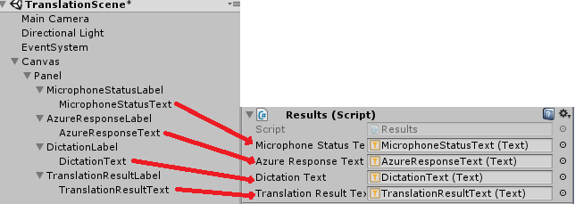
  
4.	Next, click and drag the ***Translator*** class from the **Scripts** folder to the **Main Camera** object in the **Hierarchy Panel**. 
5.	Then, click and drag the ***MicrophoneManager*** class from the **Scripts** folder to the **Main Camera** object in the **Hierarchy Panel**. 
6.	Lastly, click on the **Main Camera** and look at the **Inspector Panel**.
You will notice that in the script you dragged on, there are two drop down boxes that will allow you to set the languages.
 
    

### **Step 8 – Test in MR**
At this point you need to test that the Scene has been properly implemented.

Ensure that:

-	All the settings mentioned in **Step 1** are set correctly. 
-	The ***Results***, ***Translator***, and ***MicrophoneManager***, scripts are attached to the **Main Camera** object. 
-	You have placed your **Azure Translator Text API** service ***Key*** within the **authorizationKey** variable within the ***Translator*** Script.  
-	All the fields in the **Main Camera Inspector Panel** are assigned properly.

You can test the Immersive Headset by pressing the ***Play*** button in the **Unity Editor**.
The App should be functioning through the attached Immersive Headset.

> [!WARNING]  
> If you see an error in the Unity console about the default audio device changing, the scene may not function as expected. This is due to the way the Mixed Reality portal deals with built-in microphones for headsets that have them. If you see this error, simply stop the scene and start it again and things should work as expected.

### **Step 9 – Build the UWP Solution and Sideload on Local Machine**

Everything needed for the Unity section of this project has now been completed, so it is time to build it from Unity.

1.	Navigate to **Build Settings**: ***File > Build Settings...***
2.	From the **Build Settings** window, click **Build**.

    
  
3.	If not already, tick ***Unity C# Projects***.
4.	Click ***Build***. Unity will launch a **File Explorer** window, where you need to create and then select a folder to build the app into. Create that folder now, and name it **App**. Then with the **App** folder selected, press ***Select Folder***. 
5.	Unity will begin building your project to the **App** folder. 
6.	Once Unity has finished building (it might take some time), it will open a **File Explorer** window at the location of your build (check your task bar, as it may not always appear above your windows, but will notify you of the addition of a new window).

### **Step 10 – Deploy to the Immersive Headset**

To deploy on an Immersive Headset:

1.	Navigate to your new Unity build (the ***App*** folder) and open the solution file with **Visual Studio**.
2.	In the Solution Configuration select ***Debug***.
3.	In the Solution Platform, select ***x86***, ***Local Machine***. 

    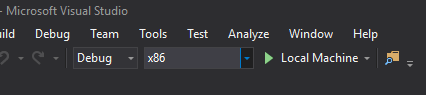
 
4.	Go to **Build menu** and click on **Deploy Solution** to sideload the application to your PC.
5.	Your App should now appear in the list of installed apps, ready to be launched.
6.	Once launched, the App will prompt you to authorize access to the Microphone. Make sure to click the ***YES*** button.
7.	You are now ready to start translating!

### **Exercise**
1. Can you add text to speech functionality to the app, so that the returned text, is spoken?
2. Make it possible to change translation 'from' and 'to', within the app itself, so the app does not need to be rebuilt, every time you want to change languages.

### **Your Translation Text API Application**

