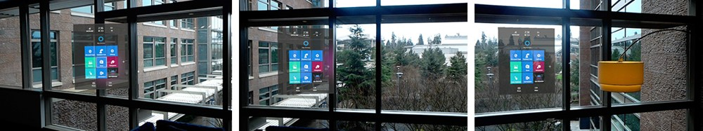

# Billboarding and tag-along

Billboarding is a behavioral concept that can be applied to objects in mixed reality. Objects with billboarding always orient themselves to face the user. This is especially helpful with text and menuing systems where static objects placed in the user's environment (world-locked) would be otherwise obscured or unreadable if a user were to move around.

 
*HoloLens perspective of a menu system that always faces the user*

Objects with billboarding enabled can rotate freely in the user's environment. They can also be constrained to a single axis depending on design considerations. Keep in mind, billboarded objects may clip or occlude themselves if they are placed too close to other objects, or in HoloLens, too close scanned surfaces. To avoid this, think about the total footprint an object may produce when rotated on the axis enabled for billboarding.

## What is a tag-along?

Tag-along is a behavioral concept that can be added to holograms, including billboarded objects. This interaction is a more natural and friendly way of achieving the effect of head-locked content. A tag-along object attempts to never leave the user's view. This allows the user to freely interact with what is front of them while also still seeing the holograms outside their direct view.

 
*The HoloLens Start menu is a great example of tag-along behavior*

Tag-along objects have parameters which can fine-tune the way they behave. Content can be in or out of the user’s line of sight as desired while the user moves around their environment. As the user moves, the content will attempt to stay within the user’s periphery by sliding towards the edge of the view, depending on how quickly a user moves may leave the content temporarily out of view. When the user gazes towards the tag-along object, it comes more fully into view. Think of content always being "a glance away" so users never forget what direction their content is in.

Additional parameters can make the tag-along object feel attached to the user's head by a rubber band. Dampening acceleration or deceleration gives weight to the object making it feel more physically present. This spring behavior is an affordance that helps the user build an accurate mental model of how tag-along works. Audio helps provide additional affordances for when users have objects in tag-along mode. Audio should reinforce the speed of movement; a fast head turn should provide a more noticeable sound effect while walking at a natural speed should have minimal audio if any effects at all.

Just like truly head-locked content, tag-along objects can prove overwhelming or nauseating if they move wildly or spring too much in the user’s view. As a user looks around and then quickly stop, their senses tell them they have stopped. Their balance informs them that their head has stopped turning as well as their vision sees the world stop turning. However, if tag-along keeps on moving when the user has stopped, it may confuse their senses.

## See also
* [Cursors](cursors.md)
* [Instinctual interactions](interaction-fundamentals.md)
* [Comfort](comfort.md)
