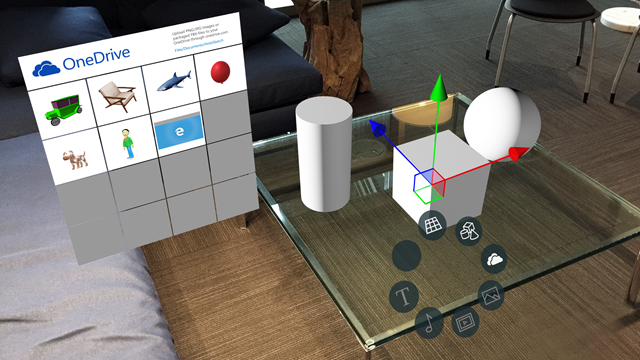
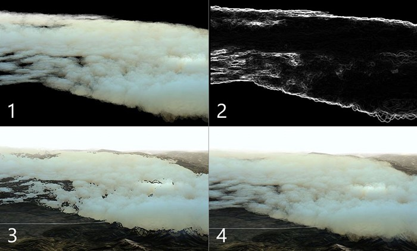
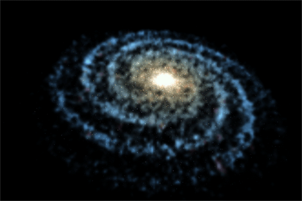
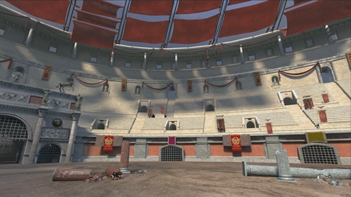
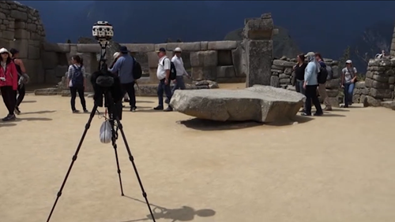

# Case studies

Stories, learnings and experiences the Mixed Reality team has encountered and jotted down along the way.

<ul id="cardtypes-W" class="cardsW panelContent" style="display: flex; margin-top: 0px;">
                            <li>
                                    <a href="case-study-3-holostudio-ui-and-interaction-design-learnings.md" title="3 HoloStudio UI and interaction design learnings" data-linktype="absolute-path">
                                    

                                        

                                            

                                                

                                                    

                                                        
                                                    

                                                

                                                

                                                    <h3>3 HoloStudio UI and interaction design learnings</h3>
                                                    
HoloStudio was one of the first Microsoft apps for HoloLens. Because of this, we had to create new best practices for 3D UI and interaction design. We did this through a lot of user testing, prototyping, and trial and error.

                                                    <i>July 2016<i>
                                                

                                            

                                        

                                    

                               </a>
                            </li>
                               <li>
                                  <a href="case-study-building-holosketch,-a-spatial-layout-and-ux-sketching-app-for-hololens.md" title="Building HoloSketch, a spatial layout and UX sketching app for HoloLens" data-linktype="absolute-path">
                                    

                                        

                                            

                                                

                                                    

                                                        
                                                    

                                                

                                                

                                                    <h3>Building HoloSketch, a spatial layout and UX sketching app for HoloLens</h3>
                                                    
HoloSketch is an on-device spatial layout and UX sketching tool for HoloLens to help build holographic experiences.

                                                    <i>July 2017<i>
                                                

                                            

                                        

                                    

                               </a>
                            </li>
                            <li>
                            <a href="case-study-creating-an-immersive-experience-in-fragments.md" title="Creating an immersive experience in Fragments" data-linktype="absolute-path">
                              

                                  

                                      

                                          

                                              

                                                  
                                              

                                          

                                          

                                              <h3>Creating an immersive experience in Fragments</h3>
                                              
Fragments is an interactive crime drama for Microsoft Hololens, where you follow the clues to solve a mystery that takes place in your real-world space.

                                              <i>August 2016<i>
                                          

                                      

                                  

                              

                              </a>
                            </li>          
                              <li>
                              <a href="case-study-expanding-the-spatial-mapping-capabilities-of-hololens.md" title="Expanding the spatial mapping capabilities of HoloLens" data-linktype="absolute-path">
                              

                                  

                                      

                                          

                                              

                                                  
                                              

                                          

                                          

                                              <h3>Expanding the spatial mapping capabilities of HoloLens</h3>
                                              
When creating our first apps for Microsoft HoloLens, we were eager to see just how far we could push the boundaries of spatial mapping on the device.

                                              <i>December 2016<i>
                                          

                                      

                                  

                              

                              </a>
                            </li>      
                               <li>
                               <a href="case-study-lessons-from-the-lowes-kitchen.md" title="Lessons from the Lowe's kitchen" data-linktype="absolute-path">
                              

                                  

                                      

                                          

                                              

                                                  
                                              

                                          

                                          

                                              <h3>Lessons from the Lowe's kitchen</h3>
                                              
The HoloLens team wants to share some of the best practices that were derived from the Lowe's HoloLens project.

                                              <i>September 2016<i>
                                          

                                      

                                  

                              

                             </a>
                            </li> 
                                <li>
                                   <a href="case-study-scaling-datascape-across-devices-with-different-performance.md" title="Scaling Datascape across devices with different performance" data-linktype="absolute-path">
                              

                                  

                                      

                                          

                                              

                                                  
                                              

                                          

                                          

                                              <h3>Scaling Datascape across devices with different performance</h3>
                                              
This case study offers insight on how Microsoft developers optimized the Datascape app to deliver a compelling experience across devices with a range of performance capabilities.

                                              <i>August 2017<i>
                                          

                                      

                                  

                              

                              </a>
                            </li>  
                            <li>
                                   <a href="case-study-using-the-stabilization-plane-to-reduce-holographic-turbulence.md" title="Using the stabilization plane to reduce holographic turbulence" data-linktype="absolute-path">
                              

                                  

                                      

                                          

                                              

                                                  
                                              

                                          

                                          

                                              <h3>Using the stabilization plane to reduce holographic turbulence</h3>
                                              
Working with holograms can be tricky. The fact that you can move around your space and see your holograms from all different angles provides a level of immersion that you can’t get with a normal computer screen.

                                              <i>April 2017<i>
                                          

                                      

                                  

                              

                              </a>
                            </li> 
</ul>

 

## Galaxy Explorer

Before Microsoft HoloLens shipped, we asked our developer community what kind of app they'd like to see an experienced internal team build for the new device. More than 5000 ideas were shared, and after a 24-hour Twitter poll, the winner was an idea called Galaxy Explorer.

<ul id="cardtypes-W" class="cardsW panelContent" style="display: flex; margin-top: 0px;">
                            <li>
                             <a href="case-study-creating-a-galaxy-in-mixed-reality.md" title="Creating a galaxy in mixed reality" data-linktype="absolute-path">
                              

                                  

                                      

                                          

                                              

                                                  
                                              

                                          

                                          

                                              <h3>Creating a galaxy in mixed reality</h3>
                                              
Before Microsoft HoloLens shipped, we asked our developer community what kind of app they'd like to see an experienced internal team build for the new device. More than 5000 ideas were shared, and after a 24-hour Twitter poll, the winner was an idea called Galaxy Explorer.

                                              <i>February 2016<i>
                                          

                                      

                                  

                              

                               </a>
                            </li>
                           <li>
                             <a href="galaxy-explorer-update.md" title="The Making of Galaxy Explorer for HoloLens 2" data-linktype="absolute-path">
                              

                                  

                                      

                                          

                                              

                                                  
                                              

                                          

                                          

                                              <h3>The Making of Galaxy Explorer for HoloLens 2</h3>
                                              
Welcome to the journey of how we are updating Galaxy Explorer for HoloLens 2. Galaxy Explorer was originally developed as an open source application for HoloLens (1st gen) through the Share Your Idea program, and is one of the first mixed reality experiences many people had. Now we are updating it for the new and exciting capabilities of HoloLens 2..

                                              <i>June 2019<i>
                                          

                                      

                                  

                              

                               </a>
                            </li>
</ul>

 

## HoloTour

HoloTour for Microsoft HoloLens provides immersive 3D personal tours of iconic locations around the world. As the designers, artists, producers, audio designers, and developers working on this project found out, creating a convincingly real 3D rendering of a well-known location takes a unique blend of creative and technological wizardry.

<ul id="cardtypes-W" class="cardsW panelContent" style="display: flex; margin-top: 0px;">
                                <li>
                                   <a href="case-study-spatial-sound-design-for-holotour.md" title="Spatial sound design for HoloTour" data-linktype="absolute-path">
                              

                                  

                                      

                                          

                                              

                                                  
                                              

                                          

                                          

                                              <h3>Spatial sound design for HoloTour</h3>
                                              
To create a truly immersive 3D virtual tour for Microsoft HoloLens, the panoramic videos and holographic scenery are only part of the formula.

                                              <i>August 2016<i>
                                          

                                      

                                  

                              

                              </a>
                            </li> 
                                <li>
                             <a href="case-study-creating-impossible-perspectives-for-holotour.md" title="Creating impossible perspectives for HoloTour" data-linktype="absolute-path">
                              

                                  

                                      

                                          

                                              

                                                  
                                              

                                          

                                          

                                              <h3>Creating impossible perspectives for HoloTour</h3>
                                              
We wanted your experiences in HoloTour for Microsoft HoloLens to be unforgettable. In addition to the traditional tourist stops, we planned out some "impossible perspectives".

                                              <i>August 2016<i>
                                          

                                      

                                  

                              

                              </a>
                            </li>
                            <li>
                                <a href="case-study-capturing-and-creating-content-for-holotour.md" title="Capturing and creating content for HoloTour" data-linktype="absolute-path">
                                    

                                        

                                            

                                                

                                                    

                                                        
                                                    

                                                

                                                

                                                    <h3>Capturing and creating content for HoloTour</h3>
                                                    
HoloTour for Microsoft HoloLens provides immersive 3D personal tours of iconic locations around the world. As the designers, artists, producers, audio designers, and developers working on this project found out, creating a convincingly real 3D rendering of a well-known location takes a unique blend of creative and technological wizardry.

                                                    <i>August 2016<i>
                                                

                                            

                                        

                                    

                                  </a>
                            </li>
</ul>

 

## RoboRaid

In this mixed reality first-person shooter, use gaze and gesture to target enemies, and dodge incoming fire using natural movements. Spatial mapping turns each room into a unique game level, while spatial sound lets you use the entire room to play—even the spaces behind you. 

<ul id="cardtypes-W" class="cardsW panelContent" style="display: flex; margin-top: 0px;">
                            <li>
                                   <a href="case-study-using-spatial-sound-in-roboraid.md" title="Using spatial sound in RoboRaid" data-linktype="absolute-path">
                              

                                  

                                      

                                          

                                              

                                                  
                                              

                                          

                                          

                                              <h3>Using spatial sound in RoboRaid</h3>
                                              
Spatial sound is one of the most exciting features of Microsoft HoloLens, providing a way for users to perceive what's going on around them when objects are out of the line of sight.

                                              <i>February 2016<i>
                                          

                                      

                                  

                              

                              </a>
                            </li> 
                             <li>
                                <a href="case-study-looking-through-holes-in-your-reality.md" title="Looking through holes in your reality" data-linktype="absolute-path">
                              

                                  

                                      

                                          

                                              

                                                  
                                              

                                          

                                          

                                              <h3>Looking through holes in your reality</h3>
                                              
This case study explains how to implement the "magic window" effect on HoloLens, allowing the user to see behind walls, under the floor, and into virtual openings within their actual environment.

                                              <i>February 2016<i>
                                          

                                      

                                  

                              

                             </a>
                            </li> 
</ul>

 

## Design and human experience

Read our high-level thoughts, and understand the principles we follow.

<ul id="cardtypes-W" class="cardsW panelContent" style="display: flex; margin-top: 0px;">
                                <li>
                                   <a href="case-study-representing-humans-in-mixed-reality.md" title="Representing humans in mixed reality" data-linktype="absolute-path">
                              

                                  

                                      

                                          

                                              

                                                  
                                              

                                          

                                          

                                              <h3>Representing humans in mixed reality</h3>
                                              
What kind of opportunities emerge when we cannot only create fantastic elements, but utilize the most realistic captures of environments, objects, and people in mixed reality?

                                              <i>November 2017<i>
                                          

                                      

                                  

                              

                              </a>
                            </li> 
                                <li>
                                   <a href="case-study-my-first-year-on-the-hololens-design-team.md" title="My first year on the HoloLens design team" data-linktype="absolute-path">
                              

                                  

                                      

                                          

                                              

                                                  
                                              

                                          

                                          

                                              <h3>My first year on the HoloLens design team</h3>
                                              
My journey from a 2D flatland to the 3D world started when I joined the HoloLens design team in January 2016.

                                              <i>Janurary 2016<i>
                                          

                                      

                                  

                              

                              </a>
                            </li> 
                         <li>
                              <a href="case-study-expanding-the-design-process-for-mixed-reality.md" title="Expanding the design process for mixed reality" data-linktype="absolute-path">
                              

                                  

                                      

                                          

                                              

                                                  
                                              

                                          

                                          

                                              <h3>Expanding the design process for mixed reality</h3>
                                              
Adding techniques to your design process to help your team think spatially and more easily envision mixed reality experiences.

                                              <i>April 2018<i>
                                          

                                      

                                  

                              

                              </a>
                            </li>  
                             <li>
                                  <a href="case-study-afternows-process-envisioning,-prototyping,-building.md" title="AfterNow's process - envisioning, prototyping, building" data-linktype="absolute-path">
                                    

                                        

                                            

                                                

                                                    

                                                        
                                                    

                                                

                                                

                                                    <h3>AfterNow's process - envisioning, prototyping, building</h3>
                                                    
At AfterNow, we work with you to turn your ideas and aspirations into concrete, fully operational products and experiences ready for the market. But before we write a single line of code, we create a blueprint through a process called envisioning.

                                                    <i>April 2017<i>
                                                

                                            

                                        

                                    

                               </a>
                            </li>
</ul>