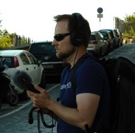

# Case study - Spatial sound design for HoloTour

To create a truly immersive 3D virtual tour for Microsoft HoloLens, the panoramic videos and holographic scenery are only part of the formula. Audio designer Jason Syltebo talks about how sound was captured and processed to make you feel like you're actually in each of the locations in HoloTour.

## The tech

The beautiful imagery and holographic scenes you see in HoloTour are only one part of creating a believable mixed reality experience. While holograms can only appear visually in front of a user, the [spatial sound](spatial-sound.md) feature of HoloLens allows audio to come from all directions, which gives the user a more complete sensory experience.

Spatial sound allows us to give audio cues to indicate a direction in which the user should turn, or to let the user know there are more holograms for them to see within their space. We can also attach a sound directly to a hologram and continually update the direction and distance the hologram is from a user to make it seem as if the sound is coming directly from that object.

With HoloTour, we wanted to take advantage of the spatial sound capabilities of HoloLens to create a 360-degree ambient environment, synchronized with the video to reveal the sonic highlights of specific locations.

## Behind the scenes

We created HoloTour experiences of two different locations: Rome and Machu Picchu. To make these tours feel authentic and compelling we wanted to avoid using generic sounds and instead capture audio directly from the locations where we were filming.

### Capturing the audio

In our [case study about capturing the visual content for HoloTour](case-study-capturing-and-creating-content-for-holotour.md), we talked about the custom design of our camera rig. It consisted of 14 GoPro cameras contained in a 3D-printed housing, designed to the specific dimensions of the tripod. To capture audio from this rig, we added a quad-microphone array beneath the cameras, which fed into a compact 4-channel recording unit that sat at the base of the tripod. We chose microphones that not only performed well, but which had a very small footprint, so as to not occlude the view of the camera.

 
*Custom camera and microphone rig*

This setup captured sound in four directions from the precise location of our camera, giving us enough information to re-create a 3D aural panorama using spatial sound, which we could later synchronize to the 360-degree video.

One of the challenges with the camera array audio is that you are at the mercy of what is recorded at the time of capture. Even if the video capture is good, the sound capture can become problematic due to off-camera sounds such as sirens, airplanes, or high winds. To assure we had all the elements we need, we used a series of stereo and mono mobile recording units to get asynchronous, ambient elements at specific points of interest in each location. This capture is important as it gives the sound designer the ability to seek out clean and usable content that can be used in post-production to craft interest and add further directionality.

Any given capture day would generate a large number of files. It was important to develop a system to track which files correspond to a particular location or camera shot. Our recording unit was set up to auto-name files by date and take number and we would back these up at the end of the day to external drives. At the very least, verbally slating the beginning of audio recordings was important as this allows easy contextual identification of the content should filenames become a problem. It was also important for us to visually slate the camera rig capture as the video and audio were recorded as separate media and needed to be synchronized during post.

### Editing the audio

Back at the studio after the capture trip, the first step in assembling a directional and immersive aural experience is to review all of the audio capture for a location, picking out the best takes and identifying any highlights that could be applied creatively during integration. The audio is then edited and cleaned up. For example, a loud car horn lasting a second or so and repeating a few times, can be replaced and stitched in with sections of quiet, ambient audio from the same capture.

Once the video edit for a location has been established the sound designer can synchronize the corresponding audio. At this point we worked with both camera rig capture and mobile capture to decide what elements, or combination thereof, will work to build an immersive audio scene. A technique we found useful was to add all the sound elements into an audio editor and build quick linear mock ups to experiment with different mix ideas. This gave us better formed ideas when it came time to build the actual HoloTour scenes.

### Assembling the scene

The first step to building a 3D ambient scene is to create a bed of general background ambient looping sounds that will support other features and interactive sound elements in a scene. In doing so, we took a holistic approach towards different implementation techniques determined by the specific needs and design criteria of any particular scene. Some scenes might index towards using the synchronized camera capture, whereas others might require a more curated approach that uses more discretely placed sounds, interactive elements and music and sound effects for the more cinematic moments in HoloTour.

When indexing on the use of the camera capture audio, we placed spatial sound-enabled ambient audio emitters corresponding to the directional coordinates of the camera orientation such that the north camera view plays audio from the north microphone and likewise for the other cardinal directions. These emitters are world-locked, meaning the user can freely turn their head in relation to these emitters and the sound will change accordingly, effectively modeling the sound of standing at that location. Listen to Piazza Navona or The Pantheon for examples of scenes that use a good mix of camera captured audio.

A different approach involved playing a looping stereo ambience in conjunction with spatial sound emitters placed around the scene playing one-off sounds that are randomized in terms of volume, pitch and trigger frequency. This creates an ambience with an enhanced sense of directionality. In Aguas Calientes, for example, you can listen to how each quadrant of the panorama has specific emitters that intentionally highlight specific areas of the geography, but work together to create an overall immersive ambience.

## Tips and tricks

When you're putting together audio for a scene, there are some additional methods you can use to further highlight directionality and immersion, making full use of the spatial sound capabilities of HoloLens. We've provided a list of some below—listen for them the next time you try HoloTour.
* **Look Targets**: These are sounds that trigger only when you are looking at a specific object or area of the holographic frame. For example, looking in the direction of the street-side café in Rome's Piazza Navona will subtly trigger the sounds of a busy restaurant.
* **Local Vision**: The journey though HoloTour contains certain beats where your tour guide, aided by holograms, will explore a topic in-depth. For instance, as the façade of the Pantheon dissolves to reveal the oculus, reverberating audio placed as a 3D emitter from the inside of the Pantheon encourages the user to explore the interior model.
* **Enhanced directionality**: Within many scenes, we placed sounds in various ways to add to the directionality. In the Pantheon scene, for example, the sound of the fountain was placed as a separate emitter close enough to the user so that they could get a sense of ‘sonic parallax’ as they walked around the play space. In Peru's Salinas de Maras scene, the individual perspective of some of the little streams were placed as separate emitters to build a more immersive ambient environment, surrounding the user with the authentic sounds of that location.
* **Spline emitter**: This special spatial sound emitter moves in 3D space relative to the visual position of the object it's attached to. An example of this was the train in Machu Picchu, where we used a spline emitter to give a distinct sense of directionality and movement.
* **Music and SFX**: Certain aspects of HoloTour that represent a more stylized or cinematic approach use music and sound effects to heighten the emotional impact. In the gladiator battle at the end of the Rome tour, special effects like whooshes or stingers were used to help strengthen the effect of labels appearing in scenes.

## About the author

<table style="border-collapse:collapse">
<tr>
<td style="border-style: none" width="60px"></td>
<td style="border-style: none"><b>Jason Syltebo</b> Audio Designer @Microsoft</td>
</tr>
</table>

## See also
* [Spatial sound](spatial-sound.md)
* [Spatial sound design](spatial-sound-design.md)
* [Spatial sound in Unity](spatial-sound-in-unity.md)
* [MR Spatial 220](holograms-220.md)
* [Video: Microsoft HoloLens: HoloTour](https://www.youtube.com/watch?v=pLd9WPlaMpY)

 
