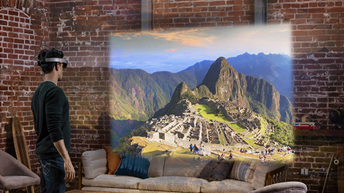
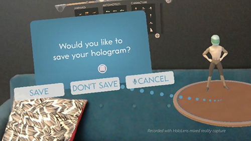
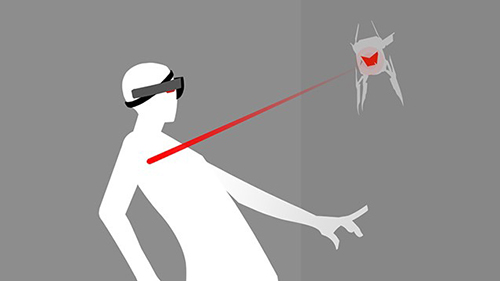
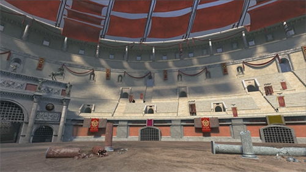

# Case studies

 

<h3 class="text-title spacer-12-bottom" style="margin-top:15px;">
<a href="../case-study-expanding-the-spatial-mapping-capabilities-of-hololens.md">Expanding the spatial mapping capabilities of HoloLens</a>
</h3>Look into the technology used by Conker and Fragments for building on top of the spatial mapping mesh to understand topology and locate shapes like couches and walls.

&#160;

 

<h3 class="text-title spacer-12-bottom" style="margin-top:15px;">
<a href="../case-study-creating-a-galaxy-in-mixed-reality.md">Creating a galaxy in mixed reality</a>
</h3>Explore the work between art and engineering that led to the creation of an accurate, interactive representation of the Milky Way galaxy in Galaxy Explorer.

 

<h3 class="text-title spacer-12-bottom" style="margin-top:15px;">
<a href="../case-study-spatial-sound-design-for-holotour.md">Spatial sound design for HoloTour</a>
</h3>Learn how sound was captured and processed to make you feel like you&#39;re actually in each of the locations in HoloTour.&#160;

 

<h3 class="text-title spacer-12-bottom" style="margin-top:15px;">
<a href="../case-study-3-holostudio-ui-and-interaction-design-learnings.md">3 HoloStudio UI and interaction design learnings</a>
</h3>Marcus Ghaly, a Sr. Holographic Designer from the HoloStudio team, shares some things we learned about designing interactions and user interfaces in HoloLens apps.

 

<h3 class="text-title spacer-12-bottom" style="margin-top:15px;">
<a href="../case-study-using-spatial-sound-in-roboraid.md">Using spatial sound in RoboRaid</a>
</h3>Audio lead Charles Sinex discusses how spatial sound is used to communicate a variety of actions to players in RoboRaid.

 

<h3 class="text-title spacer-12-bottom" style="margin-top:15px;">
<a href="../case-study-creating-impossible-perspectives-for-holotour.md">Creating impossible perspectives for HoloTour</a>
</h3>Discover how our team was able to make some of the most unforgettable moments for HoloTour.

## Page list

The following 15 pages are in this category.
* [Case study - 3 HoloStudio UI and interaction design learnings](../case-study-3-holostudio-ui-and-interaction-design-learnings.md)
* [Case study - AfterNow's process - envisioning, prototyping, building](../case-study-afternows-process-envisioning,-prototyping,-building.md)
* [Case study - Building HoloSketch, a spatial layout and UX sketching app for HoloLens](../case-study-building-holosketch,-a-spatial-layout-and-ux-sketching-app-for-hololens.md)
* [Case study - Capturing and creating content for HoloTour](../case-study-capturing-and-creating-content-for-holotour.md)
* [Case study - Creating a galaxy in mixed reality](../case-study-creating-a-galaxy-in-mixed-reality.md)
* [Case study - Creating an immersive experience in Fragments](../case-study-creating-an-immersive-experience-in-fragments.md)
* [Case study - Creating impossible perspectives for HoloTour](../case-study-creating-impossible-perspectives-for-holotour.md)
* [Case study - Expanding the spatial mapping capabilities of HoloLens](../case-study-expanding-the-spatial-mapping-capabilities-of-hololens.md)
* [Case study - Looking through holes in your reality](../case-study-looking-through-holes-in-your-reality.md)
* [Case study - My first year on the HoloLens design team](../case-study-my-first-year-on-the-hololens-design-team.md)
* [Case study - Scaling Datascape across devices with different performance](../case-study-scaling-datascape-across-devices-with-different-performance.md)
* [Case study - Spatial sound design for HoloTour](../case-study-spatial-sound-design-for-holotour.md)
* [Case study - The pursuit of more personal computing](../case-study-the-pursuit-of-more-personal-computing.md)
* [Case study - Using spatial sound in RoboRaid](../case-study-using-spatial-sound-in-roboraid.md)
* [Case study - Using the stabilization plane to reduce holographic turbulence](../case-study-using-the-stabilization-plane-to-reduce-holographic-turbulence.md)