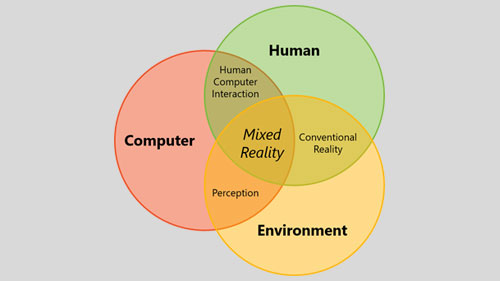
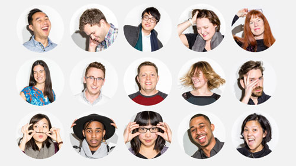
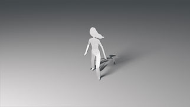
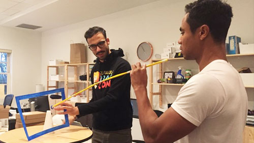
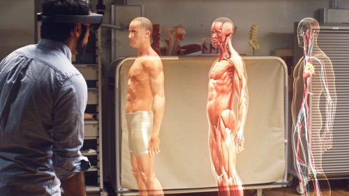

---
title: Get started with design
description: 
author: 
ms.author: 
ms.date: 2/28/2018
ms.topic: article
keywords: 
---

# Get started with design

This guidance is authored by Microsoft designers, developers, program managers, and researchers, whose work spans holographic devices (like HoloLens) and immersive devices (like the Acer and HP Windows Mixed Reality headsets). So, consider this work as a set of topics for ‘how to design for Windows head-mounted displays’.

 

<h3 class="text-title spacer-12-bottom" style="margin-top:15px;">
<a href="../mixed-reality.md">Mixed reality</a>
</h3>Mixed reality is the result of blending the physical world with the digital world. It is the next evolution in human, computer, and environment interaction.

 

<h3 class="text-title spacer-12-bottom" style="margin-top:15px;">
<a href="../about-this-design-guidance.md">About this design guidance</a>
</h3>Hello, and welcome to your design guidance for mixed reality. Consider this work as a set of topics for ‘how to design for Windows head-mounted displays’.

 

<h3 class="text-title spacer-12-bottom" style="margin-top:15px;">
<a href="../case-study-my-first-year-on-the-hololens-design-team.md">Case study - My first year on the HoloLens design team</a>
</h3>My journey from a 2D flatland to the 3D world started when I joined the HoloLens design team in January, 2016. Before joining the team, I had very little experience in 3D design.

 

<h3 class="text-title spacer-12-bottom" style="margin-top:15px;">
<a href="../case-study-afternows-process-envisioning,-prototyping,-building.md">Case study - AfterNow&#39;s process - envisioning, prototyping, building</a>
</h3>We work with you to turn your ideas and aspirations into concrete, fully operational products and experiences ready for the market.

 

<h3 class="text-title spacer-12-bottom" style="margin-top:15px;">
<a href="../case-study-the-pursuit-of-more-personal-computing.md">Case study - The pursuit of more personal computing</a>
</h3>How Microsoft’s bet on mixed reality creates new opportunities for designers and developers.

## Page list

The following 5 pages are in this category.
* [About this design guidance](../about-this-design-guidance.md)
* [Case study - AfterNow's process - envisioning, prototyping, building](../case-study-afternows-process-envisioning,-prototyping,-building.md)
* [Case study - My first year on the HoloLens design team](../case-study-my-first-year-on-the-hololens-design-team.md)
* [Case study - The pursuit of more personal computing](../case-study-the-pursuit-of-more-personal-computing.md)
* [Mixed reality](../mixed-reality.md)