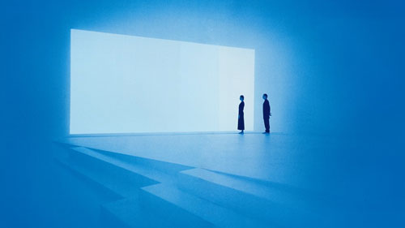
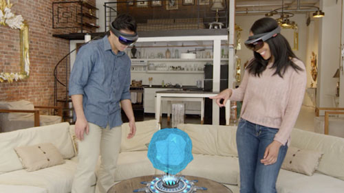
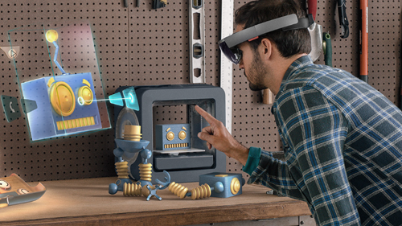

# Interaction design

Mixing the physical and digital world requires a balance of both familiar and novel interactions. It is important to leverage what users know from 2D screen interactions, like flat windows, swiping, and scrolling, while creating entirely new interactions using volumetric space and unique input methods such as gaze. Learn how to manage expectations and push the boundaries of what users can experience within mixed reality.

## Guidelines

 

<h3 class="text-title spacer-12-bottom" style="margin-top:15px;">
<a href="../interaction-fundamentals.md">Interaction fundamentals</a>
</h3>As we&#39;ve built experiences across HoloLens and immersive headsets, we&#39;ve started writing down some things we found useful to share.

 

<h3 class="text-title spacer-12-bottom" style="margin-top:15px;">
<a href="../comfort.md">Comfort</a>
</h3>During natural viewing, the human visual system relies on multiple sources of information, or “cues,” to interpret 3D shapes and the relative position of objects.

 

<h3 class="text-title spacer-12-bottom" style="margin-top:15px;">
<a href="../gaze-targeting.md">Gaze targeting</a>
</h3>All interactions are built upon the ability of a user to target the element they want to interact with, regardless of the input modality.

 

<h3 class="text-title spacer-12-bottom" style="margin-top:15px;">
<a href="../gestures.md">Gestures</a>
</h3>Interaction on HoloLens are built on gaze to target and gesture or voice to act upon whatever element has been targeted.

 

<h3 class="text-title spacer-12-bottom" style="margin-top:15px;">
<a href="../voice-design.md">Voice design</a>
</h3>Voice is one of the main input forms in Windows Mixed Reality. You should also consider adding voice commands to any experience that you build.

 

<h3 class="text-title spacer-12-bottom" style="margin-top:15px;">
<a href="../motion-controllers.md">Motion controllers</a>
</h3>Motion controllers are hardware accessories that allow users to take action in mixed reality.

 

<h3 class="text-title spacer-12-bottom" style="margin-top:15px;">
<a href="../spatial-sound-design.md">Spatial sound design</a>
</h3> The more closely your app&#39;s sound behaves like it does in the real world, the more convincing and engaging your holograms will be.

 

<h3 class="text-title spacer-12-bottom" style="margin-top:15px;">
<a href="../spatial-mapping-design.md">Spatial mapping design</a>
</h3>HoloLens learns about the surfaces in its environment as the user looks at them. Over time, HoloLens builds up a scan of all parts of the environment that have been observed.

 

<h3 class="text-title spacer-12-bottom" style="margin-top:15px;">
<a href="../hologram.md">Holograms</a>
</h3>Holograms are objects made of light and sound that appear in the world around you, just as if they are real objects.

 

<h3 class="text-title spacer-12-bottom" style="margin-top:15px;">
<a href="../holographic-frame.md">Holographic frame</a>
</h3>Users see the world of mixed reality through the holographic frame.

## Perspective

 

<h3 class="text-title spacer-12-bottom" style="margin-top:15px;">
<a href="../case-study-representing-humans-in-mixed-reality.md">Case study - Representing humans in mixed reality</a>
</h3>The importance of volumetric video and human experiences.

 

<h3 class="text-title spacer-12-bottom" style="margin-top:15px;">
<a href="../shared-experiences-in-mixed-reality.md">Shared experiences in mixed reality</a>
</h3>Six questions to help you define shared scenarios.

 

<h3 class="text-title spacer-12-bottom" style="margin-top:15px;">
<a href="../case-study-3-holostudio-ui-and-interaction-design-learnings.md">Case study - 3 HoloStudio UI and interaction design learnings</a>
</h3>Best practices for 3D UI and interaction design created for one of the first Microsoft apps for HoloLens.

## Page list

The following 10 pages are in this category.
* [Case study - 3 HoloStudio UI and interaction design learnings](../case-study-3-holostudio-ui-and-interaction-design-learnings.md)
* [Case study - Representing humans in mixed reality](../case-study-representing-humans-in-mixed-reality.md)
* [Comfort](../comfort.md)
* [Gaze targeting](../gaze-targeting.md)
* [Hologram](../hologram.md)
* [Interaction fundamentals](../interaction-fundamentals.md)
* [Navigating the Windows Mixed Reality home](../navigating-the-windows-mixed-reality-home.md)
* [Shared experiences in mixed reality](../shared-experiences-in-mixed-reality.md)
* [Spatial mapping design](../spatial-mapping-design.md)
* [Voice design](../voice-design.md)