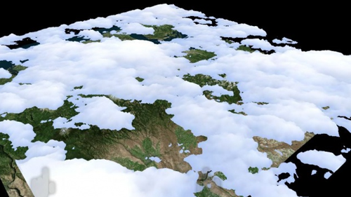

---
title: Sample apps
description: 
author: 
ms.author: 
ms.date: 2/28/2018
ms.topic: article
keywords: 
---

# Sample apps

Explore and experiment with sample app experiences created for developers by the Windows Mixed Reality team. These apps showcase our approach to designing great experiences and highlight the opportunities in UI, interaction, and integrated services.

 

<h3 class="text-title spacer-12-bottom" style="margin-top:15px;">
<a href="../periodic-table-of-the-elements.md">Periodic Table of the Elements</a>
</h3>Learn how to lay out an array of objects in 3D space with various surface types using an Object collection.

 

<h3 class="text-title spacer-12-bottom" style="margin-top:15px;">
<a href="../lunar-module.md">Lunar Module</a>
</h3>Learn how to extend Hololens&#39; base gestures with two-handed tracking and Xbox controller input.

 

<h3 class="text-title spacer-12-bottom" style="margin-top:15px;">
<a href="../galaxy-explorer.md">Galaxy Explorer</a>
</h3>The Galaxy Explorer Project is ready. You shared your ideas with the community, chose an app, watched a team build it, and can now get the source code.

 

<h3 class="text-title spacer-12-bottom" style="margin-top:15px;">
<a href="../case-study-scaling-datascape-across-devices-with-different-performance.md">Case study - Scaling Datascape across devices with different performance</a>
</h3>Datascape is a Windows Mixed Reality application developed internally at Microsoft where we focused on displaying weather data on top of terrain data.

## Page list

The following 4 pages are in this category.
* [Case study - Scaling Datascape across devices with different performance](../case-study-scaling-datascape-across-devices-with-different-performance.md)
* [Galaxy Explorer](../galaxy-explorer.md)
* [Lunar Module](../lunar-module.md)
* [Periodic Table of the Elements](../periodic-table-of-the-elements.md)