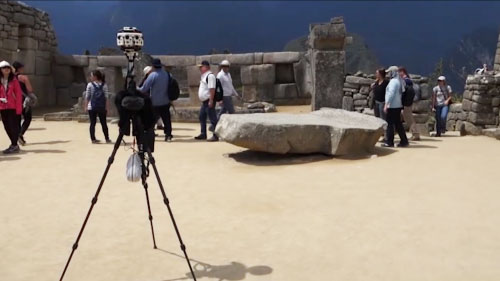

---
title: Style
description: 
author: 
ms.author: 
ms.date: 2/28/2018
ms.topic: article
keywords: 
---

# Style

Style helps digital elements coexist within a physical environment, creating delight for users while enhancing the usability of interactions. From the legibility of type, to the placement of sounds, to the scale and lighting of objects, attention to style can both refine and enrich an experience.

## Guidelines

 

<h3 class="text-title spacer-12-bottom" style="margin-top:15px;">
<a href="../color,-light-and-materials.md">Color, light and materials</a>
</h3>Designing content for mixed reality requires careful consideration of color, lighting, and materials for each of the visual assets used in your experience.

 

<h3 class="text-title spacer-12-bottom" style="margin-top:15px;">
<a href="../spatial-sound-design.md">Spatial sound design</a>
</h3> The more closely your app&#39;s sound behaves like it does in the real world, the more convincing and engaging your holograms will be.

 

<h3 class="text-title spacer-12-bottom" style="margin-top:15px;">
<a href="../typography.md">Typography</a>
</h3> Text is an important element for delivering information in your app experience. Just like typography on 2D screens, the goal is to be clear and readable.

 

<h3 class="text-title spacer-12-bottom" style="margin-top:15px;">
<a href="../scale.md">Scale</a>
</h3> A key to displaying content that looks realistic in holographic form is to mimic the visual statistics of the real world as closely as possible.

## Perspective

 

<h3 class="text-title spacer-12-bottom" style="margin-top:15px;">
<a href="../case-study-spatial-sound-design-for-holotour.md">Case study - Spatial sound design for HoloTour</a>
</h3>To create a truly immersive 3D virtual tour for Microsoft HoloLens, the panoramic videos and holographic scenery are only part of the formula.

## Page list

The following 5 pages are in this category.
* [Case study - Spatial sound design for HoloTour](../case-study-spatial-sound-design-for-holotour.md)
* [Color, light and materials](../color,-light-and-materials.md)
* [Scale](../scale.md)
* [Spatial sound design](../spatial-sound-design.md)
* [Typography](../typography.md)