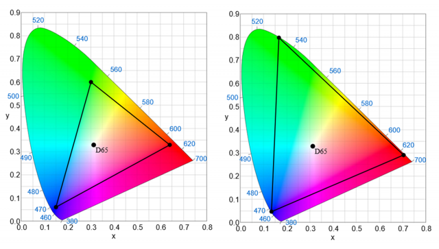
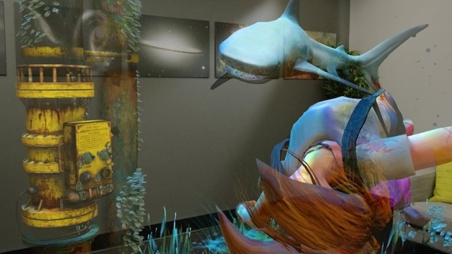

# Color, light and materials

Designing content for mixed reality requires careful consideration of color, lighting, and materials for each of the visual assets used in your experience. These decisions can be for both aesthetic purposes, like using light and material to set the tone of an immersive environment, and functional purposes, like using striking colors to alert users of an impending action. Each of these decisions must be weighed against the opportunities and constraints of your experience’s target device.

Below are guidelines specific to rendering assets on both immersive and holographic headsets. Many of these are closely tied to other technical areas and a list of related subjects can be found in the [See also](color,-light-and-materials.md#see-also) section at the end of this article.

## Rendering on immersive vs. holographic devices

Content rendered in immersive headsets will appear visually different when compared to content rendered in holographic headsets. While immersive headsets generally render content much as you would expect on a 2D screen, holographic headsets like HoloLens use color-sequential, see-through RGB displays to renders holograms.

Always take time to test your holographic experiences in a holographic headset. The appearance of content, even if it is built specifically for holographic devices, will differ as seen on secondary monitors, snapshots, and in spectator view. Remember to walk around experiences with a device, testing the lighting of holograms and observing from all sides (as well as from above and below) how your content is rendered. Be sure to test at a range of brightness settings on the device, as it is unlikely all users will share an assumed default, as well as a diverse set of lighting conditions.

## Fundamentals of rendering on holographic devices
* **Holographic devices have additive displays** – Holograms are created by adding light to the light from the real world – white will appear brightly, while black will appear transparent.
* **Colors impact varies with the user’s environment** – There are many diverse lighting conditions in a user’s room. Create content with appropriate levels of contrast to help with clarity.
* **Avoid dynamic lighting** – Holograms that are uniformly lit in holographic experiences are the most efficient. Using advanced, dynamic lighting will likely exceed the capabilities of mobile shaders.

## Designing with color

Due to the nature of additive displays, certain colors can appear different on holographic displays. Some colors will pop in lighting environments while others will appear as less impactful. Cool colors tend to recede into the background while warm colors jump to the foreground. Consider these factors as you explore color in your experiences:
* **Gamut** - HoloLens benefits from a "wide gamut" of color, conceptually similar to Adobe RGB. As a result, some colors can exhibit different qualities and representation in the device.
* **Gamma** - The brightness and contrast of the rendered image will vary between immersive and holographic devices. These device differences often appear to make dark areas of color and shadows, more or less bright.
* **Color separation** - Also called "color breakup" or "color fringing", color separation most commonly occurs with moving holograms (including cursor) when a user tracks objects with their eyes.
* **Color uniformity** - Typically holograms are rendered brightly enough so that they maintain color uniformity, regardless of the background. Large areas may become blotchy. Avoid large regions of bright, solid color.
* **Rendering light colors** - White appears very bright and should be used sparingly. For most cases, consider a white value around R 235 G 235 B 235. Large bright areas may cause user discomfort.

**Rendering dark colors**

Due to the nature of additive displays, dark colors appear transparent. A solid black object will appear no different from the real world. See Alpha channel below. To give the appearance of “black” try a very dark grey RGB value such as 16,16,16.

 
*Normal vs. wide color gamut*

## Technical considerations
* **Aliasing** - Be considerate of aliasing, jagged or “stair steps” where the edge of a hologram’s geometry meets the real world. Using textures with high detail can aggravate this effect. Textures should be mapped and filtering enabled. Consider fading the edges of holograms or adding a texture that creates a black edge border around objects. Avoid thin geometry where possible.
* **Alpha channel** - You must clear your alpha channel to fully transparent for any parts where you are not rendering a hologram. Leaving the alpha undefined leads to visual artifacts when taking images/videos from the device or with Spectator View.
* **Texture softening** - Since light is additive in holographic displays, it is best to avoid large regions of bright, solid color as they often do not produce the intended visual effect.

## Storytelling with light and color

Light and color can help make your holograms appear more naturally in a user's environment as well as offer guidance and help for the user. For holographic experiences, consider these factors as you explore lighting and color:
* **Vignetting** - A 'vignette' effect to darken materials can help focus the user's attention on the center of the field of view. This effect darkens the hologram's material at some radius from the user's gaze vector. Note that this is also effective when the user's views holograms from an oblique or glancing angle.
* **Emphasis** - Draw attention to objects or points of interaction by contrasting colors, brightness, and lighting. For a more detailed look at lighting methods in storytelling, see [Pixel Cinematography - A Lighting Approach for Computer Graphics](http://media.siggraph.org/education/cgsource/Archive/ConfereceCourses/S96/course30.pdf).

 
*Use of color to show emphasis for storytelling elements, shown here in a scene from [Fragments](http://www.microsoft.com/en-us/hololens/apps/fragments).*

## See also
* [Color Separation](hologram-stability.md#color-separation)
* [Holograms](hologram.md)
* [Microsoft Design Language - color](https://www.microsoft.com/en-us/design/color)
* [Universal Windows Platform - color](https://docs.microsoft.com/windows/uwp/style/color)
