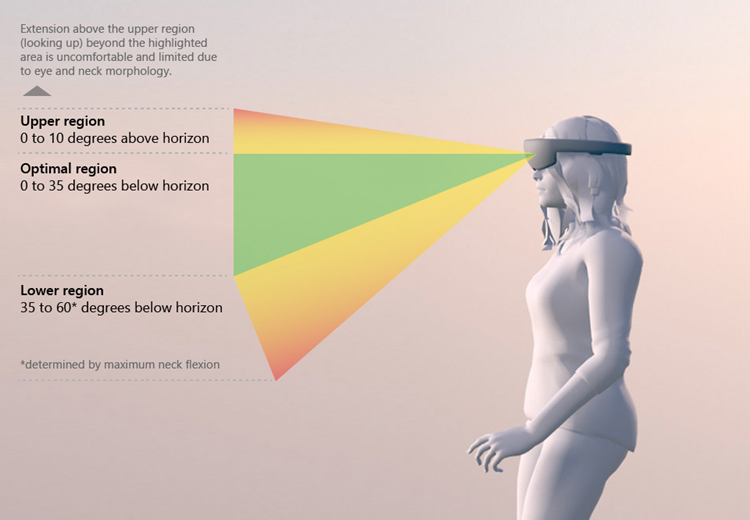

# Comfort

During natural viewing, the human visual system relies on multiple sources of information, or “cues,” to interpret 3D shapes and the relative positions of objects. Some cues rely only on a single eye (monocular cues), including [linear perspective](https://en.wikipedia.org/wiki/Perspective_(graphical)), [familiar size](https://en.wikipedia.org/wiki/Size#Perception_of_size), occlusion, [depth-of-field blur](https://en.wikipedia.org/wiki/Depth_of_field), and [accommodation](https://en.wikipedia.org/wiki/Accommodation_(eye)). Other cues rely on both eyes (binocular cues), and include [vergence](https://en.wikipedia.org/wiki/Vergence) (essentially the relative rotations of the eyes required to look at an object) and [binocular disparity](https://en.wikipedia.org/wiki/Stereopsis) (the pattern of differences between the projections of the scene on the back of the two eyes). To ensure maximum comfort on head-mounted displays, it’s important for designers and developers to create and present content in a way that mimics how these cues operate in the natural world. From a physical perspective, it is also important to design content that does not require fatiguing motions of the neck or arms. In this article, we’ll go over key considerations to keep in mind to achieve these goals.

## Vergence-accommodation conflict

To view objects clearly, humans must [accommodate](https://en.wikipedia.org/wiki/Accommodation_%28eye%29), or adjust their eyes’ focus, to the distance of the object. At the same time, the rotation of both eyes must [converge](https://en.wikipedia.org/wiki/Convergence_(eye)) to the object’s distance to avoid seeing double images. In natural viewing, vergence and accommodation are linked. When you view something near (e.g. a housefly close to your nose) your eyes cross and accommodate to a near point. Conversely, if you view something at optical infinity (roughly starting at 6m or farther for normal vision), your eyes’ lines of sight become parallel and your eyes’ lenses accommodate to infinity. 

In most head-mounted displays users will always accommodate to the focal distance of the display (to get a sharp image), but converge to the distance of the object of interest (to get a single image). When users accommodate and converge to different distances, the natural link between the two cues must be broken and this can lead to visual discomfort or fatigue.

 

>[!VIDEO https://www.youtube.com/embed/-606oZKLa_s]

### Guidance for holographic devices

HoloLens displays are fixed at an optical distance approximately 2.0m away from the user. Thus, users must always accommodate near 2.0m to maintain a clear image in the device. App developers can guide where users' eyes converge by placing content and holograms at various depths. Discomfort from the vergence-accommodation conflict can be avoided or minimized by keeping content to which users converge as close to 2.0m as possible (i.e. in a scene with lots of depth, place the areas of interest near 2.0m from the user when possible). When content cannot be placed near 2.0m, discomfort from the vergence-accommodation conflict is greatest when the user’s gaze switches back and forth between different distances. In other words, it is much more comfortable to look at a stationary hologram that stays 50cm away than to look at a hologram 50cm away that moves toward and away from you over time.

 
*Optimal distance for placing holograms from the user*

### Best practices for HoloLens (1st gen) and HoloLens 2

For maximum comfort, **the optimal zone for hologram placement is between 1.25m and 5m**. In every case, designers should attempt to structure content scenes to encourage users to interact 1m or farther away from the content (e.g. adjust [content size and default placement parameters](gaze-targeting.md)). 

Although content may occasionally need to be displayed closer than 1m, we recommend against ever presenting holograms closer than 40cm. Thus, we recommend starting to **fade out content at 40cm and placing a rendering clipping plane at 30cm** to avoid any nearer objects.

Objects that move in depth are more likely than stationary objects to produce discomfort due to the vergence-accommodation conflict. Similarly, requiring users to rapidly switch between near-focus and far-focus (e.g., because of a pop-up hologram requiring direct interaction) can cause visual discomfort and fatigue. Therefore, **extra care should be taken to minimize how often users are: viewing content that is moving in depth; or rapidly switching focus between near and far holograms**. 

### Additional considerations for HoloLens 2 and near interaction distances

When designing content for direct (near) interaction in HoloLens 2, or **in any applications where content must be placed closer than 1m, extra care should be taken to ensure user comfort**. The odds of discomfort due to the vergence-accommodation conflict increase exponentially with decreasing viewing distance. Additionally, users may experience increased bluriness when viewing content at near interaction distances, so we recommend testing content rendered both within the zone of optimal hologram placement as well as closer (less than 1.0m down to the clipping plane) to ensure it remains clear and comfortable to view. 

**We recommend creating a “depth budget” for apps based on the amount of time a user is expected to view content that is near (less than 1.0m) and moving in depth**. An example is to avoid placing the user in those situations more than 25% of the time. If the depth budget is exceeded, we recommend careful user testing to ensure it remains a comfortable experience. 

In general, we also recommend careful testing to ensure any interaction requirements (e.g., velocity of movement, reachability, etc.) at near interaction distances remain comfortable for users. 

### Guidance for immersive devices

For immersive devices, the guidance and best practices for HoloLens still applies, but the specific values for the Zone of Comfort are shifted depending on the focal distance to the display. In general, the focal distances to these displays are between 1.25m-2.5m. When in doubt, avoid rendering objects of interest too near to users and instead try to keep most content 1m or farther away.

## Interpupillary distance and vertical offset

When viewing digital content on head mounted displays (HMD), the position of a viewer’s eyes relative to the display position of digital content is critical. Specifically, both interpupillary distance ([IPD](https://en.wikipedia.org/wiki/Pupillary_distance)) and vertical offset (VO) are important for comfortable viewing of digital content in HMDs. 

IPD refers to the distance between the pupils, or centers, of an individual’s eyes. VO refers to the potential vertical offset of digital content shown to each eye relative to the horizontal axis of the viewer's eyes (notably, this is NOT the same as horizontal offset, or binocular disparity). Mis-matching either or both of these factors to an individual user can worsen the effects of discomfort caused by vergence-accommodation conflict, but it can even cause discomfort when V-A conflict is minimized (e.g., for content displayed at the 2.0m focal distance of the HoloLens). 

### Guidance for holographic devices

#### HoloLens (1st gen)

For HoloLens (1st gen), IPD is estimated and set during device [calibration](calibration.md). For new users to an already set up device, calibration must be run or IPD must be set manually. VO depends wholly on device fit. Specifically, to minimize VO, the device needs to be resting on a user’s head such that the displays are level with the axis of his/her eyes. 

#### HoloLens 2

For HoloLens 2, IPD is estimated and set during eye/device [calibration](calibration.md). For new users to an already set up device, calibration must be run to ensure IPD is set correctly. VO is accounted for automatically in HoloLens 2. 

### Guidance for immersive devices

Windows Mixed Reality immersive HMDs have no automatic calibration for IPD or VO. IPD can be set manually in software (under Mixed Reality Portal settings, see [calibration](calibration.md)), or some HMDs have a mechanical slider that allows the user to adjust the spacing of the lenses to a comfortable position (i.e., that roughly matches their IPD). 

## Rendering rates

Mixed reality apps are unique because users can move freely in the world and interact with virtual content like as though they were real objects. To maintain this impression, it is critical to render holograms so they appear stable in the world and animate smoothly. Rendering at a [minimum of 60 frames per second (FPS)](understanding-performance-for-mixed-reality.md) helps achieve this goal. There are some Mixed Reality devices that support rendering at framerates higher than 60 FPS and for these devices it is strongly recommended to render at the higher framerates to provide an optimal user experience.

**Diving deeper**

To draw holograms to look like [they're stable in the real or virtual world](hologram-stability.md), apps need to render images from the user's position. Since image rendering takes time, HoloLens and other Windows Mixed Reality devices predict where a user's head will be when the images are shown in the displays. This prediction algorithm is an approximation. Windows Mixed Reality algorithms and hardware adjust the rendered image to account for the discrepancy between the predicted head position and the actual head position. This process makes the image seen by the user appear as if it were rendered from the correct location, and holograms feel stable. The updates work best for small changes in head position, and they can't completely account for some rendered image differences, like those caused by motion-parallax.

**By rendering at a minimum framerate of 60 FPS, you are doing two things to help make stable holograms:**
1. Reducing the appearance of judder, which is characterized by uneven motion and double images. Faster hologram motion and lower render rates are associated with more pronounced judder. Therefore, striving to always maintain 60 FPS (or your device’s maximum render rate) will help avoid judder for moving holograms.
2. Minimizing the overall latency. In an engine with a game thread and a render thread running in lockstep, running at 30FPS can add 33.3ms of extra latency. By reducing latency, this decreases prediction error, and increases hologram stability.

**Performance analysis**

There are a variety of tools that can be used to benchmark your application frame rate such as:
* GPUView
* Visual Studio Graphics Debugger
* Profilers built into 3D engines such as the Frame Debugger in Unity

## Self-motion and user locomotion

The only limitation is the size of your physical space; if you want to allow users to move farther in the virtual environment than they can in their real rooms, then a form of purely virtual motion must be implemented. However, sustained virtual motion that does not match the user’s real, physical motion can often induce motion sickness. This outcome is due to the *visual cues* for self-motion from the *virtual world* conflicting with the [vestibular cues](https://en.wikipedia.org/wiki/Vestibular_system) for self-motion coming from the *real world*.

Fortunately, there are tips for implementing user locomotion that can help avoid the issue:
* Always put the user in control of their movements; unexpected self-motion is particularly problematic
* Humans are very sensitive to the direction of gravity. Therefore, non-user-initiated vertical motions especially should be avoided.

### Guidance for holographic devices

One method to allow the user to move to another location in a large virtual environment is to give the impression they're moving a small object in the scene. This effect can be achieved as follows:
   1. Provide an interface where the user can select a spot in the virtual environment where they want to move.
   2. Upon selection, shrink the scene rendering down to a disk around the desired spot.
   3. While keeping the spot selected, allow the user to move it as though it were a small object. The user can then move the selection close to their feet.
   4. Upon deselection, resume rendering the entire scene.

### Guidance for immersive devices

The preceding holographic device approach does not work as well in an immersive device because it requires the app to render a large black void or another default environment while moving the “disk.” This treatment disrupts one’s sense of immersion. One trick for user locomotion in an immersive headset is the “blink” approach. This implementation provides the user with control over their motion and gives a brief impression of movement, but makes it so brief that the user is less likely to feel disoriented by the purely virtual self-motion:
   1. Provide an interface where the user can select a spot in the virtual environment where they want to move.
   2. Upon selection, begin a very rapid simulated (100 m/s) motion towards that location while quickly fading out the rendering.
   3. Fade the rendering back in after finishing the translation.

## Heads-up displays

In first-person-shooter videogames, heads-up displays (HUDs) persistently present information such as player health, mini-maps, and inventories directly on the screen. HUDs work well to keep the player informed without intruding on the gameplay experience. In mixed reality experiences, HUDs have the potential to cause significant discomfort and must be adapted to the more immersive context. Specifically, HUDs that are rigidly locked to the user’s head orientation are likely to produce discomfort. If an app requires a HUD, we recommend *body* locking rather than head locking. This treatment can be implemented as a set of displays that immediately translate with the user, but do not rotate with the user’s head until a threshold of rotation is reached. Once that rotation is achieved, the HUD may reorient to present the information within the user’s field of view. Implementing 1:1 HUD rotation and translation relative to the user’s head motions should always be avoided.

## Text legibility

Optimal text legibility can help reduce eye strain and maintain user comfort, especially in applications or scenarios that require users to read while in an HMD. Text legibility depends on a variety of factors including various display properties (for example, pixel density, brightness, contrast), lens properties (for example, chromatic aberration), and text/font properties (for example, the specific font characteristics like weight, spacing, serifs, etc., color of font, color of background).  

In general, we recommend testing specific applications for legibility and making font sizes as large as is feasible for a comfortable experience. Below we offer general guidance as a starting point for development. Note that all font sizes are reported in degrees of [visual angle](https://en.wikipedia.org/wiki/Visual_angle) rather than specific physical sizes, which provides guidance for any distance within the zone of optimal hologram placement because it accounts for both the size of the text and the distance it appears to the viewer. 

### Guidance for holographic devices

For holographic devices, rendering black/dark text on a white/light background provides the most consistent contrast ratio because the background will occlude interference from the real-world behind the rendering. Rendering white/light text on a black/dark background allows more of real-world environment to show through, which may interfere with text legibility. 

#### HoloLens (1st gen)

The minimum legible font size (measuring from font baseline to ascender) is approximately 0.35° and a comfortable font size is at least approximately 0.5° for reading content presented at a distance of 2m to the user. 

#### HoloLens 2

The minimum legible font size (measuring from font baseline to ascender) is at least approximately: 
   - 0.4°-0.5° at 45cm (direct manipulation distance) 
   - 0.35°-0.4° at 2.0m
   
The comfortably legible font size (measuring from font baseline to ascender) is at least approximately: 
   - 0.65°-0.8° at 45cm (direct manipulation distance)
   - 0.6°-0.75° at 2.0m

Note that font sizes need to be slightly larger for text at direct manipulation distances because of the vergence-accommodation conflict described above (users' eyes are accommodating at a distance of 2.0m on the HoloLens display, so content rendered at, e.g., 45cm may appear more blurry to users). 

### Guidance for immersive devices

Immersive devices generally have higher contrast ratios due to the complete occlusion of the outside environment, but may have lower effective pixel density in part because of the magnification of the lenses in front of the displays. 

For Windows Mixed Reality immersive HMDs, the minimum legible vertical font size (measuring from font baseline to ascender) is approximately 0.7-0.9° and a comfortable vertical font size is approximately 1.0° for reading content presented at a distance of 2m to the user.

## Gaze direction

To avoid eye and neck strain content should be designed so that excessive eye and neck movements are avoided.
* **Avoid** gaze angles more than 10 degrees above the horizon (vertical movement)
* **Avoid** gaze angles more than 60 degrees below the horizon (vertical movement)
* **Avoid** neck rotations more than 45 degrees off-center (horizontal movement)

The optimal (resting) gaze angle is considered between 10-20 degrees below horizontal, as the head tends to tilt downward slightly, especially during activities.

 
*Allowable field of view (FOV) as determined by neck range of motion*

## Arm positions

Muscle fatigue can accumulate when users are expected to keep a hand raised throughout the duration of an experience. It can also be fatiguing to require the user to repeatedly make air tap gestures over long durations. We therefore recommend that experiences avoid requiring constant, repeated gesture input. This goal can be achieved by incorporating short breaks or offering a mixture of gesture and speech input to interact with the app.

## See also
* [Gaze](gaze.md)
* [Hologram stability](hologram-stability.md)
* [Instinctual interactions](interaction-fundamentals.md)
* [Holographic frame](holographic-frame.md)
* [Calibration](calibration.md)
