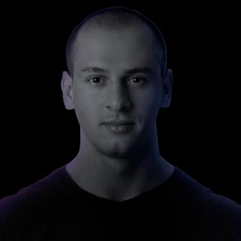
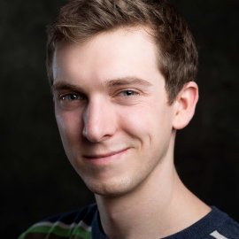
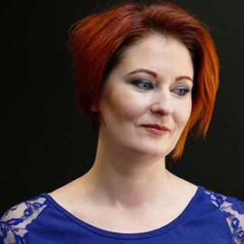
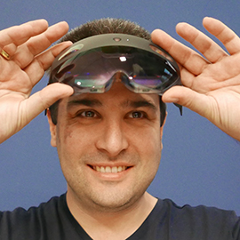

# Mixed Reality Community

At Microsoft, we believe that having access to strong communities is essential for the growth of developers, platforms, and ecosystems.  This page is meant to help developers find the many places they can take part in communities, as well as introduce you to some of the team and community members who are here to help you.

## Online Communities

|Community Name  |Link  |Description  |
|---------|---------|---------|
|**HoloDevelopers Slack**|[Join Here](https://aka.ms/holodevelopers)|The HoloDevelopers Slack was initially created as a place for developers exploring HoloLens to get to know one another, form friendships, build trust, and get help from each other.  It has grown into a thriving community that is still focused on these, but conversations that happen there cover the spectrum of mixed reality across many platforms, devices, and companies.|
|**Stack Overflow**|[MR Questions](https://stackoverflow.com/questions/tagged/windows-mixed-reality)||
|**Reddit WMR Headsets**|[WMR subreddit](https://www.reddit.com/r/WindowsMR/)|         |
|**Reddit HoloLens**|[HoloLens subreddit](https://www.reddit.com/r/HoloLens/)|         |

 

## Local Communities

|Community Name|Country|City|Link|
|---------|---------|---------|---------|
|**Chicago AWE Nite**|USA|Chicago|[Link](https://www.meetup.com/AWENiteChicago/)|
<!-- 
|Row2     |         |         |         |
|Row3     |         |         |         |
|Row4     |         |         |         |
|Row5     |         |         |         |
|Row6     |         |         |         |
-->

 

## Microsoft MR Developer Ecosystem Team

|||||
|---------|---------|---------|---------|
|<!--  --> **Daniel Escudero** *MR Academy Lead Designer*| |San Francisco, Ca|[Email](mailto:daescu@microsoft.com)|
|<!--  --> **Daniel Gonzalez** *Program Manager II*| |Redmond, Wa|[Email](mailto:dgonza@microsoft.com)|
|<!--  --> **Jane Fang** *Principal Program Manager Lead*| |San Francisco, Ca|[Email](mailto:jafang@microsoft.com)|
| **Jesse McCulloch** *Program Manager II*|Jesse is a Program Manager on the Mixed Reality Developer Ecosystem team at Microsoft. He is often found hanging out in developer Slack groups, on Twitter trying to keep up with everything going on in this rapidly growing space, or in a big metal tube flying through the air on his way to engage with developers in the real world.|Redmond, Wa|[Email](mailto:jemccull@microsoft.com)|
|<!--  --> **Jo Ryall** *Head of Marketing, SF Academy*| |San Francisco, Ca|[Email](mailto:joryal@microsoft.com)|
| **Nick Klingensmith** *MR Academy Lead Engineer*|Nick is an experienced game developer specializing in tool development, graphics programming, MR, and Unity! With over 100 published games, he's worked on small arcade games, mobile high fidelity GPU pushing titles, all the way to massive networked social games. The tools he's published on the Unity Asset Store are also used in thousands of games, on just about every modern platform imaginable. Nick has collected most of the official Unity certifications, and also helped write them. Nick currently works for Microsoft as the lead engineer on the Mixed Reality Academy team in San Francisco.|San Francisco, Ca|[Email](mailto:niklinge@microsoft.com)|

 

## Azure Cloud Advocate Spatial Computing Team

The Azure Cloud Advocates charter is to help every technologist on the planet succeed, be they students or those working in enterprises or startups. They engage in outreach to developers and others in the software ecosystem, all designed to further technical education and proficiency with the Microsoft Cloud + AI platform.

The members listed here are the Cloud Advocates that work on the Spatial Computing team within the Cloud Advocate organization. They work extremely close with the Mixed Reality Developer Ecosystem team, and it's often hard to tell where one team stops, and the other one starts.

More info coming soon....
<!--
|||||
|---------|---------|---------|---------|
| **Adi Polak** *Title*|Bio|Location|[Email](mailto:test@microsoft.com)|
| **April Speight** *Title*|Bio|Location|[Email](mailto:test@microsoft.com)|
| **Aysegul Yonet** *Title*|Bio|Location|[Email](mailto:test@microsoft.com)|
| **Cassie Breviu** *Title*|Bio|Location|[Email](mailto:test@microsoft.com)|
| **Chris Noring** *Title*|Bio|Location|[Email](mailto:test@microsoft.com)|
| **Christopher Maneu** *Title*|Bio|Location|[Email](mailto:test@microsoft.com)|
| **Em Lazer-Walker** *Title*|Bio|Location|[Email](mailto:test@microsoft.com)|
| **Karissa Peth** *Title*|Bio|Location|[Email](mailto:test@microsoft.com)|
| **Madoka Chiyoda** *Title*|Bio|Location|[Email](mailto:test@microsoft.com)|
| **Thomas Lewis** *Title*|Bio|Location|[Email](mailto:test@microsoft.com)|
| **Vanessa Diaz** *Title*|Bio|Location|[Email](mailto:test@microsoft.com)|
-->

 

## Microsoft Mixed Reality MVP's

Microsoft Most Valuable Professionals, or MVPs, are technology experts who passionately share their knowledge with the community. They are always on the "bleeding edge" and have an unstoppable urge to get their hands on new, exciting technologies. They have very deep knowledge of Microsoft products and services, while also being able to bring together diverse platforms, products and solutions, to solve real world problems. MVPs make up a global community of over 4,000 technical experts and community leaders across 90 countries/regions and are driven by their passion, community spirit, and quest for knowledge. Above all and in addition to their amazing technical abilities, MVPs are always willing to help others - that's what sets them apart.

||||
|---------|---------|---------|
| **Aleksandr Kudishov** *Russia*|MVP focused on Game Development & Windows Development, VR/AR/MR. Game Producer, Tech Evangelist, Holographic Developer, MSP Lead of Game-Development.|[Email](mailto:draconifore@gmail.com)|
| **Alexander Meijers** *The Netherlands, Rijswijk*|A professional who inspires, motivates and educates businesses on how to leverage emerging technologies using Virtual, Augmented and Mixed Reality in their journey to digital innovation. He has a strong background on SharePoint, Office 365 and Microsoft Azure and is working with machine learning, artificial intelligence and cognitive services.  Primarily focused on manufacturing, construction, industry, logistics and maritime/offshore, his goal is helping businesses to achieve more on creating, improving, smartening and shortening of business processes by using services, apps and devices like HoloLens and Kinect for Azure.|[Email](mailto:alexander@appzinside.com)|
| **Bruno Anjos** *Brazil*|Innovation Manager, work at management and architecture of Digital Pages innovation projects, with expertise for XR - Augmented Reality, Mixed and Virtual Reality platforms. Microsoft MVP in Mixed Reality 2020-2021 in Mixed Reality, I work as an expert in the development and planning of Mixed Reality solutions - focusing on Microsoft HoloLens. Experience with game and application development, as well as asset creation and multimedia content.|[Email](mailto:brunof.anjos@outlook.com)|
| **Dave Smits** *Amersfoort, The Netherlands*|Dave Smits is Microsoft MVP since 2014 and working with the HoloLens since the first version launched. Did several projects for customers from starting with simple models to applications that included motion tracking sensors to be used on holograms.|[Email](mailto:dave@familie-smits.com)|
| **Eric Provencher** *Montreal, QC, Canada*|Eric is a Senior Mixed Reality Framework and UX developer at CAE, one of the first Microsoft Mixed Reality Partners, and a wave 1 HoloLens adopter. His main roles are leading the architecture and development of an internal cross-platform development framework very similar to the MRTK, as well as developing and maintaining new and existing healthcare simulation and training applications.He mainly build apps in Unity, in VR (Oculus Quest), AR (HoloLens 1&2), as well as screen-based (WebGL + iOS/Android).|[Email](mailto:erproven@gmail.com)|
| **Fabrice Barbin** *France*|Entrepreneur, innovation and technology enthusiast for years, Fabrice is CEO at [SYNERGIZ](http://www.synergiz.com), Microsoft Mixed Reality Partner, pioneer of HoloLens use cases in France. Actively promoting Microsoft technologies as speaker, rewarded MVP for 12 years, Fabrice is interested by a large set of products: HoloLens, Kinect4Azure, IoT, Surface Hub, Ink, Touch, IA, Machine Learning, Cognitive Services, Azure|[Email](mailto:fbarbin@synergiz.com)|
| **Gianni Rosa Gallina** *Italy*|Gianni is a Microsoft MVP since 2011, focusing on emerging technologies, AI and Virtual/Augmented/Mixed Reality since 2013. Currently he is R&D Senior Software Engineer in Deltatre's Innovation Lab, designing and prototyping next generation solutions for sport related experiences and services, from VR/MR apps to end-to-end Azure architectures and video workflows, passing by Cognitive Services, AI and much more. Besides that, he's an active member of the local community “Torino Technologies Group” (TTG), organizer and trainer for Coding Gym Torino monthly meetups, Pluralsight online courses author, publish articles on his blog and he's speaker in national and international tech conferences and events.|[Email](mailto:giannishub@hotmail.com)|
| **Jessica Engstrom** *Stockholm, Sweden*|Microsoft MVP - Windows Platform Development, Public speaker, UX, Bots, and Mixed Reality. Coding After Work Podcast co-host. User group and conference organizer|[Email](mailto:jessica@catoholic.se)|
| **Jimmy Engstrom** *Stockholm, Sweden*|Microsoft MVP - Windows Platform Development, speaker, Blazor, Mixed Reality, HoloLens, and Windows developer. Coding After Work Podcast co-host. User group and conference organizer|[Email](mailto:jimmy@engstromjimmy.se)|
| **Joost van Schaik** *Amersfoort, The Netherlands*|I am not the one to paint big stories and wide vistas in the MR space – I call myself a developer++ and I make things happen. My primary claims to ‘fame’ are my blog and my apps – one of the very first indie apps for both HoloLens 1 and 2 available from the Store are mine. Look for publisher “LocalJoost” and see for yourself. In the past three years I have been involved in quite some commercial projects too. I consider myself a community person – I love to share my knowledge, both on my blog and in person.|[Email](mailto:joostvanschaik@outlook.com.)|
| **Lance Larsen** *Madison, WI, USA*|Lance Larsen is a Microsoft MVP, a founder and the Chief Visionary Officer (CVO) of [HOLOSOFT](https://www.HoloSoft.com) as well avid Community Speaker -and- president of [MADdotNET](https://www.MADdotNET.com), Madison Wisconsin's .NET developer community!  Additionally, he's one of the original organizers of That Conference - the Summer Camp for Geeks.  Most proud to have focused on "Growing-up Geek" talks to raise the next generation of kids on technology. Technology focused on "Hololens / Mixed Reality", "VR / AR for industry", "Azure Spatial Anchors", "Azure Kinect", "Unity Development" and much more...|[Email](mailto:lance@lancelarsen.com)|
| **Lance McCarthy** *Boston, MA, USA*|Lance McCarthy is an exceptional community leader with an acute expertise for all things .NET and C# (especially on the XAML stack) as well as HoloLens/Mixed Reality applications.  Lance is very helpful online, guiding and answering questions from Microsoft developers on Twitter as @lancewmccarthy and blogs at DVLUP.com. He organizes & hosts events in the Boston area such as user group nights, mini-code camps and full hackathons.|[Email](mailto:lance@dvlup.com)|
| **Philipp Bauknecht** *Pforzheim, Germany*|Hi, I’m Philipp Bauknecht from Germany, Founder & CEO of medialesson GmbH an early adopter of HoloLens and member of the Microsoft Mixed Reality Partner Program. I help my customers design, architect, build and operate modern, beautiful and useable Apps that run on any platform as a consultant, architect and trainer together with my team of highly skilled designers and developers.  Besides I teach Interface Design at the Pforzheim University and engage with the community as a speaker at conferences and user groups and organizer of code camps and hackathons.  I was selected as one of the one hundred creative talents by the European Union and the Committee of the Regions. I’m a Microsoft Most Valuable Professional (MVP) for Windows Development since 2013. In 2017 I was accepted into the Microsoft Regional Director Program.|[Email](mailto:bauknecht@medialesson.de)|
| **René Schulte** *Dresden, Germany*|René Schulte is Director of Global Innovation at Valorem Reply working with teams across the globe on emerging technologies like the revolutionary 3D volumetric video telepresence solution HoloBeam and the AR Cloud enabling large, cross-platform user experiences with persistence.  He is a creative thought leader with a passion for UX and deep technical knowledge from more than 10 years in VR/AR/MR/XR technology and 3D programming, developing for the Microsoft HoloLens since 2015, was featured on Forbes and is listed as VR/AR/MR dev influencer. He also coded AI deep learning neural networks before it was cool and is leveraging modern AI to empower humans.  He is a frequent keynote and session speaker and panelist at conferences like //build, Unite, Vision VR/AR Summit, VRDC (GDC), AWE, ESA and more. Blogs about many topics. He also created popular open source libraries like WriteableBitmapEx and the AR library SLARToolKit.  He was honored several times for his dev community work with the Microsoft MVP award, recognized as Microsoft Regional Director and Global Advisory Board member for the VR/AR Association.  He lives in Dresden, Germany with his wife and their 5 children.|[Email](mailto:schulte.rene@outlook.com)|
| **Takahiro Miyaura** *Nara, Japan*|I'm working as a software engineer,and developer in IT industry . In particular, I've been doing research XR(VR/AR/MR etc.. ) technologies,and various technologies(AI, IoT etc...) that can take advantage of XR.|[Email](mailto:cafe.kobe@gmail.com)|
| **Tamás Deme** *Budapest, Hungary*|Tamás is a mixed reality engineer working at the Atlanta based VIM, where he develops solutions for devices ranging from servers to a headset that shows you holograms. He’s a 5 times Microsoft MVP in Windows Development, interested in open source projects, teaching and mentoring. You can find him online at [https://tomzorz.me](https://tomzorz.me) or on twitter at [https://twitter.com/tomzorz_](https://twitter.com/tomzorz_).|[Email](mailto:mixedreality@tomzorz.me)|
| **Tatsuro Ueda** *Mie, Japan*|MR Educator of Physics in 5 countries including Afrika, President of Feel Physics|[Email](mailto:tatsuro.ueda@feel-physics.jp)|
