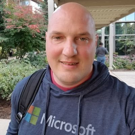
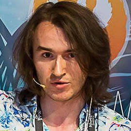

# Mixed Reality Community

At Microsoft, we believe that having access to strong communities is essential for the growth of developers, platforms, and ecosystems.  This page is meant to help developers find the many places they can take part in communities, as well as introduce you to some of the team and community members who are here to help you.

## Online Communities

|Community Name  |Link  |Description  |
|---------|---------|---------|
|**HoloDevelopers Slack**|[Join Here](https://aka.ms/holodevelopers)|The HoloDevelopers Slack was initially created as a place for developers exploring HoloLens to get to know one another, form friendships, build trust, and get help from each other.  It has grown into a thriving community that is still focused on these, but conversations that happen there cover the spectrum of mixed reality across many platforms, devices, and companies.|
|**Stack Overflow**|[MR Questions](https://stackoverflow.com/questions/tagged/windows-mixed-reality)||
|**Reddit WMR Headsets**|[WMR subreddit](https://www.reddit.com/r/WindowsMR/)|         |
|**Reddit HoloLens**|[HoloLens subreddit](https://www.reddit.com/r/HoloLens/)|         |

 

## Local Communities

|Community Name|Country|City|Link|
|---------|---------|---------|---------|
|**Chicago AWE Nite**|USA|Chicago|[Link](https://www.meetup.com/AWENiteChicago/)|
<!-- 
|Row2     |         |         |         |
|Row3     |         |         |         |
|Row4     |         |         |         |
|Row5     |         |         |         |
|Row6     |         |         |         |
-->

 

## Microsoft MR Developer Ecosystem Team

|||||||
|---------|---------|---------|---------|---------|---------|
|<!--  -->|**Daniel Escudero**|*MR Academy Lead Designer*|Bio|San Francisco, Ca|[Email](mailto:daescu@microsoft.com)|
|<!--  -->|**Daniel Gonzalez**|*Program Manager II*|Bio|Redmond, Wa|[Email](mailto:dgonza@microsoft.com)|
|<!--  -->|**Jane Fang**|*Principal Program Manager Lead*|Bio|San Francisco, Ca|[Email](mailto:jafang@microsoft.com)|
||**Jesse McCulloch**|*Program Manager II*|Jesse is a Program Manager on the Mixed Reality Developer Ecosystem team at Microsoft. He is often found hanging out in developer Slack groups, on Twitter trying to keep up with everything going on in this rapidly growing space, or in a big metal tube flying through the air on his way to engage with developers in the real world.|Redmond, Wa|[Email](mailto:jemccull@microsoft.com)|
|<!--  -->|**Jo Ryall**|*Head of Marketing, SF Academy*|Bio|San Francisco, Ca|[Email](mailto:joryal@microsoft.com)|
|<!--  -->|**Nick Klingensmith**|*MR Academy Lead Engineer*|Bio|San Francisco, Ca|[Email](mailto:niklinge@microsoft.com)|

 

## Azure Cloud Advocate Spatial Computing Team

The Azure Cloud Advocates charter is to help every technologist on the planet succeed, be they students or those working in enterprises or startups. They engage in outreach to developers and others in the software ecosystem, all designed to further technical education and proficiency with the Microsoft Cloud + AI platform.

The members listed here are the Cloud Advocates that work on the Spatial Computing team within the Cloud Advocate organization. They work extremely close with the Mixed Reality Developer Ecosystem team, and it's often hard to tell where one team stops, and the other one starts.

More info coming soon....
<!--
|||||||
|---------|---------|---------|---------|---------|---------|
||**Adi Polak**|*Title*|Bio|Location|[Email](mailto:test@microsoft.com)|
||**April Speight**|*Title*|Bio|Location|[Email](mailto:test@microsoft.com)|
||**Aysegul Yonet**|*Title*|Bio|Location|[Email](mailto:test@microsoft.com)|
||**Cassie Breviu**|*Title*|Bio|Location|[Email](mailto:test@microsoft.com)|
||**Chris Noring**|*Title*|Bio|Location|[Email](mailto:test@microsoft.com)|
||**Christopher Maneu**|*Title*|Bio|Location|[Email](mailto:test@microsoft.com)|
||**Em Lazer-Walker**|*Title*|Bio|Location|[Email](mailto:test@microsoft.com)|
||**Karissa Peth**|*Title*|Bio|Location|[Email](mailto:test@microsoft.com)|
||**Madoka Chiyoda**|*Title*|Bio|Location|[Email](mailto:test@microsoft.com)|
||**Thomas Lewis**|*Title*|Bio|Location|[Email](mailto:test@microsoft.com)|
||**Vanessa Diaz**|*Title*|Bio|Location|[Email](mailto:test@microsoft.com)|
-->

 

## Microsoft Mixed Reality MVP's

Microsoft Most Valuable Professionals, or MVPs, are technology experts who passionately share their knowledge with the community. They are always on the "bleeding edge" and have an unstoppable urge to get their hands on new, exciting technologies. They have very deep knowledge of Microsoft products and services, while also being able to bring together diverse platforms, products and solutions, to solve real world problems. MVPs make up a global community of over 4,000 technical experts and community leaders across 90 countries/regions and are driven by their passion, community spirit, and quest for knowledge. Above all and in addition to their amazing technical abilities, MVPs are always willing to help others - that's what sets them apart.

||||||
|---------|---------|---------|---------|---------|
||**Aleksandr Kudishov**|MVP focused on Game Development & Windows Development, VR/AR/MR. Game Producer, Tech Evangelist, Holographic Developer, MSP Lead of Game-Development. Developer and good man ;)|Russia|[Email](mailto:draconifore@gmail.com)|
||**Eric Provencher**|Eric is a Senior Mixed Reality Framework and UX developer at CAE, one of the first Microsoft Mixed Reality Partners, and a wave 1 HoloLens adopter. His main roles are leading the architecture and development of an internal cross-platform development framework very similar to the MRTK, as well as developing and maintaining new and existing healthcare simulation and training applications.He mainly build apps in Unity, in VR (Oculus Quest), AR (HoloLens 1&2), as well as screen-based (WebGL + iOS/Android).|Montreal, QC, Canada|[Email](mailto:erproven@gmail.com)|
||**Tamás Deme**|Tamás is a mixed reality engineer working at the Atlanta based VIM, where he develops solutions for devices ranging from servers to a headset that shows you holograms. He’s a 5 times Microsoft MVP in Windows Development, interested in open source projects, teaching and mentoring. You can find him online at [https://tomzorz.me](https://tomzorz.me) or on twitter at [https://twitter.com/tomzorz_](https://twitter.com/tomzorz_).|Budapest, Hungary|[Email](mailto:mixedreality@tomzorz.me)|

 
