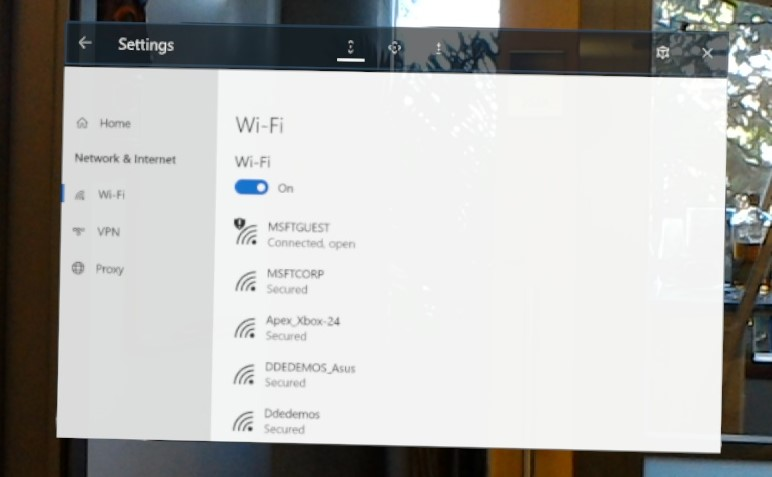

# Connecting to Wi-Fi on HoloLens

HoloLens contains a 802.11ac-capable, 2x2 Wi-Fi radio. Connecting HoloLens to a Wi-Fi network is similar to connecting a Windows 10 Desktop or Mobile device to a Wi-Fi network.

## Connecting to a Wi-Fi network on HoloLens

1. [Bloom](gestures.md#bloom) to the **Start** menu.
2. Select the **Settings** app from Start or from the **All Apps** list on the right of the Start menu.
3. The **Settings** app will be auto-placed in front of you.
4. Select **Network & Internet**.
5. Make sure Wi-Fi is turned on.
6. Select a Wi-Fi network from the list.
7. Type in the Wi-Fi network password (if needed).

## Disabling Wi-Fi on HoloLens

### Using the Settings app on HoloLens

1. [Bloom](gestures.md#bloom) to the **Start** menu.
2. Select the **Settings** app from Start or from the **All Apps** list on the right of the Start menu.
3. The **Settings** app will be auto-placed in front of you.
4. Select **Network & Internet**.
5. Select the Wi-Fi slider switch to move it to the "Off" position. This will turn off the RF components of the Wi-Fi radio and disable all Wi-Fi functionality on HoloLens. 

    >[!WARNING]
    >HoloLens will not be able to automatically load your [spaces](environment-considerations-for-hololens.md#WiFi fingerprint considerations) when the Wi-Fi radio is disabled.
    
6. Move the slider switch to the "On" position to turn on the Wi-Fi radio and restore Wi-Fi functionality on Microsoft HoloLens. The selected Wi-Fi radio state ("On" of "Off") will persist across reboots.

## How to confirm you are connected to a Wi-Fi network

1. [Bloom](gestures.md#bloom) to bring up the **Start** menu.
2. Look at the top left of the Start menu for Wi-Fi status. The state of Wi-Fi and the SSID of the connected network will be shown.

## Identifying the IP Address of your HoloLens on the Wi-Fi network

### Using the Settings app

1. [Bloom](gestures.md#bloom) to the **Start** menu.
2. Select the **Settings** app from Start or from the **All Apps** list on the right of the Start menu.
3. The **Settings** app will be auto-placed in front of you.
4. Select **Network & Internet**.
5. Scroll down to beneath the list of available Wi-Fi networks and select **Hardware properties**.

    

The IP address will be shown next to **IPv4 address**.

### Using Cortana

Say "*Hey Cortana, What's my IP address?*" and Cortana will display and read out your IP address.

### Using Windows Device Portal

1. Open the [device portal](using-the-windows-device-portal.md#networking) in a web browser on your PC.
2. Navigate to the **Networking** section.

Your IP address and other network information will be displayed there. This method allows for easy copy and paste of the IP address on your development PC.
