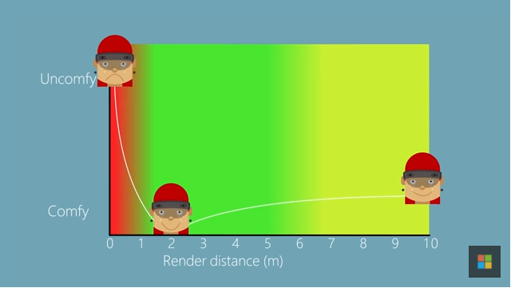
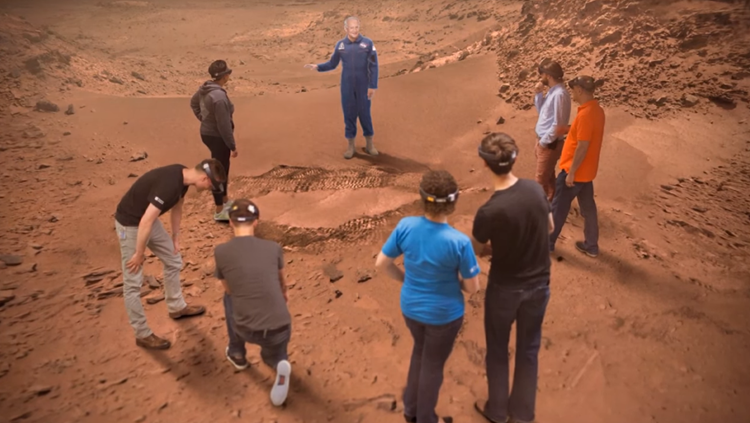
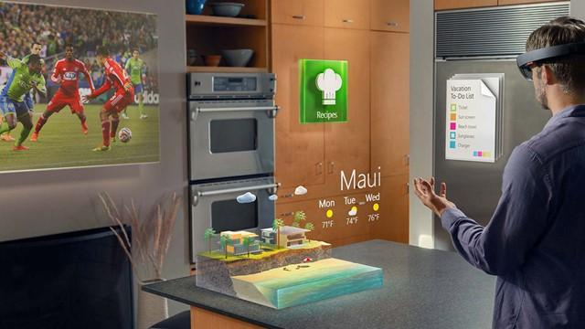
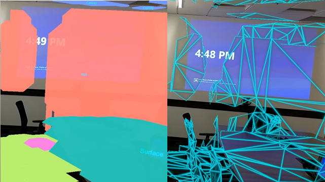

# Core concepts overview

Before diving into the design your experience, it's helpful to understand a few core concepts. Each topic below is a underlying factor that fundamentally affects and contributes to the quality of the mixed reality experience you are creating for your user. 

:::row:::
    :::column:::
       
        **[Comfort](comfort.md)**
    :::column-end:::
    :::column:::
       
        **[Holographic frame](holographic-frame.md)**
    :::column-end:::
    :::column:::
       
        **[Types of mixed reality apps](types-of-mixed-reality-apps.md)**
    :::column-end:::
:::row-end:::

:::row:::
    :::column:::
       
        **[App model](app-model.md)**
    :::column-end:::
    :::column:::
        
        **[Coordinate systems](coordinate-systems.md)**
    :::column-end:::
    :::column:::
        
        **[Scene understanding](scene-understanding.md)**
    :::column-end:::
:::row-end:::

:::row:::
    :::column:::
       
        **[Spatial mapping](spatial-mapping.md)**
    :::column-end:::
    :::column:::
       
        **[Room scan visualization](room-scan-visualization.md)**
    :::column-end:::
    :::column:::
       
        **[Spatial anchors](spatial-anchors.md)**
    :::column-end:::
:::row-end:::

 

 

