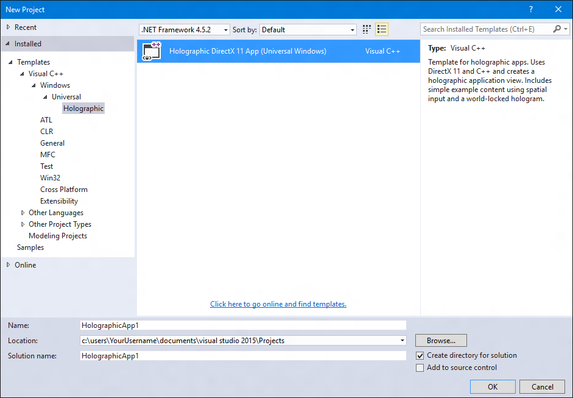

# Creating a holographic DirectX project

A holographic app can be a [Universal Windows Platform app](https://msdn.microsoft.com/library/windows/apps/dn894631.aspx) or a Win32 app.

The DirectX 11 holographic UWP app template is much like the DirectX 11 UWP app template; it includes a program loop (or "game loop"), a **DeviceResources** class to manage the Direct3D device and context, and a simplified content renderer class. It also has an [IFrameworkView](https://msdn.microsoft.com/library/windows/apps/windows.applicationmodel.core.iframeworkview.aspx), just like any other UWP app.

The mixed reality app, however, has some additional capabilities that aren't present in a typical D3D11 UWP app. The Windows Holographic app template is able to:
* Handle Direct3D device resources associated with holographic cameras.
* Retrieve camera back buffers from the system.
* Handle [gaze](gaze.md) input, and recognize a simple [gesture](gestures.md).
* Go into full-screen stereo rendering mode.

## How do I get started?

First [install the tools](install-the-tools.md), and then follow the instructions on downloading Visual Studio 2017 and the Microsoft HoloLens emulator. The holographic app templates are included in the same installer as the Microsoft HoloLens emulator. Also ensure that the option to install the templates is selected before installing.

Now you can create your DirectX 11 Windows Mixed Reality App! Note, to remove the sample content, comment out the **DRAW_SAMPLE_CONTENT** preprocessor directive in *pch.h*.

## Creating the project

>[!NOTE]
>The rest of the instructions in this article describe how to create a UWP holographic project using C++/CX. C++/WinRT sample code for both UWP and Win32 projects is coming soon. To create a Win32 holographic project, skip to the [Creating a Win32 project](#creating-a-win32-project) section.

Once the tools are installed you can then create a holographic DirectX project. To create a new project:
1. Start **Visual Studio**.
2. From the **File** menu, point to **New** and select **Project** from the context menu. The **New Project** dialog opens.
3. Expand **Installed** on the left and expand either the **Visual C#** or **Visual C++** language node.
4. Navigate to the **Windows Universal > Holographic** node and select **Holographic DirectX 11 App (Universal Windows)**.
5. Fill in the **Name** and **Location** text boxes, and click or tap **OK**. The holographic app project is created.

<br>
*Holographic app project template in Visual Studio*

Review [Using Visual Studio to deploy and debug](using-visual-studio.md) for information on how to build and deploy the sample to your HoloLens, PC with immersive device attached, or an emulator.

The project template shows how to create a world-locked cube that's placed two meters from the user. The user can [air-tap](gestures.md#air-tap), or press a button on the controller, to place the cube in a different position that's specified by the user's [gaze](gaze.md). You can modify this project to create any mixed reality app.

Note that if your holographic C# project did not start from the Windows Holographic app template, you will need to copy the ms.fxcompile.targets file from a Windows Mixed Reality C# template project and import it in your .csproj file in order to compile HLSL files that you add to your project.

## Holographic app entry point

Your holographic app starts in the **main** function in AppView.cpp. The **main** function creates the app's [IFrameworkView](https://msdn.microsoft.com/library/windows/apps/windows.applicationmodel.core.iframeworkview.aspx) and starts the [CoreApplication](https://msdn.microsoft.com/library/windows/apps/windows.applicationmodel.core.coreapplication.aspx) with it.


From **AppView.cpp**

```cpp
// The main function is only used to initialize our IFrameworkView class.
// Under most circumstances, you should not need to modify this function.
[Platform::MTAThread]
int main(Platform::Array<Platform::String^>^)
{
    AppViewSource^ appViewSource = ref new ::AppViewSource();
    CoreApplication::Run(appViewSource);
    return 0;
}
```

From that point on, the AppView class handles interaction with Windows basic input events, CoreWindow events and messaging, and so on. It will also create the HolographicSpace used by your app.

## Render holographic content

The project's **Content** folder contains classes for rendering holograms in the [holographic space](getting-a-holographicspace.md). The default hologram in the template is a spinning cube that's placed two meters away from the user. Drawing this cube is implemented in **SpinningCubeRenderer.cpp**, which has these key methods:

|  Method  |  Explanation | 
|----------|----------|
|  `CreateDeviceDependentResources` |  Loads shaders and creates the cube mesh. | 
|  `PositionHologram` |  Places the hologram at the location specified by the provided [SpatialPointerPose](https://msdn.microsoft.com/library/windows/apps/windows.ui.input.spatial.spatialpointerpose.aspx). | 
|  `Update` |  Rotates the cube, and sets the model matrix. | 
|  `Render` |  Renders a frame using the vertex and pixel shaders. | 

The **Shaders** folder contains four default shader implementations:

|  Shader  |  Explanation | 
|----------|----------|
|  `GeometryShader.hlsl` |  A pass-through that leaves the geometry unmodified. | 
|  `PixelShader.hlsl` |  Passes through the color data. The color data is interpolated and assigned to a pixel at the rasterization step. | 
|  `VertexShader.hlsl` |  Simple shader to do vertex processing on the GPU. | 
|  `VPRTVertexShader.hlsl` |  Simple shader to do vertex processing on the GPU, that is optimized for Windows Mixed Reality stereo rendering. | 

The shaders are compiled when the project is built, and they're loaded in the **SpinningCubeRenderer::CreateDeviceDependentResources** method.

## Interact with your holograms

User input is processed in the **SpatialInputHandler** class, which gets a [SpatialInteractionManager](https://msdn.microsoft.com/library/windows/apps/windows.ui.input.spatial.spatialinteractionmanager.aspx) instance and subscribes to the [SourcePressed](https://msdn.microsoft.com/library/windows/apps/windows.ui.input.spatial.spatialinteractionmanager.sourcepressed.aspx) event. This enables detecting the air-tap gesture and other spatial input events.

## Update holographic content

Your mixed reality app updates in a game loop, which by default is implemented in the **Update** method in `Main.cpp`. The **Update** method updates scene objects, like the spinning cube, and returns a [HolographicFrame](https://msdn.microsoft.com/library/windows/apps/windows.graphics.holographic.holographicframe.aspx) object that is used to get up-to-date view and projection matrices and to present the swap chain.

The **Render** method in `Main.cpp` takes the [HolographicFrame](https://msdn.microsoft.com/library/windows/apps/windows.graphics.holographic.holographicframe.aspx) and renders the current frame to each holographic camera, according to the current app and spatial positioning state.

## Creating a Win32 project

>[!NOTE]
>A full Win32 holographic project template is coming soon.

To create a Win32 instead of UWP holographic project, you can adapt the standard Win32 desktop project template by following these steps:
1. Start **Visual Studio**.
2. From the **File** menu, point to **New** and select **Project** from the context menu. The **New Project** dialog opens.
3. Expand **Installed** on the left and expand the **Visual C++** language node.
4. Navigate to the **Windows Desktop** node and select **Windows Desktop Application**.
5. Fill in the **Name** and **Location** text boxes, and click or tap **OK**. The Win32 app project is created.

You can now adapt this Win32 desktop application to make its primary HWND holographic instead.  To do so, follow the Win32 instructions on the [Getting a HolographicSpace](getting-a-holographicspace.md) page to get a HolographicSpace for your main HWND.  After that, you'll use the HolographicSpace in the same way in your Win32 project as you would in a UWP project.

## See also
* [Getting a HolographicSpace](getting-a-holographicspace.md)
* [HolographicSpace](https://msdn.microsoft.com/library/windows/apps/windows.graphics.holographic.holographicspace.aspx)
* [Rendering in DirectX](rendering-in-directx.md)
* [Using Visual Studio to deploy and debug](using-visual-studio.md)
* [Using the HoloLens emulator](using-the-hololens-emulator.md)
* [Using XAML with holographic DirectX apps](using-xaml-with-holographic-directx-apps.md)
