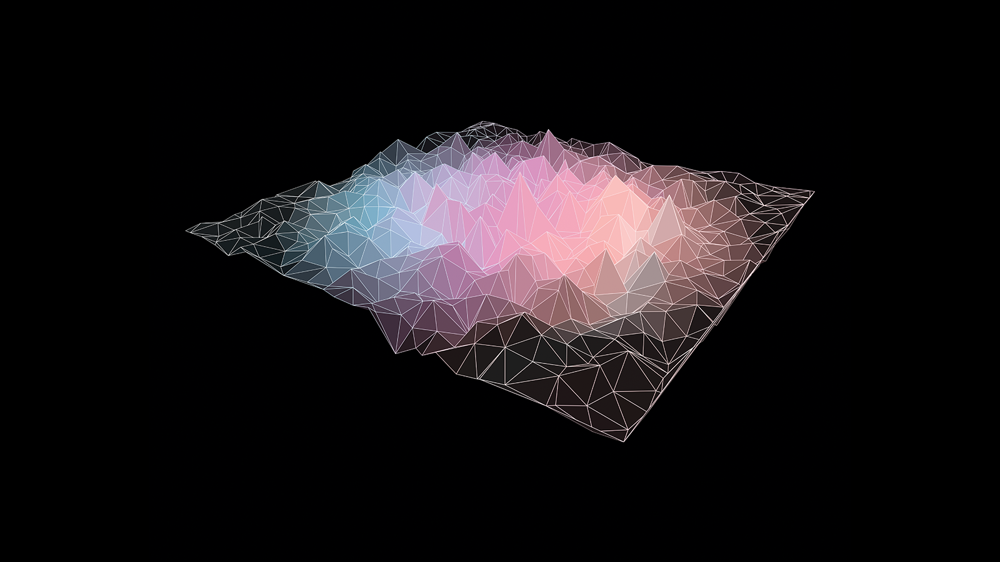
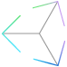
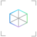
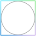
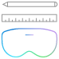
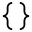

# Start designing and prototyping

## [Expand your design process](case-study-expanding-the-design-process-for-mixed-reality.md)

As Microsoft launched the HoloLens to an audience of eager developers in 2016, the team had already partnered with studios inside and outside of Microsoft to build the device’s launch experiences. These teams learned by doing, finding both opportunities and challenges in the new field of mixed reality design. [Read more](case-study-expanding-the-design-process-for-mixed-reality.md)

 

---

## What are the core concepts of an experience?

### [Keep the user comfortable - (Comfort)](comfort.md)
To ensure maximum comfort on head-mounted displays, it’s important for designers and developers to create and present content in a way that mimics how these cues operate in the natural world.

 

### [Consider how the user sees the world - (Holographic frame)](holographic-frame.md)
Users see the world of mixed reality through a rectangular viewport powered by their headset. On the HoloLens, this rectangular area is called the holographic frame and allows users to see digital content overlaid onto the real world around them.

 

### [Types of mixed reality apps](types-of-mixed-reality-apps.md)
One of the advantages of developing apps for mixed reality is that there is a spectrum of experiences that the platform can support. From fully immersive, virtual environments, to light information layering over a user’s current environment, mixed reality provides a robust set of tools to bring any experience to life.

 

### [Keeping holograms in place - (Coordinate systems)](coordinate-systems.md)
At their core, mixed reality apps place holograms in your world to look and sound like real objects. This involves precisely positioning those holograms at places in the world that are meaningful to the user, whether it's their physical room or a virtual realm you've created.

 

### [Making holographic objects feel real - (Spatial mapping)](spatial-mapping.md)
Spatial mapping makes it possible to place objects on real surfaces. This helps anchor objects in the user's world and takes advantage of real world depth cues.

 

---

 

## Interaction design factors to consider

### [Choose an interaction model for your customer](interaction-fundamentals.md)
The philosophy of simple, instinctual interactions is interwoven throughout the Mixed Reality platform. We've taken three steps to ensure that application designers and developers can provide their customers with easy and intuitive interactions.

 

### [Hands and motion controllers](hands-and-tools.md)
Users can touch and manipulate holograms directly with one or both hands much like they do with real world objects. Or with motion controllers, you can extend the user's physical capabilities by providing precise interactions across a large range of distances.

 

### [Directly commanding objects with voice input](voice-input.md)
Voice is one of the key forms of input on HoloLens. It allows you to directly command a hologram without having to use gestures. Voice input can be a natural way to communicate your intent.

 

### [Leveraging the user's eye-gaze](eye-tracking.md)
HoloLens 2 allows for a new level of context and human understanding within the holographic experience by providing developers with the ability to use information about what users are looking at.

 

### [Color, light and materials](color,-light-and-materials.md)
Designing content for mixed reality requires careful consideration of color, lighting, and materials for each of the visual assets used in your experience.

 

### [Suggesting the scale of an object](scale.md)
A key to displaying content that looks realistic in holographic form is to mimic the visual characteristics of the real world as closely as possible. This means incorporating as many of the visual cues as we can that help us (in the real world) understand where objects are, how big they are, and what they’re made of.

 

### [Clear and readable typography](typography.md)
Just like typography on 2D screens, the goal is to be clear and readable. With the three-dimensional aspect of mixed reality, there is an opportunity to affect the text and the overall user experience in an even greater way.

 

### [UX elements for the mixed reality](app-patterns-landingpage.md)
Learn about the building blocks for spatial interactions and UI in mixed reality.
 

---

## Choose a prototyping option  

:::row:::	
    :::column:::	
        
        **[Learn Unity](https://learn.unity.com/)** 
        Learn how to create interactive experiences with Unity. Learn by doing, from start to finish.
    :::column-end:::	
    :::column:::	
         
        **[Mixed Reality Toolkit (MRTK)](https://github.com/Microsoft/MixedRealityToolkit-Unity)** 	
        With spatial interaction and UI building blocks, jump-start your mixed reality design and development with Unity.	
    :::column-end:::
    :::column:::	
         
        **[Mixed Reality Design Labs](https://github.com/Microsoft/MRDL_Unity_PeriodicTable)** 	
        Get sample apps that show you how to use MRTK's building blocks to create beautiful mixed reality experiences.
    :::column-end:::		
    :::column:::	
         
        **[Microsoft Maquette](https://www.maquette.ms/)** 	
        Design for VR. Microsoft Maquette makes spatial prototyping easy, quick, and immersive.	
    :::column-end:::	
:::row-end:::

 

---

## What would you like to do next?

:::row:::
    :::column:::
        
        **[Understand the basics](index.yml)** 
        Get a better understanding of what defines mixed reality and how it’s being used.
    :::column-end:::
    :::column:::
         
         **[Come to an event](sf-academy-events.md)** 
        See the hardware and get a hands-on tutorial to make your first HoloLens 2 application.
    :::column-end:::
    :::column:::
         
         **[Install the tools](install-the-tools.md)** 
        Use the installation checklist to get the tools you need to build apps for HoloLens and mixed reality.
    :::column-end:::
    :::column:::
         
        **[Start developing](development.md)** 
        Choose a development path based on your skill level, work style, or platform interest.
    :::column-end:::
:::row-end:::

 

 

