# Design for mixed reality

This guidance is authored by Microsoft designers, developers, program managers, and researchers, whose work spans holographic devices (like HoloLens) and immersive devices (like the Acer and HP Windows Mixed Reality headsets). So, consider this work as a set of topics for ‘how to design for Windows head-mounted displays’.

## Article categories

<ul class="panelContent cardsF">
    <li>
        

            

                

                    

                        

                            
                        

                    

                    

                        <h3>Get started with Design</h3>
                        

                            <a href="mixed-reality.md">What is mixed reality?</a>
                        

                        

                            <a href="about-this-design-guidance.md">About this guidance</a>
                        

                        

                            <a href="case-study-my-first-year-on-the-hololens-design-team.md">My first year on the design team</a>
                        

                        

                            <a href="case-study-expanding-the-design-process-for-mixed-reality.md">Expanding the design process for mixed reality</a>
                        

                        

                            <a href="case-study-the-pursuit-of-more-personal-computing.md">The pursuit of more personal computing</a>
                        

                    

                

            

        

    </li>
    <li>
        

            

                

                    

                        

                            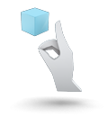
                        

                    

                    

                        <h3>MR design system and tools</h3>
                        

                            <a href="comfort.md">Comfort</a>
                        

			

                            <a href="interaction-fundamentals.md">Instinctual interactions</a>
                        

                        

                            <a href="hands-and-tools.md">Hands and motion controllers</a>
                        

                        

                            <a href="hands-free.md">Hands-free</a>
                        

                         

                            <a href="gaze-and-commit.md">Head-gaze and commit</a>
                        

                    

                

            

        

    </li>
    <li>
        

            

                

                    

                        

                            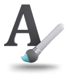
                        

                    

                    

                        <h3>Style</h3>
                        

                            <a href="color,-light-and-materials.md">Color, light and materials</a>
                        

                         

                            <a href="spatial-sound-design.md">Spatial sound design</a>
                        

                        

                            <a href="typography.md">Typography</a>
                        

                        

                            <a href="scale.md">Scale</a>
                        
                      
                    

                

            

        

    </li>
    <li>
        

            

                

                    

                        

                            
                        

                    

                    

                        <h3>App patterns</h3>
                        

                            <a href="types-of-mixed-reality-apps.md">Types of mixed reality apps</a>
                        

                        

                            <a href="room-scan-visualization.md">Room scan visualization</a>
                        

                        

                            <a href="cursors.md">Cursors</a>
                        

                        

                            <a href="billboarding-and-tag-along.md">Billboarding and tag-along</a>
                        

                    

                

            

        

    </li>
    <li>
        

            

                

                    

                        

                            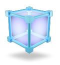
                        

                    

                    

                        <h3>Controls</h3>
                        

                            <a href="text-in-unity.md">Text in Unity</a>
                        

                        

                            <a href="interactable-object.md">Interactable object</a>
                        

                        

                            <a href="object-collection.md">Object collection</a>
                        

                        

                            <a href="progress.md">Displaying progress</a>
                        

                        

                            <a href="app-bar-and-bounding-box.md">Bounding box and App bar</a>
                        

                    

                

            

        

    </li>    
</ul>

## Sample apps

Build great experiences from samples designed and created by our team.

 
<ul id="cardtypes-W" class="cardsW panelContent" style="display: flex; margin-top: 0px;">
    <li>
        <a href="periodic-table-of-the-elements.md" title="Periodic Table of the Elements" data-linktype="absolute-path">
            

                

                    

                        

                            

                                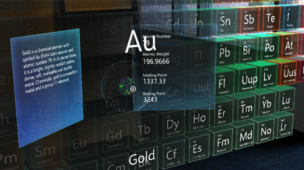
                            

                        

                        

                            <h3>Periodic Table of the Elements</h3>
                            
Learn how to lay out an array of objects in 3D space with various surface types using an Object collection.

                        

                    

                

            

		</a>	    
    </li>
    <li>
        <a href="lunar-module.md" title="Lunar Module" data-linktype="absolute-path">
            

                

                    

                        

                            

                                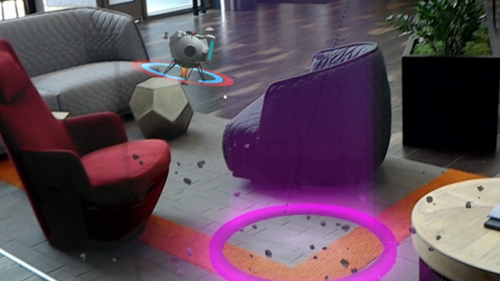
                            

                        

                        

                            <h3>Lunar Module</h3>
                            
Learn how to extend HoloLens base gestures with two-handed tracking and Xbox controller input.

                        

                    

                

            

		</a>
    </li>
    <li>
        <a href="galaxy-explorer.md" title="Galaxy Explorer" data-linktype="absolute-path">
            

                

                    

                        

                            

                                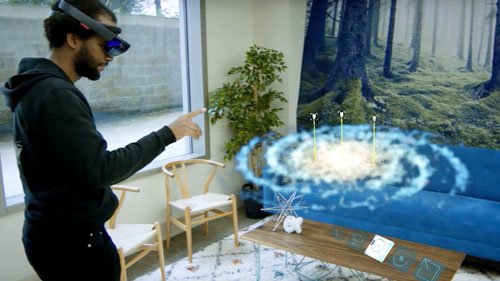
                            

                        

                        

                            <h3>Galaxy Explorer</h3>
                            
The Galaxy Explorer Project is ready. You shared your ideas with the community, chose an app, watched a team build it, and can now get the source code.

                        

                    

                

            

        </a>
    </li>
</ul>

## Design tools

<ul id="cardtypes-D" class="cardsD panelContent" style="display: flex; margin-top: 0px;">
    <li>
	<a href="https://microsoft.github.io/MixedRealityToolkit-Unity/README.html#ui-and-interaction-building-blocks" title="Mixed Reality Toolkit - Unity" data-linktype="absolute-path">
        

            

                

                    

                        

                            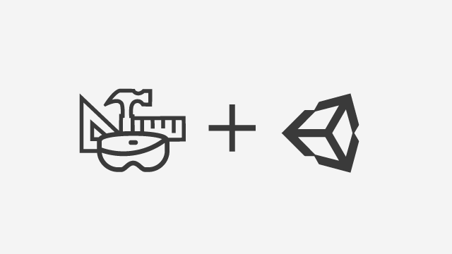
                        

                    
                    
			

                        <h3>Mixed Reality Toolkit - Unity</h3>
                        
 

                    

                

            

        

      </a>	
    </li>
    <li>
	<a href="https://github.com/Microsoft/MixedRealityToolkit" title="Mixed Reality Toolkit" data-linktype="absolute-path">
        

            

                

                    

                        

                            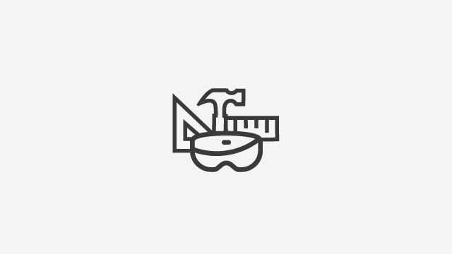
                        

                    
                    
			

                        <h3>Mixed Reality Toolkit</h3>
                        
 

                    

                

            

        

      </a>	
    </li>		
            <li>
	<a href="https://www.simplygon.com" title="Simplygon" data-linktype="absolute-path">
        

            

                

                    

                        

                            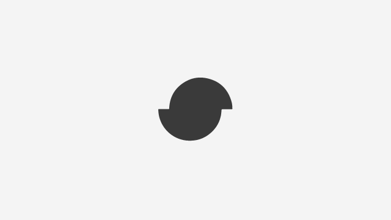
                        

                    
                    
			

                        <h3>Simplygon</h3>
                        
 

                    

                

            

        

      </a>	
    </li>
</ul>

## General design resources

<ul id="cardtypes-D" class="cardsD panelContent" style="display: flex; margin-top: 0px;">
    <li>
	<a href="http://fluent.microsoft.com" title="Fluent Design System" data-linktype="absolute-path">
        

            

                

                    

                        

                            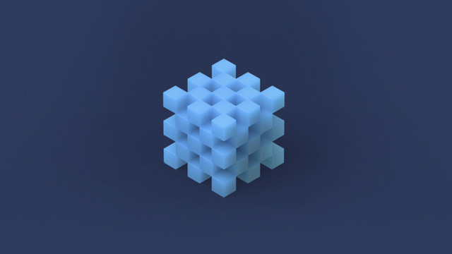
                        

                    
                    
			

                        <h3>Fluent Design System</h3>
                        
 

                    

                

            

        

      </a>	
    </li>
    <li>
	<a href="https://www.microsoft.com/design/inclusive" title="Inclusive design at Microsoft" data-linktype="absolute-path">
        

            

                

                    

                        

                            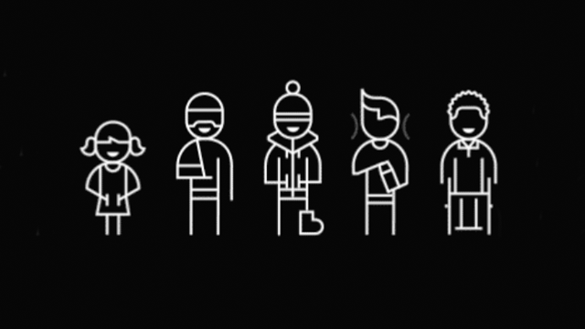
                        

                    
                    
			

                        <h3>Inclusive design at Microsoft</h3>
                        
 

                    

                

            

        

      </a>	
    </li>	
        <li>
	<a href="https://developer.microsoft.com/windows/apps/design" title="Universal Windows Platform (UWP) app design" data-linktype="absolute-path">
        

            

                

                    

                        

                            
                        

                    
                    
			

                        <h3>Universal Windows Platform (UWP) app design</h3>
                        
 

                    

                

            

        

      </a>	
    </li>	
</ul>
