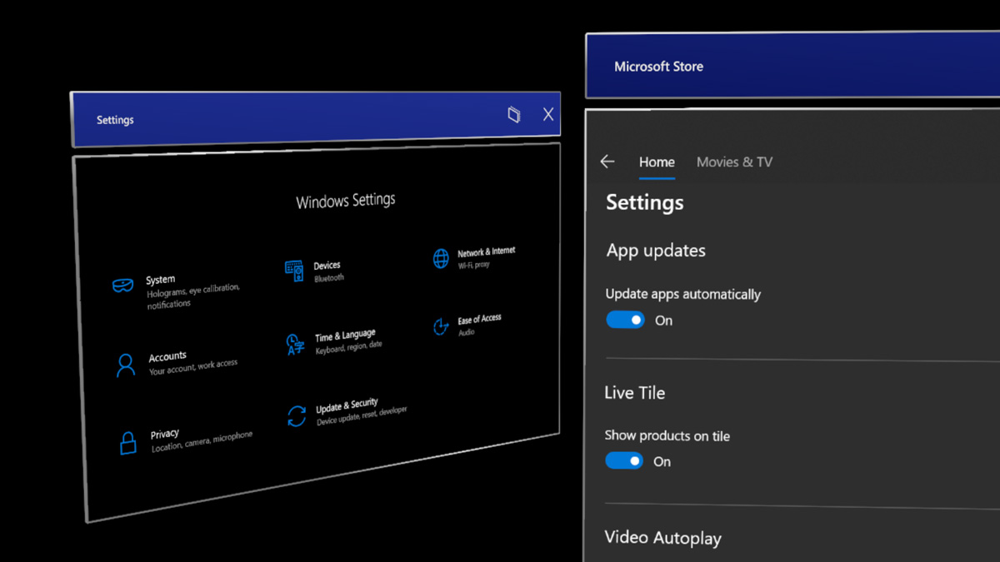
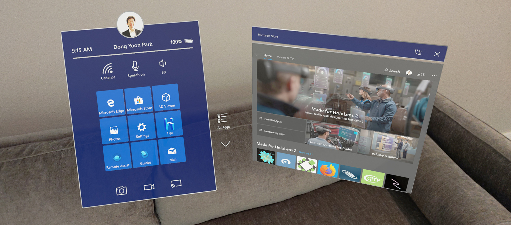

# Designing content for holographic display

When designing content for holographic displays, there are several elements that you need to consider achieving the best experience. Below are some of the recommendations. To learn about the characteristics of the holographic display, see [Color, light and materials](color,-light-and-materials.md) page.

 

## Challenges with bright color on a large surface 
Based on our user research and testing on various types of HoloLens experiences, we found that using bright colors in a large area of the display can cause several issues: 

**Eye fatigue** 

Since holographic display is additive, bright color uses more light to display holograms. Bright, solid color in a large area of the display can easily cause eye fatigue for the user. 

**Hand occlusion** 

Bright color makes it difficult for the user to see their hands when directly interacting with objects. Since the user cannot see their hands, it becomes difficult to perceive the depth/distance between the hand/finger to the target surface. The Finger Cursor helps compensate for this issue, but it can still be challenging on a bright white surface. 

*Difficult to see the hand on the bright colored content backplate*

**Color uniformity**

Because of the characteristics of holographic displays, a large bright area on the display can become blotchy. By using dark color scheme, you can minimize this issue. 

## Design guidelines

**Use dark color for the UI background**

By using the dark color scheme, you can minimize the eye fatigue and improve the confidence on direct hand interactions. 

*Examples of dark color used for the content background*

**Use semibold or bold font weight**

HoloLens allows your experience to show beautiful high-resolution text. However, it is recommended to avoid thin font weight such as light or semi-light because the vertical strokes can jitter in small font size. 

*Bold or semi-bold font weight (upper panel) improves the legibility*

**Use MRTK’s HolographicBackplate material**

The HolographicBackplate material is applied to several UI panels in the HoloLens shell. One of its features is an iridescence effect that is visible to users as they shift their position in relation to the panel. The backplate color shifts subtly across a predefined spectrum, creating an engaging and dynamic visual effect without interfering with content readability. This subtle shift in color also serves to compensate for any minor color irregularities. 

## Challenges with transparent or translucent UI backplate 

*Examples of transparent UI backplate*

**Visual complexity and accessibility**

Since holographic objects are blended with the physical environment, the legibility of the content or UI on the transparent or translucent window could be degraded. Additionally, when transparent holographic objects are overlaid on top of each other, it could make it difficult for the user to interact because of the confusing depth.

**Performance**

For transparent or translucent objects to render correctly they must be sorted and blended with any objects which exist in the background. Sorting of transparent objects has a modest CPU cost, blending has considerable GPU cost because it does not allow the GPU to perform hidden surface removal via z-culling (i.e depth testing). Not allowing hidden surface removal increases the number of operations that need to be computed for the final rendered pixel, and thus puts more pressure on fill rate constraints.

**Hologram stability issue with Depth LSR technology**

To improve holographic reprojection, or hologram stability, an application can submit a depth buffer to the system for every rendered frame. When using the depth buffer for reprojection one rule is that for every color pixel rendered a corresponding depth value must be written to the depth buffer (and any pixel with a depth value should also have color value). If the above guidance is not followed, areas of the rendered image that lack valid depth information may be reprojected in a way that produces artifacts (often visible as a wave-like distortion).

## Design guidelines
**Use opaque UI background**

By default, transparent or translucent objects do not write depth to allow for proper blending. Ways to mitigate this issue include, using opaque objects, ensuring translucent objects appear close to opaque objects (such as a translucent button in front of an opaque backplate), forcing translucent objects to write depth (not applicable in all scenarios), or rendering proxy objects which only contribute depth values at the end of the frame.

Solutions within MRTK-Unity: https://microsoft.github.io/MixedRealityToolkit-Unity/Documentation/hologram-stabilization.html#depth-buffer-sharing-in-unity  

By using a solid and opaque backplate, we can secure legibility and interaction confidence.

**Minimize the number of pixels affected**

If your project must use transparent objects, try to minimize the number of pixels affected. For example, if an object is only visible under certain conditions (like an additive glow effect), disable the object when it is fully invisible (instead of setting the additive color to black). For simple 2D shapes created using a quad with an alpha mask, consider creating a mesh representation of the shape with an opaque shader instead. 

 
---
 

## Dark UI examples in MRTK (Mixed Reality Toolkit) for Unity
**[MRTK](https://github.com/Microsoft/MixedRealityToolkit-Unity)** provides many UI building block examples based on the dark color schemes.

* [Near Menu](https://microsoft.github.io/MixedRealityToolkit-Unity/Documentation/README_NearMenu.html)
* [Dialog](https://microsoft.github.io/MixedRealityToolkit-Unity/Assets/MRTK/SDK/Experimental/Dialog/README_Dialog.html)
* [Hand Menu](https://microsoft.github.io/MixedRealityToolkit-Unity/Documentation/README_HandMenu.html)

 

---

## See also

* [Cursors](cursors.md)
* [Hand ray](point-and-commit.md)
* [Button](button.md)
* [Interactable object](interactable-object.md)
* [Bounding box and App bar](app-bar-and-bounding-box.md)
* [Manipulation](direct-manipulation.md)
* [Hand menu](hand-menu.md)
* [Near menu](near-menu.md)
* [Object collection](object-collection.md)
* [Voice command](voice-input.md)
* [Keyboard](keyboard.md)
* [Tooltip](tooltip.md)
* [Slate](slate.md)
* [Slider](slider.md)
* [Shader](shader.md)
* [Billboarding and tag-along](billboarding-and-tag-along.md)
* [Displaying progress](progress.md)
* [Surface magnetism](surface-magnetism.md)
