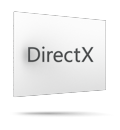
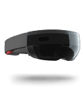
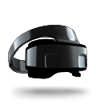

# Development launchpad

## Article categories

<ul class="panelContent cardsF">
    <li>
        

            

                

                    

                        

                            
                        

                    

                    

                        <h3>Get started</h3>
                        

                            <a href="install-the-tools.md">Install the tools</a>
                        

                        

                            <a href="development-overview.md">Development overview</a>
                        

                        

                            <a href="academy.md">Academy</a>
                        

                    

                

            

        

    </li>
    <li>
        

            

                

                    

                        

                            
                        

                    

                    

                        <h3>Unity</h3>
                        

                            <a href="unity-development-overview.md">Unity development overview</a>
                        

                        

                            <a href="vuforia-development-overview.md">Using Vuforia with Unity</a>
                        

                        

                            <a href="porting-guides.md">Porting guides</a>
                        

                    

                

            

        

    </li>
    <li>
        

            

                

                    

                        

                            
                        

                    

                    

                        <h3>DirectX</h3>
                        

                            <a href="directx-development-overview.md">DirectX development overview</a>
                        

                         

                            <a href="creating-a-holographic-directx-project.md">Creating a holographic DirectX project</a>
                        

                        

                            <a href="rendering-in-directx.md">Rendering in DirectX</a>
                        
                
                    

                

            

        

    </li>
    <li>
        

            

                

                    

                        

                            
                        

                    

                    

                        <h3>Open source projects</h3>
                        

                            <a href="https://github.com/Microsoft/MixedRealityToolkit">Mixed Reality Toolkit</a>
                        

                        

                            <a href="https://github.com/Microsoft/MRDesignLabs_Unity">Mixed Reality Design Labs</a>
                        

                        

                            <a href="galaxy-explorer.md">Galaxy Explorer</a>
                        

                    

                

            

        

    </li>
    <li>
        

            

                

                    

                        

                            
                        

                    

                    

                        <h3>Unique to HoloLens</h3>
                        

                            <a href="hololens-hardware-details.md">HoloLens hardware details</a>
                        

                        

                            <a href="gestures.md">Gestures</a>
                        

                        

                            <a href="spatial-mapping.md">Spatial mapping</a>
                        

                    

                

            

        

    </li>    
        <li>
        

            

                

                    

                        

                            
                        

                    

                    

                        <h3>Unique to immersive headsets</h3>
                        

                            <a href="immersive-headset-hardware-details.md">Immersive headset hardware details</a>
                        

                        

                            <a href="motion-controllers.md">Motion controllers</a>
                        

                        

                            <a href="performance-recommendations-for-immersive-headset-apps.md">Performance recommendations for immersive headset apps</a>
                        

                    

                

            

        

    </li> 
</ul>

## Windows API reference (external)

<ul class="panelContent cardsF">
    <li>
        

            

                

                    

                        <h3>Windows API reference</h3>
                        

                            <a href="https://docs.microsoft.com/uwp/api/windows.graphics.holographic">Windows.Graphics.Holographic</a>
                        

                        

                            <a href="https://docs.microsoft.com/uwp/api/windows.perception.spatial">Windows.Perception</a>
                        

                        

                            <a href="https://docs.microsoft.com/uwp/api/windows.perception.spatial">Windows.Perception.Spatial</a>
                        

                         

                            <a href="https://docs.microsoft.com/uwp/api/Windows.Perception.Spatial.Surfaces">Windows.Perception.Spatial.Surfaces</a>
                        

                          

                            <a href="https://docs.microsoft.com/uwp/api/windows.ui.input.spatial">Windows.UI.Input.Spatial</a>
                        

                           

                            <a href="https://docs.microsoft.com/uwp/api/windows.applicationmodel.preview.holographic">Windows.ApplicationModel.Preview.Holographic</a>
                        

                    

                

            

        

    </li>
</ul>

## Unity API reference (external)

<ul class="panelContent cardsF">
    <li>
        

            

                

                    

                        <h3>Gaze, gesture, and motion controller input</h3>
                        

                            <a href="https://docs.unity3d.com/ScriptReference/XR.InputTracking.html">UnityEngine.XR.InputTracking</a>
                        

                        

                            <a href="https://docs.unity3d.com/ScriptReference/XR.WSA.Input.InteractionManager.html">UnityEngine.XR.WSA.Input.InteractionManager</a>
                        

                        

                            <a href="https://docs.unity3d.com/ScriptReference/XR.WSA.Input.GestureRecognizer.html">UnityEngine.XR.WSA.Input.GestureRecognizer</a>
                        

                    

                

            

        

    </li>
        <li>
        

            

                

                    

                        <h3>World-locking, persistence, and sharing</h3>
                        

                            <a href="https://docs.unity3d.com/ScriptReference/XR.WSA.WorldAnchor.html">UnityEngine.XR.InputTracking</a>
                        

                        

                            <a href="https://docs.unity3d.com/ScriptReference/XR.WSA.Persistence.WorldAnchorStore.html">UnityEngine.XR.WSA.Persistence.WorldAnchorStore</a>
                        

                        
 
                         <a href="https://docs.unity3d.com/ScriptReference/XR.WSA.Sharing.WorldAnchorTransferBatch.html">UnityEngine.XR.WSA.Sharing.WorldAnchorTransferBatch</a>
                        

                        

                         <a href="https://docs.unity3d.com/ScriptReference/XR.WSA.WorldManager.html">UnityEngine.XR.WSA.WorldManager</a>
                        

                    

                

            

        

    </li>
        <li>
        

            

                

                    

                        <h3>Spatial mapping</h3>
                        

                            <a href="https://docs.unity3d.com/ScriptReference/XR.WSA.SpatialMappingCollider.html">UnityEngine.XR.WSA.SpatialMappingCollider</a>
                        

                        

                            <a href="https://docs.unity3d.com/ScriptReference/XR.WSA.SpatialMappingRenderer.html">UnityEngine.XR.WSA.SpatialMappingRenderer</a>
                        

                    

                

            

        

    </li>
      <li>
        

            

                

                    

                        <h3>App tailoring</h3>
                        

                            <a href="https://docs.unity3d.com/ScriptReference/XR.XRSettings.html">UnityEngine.XR.XRSettings</a>
                        

                        

                            <a href="https://docs.unity3d.com/ScriptReference/XR.WSA.HolographicSettings.html">UnityEngine.XR.WSA.HolographicSettings</a>
                        

                    

                

            

        

    </li>
  </ul>
