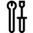

# Development

 

<h3 class="text-title spacer-12-bottom" style="margin-top:15px;">
Keep up-to-date
</h3>

<a href="install-the-tools.md">Install the tools</a>

<a href="release-notes.md">Release notes</a>

<a href="https://docs.microsoft.com/en-us/windows/mixed-reality/enthusiast-guide/mixed-reality-software">Immersive headset and controller driver history</a>

<a href="https://docs.microsoft.com/en-us/windows/mixed-reality/enthusiast-guide/troubleshooting-windows-mixed-reality">Immersive headset and controller support</a>

 

<h3 class="text-title spacer-12-bottom" style="margin-top:15px;">
Basics
</h3>

<a href="navigating-the-windows-mixed-reality-home.md">Navigating the Windows Mixed Reality home</a>

<a href="coordinate-systems.md">Coordinate systems</a>

<a href="gaze.md">Gaze</a>

<a href="gestures.md">Gestures</a>

<a href="voice-input.md">Voice input</a>

<a href="motion-controllers.md">Motion controllers</a>

<a href="spatial-sound.md">Spatial sound</a>

<a href="spatial-mapping.md">Spatial mapping</a>

<a href="app-quality-criteria.md">App quality criteria</a>

 

<h3 class="text-title spacer-12-bottom" style="margin-top:15px;">
Getting started
</h3>

<a href="install-the-tools.md">Install the tools</a>

<a href="https://docs.microsoft.com/en-us/windows/mixed-reality/enthusiast-guide/before-you-start">Immersive headset setup</a>

<a href="development-overview.md">Development overview</a>

<a href="using-visual-studio.md">Using Visual Studio</a>

<a href="using-the-hololens-emulator.md">Using the HoloLens emulator</a>

<a href="using-the-windows-mixed-reality-simulator.md">Using the Windows Mixed Reality simulator</a>

<a href="using-the-windows-device-portal.md">Using the Windows Device Portal</a>

<a href="porting-guides.md">Porting guides</a>

 

<h3 class="text-title spacer-12-bottom" style="margin-top:15px;">
Hardware
</h3>

<a href="hololens-hardware-details.md">HoloLens hardware details</a>

<a href="immersive-headset-hardware-details.md">Immersive headset hardware details</a>

<a href="motion-controllers.md">Motion controllers</a>

<a href="hardware-accessories.md">Hardware accessories</a>

 

<h3 class="text-title spacer-12-bottom" style="margin-top:15px;">
Building 2D apps
</h3>

<a href="building-2d-apps.md">Building 2D apps</a>

<a href="current-limitations-for-apps-using-apis-from-the-shell.md">Current limitations for apps using APIs from the shell</a>

 

<h3 class="text-title spacer-12-bottom" style="margin-top:15px;">
Building immersive apps
</h3>

<a href="unity-development-overview.md">Unity development overview</a>

<a href="vuforia-development-overview.md">Vuforia development overview</a>

<a href="performance-recommendations-for-hololens-apps.md">Performance recommendations for HoloLens apps</a>

<a href="app-views.md">App views</a>

<a href="app-model.md">App model</a>

 

<h3 class="text-title spacer-12-bottom" style="margin-top:15px;">
Building middleware
</h3>

<a href="directx-development-overview.md">DirectX development overview</a>

<a href="creating-a-holographic-directx-project.md">Creating a holographic DirectX project</a>

<a href="rendering-in-directx.md">Rendering in DirectX</a>

 

<h3 class="text-title spacer-12-bottom" style="margin-top:15px;">
Notable features
</h3>

<a href="mixed-reality-capture.md">Mixed reality capture</a>

<a href="spectator-view.md">Spectator view</a>

<a href="updating-your-steamvr-application-for-windows-mixed-reality.md">Updating your SteamVR application for Windows Mixed Reality</a>

 

<h3 class="text-title spacer-12-bottom" style="margin-top:15px;">
Terminology
</h3>

<a href="hologram.md">Hologram</a>

<a href="mixed-reality.md">Mixed reality</a>

 

<h3 class="text-title spacer-12-bottom" style="margin-top:15px;">
API reference
</h3>

<a href="https://msdn.microsoft.com/en-us/library/windows/apps/windows.graphics.holographic.aspx">Windows.Graphics.Holographic</a>

<a href="https://msdn.microsoft.com/en-us/library/windows/apps/windows.perception.aspx">Windows.Perception</a>

<a href="https://msdn.microsoft.com/en-us/library/windows/apps/windows.perception.spatial.aspx">Windows.Perception.Spatial</a>

<a href="https://msdn.microsoft.com/en-us/library/windows/apps/windows.perception.spatial.surfaces.aspx">Windows.Perception.Spatial.Surfaces</a>

<a href="https://msdn.microsoft.com/en-us/library/windows/apps/windows.ui.input.spatial.aspx">Windows.UI.Input.Spatial</a>

 

<h3 class="text-title spacer-12-bottom" style="margin-top:15px;">
Troubleshooting
</h3>

<a href="https://support.microsoft.com/en-us/help/13456/hololens-and-holograms-faq">HoloLens troubleshooting</a> (external link)

<a href="hololens-known-issues.md">HoloLens known issues</a>

<a href="https://docs.microsoft.com/en-us/windows/mixed-reality/enthusiast-guide/troubleshooting-windows-mixed-reality">Immersive headset and controller support</a>

<a href="testing-your-app-on-hololens.md">Testing your app on HoloLens</a>

<a href="give-us-feedback.md">Give us feedback</a>

