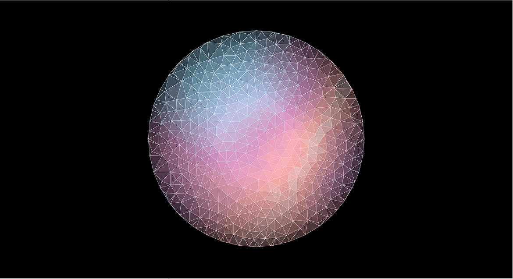
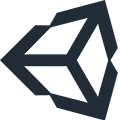
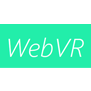
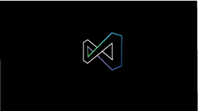

# Learn the tools and architecture

## [Expand your design process](case-study-expanding-the-design-process-for-mixed-reality.md)

As Microsoft launched the HoloLens to an audience of eager developers in 2016, the team had already partnered with studios inside and outside of Microsoft to build the device’s launch experiences. These teams learned by doing, finding both opportunities and challenges in the new field of mixed reality design. [Read more](case-study-expanding-the-design-process-for-mixed-reality.md)

 

---

## What technology path are you interested in? 

:::row:::	
    :::column:::	
        
        **[Unity](development.md#unity)** 	
        The fastest path to building a mixed reality app is with Unity.	
    :::column-end:::	
    :::column:::	
         
         **[Unreal](development.md#unreal)** 	
        Production-ready support for HoloLens 2 will also be included in Unreal Engine 4.23.	
    :::column-end:::
    :::column:::	
         
        **[WebVR](development.md#webvr)** 
        WebVR is an open specification that makes it possible to experience VR in your browser.	
    :::column-end:::		
    :::column:::	
         
        **[Native](development.md#native)** 	
        Create mixed reality apps by directly coding to the Windows Mixed Reality APIs.	
    :::column-end:::	
:::row-end:::

 

---

## Unity

### [Unity development overview](unity-development-overview.md)
We recommend that you take time to explore the Unity tutorials. If you need assets, Unity has a comprehensive Asset Store. 

 

### [Microsoft’s Mixed Reality Toolkit (MRTK) for Unity](mrtk-getting-started.md)
The MRTK v2 with Unity is an open source cross-platform development kit for mixed reality applications. MRTK version 2 is intended to accelerate development of applications targeting Microsoft HoloLens, Windows Mixed Reality immersive (VR) headsets and OpenVR platform.

 

### [Open source sample apps and step-by-step tutorials](tutorials.md)
The HoloLens 2 tutorials are designed to help developers learn both techniques and best practices for developing mixed reality applications. The tutorials are based on the Mixed Reality Toolkit 2.0 (MRTK 2.0).

 

### [Hand interaction examples scene (MRTK) for Unity](https://microsoft.github.io/MixedRealityToolkit-Unity/Documentation/GettingStartedWithTheMRTK.html#open-and-run-the-handinteractionexamples-scene-in-editor)
The HandInteractionExamples.unity example scene contains various types of interactions and UI controls that highlight articulated hand input.
>[!NOTE]
>Requires the install of MRTK Foundation and Example Unity packages.

### [Eye tracking examples (MRTK) for Unity](https://microsoft.github.io/MixedRealityToolkit-Unity/Documentation/EyeTracking/EyeTracking_ExamplesOverview.html)
This page covers how to get quickly started with using eye tracking in MRTK by building on our provided MRTK eye tracking examples.
>[!NOTE]
>Requires the install of MRTK Foundation and Example Unity packages.

 

---

## Unreal

### [Unreal development overview](unreal-development-overview.md)
Learn how to build a mixed reality app using Unreal.

 

---

## WebVR	

### [Babylon development overview](https://doc.babylonjs.com/)	
Learn how to build a mixed reality app with Babylon. We recommend that you take time to explore the Babylon tutorials.

 

---

## Native

### [Native development overview](directx-development-overview.md)
The fastest path to building a native mixed reality app.

 

### [DirectX UWP app templates for mixed reality](https://marketplace.visualstudio.com/items?itemName=WindowsMixedRealityteam.WindowsMixedRealityAppTemplatesVSIX)
All of the essentials you need to start writing a mixed reality app using DirectX.

 

---

## What would you like to do next?

:::row:::
    :::column:::
        
        **[Understand the basics](index.yml)** 
        Get a better understanding of what defines mixed reality and how it’s being used.
    :::column-end:::
    :::column:::
         
         **[Become a creator](design.md)** 
        Learn the basic concepts you need to begin designing and prototyping.
    :::column-end:::
    :::column:::
         
         **[Install the tools](install-the-tools.md)** 
        Use the installation checklist to get the tools you need to build apps for HoloLens and mixed reality.
    :::column-end:::
    :::column:::
         
         **[Come to an event](sf-academy-events.md)** 
        See the hardware and get a hands-on tutorial to make your first HoloLens 2 application.
    :::column-end:::
:::row-end:::

 

 
