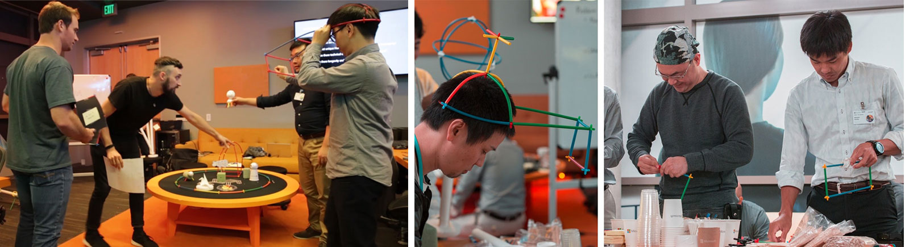

# Learn the tools and architecture

## [How is mixed reality development different?](case-study-expanding-the-design-process-for-mixed-reality.md)

As Microsoft launched the HoloLens to an audience of eager developers in 2016, the team had already partnered with studios inside and outside of Microsoft to build the device’s launch experiences. These teams learned by doing, finding both opportunities and challenges in the new field of mixed reality design.

 

---

## What technology path are you interested in? 

:::row:::
    :::column:::
       
        ### [Unity](unity-development-overview.md)
        Get a better understanding of what defines mixed reality and how it’s being used.
    :::column-end:::
    :::column:::
        
         ### [Unreal](https://www.unrealengine.com/en-US/blog/unreal-engine-4-support-for-hololens-2-released-in-early-access)
        Use the installation checklist to get the tools you need to build applications for Microsoft HoloLens and Windows Mixed Reality.
    :::column-end:::
    :::column:::
        
         ### [DirectX](directx-development-overview.md)
        See the hardware and get a hands-on tutorial to make your first HoloLens 2 application.
    :::column-end:::
    :::column:::
        
         ### [WebVR](using-webvr-in-edge-with-windows-mixed-reality.md)
        Choose a development path based on your skill level, work style. or platform interest.
    :::column-end:::
:::row-end:::

 

---

## Unity

### [Unity development overview](unity-development-overview.md)
The fastest path to building a mixed reality app is with Unity. We recommend that you take time to explore the Unity tutorials. If you need assets, Unity has a comprehensive Asset Store. 
 

### [Microsoft’s Mixed Reality Toolkit (MRTK) for Unity](mrtk-getting-started.md)
The MRTK v2 with Unity is an open source cross-platform development kit for mixed reality applications. MRTK version 2 is intended to accelerate development of applications targeting Microsoft HoloLens, Windows Mixed Reality immersive (VR) headsets and OpenVR platform.
 

### [Open source sample apps and step-by-step tutorials](tutorials.md)
The HoloLens 2 tutorials are designed to help developers learn both techniques and best practices for developing mixed reality applications. The tutorials are based on the Mixed Reality Toolkit 2.0 (MRTK 2.0).
 

### [Example Unity scenes in MRTK](https://microsoft.github.io/MixedRealityToolkit-Unity/Documentation/README_HandInteractionExamples.html)
The HandInteractionExamples.unity example scene contains various types of interactions and UI controls that highlight articulated hand input

 

---

## Unreal

### [Unity development overview](unity-development-overview.md)

The fastest path to building a mixed reality app is with Unity. We recommend that you take time to explore the Unity tutorials. If you need assets, Unity has a comprehensive Asset Store. 

### [Microsoft’s Mixed Reality Toolkit (MRTK) for Unity](mrtk-getting-started.md)

The MRTK v2 with Unity is an open source cross-platform development kit for mixed reality applications. MRTK version 2 is intended to accelerate development of applications targeting Microsoft HoloLens, Windows Mixed Reality immersive (VR) headsets and OpenVR platform.

### [Open source sample apps and step-by-step tutorials](tutorials.md)

The HoloLens 2 tutorials are designed to help developers learn both techniques and best practices for developing mixed reality applications. The tutorials are based on the Mixed Reality Toolkit 2.0 (MRTK 2.0).

### [Example Unity scenes in MRTK](https://microsoft.github.io/MixedRealityToolkit-Unity/Documentation/README_HandInteractionExamples.html)

The HandInteractionExamples.unity example scene contains various types of interactions and UI controls that highlight articulated hand input

 

---

## DirectX

### [Unity development overview](unity-development-overview.md)

The fastest path to building a mixed reality app is with Unity. We recommend that you take time to explore the Unity tutorials. If you need assets, Unity has a comprehensive Asset Store. 

### [Microsoft’s Mixed Reality Toolkit (MRTK) for Unity](mrtk-getting-started.md)

The MRTK v2 with Unity is an open source cross-platform development kit for mixed reality applications. MRTK version 2 is intended to accelerate development of applications targeting Microsoft HoloLens, Windows Mixed Reality immersive (VR) headsets and OpenVR platform.

### [Open source sample apps and step-by-step tutorials](tutorials.md)

The HoloLens 2 tutorials are designed to help developers learn both techniques and best practices for developing mixed reality applications. The tutorials are based on the Mixed Reality Toolkit 2.0 (MRTK 2.0).

### [Example Unity scenes in MRTK](https://microsoft.github.io/MixedRealityToolkit-Unity/Documentation/README_HandInteractionExamples.html)

The HandInteractionExamples.unity example scene contains various types of interactions and UI controls that highlight articulated hand input

 

---

## WebVR

### [Unity development overview](unity-development-overview.md)

The fastest path to building a mixed reality app is with Unity. We recommend that you take time to explore the Unity tutorials. If you need assets, Unity has a comprehensive Asset Store. 

### [Microsoft’s Mixed Reality Toolkit (MRTK) for Unity](mrtk-getting-started.md)

The MRTK v2 with Unity is an open source cross-platform development kit for mixed reality applications. MRTK version 2 is intended to accelerate development of applications targeting Microsoft HoloLens, Windows Mixed Reality immersive (VR) headsets and OpenVR platform.

### [Open source sample apps and step-by-step tutorials](tutorials.md)

The HoloLens 2 tutorials are designed to help developers learn both techniques and best practices for developing mixed reality applications. The tutorials are based on the Mixed Reality Toolkit 2.0 (MRTK 2.0).

### [Example Unity scenes in MRTK](https://microsoft.github.io/MixedRealityToolkit-Unity/Documentation/README_HandInteractionExamples.html)

The HandInteractionExamples.unity example scene contains various types of interactions and UI controls that highlight articulated hand input

 

---

## What would you like to do next?

:::row:::
    :::column:::
       
        ### [Understand the basics](index.md#understand-the-basics)
        Get a better understanding of what defines mixed reality and how it’s being used.
    :::column-end:::
    :::column:::
         
         ### [Become a creator](design.md)
        Learn the basic concepts you need to begin designing and prototyping.
    :::column-end:::
    :::column:::
        
         ### [Install the tools](install-the-tools.md)
        Use the installation checklist to get the tools you need to build applications for Microsoft HoloLens and Windows Mixed Reality.
    :::column-end:::
    :::column:::
        
         ### [Come to a design or development event](sf-academy-events.md)
        See the hardware and get a hands-on tutorial to make your first HoloLens 2 application.
    :::column-end:::
:::row-end:::