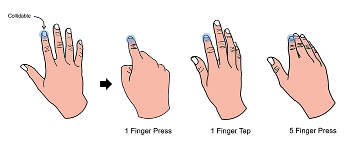
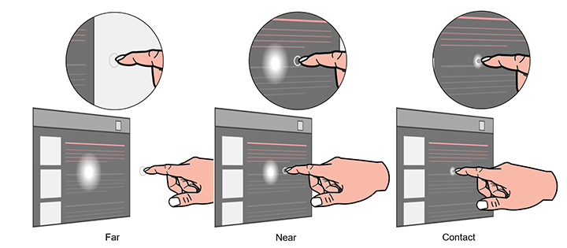
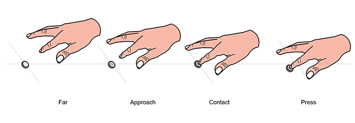
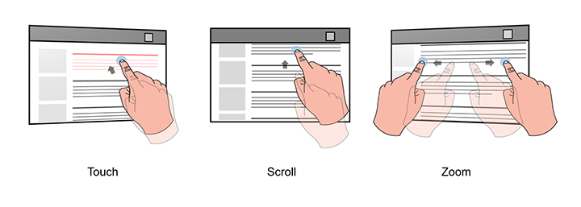
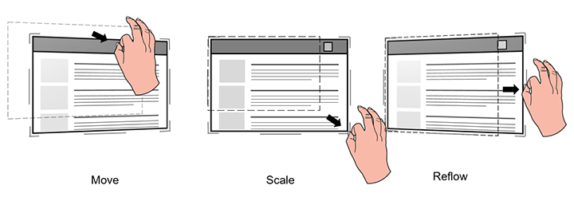
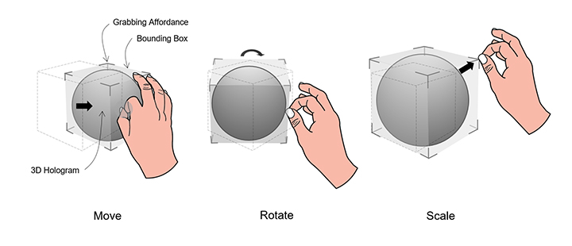
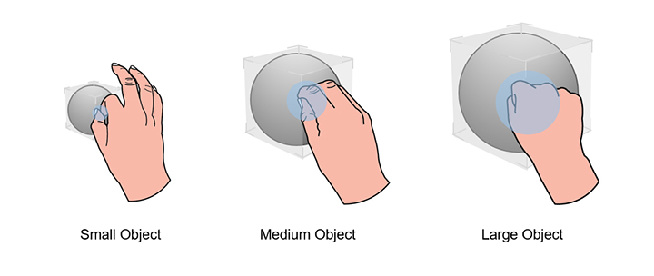

# Direct Manipulation

The HoloLens 2 has a direct manipulation input model that lets you touch holograms dircly with your hands. The goal with direct manipulation is for objects to behave just as they do in the real world. You can activate buttons by simply pressing them, and even and pick up, grab, and move objects. In these scenarios, 2D content behaves like a virtual touchscreen.

Direct manipulation is easy for users to learn, and it's fun too. It is considered a "hands near" input model, meaning it's best used for interacting with content that is within an arm's reach.

Direct manipulation is affordance-based, meaning it's user friendly. There are no symbolic gestures to teach users. All interactions are built around a visual element that you can touch or grab.

## Device support

| Input Model | [HoloLens (1st Gen)](https://review.docs.microsoft.com/en-us/windows/mixed-reality/hololens-hardware-details?branch=master) | HoloLens 2 |[Immersive Headsets](https://review.docs.microsoft.com/en-us/windows/mixed-reality/immersive-headset-hardware-details?branch=master)|
|:-------- | :-------| :--------| :------------|
| Direct manipulation | ❌ Not supported | ✔️ Recommended | ➕ An alternative, [point and commit with hands](point-and-commit.md) is recommended.

Direct manipulation is a primary input model on HoloLens 2, and utilizes the new articulated hand-tracking system. The input model is also available on immersive headsets through the use of motion controllers, but is not recommended as a primary means of interaction outside of object manipulation.  Direct manipluation is not available on HoloLens v1.

## Collidable fingertip

On HoloLens 2, user's real hands are recognized and interpreted as left and right hand skeletal models. To implement the idea of touching holograms directly with hands, ideally, 5 colliders could be attached to 5 fingertips of each hand skeletal model. However, practically, due to the lack of tactile feedback, 10 collidable fingertips caused unexpected and unpredictable collisions with holograms. 

Hence, we suggest to only put a collider on each index finger. The collidable index fingertips can still serve as active touch points for diverse touch gestures involving other fingers, such as 1-finger press, 1-finger tap, 2-finger press and 5-finger press, as shown in the image below.

### Sphere collider

Instead of using a random generic shape, we suggest to use a sphere collider and to visually render it to provide better cues for near targeting. The sphere's diameter should match the thickness of the index finger to increase touch accuracy. It will be easy to retrieve the variable of finger thickness by calling the hand API.

### Fingertip cursor

In addition to rendering a collidable sphere on the index fingertip, we've created an advanced solution, fingertip cursor, to achieve better near-targeting experience interactively. It is a donut-shaped cursor attached on the index fingertip. According to proximity, it dynamically reacts to a target in terms of orientation and size as detailed below:

* When an index finger moves toward a hologram, the cursor is always parallel to the hologram's surface  and gradually shrinks its size accordingly.
* As soon as the finger touches the surface, the cursor shrinks into a dot and emits a touch event.

With the interactive feedback, users can achieve high precision near targeting tasks, such as triggering a hyperlink on web content or pressing a button, as shown, below. 

## Bounding box with proximity shader

The hologram itself also requires the ability to provide both visual and audio feedback to compensate the lack of tactile feedback. For that, we generate the concept of a bounding box with proximity shader. A bounding box is a minimum volumetric area that encloses a 3D object. The bounding box has an interactive rendering mechanism called proximity shader. The proximity shader behaves:

* When the index finger is within a range, a fingertip spotlight is cast on the surface of bounding box.
* When the fingertip gets closer to the surface, the spotlight condenses accordingly.
* As soon as the fingertip touch the surface, the whole bounding box changes the color or generate visual effect to reflect the touch state.
* Meanwhile, a sound effect can be activated to enhance the visual touch feedback.

## Pressable button

With a collidable fingertip, users are now ready to interact with the very fundamental holographic UI component, pressable button. A pressable button is a holographic button tailored for direct finger press. Again, due to the lack of tactile feedback, a pressable button equips a couple mechanisms to tackle tactile feedback-related issues.

* The first mechanism is a bounding box with proximity shader, detailed in the previous section. It serves to provide better sense of proximity for users to approach and make contact with a button.
* The second one is depression. It creates sense of press, after a fingertip contacts the button. The mechanism is that the button tightly moves with the fingertip along the depth axis. The button can be triggered when it reaches a designated depth (on press) or leaves the depth (on release) after passing through it.
* The sound effect should be added to enhance feedback, when the button is triggered.

## 2D slate interaction

A 2D slate is a holographic container hosting 2D app contents, such as web browser. The design concept for interacting with a 2D slate via direct manipulation is to leverage the mental model of interacting with a physical touch screen.

To interact with the slate contact:

* Use an index finger to press a hyperlink or a button.
* Use an index finger to scroll a slate content up and down.
* Users use two index fingers to zoom in and out the slate content according to relative motion of fingers.

For manipulating the 2D slate itself:

* Approach your hands toward corners and edges to reveal the closest manipulation affordances.
* Grab the manipulation affordances, and perform uniform scaling through the corner affordances and reflow via the edge affordances.
* Grab the holobar at the top of the 2D slate, which lets you move the whole slate.

## 3D object manipulation

HoloLens 2 lets lets users enable their hands to direct manipulate 3D hologramphic objects by applying a bounding box to each 3D object. The bounding box provides better depth perception through its proximity shader. With the bounding box, there are two design approaches for 3D object manipulation.

### Affordance-based manipulation

This lets you manipulate the 3D object through a bounding box and the manipulation affordances around it. As soon as a user's hand is close to a 3D object, the bounding box and the nearest affordance are revealed. Users can grab the bounding box to move the whole object, the edge affordances to rotate and the corner affordances to scale uniformly.

### Non-affordance based manipulation

In this mechanism, no affordance is attached to the bounding box. Users can only reveal the bounding box, then directly interact with it. If the bounding box is grabbed with one hand, the translation and rotation of the object are associated to motion and orientation of the hand. When the object is grabbed with two hands, users can translate, scale and rotate it according to relative motions of two hands.

Specific manipulation requires precision, we recommend you use **affordance-based manipulation**, because it provides a high level of granularity. For flexible manipulation, we recommend you uses **non-affordance manipulation** is as it allows for instant and playful experiences.

## Instinctual gestures

Unlike HoloLens (1st gen), we taught users a couple predefined gestures,such as Bloom and Air Tap. For HoloLens 2, we don't ask users to memorize any symbolic gestures. All required user gestures, users need to interact with holograms and contents, are instinctual. The way to achieve instinctual gesture is to guide users to perform gestures through the design of UI affordances.

For example, if we encourage you to grab an object or a control point with two finger pinch, the object or the control point should be small. If we want you to perform five finger grab, the object or the control point should be relatively big. Similar to buttons, a tiny button would limit users to press it with a single finger, while a huge button would encourage users to press it with their palms.

## Symmetric design between hands and 6 DoF controllers

You may have noticed that there are now interaction parallels we can draw between hands in AR and motion controllers in VR. Both inputs can be used to trigger direct manipulations in their respective environments. In HoloLens 2, grabbing and dragging with hands at a close distance works much in the same way as the grab button does on the motion controllers in WMR. This provides users with interaction familiarity between the two platforms and may prove useful should you ever decide to port your app from one to the other.

## Optimize with eye tracking

Direct manipulation can feel magical if it works as intended, but can also quickly become frustrating if you can’t move your hand anywhere anymore without unintentionally triggering a hologram.
Eye tracking can potentially help in better identifying what the user’s intent is.

* **When**: Reduce falsely triggering a manipulation response. Eye tracking allows for better understanding what a user is currently engaged with.
For example, imagine you are reading through a holographic (instructional) text when reaching over to grab you real-world work tool.

  By doing so, you accidentally move your hand across some interactive holographic buttons that you hadn't even noticed before (maybe it even was outside of the user's Field-of-View (FOV)).

  Long story short: If the user hasn't looked at a hologram for a while, yet a touch or grasp event has been detected for it, it is likely that the user wasn't actually intending to interact with that hologram.

* **Which one**:  Aside from addressing false positive activations, another example includes better identifying which holograms to grab or poke as the precise intersection point may not be clear from your perspective especially if several holograms are positioned close to each other.

  While eye tracking on HoloLens 2 has a certain limitation on how accurately it can determine you eye gaze, this can still be very helpful for near interactions due to depth disparity when interacting with hand input.  This means that it is sometimes difficult to determine whether your hand is behind or in front of a hologram to precisely grab a manipulation widget for example.

* **Where to**: Use information about what a user is looking at with quick- throwing gestures. Grab a hologram and roughly toss it toward your intended destination.  

    While this may sometimes works just fine, quickly performing hand gestures may result in highly inaccurate destinations. This is where eye tracking could help out to lean the hand throwing vector back to your intended position.

## See also

* [Head-gaze and commit](gaze-and-commit.md)
* [Point and commit with hands](point-and-commit.md)
* [Instinctual interactions](interaction-fundamentals.md)
