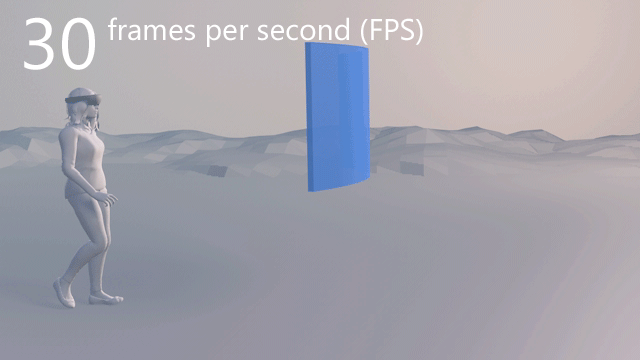

# Critical concepts to ensure optimal user experience

Unlike traditional programming, mixed reality development has unique challenges to solve and configurations to optimize. This article will introduce valuable development concepts that, when applied correctly, can greatly improve tracking and hologram stability in a mixed reality application. Similar to how laggy video or high-latency network performance can degrade user experience, poor tracking and holographic rendering deteriorates the overall quality of a mixed reality application.

Applications that do not properly configure the following will likely receive feedback from customers that their app experience suffers from "jitter", "judder", "drift", "jumpiness" and other similar issues. On HoloLens, these issues will generally be even more pronounced.

- [Frame rate](#why-does-frame-rate-matter?)
- [Late-stage reprojection](#late-stage-reprojection-immersive-(lsr))
- [Anchoring (HoloLens only)](#anchoring)
- [Device calibration](#device-calibration)
- [Interpupillary distance (IPD)](#interpupillary-distance-ipd)

>[!IMPORTANT]
> Please read the following articles for details on how to setup a performant development environment and to explore more advanced performance recommendations:
>
>* [Unity development overview](unity-development-overview.md)
>* [Advanced performance recommendations](advanced-performance-recommendations.md)

## Frame rate

*Frame rate*, also known as FPS (frames per second), is **one of the most critical indicators** that determines how comfortable your application’s user experience will be.

### What is frame rate?

Frame rate is a metric equal to the number of times per second your app can present an image to the user in their device.

Developers should ensure their applications meet the target framerate that is determined by the type of device running the app. See the table below for target frame rates on each device endpoint.

| Platform | Target frame rate |
|----------|-------------------|
| [HoloLens](hololens-hardware-details.md) | 60 FPS |
| [Windows Mixed Reality Ultra PCs](immersive-headset-hardware-details.md) | 90 FPS |
| [Windows Mixed Reality PCs](immersive-headset-hardware-details.md) | 60 FPS |

### Why does frame rate matter?

Applications that do not meet the target frame rate value for their device endpoint will suffer from the following:
* Inaccurate head tracking
* Unstable and incorrectly drawn holograms
* Potential user motion sickness

For holograms to appear stable in the world, each image presented to the user must have the holograms drawn in the correct spot. Rendering an image for your application takes time. With a target frame rate of 60 FPS, this equates to about 16 milliseconds. At 30FPS, this delay doubles to ~33 ms and effectively the same image is shown twice to the user, compared to rendering at 60 FPS. This longer delay can result in uneven motion and double images of holograms which will manifest to the user as judder.

Further, a user’s head is constantly moving and rotating over time, even if every so slightly. The user's head position will be different before and after rendering a frame. The Windows Mixed Reality platform will make predictions of where the user's view will be at the end of the frame. Additionally, the platform will perform late-stage reprojection (LSR), which adjusts the rendered image to account for the discrepancy between the predicted head position and the actual head position.

However, the error for predicting final head position will be greater for longer rendering times. Lower framerate applications thus will have less effective positioning and stability of holograms being rendered to the user, resulting in a negative user experience.

### Measure your frame rate

It is vital that developers and creators keep track of their framerate throughout the entire development process. Thus, it is recommended to add a visual counter to your application during environment set-up.

A framerate counter can easily be enabled in Unity with [Mixed Reality Toolkit for Unity](https://github.com/Microsoft/MixedRealityToolkit-Unity). 

1. Import the MRTK *.unitypackage* into your project
2. Search in your *Project Window* for "FPSDisplay.prefab"
3. Drag this prefab into your scene

>[!NOTE]
> One can also view their app's framerate via the **System Performance** page of **[Device Portal](using-the-windows-device-portal.md)**. The *Device Portal* lets you configure and manage your device remotely over Wi-Fi or USB via a web browser page. After you [set up access to Device Portal](using-the-windows-device-portal.md), look for the tab **Performance/System Performance** on the left side. The frame rate section on that page will track current frame rate and graph over time.

### Late-stage reprojection (LSR)

<table>
<tr>
<th>Feature</th><th style="width:150px"> <a href="hololens-hardware-details.md">HoloLens</a></th><th style="width:150px"> <a href="immersive-headset-hardware-details.md">Immersive headsets</a></th>
</tr><tr>
<td> LSR</td><td style="text-align: center;">✔️</td><td style="text-align: center;">✔️</td>
</tr>
</table>

Windows Mixed Reality devices have technology that adjusts the rendered image from a running holographic application to account for the discrepancy between the predicted head position and the actual head position.

To help the platform best stabilize holograms, developers can share their application's depth buffer with Windows.

- For **[Immersive Headsets](immersive-headset-hardware-details.md)**, the platform will utilize the depth buffer to perform per-pixel depth-based reprojection. 
- For **[HoloLens](hololens-hardware-details.md)**, the depth buffer can be used to find a [focus point](focus-point-in-unity.md) to optimize hologram stability through a stabilization plane. 

A developer can **[enable depth buffer sharing in Unity](camera-in-unity.md#sharing-your-depth-buffers-with-windows)** if:
1) The device endpoint is running [Windows 10 Fall Creators Update](release-notes-october-2017.md)
2) You are using [Unity 2017.3](https://unity3d.com/unity/whats-new/unity-2017.3.0) or later

Otherwise, for HoloLens, **[set the focus point in Unity](focus-point-in-unity.md)** manually using the
*[UnityEngine.XR.WSA.HolographicSettings.SetFocusPointForFrame()](https://docs.unity3d.com/ScriptReference/XR.WSA.HolographicSettings.SetFocusPointForFrame.html)* API in Unity.

If you are writing an application with DirectX, read [Rendering in DirectX](rendering-in-directx.md#set-the-focus-point-for-image-stabilization) for guidance on sharing the depth buffer or setting the focus point.

>[!NOTE]
> The [Windows Device Portal](using-the-windows-device-portal.md) can be used to debug and validate that the stabilization plane is being set correctly on Hololens.
> 1) Go to **Views** > **3D View** via the tabs on the left-hand side
> 2) Enable the **View Options** > **Show Stabilization Plane** checkbox
> 3) Confirm the rendered plane in the main window tracks correctly with your gaze

### Anchoring

<table>
<tr>
<th>Feature</th><th style="width:150px"> <a href="hololens-hardware-details.md">HoloLens</a></th><th style="width:150px"> <a href="immersive-headset-hardware-details.md">Immersive headsets</a></th>
</tr><tr>
<td> Anchoring</td><td style="text-align: center;">✔️</td><td style="text-align: center;"></td>
</tr>
</table>

HoloLens is constantly scanning and reasoning the current environment via multiple environment understand and tracking cameras on device (see image below). The device keeps track of several [coordinate systems](coordinate-systems.md) and their relationship to one another based on prominent features identified in the physical space. The platform abstracts much of these calculations so that developers only have to worry about the [coordinate system in Unity](coordinate-systems-in-unity.md).

>[!NOTE]
> The initial position of the user in the physical world when a Unity holographic app starts will become the origin (i.e <0,0,0\>) in the Unity coordinate system. Further, the user's initial head orientation will become Unity's world Z-forward(+) > axis , which will correspondingly make the X-axis orthogonal to the initial orientation.
> Note though, the Y-axis, or "Up" > axis, in Unity will be aligned with gravity using the device's inertial measurement unit (IMU).

**[Anchoring](spatial-anchors.md)** is a special concept whereby the developer can indicate to the HoloLens that a specific spot in space is of interest to their app experience. If a hologram should be _**anchored**_ to a particular point in physical space, you can attach a [WorldAnchor](https://docs.unity3d.com/2017.4/Documentation/ScriptReference/XR.WSA.WorldAnchor.html) component in Unity to the GameObject that should remain stable at one position. This will allow the platform to take over control of this GameObject's transform to ensure accurate positioning during app runtime.

To learn more about how anchor's work and best practices when using them, please read [Spatial anchors](spatial-anchors.md).

>[!NOTE]
> Spatial Anchors and World Anchors are one in the same. Unity describes an Anchor as a [WorldAnchor](https://docs.unity3d.com/2017.4/Documentation/ScriptReference/XR.WSA.WorldAnchor.html) component while the exact concept is known as a [Spatial Anchor](https://docs.microsoft.com/en-us/uwp/api/windows.perception.spatial.spatialanchor) in the Windows Mixed Reality API. 
> 
> If writing a holographic app in DirectX, [read this guidance](coordinate-systems-in-directx.md#place-holograms-in-the-world-using-spatial-anchors) on using the [Spatial Anchor](https://docs.microsoft.com/en-us/uwp/api/windows.perception.spatial.spatialanchor) class.

### Device sensors calibration

Windows Mixed Reality devices, such as HoloLens, are finely tuned devices which depend on accurate sensor calibration to provide the best quality tracking, mapping, and rendering. Rough treatment of the device may cause unrecoverable performance degradation. One should treat a device with the same care as a high end camera.

#### Tips to keep your WMR Device performing at its best
-	When not in use, always keep your device safely stowed
-	Do not leave your device in any harsh environments such as a hot car in direct sunlight, or outside during the winter.
-	Avoid dropping the device onto any hard surface
-	Avoid damage to the device visor or lenses caused by scratches or foreign materials like glue
-	Always make sure to wipe away fingerprints and other smudges with a soft cloth

####  Tracking calibration recovery
If your device has been dropped or damaged and you are experiencing tracking quality problems, good calibration may still be achievable. Software on the device or computer will do its best to restore the accuracy of tracking by detecting features in your environment and using your head motion to understand how calibration has changed.

####  Manual sensor tuning
If your device is running the original HoloLens OS (Windows 10 Version 1607 Anniversary Update aka RS1), then there is a manual process you can follow to improve tracking accuracy. The Sensor Tuning app will guide you through the process to recover your device.
- Open the **Settings App** on your Hololens > select **Holograms** tab > select **Sensor Tuning**

#### Automatic tracking quality recovery
On newer builds (Windows 10 Version 1803 April 2018 Update or later) of the HoloLens OS or with a Windows Mixed Reality VR headset, calibration recovery is always running, and usually users will not even notice the device working to maintain accuracy.  However, if you do notice a problem, you can improve your chances of success by following the below steps and giving the algorithm time to recover.

1. Find a room where you can use your HoloLens to start the recovery process.  Ideal rooms will fit the following guidelines
    - Contains lots of interesting things like furniture, plants, posters, etc
    - Has normal indoor lighting typical of a daytime work environment
    - Is not larger than 100m2
2. Turn your device on in the space, and walk around using it for at least 5 minutes
3. If tracking quality still does not improve, try deleting your maps, reboot the device, and repeat step 2.

### Interpupillary distance (IPD)

Mixed reality devices render two images, one for each eye of the user. To render each, two different camera parameters are used as the location of each eye is separated over a distance. The distance in millimeters between the center of the user's pupils when looking straight ahead is a user's Interpupillary distance or IPD. This value has to be calculated per user. It is important to set the correct IPD for each user as incorrect values will render a scene from the wrong perspective. Thus, users will see misalignment in placement of holograms.

To learn more about setting IPD, read the [Calibration](calibration.md) page. The IPD setting for a device can also be set remotely via the [Device Portal](using-the-windows-device-portal.md#device-portal-pages)

## See Also
- [Hologram stability](hologram-stability.md)
- [Unity development overview](unity-development-overview.md)
- [Advanced Performance Recommendations](advanced-performance-recommendations.md)
- [Mixed Reality Toolkit for Unity](https://github.com/Microsoft/MixedRealityToolkit-Unity)
