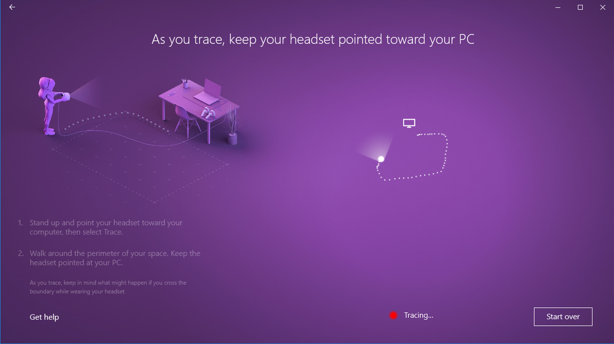

# Set up Windows Mixed Reality

## Get familiar with your motion controllers
If your headset has a built-in radio, the controllers that come with your headset are paired to it in the factory. When you first turn on your new controllers and headset, they will already be paired.

If you have a headset without a built-in radio, you will have to set up your motion controllers by pairing them to your PC (most headsets manufactured after 2018 have built-in radio). 

If you are only planning to use an Xbox gamepad or keyboard and mouse, you don’t need to pair your controllers.  If you ever plan to use controllers, you should probably pair them.

**Note**: Windows Mixed Reality motion controllers require Bluetooth 4.0. If your PC doesn't have built-in Bluetooth, you will need to plug in a USB Bluetooth adapter that supports Bluetooth 4.0 to enable your motion controllers. If you are using the built-in radio in your headset you don’t need a Bluetooth adapter.

### If you need to pair your motion controllers with your PC

Power on the controllers by pressing the Windows button for 2 seconds until LEDs light up.

Remove the battery cover from your controllers and find the small pairing button at the edge of the controller. Per the instructions in Mixed Reality Portal, hold this button down to pair with your PC

You will see two green checkmarks for the left and right controllers once they are paired successfully.

You may see a message in the bottom right hand corner of your screen as the firmware on your controllers get updated. While this is happening, you can advance to the next step in the tutorial, but don't turn off your controllers.

Once controller firmware update is complete it will restart and re-connect to host PC. LEDs will be solid on and bright.

### Common issues
* Verify that you have only one Bluetooth radio active on your PC. If you have more than one Bluetooth radio, you’ll need to disable the other radios in Device Manager.
* Place your Bluetooth dongle in a port that has a clear line of sight to your controllers, and far from plugged in USB 3.0 devices. USB 3.0 is known to have RF interference with Bluetooth (read [this paper](https://www.intel.com/content/dam/www/public/us/en/documents/white-papers/usb3-frequency-interference-paper.pdf) from Intel for more details). USB 2.0 ports may work better for your Bluetooth dongle.
* Make sure your Bluetooth dongle is not plugged into a USB port adjacent to your HMD's USB cable. The headset cable has been known to cause interference with Bluetooth dongles as well. Plug the dongle into the front USB port on your PC for best results.
* For notebooks, ensure WiFi is connected to 5GHz band for the best experience (select the wireless network icon bottom right tray, and select properties for the network you are using). Notebooks that are designed to share a 2.4GHz antenna for Bluetooth and WiFi connectivity are most likely to see data congestion in the form of slow network speeds or poor tracking performance for motion controllers.
* Your motion controllers will receive new software updates from Microsoft on a regular basis. The controllers will show an alternating pattern of flashing lights when they receive these new software updates. This is normal. Wait until the software upgrade is complete before using the controllers (the controllers will vibrate and a constant light will replace the alternating flash pattern when it is done).
* You may be told to "Put on the headset and use the thumbstick to teleport" before the controllers finish the update process. The controllers will not be visible or usable until the update is completed. Most updates occur within two minutes, but updates can take as long as 10 minutes or so. Wait for the update to complete before proceeding to the next step.

## Set up your room boundary

Choose a room scale or desk scale experience:

**Option 1: Set me up for all experiences (also known as room scale)** will allow you to walk around the room and is the most immersive mixed reality experience. We recommend you at clear at least 5 foot x 7 foot (1.5 meters x 2 meters) of space for mixed reality.

**Option 2: Set me up for seated and standing (also known as desk scale)** experience will work at your desk. It's a good option if you don't have a lot of room in your space. It also means that you will be using your headset without a boundary. You'll need to stay in one place, as you'll have no boundary to help you avoid physical obstacles. Also, some apps and games may be designed to be used with a boundary, so they might not work as intended.

### If you choose "Set me up for all experiences"

Soon, your room will become a virtual world where you can walk around and interact! Stand up and clear some space in your room for running mixed reality (e.g. clear some floor space and move your chair to the side of the room). We recommend you at clear at least 5 foot x 7 foot (1.5 meters x 2 meters) of space for mixed reality.

Make sure your space is clear.

Center your headset.

Trace your boundary.

Keep your headset pointed toward your PC.

Here's your boundary.

### If you choose "Set me up for seated and standing"

There are no additional steps required if you choose this option.

## What is the maximum size of the boundary?
The currently supported maximum boundary size in Windows Mixed Reality is 18x18ft (5.7x5.7m) or 13ft (4m) radius from the center.  The boundary size is dependent on the anchor point and how far from the anchor point you can move before you risk the stability of the boundary.  Windows Mixed Reality is built on a stage abstraction in the platform, the stage being the space you move around in, and that stage depends on a single anchor (which nearly every app also assumes – it’s how Vive and Oculus work too, as they only have a single coordinate system).  The reason that this is important is that with inside-out tracking, as you move further away from an anchor point the headset tracking is reliable at keeping the boundary stable.  Where the boundary is intended to help avoid physical obstacles, it becomes more and more of a problem the further out from the center you go.  Two factors went into the decision on maximum boundary size; the maximum distance at which Windows Mixed Reality headsets could provide the best room scale experience with a boundary and the length of the headset cable, which for most Windows Mixed Reality headsets is 10ft (3m). 

## Set up speech

You can enable Cortana commands inside of mixed reality. This allows you to use speech commands inside of mixed reality to teleport, open apps, and do other things. You'll learn more about this in the [Learn Mixed Reality](learn-mixed-reality.md) chapter.

## Set up your audio headset

Unless you purchased a Samsung HMD Odyssey (which has integrated AKG headphones and an integrated dual microphone array), you will need to get an audio headset (that has both microphone and headphones) and plug that into your headset's 3.5mm audio jack. The 3.5mm audio jack for your headset will - depending on the headset model - be located either on the underside of the headset visor or at the end of a short audio cable coming out of the headset visor.

## Adjusting your headset's display settings

Windows Mixed Reality automatically chooses display settings that balance quality and performance, based on your PC's hardware configuration. To adjust these settings, go to **Settings > Mixed Reality > Headset display**.

### Visuals

This setting controls the visual quality of your Mixed reality home. The default is "Automatic".

### Resolution

Your headset's native resolution is shown here.

If you connect a headset with higher resolution displays (for example, headsets with 4320x2160 displays) to your PC, you'll see a setting to adjust the Mixed reality display resolution.

* This setting provides the option for the Windows Mixed Reality composition stack to render natively (for example, at 4320x2160), or to have the composition stack render at a lower resolution and upscale (for example, render at 2880x1440 and upscale to 4320x2160.
* The default setting is to render natively (for example, the **4320 x 2160 (best quality)** option) to provide the best visual quality possible from your headset.
* If your PC does not meet the minimum graphics hardware requirements for your headset with higher resolution displays, and/or if you're seeing graphics performance issues, you could try using selecting the **Automatic upscaling (best performance)** option.

This setting is available on Windows 10, version 1903, or newer.

### Calibration

This setting is to adjust the IPD calibration for headsets with software IPD support.

### Experience options

This advanced setting overrides the default headset display refresh rate experience.

* **Automatic (default)**: Automatically select the 60Hz or 90Hz experience based on your PC's hardware configuration.
* **60Hz**
* **90Hz**

Certain Windows Mixed Reality features, including Mixed Reality Portal preview and a larger headset display FOV, are only available with the 90Hz experience.

### Input switching

This setting controls the behavior of Windows Mixed Reality in response to your headset's presence sensor:

* **Automatically switch using headset presence sensor** (default): Windows will automatically direct input (keyboard, mouse...) to Windows Mixed Reality whenever you're wearing your headset. You can override this at anytime with Win + Y.
* **Manually switch using Windows logo key + Y**: Windows will not use the headset presence sensor to detect when you're wearing your headset. You'll need to use Win + Y to switch your input between your PC desktop and Windows Mixed Reality.

This setting is available on Windows 10, version 1903, or newer.

## Installing Microsoft Edge 

To use the new Chromium-based Microsoft Edge in Windows Mixed Reality home, upgrade to Windows 10 Version 1903 or later for native support of Win32 applications (like the new Microsoft Edge) in Windows Mixed Reality home. Check Windows Update or [manually install the latest version of Windows 10](https://www.microsoft.com/software-download/windows10).

>[!IMPORTANT]
>The new Microsoft Edge launches with support for WebXR, the new standard for creating immersive web experiences for VR headsets. You will no longer be able to play WebVR experiences in Microsoft Edge if you install the new Microsoft Edge. 

### Issues with the new Microsoft Edge in Windows Mixed Reality

**Known issues resolved by the 2020-01 Cumulative update for Windows 10 Version 1903 (or later)**
- Launching any Win32 app, including the new Microsoft Edge, causes the headset display to briefly freeze.
- The Microsoft Edge tile disappears from the Windows Mixed Reality Start menu (you can find it in the “Classic apps” folder).
- Windows from the previous Microsoft Edge are still placed around the mixed reality home, but cannot be used. Attempting to activate those windows launches Edge inside of the Desktop app.
- Selecting a hyperlink in the mixed reality home launches a web browser on the desktop instead of the mixed reality home.
- The WebVR Showcase app is present in the mixed reality home, despite WebVR no longer being supported.
- General improvements to keyboard launch and visuals.

**Additional known issues**
-	Websites open in Windows Mixed Reality will be lost when Mixed Reality Portal closes, though the Microsoft Edge windows will remain where they were placed in the mixed reality home.
-	Audio from Microsoft Edge windows is not spatialized.
-	Fixed in 360 Viewer extension version 2.3.8: Opening a 360 video from YouTube in Windows Mixed Reality may result in the video being distorted in the headset. Restarting Edge should invisibly update the 360 Viewer extension to resolve this issue. You can confirm which version of the extension you have by entering `edge://system/` in the address bar and selecting the "Expand" button next to "extensions."
-	During Windows Mixed Reality sessions, virtual monitors will appear as generic physical monitors in **Settings > System > Display**.

## Launching mixed reality after the first time

Entering mixed reality a second time is as easy as putting the headset back on while its connected to your PC. You can also launch the Mixed Reality Portal application manually by opening it from the Start menu. Input and audio will route automatically to the headset when you put it on, or you can trigger this manually by pressing **Windows + Y** on your keyboard. 

## See also

* [Troubleshooting installation](installation_errors.md)
* [Troubleshooting setup](set-up-questions.md)
* [Learn Mixed Reality](learn-mixed-reality.md)
* [How motion controllers work](motion-controllers.md)
* [How inside-out tracking works](tracking-system.md)
