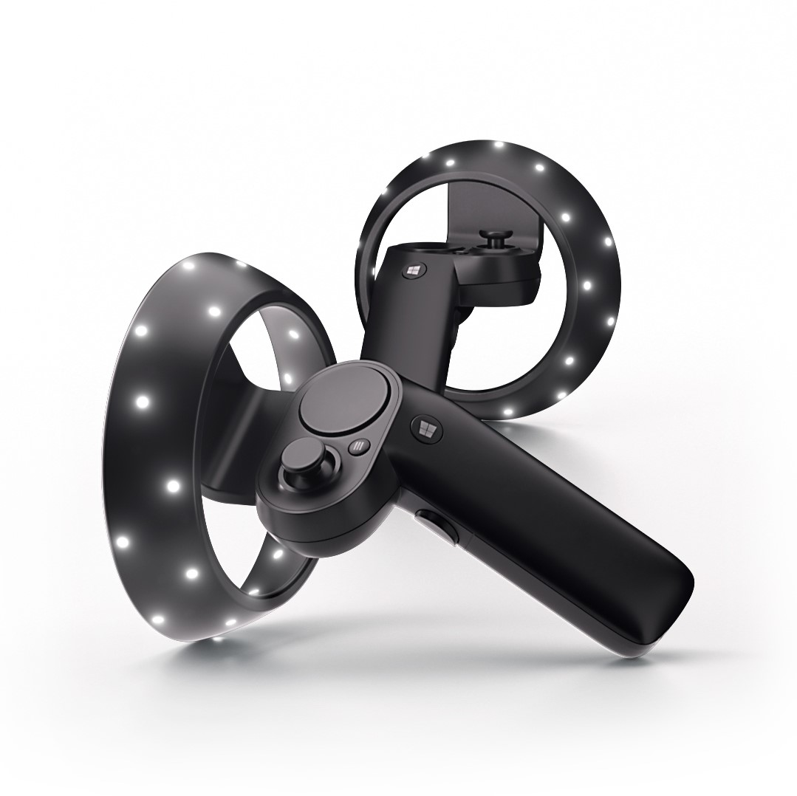

# Motion controllers

Motion controllers are hardware accessories that allow users to take action in mixed reality. An advantage of motion controllers over gestures is that the controllers have a precise position in space, allowing for fine-grained interaction with digital objects. For Windows Mixed Reality immersive headsets, motion controllers are the primary way that users will take action in their world.

## Device support

| Feature            | HoloLens | Immersive headsets |
|--------------------|:--------:|:------------------:|
| Motion controllers |          | ✔️                 |

## Hardware details

>[!VIDEO https://www.youtube.com/embed/1nlcdDNOdm8?rel=0&modestbranding=1&frameborder=0&allowfullscreen]

Windows Mixed Reality motion controllers offer precise and responsive tracking of movement in your field of view using the sensors in the immersive headset, meaning there is no need to install hardware on the walls in your space. These motion controllers will offer the same ease of setup and portability as Windows Mixed Reality immersive headsets.

**Features:**
* Optical tracking
* Trigger
* Grab button
* Thumbstick
* Touchpad

>[!VIDEO https://www.youtube.com/embed/rkDpRllbLII?rel=0&modestbranding=1&frameborder=0&allowfullscreen]

## Using Motion controllers

|         If you want to          |                                                                                                                              Then do this                                                                                                                              |
|---------------------------------|------------------------------------------------------------------------------------------------------------------------------------------------------------------------------------------------------------------------------------------------------------------------|
|            Teleport             |                                                                                 Press the thumbstick forward, then point the controller where you want to go. Release the thumbstick.                                                                                  |
|             Select              |                                                                                                   Point the controller, then pull the trigger or click the touchpad                                                                                                    |
|       Open the Start menu       |                                                                                                                      Press the **Windows** button                                                                                                                      |
|     Leave an immersive app      |                                                                                                                      Press the **Windows** button                                                                                                                      |
|             Rotate              |                                                                                                                   Move the thumbstick left or right                                                                                                                    |
|             Back up             |                                                                                                                     Move the thumbstick backwards                                                                                                                      |
|              Walk               |                                                                                           Push the thumbstick straight down, then press it in the direction you want to walk                                                                                           |
|       Move an app window        |                                                             Point at the app bar. Pull and hold the trigger to grab the window, then use the controller to move it in any direction. Release the trigger.                                                              |
|        Move a 3D object         |                                                                Point at the object, then pull and hold the trigger to grab it. Move it in any direction with the controller, then release the trigger.                                                                 |
| Rotate or resized an app window | Point one controller at the app bar and the other controller anywhere on the window. Hold down both triggers, then move the controllers together or apart to resize.  To rotate, move one controller toward you and the other one away from you. Release the triggers. |
|  Rotate or resize a 3D object   |                                   Point both controllers at the object. Hold down both triggers, then move the controllers together or apart to resize.  To rotate, move one controller toward you and the other one away from you.                                    |
|     Scroll in an app window     |                                                                                                    Pull and hold the trigger, then move the controller up or down.                                                                                                     |
|  Zoom in or out in app window   |                                                                                            Pull both triggers, then move the controllers closer together or farther apart.                                                                                             |

## Updating controller firmware
* If an immersive headset is connected to your PC, and new controller firmware is available, the firmware will be pushed to your motion controllers automatically the next time they're turned on.
* Controller firmware updates are indicated by a pattern of illuminating LED quadrants in a circular motion, and take 1-2 minutes. Firmware updates can occasionally take longer, up to 10 minutes, which may indicate poor Bluetooth connectivity or radio interference.
* In case firmware update is interrupted (controller powered off or battery runs out) it will be tried again on next power on.
* After the firmware update completes, the controllers will reboot and reconnect. 
* Both controllers should be connected now. (Check Bluetooth and other devices for the following): 
* Verify your controllers work properly:
  * Launch **Mixed Reality Portal** and enter your Mixed Reality Home.
  * Move your controllers and verify tracking, test buttons, and verify teleportation works. If they don't, then check out [the motion controller troubleshooting section](motion-controller-problems.md) 

## FAQ

### How can I connect my controller to another PC?

*A: Currently controllers support pairing with a single PC at this time. Follow the instructions on [motion controller setup](set-up-windows-mixed-reality.md#if-you-need-to-pair-your-motion-controllers-with-your-pc) to pair your controllers. Before pairing remember to remove existing paired controllers from Bluetooth & other devices within Settings so that Windows will discover the controllers.*

### How can I check battery level?

*A: Battery level is on reverse side of the virtual model, there is no physical battery level indicator. After powering on controller wait few seconds to let the reading stabilize.*

### Can you use these controllers without a headset? Just for the joystick/trigger/etc input?

*A: Not for Universal Windows Applications*

## Filing motion controller feedback/bugs

Give us feedback in Feedback Hub, using the "Mixed Reality -> Input" category.

## See also
* [Troubleshooting mixed reality > Motion controllers](motion-controller-problems.md)
* [Your Windows Mixed Reality home](your-mixed-reality-home.md)
* [Using games & apps in Windows Mixed Reality](using-games-and-apps-in-windows-mixed-reality.md)
* [Tracking system](tracking-system.md)
